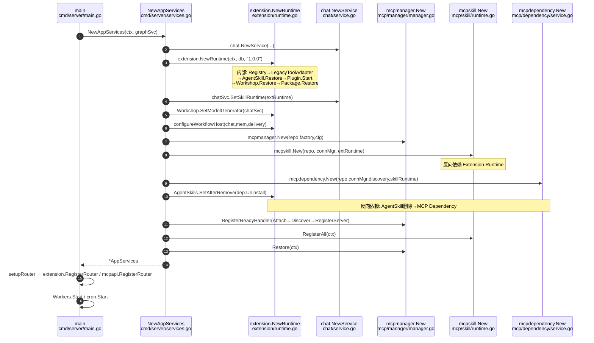
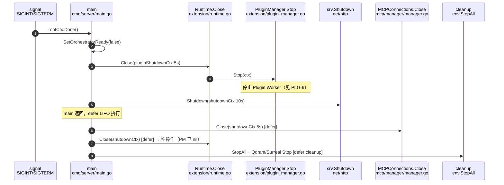

# 启动与关闭调用链地图

> 审计依据：`.trae/Amitia_扩展系统重构_第2步_建立现有系统调用链地图.md` Task 2（地图 A、B）
> 审计日期：2026-07-25
> 状态：第2步调用链地图（只审计不修改）

---

## 一、涉及文件

| 文件 | 职责 |
|---|---|
| `backend/cmd/server/main.go` | 进程入口、迁移、信号、关闭编排 |
| `backend/cmd/server/services.go` | 服务装配、Workflow Host 注入、MCP 创建、Agent Skill 删除回调 |
| `backend/cmd/server/router.go` | 路由注册 |
| `backend/internal/extension/runtime.go` | Extension Runtime 装配与 Close |
| `backend/internal/extension/plugin_manager.go` | PluginManager.Stop |
| `backend/internal/mcp/manager/manager.go` | MCP Manager.Close/Restore |

---

## 二、调用链

### 链路 SU-1：进程启动与迁移

链路编号：SU-1
链路名称：进程启动与数据库迁移
触发条件：`server.exe` 启动（`main` 函数）
最终结果：数据库迁移完成、AppContext 就绪、外部环境就绪

| 顺序 | 层级 | 文件 | 类型/函数 | 输入 | 输出/状态变化 | 错误处理 | 备注 |
|---:|---|---|---|---|---|---|---|
| 1 | 入口 | `cmd/server/main.go:58` | `main` | 无 | 加载 config、初始化 log、`signal.NotifyContext(SIGINT,SIGTERM)` | — | rootCtx 作为全局取消源 |
| 2 | 入口 | `cmd/server/main.go:77` | `mysql.NewSQLite` | DataDir | `*gorm.DB`（SQLite） | — | |
| 3 | 入口 | `cmd/server/main.go:80` | `agenttool.SetDB` | `*sql.DB` | 全局 DB 注入旧工具 | — | 旧工具全局状态 |
| 4 | 入口 | `cmd/server/main.go:81` | `applyDatabaseStartupMigrations` | db | 迁移完成 | 失败 `os.Exit(1)` | |
| 5 | 迁移 | `cmd/server/main.go:262` | `applyDatabaseStartupMigrations` | db | — | — | |
| 6 | 迁移 | `cmd/server/main.go:267` | `migration.Runner{DB, SkipBackup}.Apply(DefaultMigrations())` | 迁移列表 | 版本化迁移应用 | 失败返回错误→`os.Exit(1)` | 先 `CreatePreMigrationBackup`（若已有库） |
| 7 | 迁移 | `cmd/server/main.go:273` | `initDatabase` → `migration.ApplyInitialSQLFile` | `data/sql.sql` | 建表 | 文件未找到返回错误 | |
| 8 | 环境 | `cmd/server/main.go:87` | `startEnvironment` | 无 | 外部环境 | — | Qdrant/Surreal 子进程 |
| 9 | 环境 | `cmd/server/main.go:102-104` | `startQdrant`/`startSurreal`/`surrealdbDB.StartSurrealMonitor` | 无 | Qdrant/Surreal 就绪 | 启动失败仅 Warn，回退关键词搜索 | 非致命 |

### 链路 SU-2：服务装配（NewAppServices）

链路编号：SU-2
链路名称：服务装配总入口
触发条件：`main.go:107` `services := NewAppServices(ctx, graphSvc)`
最终结果：`*AppServices` 就绪，含 Extension/MCP 全家桶

| 顺序 | 层级 | 文件 | 类型/函数 | 输入 | 输出/状态变化 | 错误处理 | 备注 |
|---:|---|---|---|---|---|---|---|
| 1 | 装配 | `cmd/server/services.go:135` | `NewAppServices` | ctx, graphSvc | 创建基础服务（temporal/memory/profile/episodic/worldbook/vision/companion） | — | |
| 2 | Chat | `cmd/server/services.go:165` | `chat.NewService` | repo,ctx,mem,prof,epi,wb,compressor,vision,graph,psycheStore | `chatSvc` | — | |
| 3 | Extension | `cmd/server/services.go:166` | `extension.NewRuntime` | ctx, db, "1.0.0" | `extensionRuntime`（内部装配见 SU-3） | 失败 panic | 关键装配点 |
| 4 | 反向依赖 | `cmd/server/services.go:171` | `chatSvc.SetSkillRuntime` | extensionRuntime | Chat 持有 Extension Runtime 引用 | — | Chat → Ext |
| 5 | 反向依赖 | `cmd/server/services.go:172` | `extensionRuntime.Workshop.SetModelGenerator` | chatSvc | Workshop 反向持有 Chat（用于 AI 生成） | — | Ext → Chat（反向） |
| 6 | 业务 | `cmd/server/services.go:173-286` | 创建 tracker/outbox/orchestrator/runtimePipeline/dataLifecycle 等 | — | 交互编排就绪 | — | |
| 7 | 反向依赖 | `cmd/server/services.go:287` | `configureWorkflowHost` | runtime, chatSvc, memSvc, deliveryStore | WorkflowHostAdapter 4 个 Host 函数注入 Chat/Memory/Delivery | — | Ext → Chat/Memory/Delivery（反向，装配层泄漏） |
| 8 | MCP | `cmd/server/services.go:288` | `mcp.NewRepository` | db | `mcpRepository` | — | |
| 9 | MCP | `cmd/server/services.go:290` | `mcpauth.NewEncryptedFileStore` | secrets.json, secrets.key | `secretStore` | 失败 panic | Secret 加密文件 |
| 10 | MCP | `cmd/server/services.go:294` | `mcpauth.NewManager` | nil, secretStore, mcpRepository | `oauthManager` | — | |
| 11 | MCP | `cmd/server/services.go:295` | `mcpmanager.New` | repo, DefaultFactory{repo,secrets,oauth}, Config | `connectionManager` | — | ClientInfo=amitia/1.0.0，Capabilities含Roots/Sampling/Elicitation/Tasks |
| 12 | MCP | `cmd/server/services.go:296` | `mcpdiscovery.New` | repo, connectionManager | `discoveryService` | — | |
| 13 | MCP | `cmd/server/services.go:297` | `mcpskill.New` | repo, connectionManager, extensionRuntime | `skillRuntime` | — | **反向依赖**：MCP Skill Runtime 持有 Extension Runtime |
| 14 | MCP | `cmd/server/services.go:298` | `mcpfeatures.New` | repo, connectionManager | `featureService` | — | |
| 15 | MCP | `cmd/server/services.go:299` | `mcphost.NewBroker` | chatSvc | `interactionBroker` | — | **反向依赖**：MCP Host Broker 持有 Chat |
| 16 | MCP | `cmd/server/services.go:300` | `mcphost.New` | repo, connectionManager, roots, broker, broker | `hostService` | — | |
| 17 | MCP | `cmd/server/services.go:301` | `mcpdependency.New` | repo, connectionManager, discoveryService, skillRuntime | `dependencyService` | — | |
| 18 | 反向依赖 | `cmd/server/services.go:302` | `extensionRuntime.AgentSkills.SetAfterRemove` | `func(ctx,extensionID){ dependencyService.Uninstall(ctx,extensionID) }` | Agent Skill 删除回调绑定 MCP Dependency | — | **反向依赖**：Agent Skill 删除 → MCP Dependency.Uninstall |
| 19 | MCP | `cmd/server/services.go:305` | `connectionManager.RegisterReadyHandler` | `func(readyCtx, serverID){ hostService.Attach; discoveryService.Discover; skillRuntime.RegisterServer }` | Ready Handler 链 | — | 连接就绪→Attach→Discover→RegisterServer |
| 20 | MCP 恢复 | `cmd/server/services.go:315` | `skillRuntime.RegisterAll` | ctx | 恢复所有 MCP Server 的 Skill 注册 | 仅 Warn | 恢复失败不阻断启动 |
| 21 | MCP 恢复 | `cmd/server/services.go:318` | `connectionManager.Restore` | ctx | 恢复所有 MCP 连接 | 仅 Warn | 恢复失败不阻断启动 |
| 22 | 返回 | `cmd/server/services.go:331` | return `&AppServices{...}` | — | AppServices 就绪 | — | |

> 装配顺序要点：Extension Runtime 在 MCP 之前创建；MCP Skill Runtime 与 MCP Host Broker 反向持有 Extension Runtime 与 Chat；Agent Skill 删除回调在装配层绑定 MCP Dependency。装配层（services.go）知晓 MCP/Extension 内部细节，存在装配层泄漏。

### 链路 SU-3：Extension Runtime 内部装配（NewRuntime）

链路编号：SU-3
链路名称：Extension Runtime 内部装配
触发条件：`services.go:166` `extension.NewRuntime`
最终结果：`*Runtime` 就绪，内置工具/Agent Skill/Plugin/Workshop/Package 全部恢复

| 顺序 | 层级 | 文件 | 类型/函数 | 输入 | 输出/状态变化 | 错误处理 | 备注 |
|---:|---|---|---|---|---|---|---|
| 1 | 校验 | `extension/runtime.go:34` | `NewSchemaValidator` | 无 | validator | 失败返回错误 | |
| 2 | 持久化 | `extension/runtime.go:38` | `NewRepository` | db | repository | — | |
| 3 | 注册表 | `extension/runtime.go:39` | `NewRegistry` | "1.0.0", validator, repository | registry（内存 map） | — | |
| 4 | 权限 | `extension/runtime.go:40` | `NewPermissionEvaluator` | repository | permissions | — | |
| 5 | 内置工具 | `extension/runtime.go:41` | `NewLegacyToolAdapter().RegisterAll` | ctx, registry | 注册旧工具为 SkillDefinition + 系统策略授权 | 失败返回错误 | `tool.GetAll()`+`GetMemoryTools()` |
| 6 | 执行器 | `extension/runtime.go:59` | `NewExecutor` | registry, validator, permissions, repository | executor | — | |
| 7 | 服务 | `extension/runtime.go:60` | `NewService` | registry, executor, repository, validator | service | — | |
| 8 | Agent Skill | `extension/runtime.go:61` | `NewAgentSkillService` | repository, registry, validator | agentSkills | — | |
| 9 | 生命周期 | `extension/runtime.go:62` | `service.AttachLifecycleService` | NewExtensionLifecycleService | 挂接 | — | |
| 10 | Agent Skill 恢复 | `extension/runtime.go:63` | `agentSkills.Restore` | ctx | 恢复 Agent Skill Metadata | 失败返回错误→启动失败 | |
| 11 | Agent Skill 注册 | `extension/runtime.go:66` | `registerAgentSkillRuntime` | ctx, registry, agentSkills | Agent Skill 转 SkillDefinition 注册到 Registry | 失败返回错误 | |
| 12 | Plugin | `extension/runtime.go:69` | `NewPluginRegistry` | engineVersion, validator | pluginRegistry | — | |
| 13 | Plugin | `extension/runtime.go:70` | `pluginRegistry.Register` | ctx, newDiagnosticPlugin(), newDiagnosticPlugin | 注册内置诊断插件 | 失败返回错误 | **仅内置** |
| 14 | Plugin 授权 | `extension/runtime.go:73-76` | 为 diagnostic 授权系统策略 | — | GrantSystemPolicy AllowAlways | — | |
| 15 | Plugin | `extension/runtime.go:77` | `NewPluginManager` | pluginRegistry, registry, executor, permissions, repository, validator | pluginManager | — | |
| 16 | Plugin | `extension/runtime.go:78` | `service.AttachPluginManager` | pluginManager | 挂接 | — | |
| 17 | Plugin 启动 | `extension/runtime.go:79` | `pluginManager.Start` | ctx | 启动 Plugin Manager（Worker） | 失败返回错误 | |
| 18 | Workshop | `extension/runtime.go:82-86` | 创建 workshopRepository/workflowCompiler/workflowHost/workflowExecutor/workshop | — | workshop | — | workflowHost 为空 adapter，由装配层 configureWorkflowHost 填充 |
| 19 | Workshop | `extension/runtime.go:87` | `workshop.AttachAgentSkills` | agentSkills | 挂接 | — | |
| 20 | Workshop 恢复 | `extension/runtime.go:88` | `workshop.Restore` | ctx | 恢复 Workflow Skill | 仅 Warn | 恢复失败不阻断 |
| 21 | Package | `extension/runtime.go:91` | `NewPackageService` | repository, registry, validator, workflowCompiler, workshop.installer, agentSkills | packages | — | Package 依赖 Workshop.installer 与 AgentSkills |
| 22 | Package 恢复 | `extension/runtime.go:92` | `packages.Restore` | ctx | 恢复已安装包 | 失败返回错误→启动失败 | |
| 23 | 返回 | `extension/runtime.go:95` | return `&Runtime{...}` | — | Runtime 就绪 | — | |

> 恢复顺序依赖：Agent Skill Restore（L63）→ Agent Skill 注册（L66）→ Plugin Start（L79）→ Workshop Restore（L88）→ Package Restore（L92）。Package Restore 依赖 Agent Skill 与 Registry 已就绪。

### 链路 SU-4：路由注册

链路编号：SU-4
链路名称：HTTP 路由注册
触发条件：`main.go:180` `r := setupRouter(ctx, services)`
最终结果：扩展相关路由 `/api/extension/*` 与 `/api/mcp/*` 注册

| 顺序 | 层级 | 文件 | 类型/函数 | 输入 | 输出/状态变化 | 错误处理 | 备注 |
|---:|---|---|---|---|---|---|---|
| 1 | 路由 | `cmd/server/router.go:90` | `extension.RegisterRouter` | apiGroup, ctx, services.Extension | `/api/extension/*` 注册 | — | |
| 2 | 路由 | `cmd/server/router.go:92` | `mcpapi.RegisterRouter` | apiGroup, ctx, Services{Repository,Connections,Auth,Discovery,Skills,Secrets,Extensions,Features,Dependencies,Interactions} | `/api/mcp/*` 注册 | — | MCP API 注入 Extension Runtime（反向依赖） |

### 链路 SU-5：启动后 Worker 与恢复

链路编号：SU-5
链路名称：启动后 Worker 启动与交互恢复
触发条件：`main.go:188` 之后
最终结果：所有 Worker 运行、交互恢复完成

| 顺序 | 层级 | 文件 | 类型/函数 | 输入 | 输出/状态变化 | 错误处理 | 备注 |
|---:|---|---|---|---|---|---|---|
| 1 | 恢复 | `cmd/server/main.go:181` | `services.UnifiedEntry.RecoverStaleInteractions` | ctx, time.Now() | 恢复僵死交互 | 仅 Error 日志 | |
| 2 | 状态 | `cmd/server/main.go:186` | `services.UnifiedEntry.SetOrchestratorReady(true)` | — | 编排器就绪 | — | defer 设为 false |
| 3 | Worker | `cmd/server/main.go:188-195` | `OutboxWorker.Start`/`DeliveryWorker.Start`/`DesktopPetWorker.Start`/`ProcessingWorker.Start` | rootCtx | 4 个 Worker 运行 | — | defer Stop |
| 4 | 定时 | `cmd/server/main.go:196-202` | `NewProactiveCron` + `cron.Start` | db, companion, runtimeQueue | 主动消息 cron | — | defer Stop |
| 5 | goroutine | `cmd/server/main.go:204-216` | `time.Ticker(5min)` | rootCtx | 定期 DataLifecycle 清理 | — | |
| 6 | goroutine | `cmd/server/main.go:218` | `services.Reconciliation.RunWorker` | rootCtx, 10min | 对账 Worker | — | |
| 7 | HTTP | `cmd/server/main.go:220-228` | `srv.ListenAndServe` | serverAddr | HTTP 服务 | 失败 cleanup+Exit(1) | |

---

## 三、关闭链（地图 B）

### 链路 SD-1：信号触发关闭

链路编号：SD-1
链路名称：信号触发关闭编排
触发条件：`rootCtx.Done()`（SIGINT/SIGTERM）或 `serverErr`
最终结果：HTTP 停止接收、Plugin 停止、MCP 关闭、子进程终止

| 顺序 | 层级 | 文件 | 类型/函数 | 输入 | 输出/状态变化 | 错误处理 | 备注 |
|---:|---|---|---|---|---|---|---|
| 1 | 信号 | `cmd/server/main.go:237` | `<-rootCtx.Done()` | 信号 | 进入关闭分支 | — | |
| 2 | 状态 | `cmd/server/main.go:239` | `services.UnifiedEntry.SetOrchestratorReady(false)` | — | 拒绝新交互 | — | |
| 3 | Plugin | `cmd/server/main.go:240-244` | `services.Extension.Close` | pluginShutdownCtx(5s) | `PluginManager.Stop` | 仅 Error 日志 | **仅停 Plugin**，见 SD-3 |
| 4 | HTTP | `cmd/server/main.go:246-250` | `srv.Shutdown` | shutdownCtx(10s) | HTTP 排水 | 仅 Error 日志 | |

### 链路 SD-2：defer 关闭链

链路编号：SD-2
链路名称：defer 关闭链（LIFO）
触发条件：`main` 返回时 defer 执行
最终结果：所有资源释放

| 顺序 | 层级 | 文件 | 类型/函数 | 输入 | 输出/状态变化 | 错误处理 | 备注 |
|---:|---|---|---|---|---|---|---|
| 1 | defer | `cmd/server/main.go:187` | `services.UnifiedEntry.SetOrchestratorReady(false)` | — | — | — | |
| 2 | defer | `cmd/server/main.go:189-195` | `OutboxWorker.Stop`/`DeliveryWorker.Stop`/`DesktopPetWorker.Stop`/`ProcessingWorker.Stop` | — | 4 Worker 停止 | — | |
| 3 | defer | `cmd/server/main.go:199-202` | `cron.Stop` + `proactive.SchedulerRunning=false` | — | cron 停止 | — | |
| 4 | defer | `cmd/server/main.go:125` | `temporalScheduler.Stop` | — | — | — | |
| 5 | defer | `cmd/server/main.go:108-113` | `services.MCPConnections.Close(shutdownCtx)` → `services.Extension.Close(shutdownCtx)` | shutdownCtx(5s) | MCP Manager 关闭；Extension.Close 二次调用（PluginManager 已 nil，空操作） | 忽略错误 | **MCP 在 Extension 之后关闭** |
| 6 | defer | `cmd/server/main.go:100` | `cleanup` → `env.StopAll()` + `qdrantDB.StopQdrant()` + `surrealdbDB.StopSurreal()` | — | Qdrant/Surreal 子进程终止 | — | |

### 链路 SD-3：Extension.Close 与 PluginManager.Stop

链路编号：SD-3
链路名称：Extension Runtime 关闭
触发条件：SD-1 步骤3 与 SD-2 步骤5
最终结果：Plugin Manager 停止

| 顺序 | 层级 | 文件 | 类型/函数 | 输入 | 输出/状态变化 | 错误处理 | 备注 |
|---:|---|---|---|---|---|---|---|
| 1 | 关闭 | `extension/runtime.go:98` | `(*Runtime).Close` | ctx | nil 检查 PluginManager | nil 则直接返回 nil | |
| 2 | 关闭 | `extension/runtime.go:102` | `r.PluginManager.Stop` | ctx | 停止 Plugin Manager | 返回错误 | 内部停止的 Worker 见 Plugin 链路 PLG-6 |

> 关键发现：`Extension.Close` **仅关闭 PluginManager**。MCP Manager.Close 在 defer 中单独调用（SD-2 步骤5）。无 Discovery/Host/Features 的显式关闭（依赖 Manager.Close 内部清理，见 MCP 链路）。

---

## 四、Mermaid 图

### 地图 A：系统启动装配图（startup.mmd）

### 地图 B：系统关闭图（shutdown.mmd）

---

## 五、关键发现与风险

### P0（重构阻塞）

- 无。启动与关闭链可追溯，无循环依赖导致无法启动的情况。

### P1（高风险历史债务）

- **P1-SD-1 装配层泄漏**：`services.go` 直接知晓并组装 Extension/MCP 内部全部组件（11 个 MCP 组件 + Workflow Host 4 个业务函数注入），装配层与子系统内部细节强耦合。证据：`services.go:288-314`。影响：重构任一子系统都需改动装配层。建议：第4步划分范围时将装配层列为"需重写"。
- **P1-SD-2 反向依赖密集**：装配层存在 4 处反向依赖（Workshop→Chat、MCPSkill→Ext、MCPHost→Chat、AgentSkill删除→MCP Dependency）。证据：`services.go:172,297,299,302`。影响：子系统无法独立替换。建议：第10步交叉依赖矩阵单独标注。
- **P1-SD-3 关闭顺序依赖 defer 且 Extension.Close 被调用两次**：`Extension.Close` 在 SD-1 显式调用与 SD-2 defer 各执行一次，第二次因 nil 检查空操作；MCP Close 仅在 defer。证据：`main.go:241,111-112`、`runtime.go:98-103`。影响：关闭顺序不直观，若 PluginManager.Stop 未正确 nil 化可能重复关闭。建议：统一关闭编排。

### P2（中风险结构问题）

- **P2-SD-1 恢复失败策略不一致**：AgentSkill.Restore（`runtime.go:63`）与 Package.Restore（`runtime.go:92`）失败返回错误终止启动，而 Workshop.Restore（`runtime.go:88`）、MCP RegisterAll（`services.go:315`）、MCP Restore（`services.go:318`）失败仅 Warn。证据：`runtime.go:63,88,92`、`services.go:315-319`。影响：部分子系统恢复失败不阻断启动但可能导致功能缺失静默。建议：统一恢复失败策略。

### P3（低风险）

- **P3-SD-1** `killExistingServer`（`main.go:38-56`）在端口占用时 taskkill 旧进程，启动顺序依赖此副作用。建议：文档化。

---

## 六、未确认项

- `PluginManager.Stop` 内部停止的具体 Worker/goroutine 清单：待 Plugin 链路（PLG-6）确认。
- `MCPConnections.Close` 内部是否终止所有 stdio 子进程与 HTTP 连接：待 MCP 链路（MCP-4）确认。
- `env.StopAll` 是否等待 Qdrant/Surreal 子进程优雅退出：需运行时验证。
