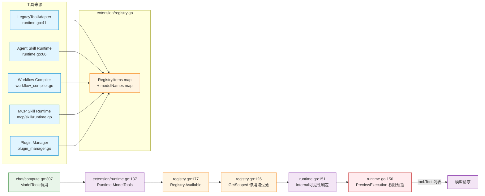
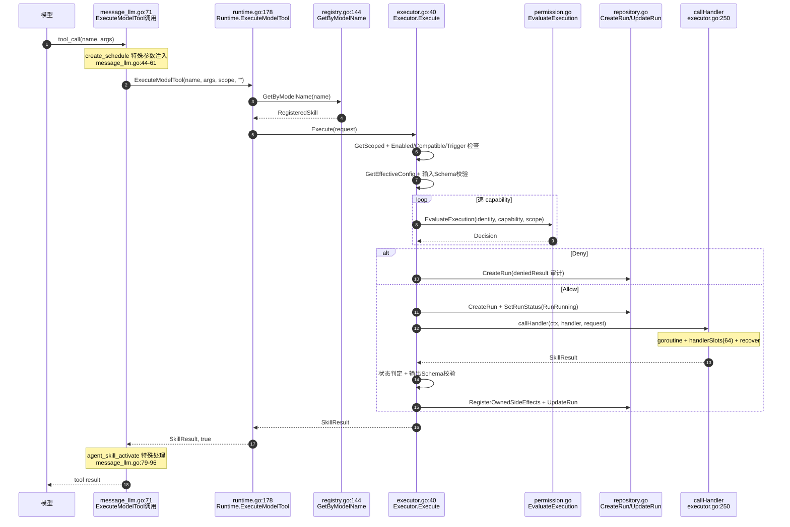

# 模型工具暴露与执行调用链地图

> 审计依据：`.trae/Amitia_扩展系统重构_第2步_建立现有系统调用链地图.md` Task 3（地图 C、D）
> 审计日期：2026-07-25
> 状态：第2步调用链地图（只审计不修改）

---

## 一、涉及文件

| 文件 | 职责 |
|---|---|
| `backend/internal/chat/compute.go` | Prompt 构建、`PrepareAgentSkillPrompt`、`BeforePrompt`、`ModelTools` 调用 |
| `backend/internal/chat/message_llm.go` | LLM 调用、`ExecuteModelTool` 调用、`create_schedule`/`agent_skill_activate` 特殊处理 |
| `backend/internal/chat/message_pipeline.go` | `dispatchPluginAfterReply`→`AfterReply` |
| `backend/internal/extension/runtime.go` | `ModelTools`、`ExecuteModelTool` |
| `backend/internal/extension/registry.go` | `Available`、`GetByModelName`、`GetScoped` |
| `backend/internal/extension/executor.go` | `Execute` 统一执行器 |
| `backend/internal/extension/permission.go` | `PreviewExecution`、`EvaluateExecution` |
| `backend/internal/extension/legacy_tool_adapter.go` | 旧工具适配为 SkillDefinition |
| `backend/internal/agent/tool/registry.go` | 旧工具枚举与执行 |

---

## 二、工具来源汇总（地图 C）

模型可见的工具全部来自 Extension Registry，共有 4 类来源汇入：

| 来源 | 注册入口 | 文件:行 | ModelName 生成 | Handler | 备注 |
|---|---|---|---|---|---|
| 旧版内置工具 | `LegacyToolAdapter.RegisterAll` | `extension/runtime.go:41`、`legacy_tool_adapter.go:25` | 旧工具原名（`get_current_time` 等） | 包装 `tool.ExecuteWithContextAndCancel` | 启动时注册；memory 工具仅 Manual trigger |
| Agent Skill | `registerAgentSkillRuntime` | `extension/runtime.go:66` | Agent Skill 定义 | Agent Skill Runtime Handler | 含 `agent_skill_activate` 等内部工具 |
| Workflow | `WorkflowCompiler` → Registry | `extension/workflow_compiler.go` | Workflow 定义 | Workflow Executor | 由 Workshop/Package 安装时注册 |
| MCP Tool | `mcpskill.Runtime.RegisterServer` | `mcp/skill/runtime.go` | MCP 工具名 | 转发 `Manager.Call("tools/call")` | MCP Server Ready 后注册 |
| Plugin Skill Contribution | `PluginManager.Start` | `extension/plugin_manager.go` | Plugin 贡献 | Plugin Handler | Plugin 加载时注册 |

> 已确认：所有工具都汇入单一 `Registry`（`extension/registry.go`），通过 `Registry.Available` 统一过滤后暴露给模型。无第二套 Tool Registry。

---

## 三、调用链

### 链路 TE-1：工具暴露链（地图 C）

链路编号：TE-1
链路名称：模型工具列表暴露
触发条件：聊天请求进入 `compute.go` Prompt 构建阶段
最终结果：模型请求携带工具定义

| 顺序 | 层级 | 文件 | 类型/函数 | 输入 | 输出/状态变化 | 错误处理 | 备注 |
|---:|---|---|---|---|---|---|---|
| 1 | Chat | `chat/compute.go:237` | 构造 `skillScope`（Trigger=LLM） | req 字段 | ExecutionScope | — | |
| 2 | Agent Skill | `chat/compute.go:242` | `skillRuntime.PrepareAgentSkillPrompt` | ctx, skillScope, req.Message | catalog, activated, activationErrors | — | 决定 internal 工具可见性 |
| 3 | Plugin | `chat/compute.go:260` | `skillRuntime.BeforePrompt` | ctx, skillScope | []ContextContribution | — | Plugin Context 注入 |
| 4 | Extension | `extension/runtime.go:137` | `(*Runtime).ModelTools` | ctx, scope | []tool.Tool, error | — | scope.Trigger 设为 LLM |
| 5 | Agent Skill | `extension/runtime.go:140-144` | `AgentSkills.ResolveCatalog` | ctx, scope | catalog 非空→agentSkillToolsAvailable=true | — | 决定 internal 工具可见性 |
| 6 | Registry | `extension/runtime.go:145` | `Registry.Available` | ctx, scope | []SkillDefinition | — | |
| 7 | Registry | `extension/registry.go:177` | `Registry.Available` → `List(Trigger,IncludeInternal)` | filter | []RegisteredSkill | — | |
| 8 | Registry | `extension/registry.go:184-189` | 逐项 `GetScoped` 过滤 | scope | 保留 Enabled && Compatible && 非 instructions | — | instructions 类型不暴露为工具 |
| 9 | Extension | `extension/runtime.go:151-153` | internal 工具可见性判定 | definition.Internal, agentSkillToolsAvailable | Internal 且无 Agent Skill catalog→跳过 | — | 隐式耦合：internal 工具可见性依赖 Agent Skill |
| 10 | 权限 | `extension/runtime.go:156-161` | `Permissions.PreviewExecution` | identity, capability, scope | DecisionDeny→跳过该工具 | — | 逐 capability 预览 |
| 11 | Schema | `extension/runtime.go:165-173` | 解析 InputSchema 构造 `tool.Tool` | definition | tool.Tool（Function.Name=ModelName） | 解析失败返回错误 | |
| 12 | Chat | `chat/compute.go:307-314` | `skillRuntime.ModelTools` 返回 toolDefs | — | 赋值 toolDefs | 失败 toolDefs=nil + TraceError | |
| 13 | Chat | `chat/compute.go:318` | TraceInfo 记录 tool_count | — | — | — | |

### 链路 TE-2：工具执行链（地图 D）

链路编号：TE-2
链路名称：模型工具调用执行
触发条件：模型返回 Tool Call
最终结果：工具结果返回模型后续轮次

| 顺序 | 层级 | 文件 | 类型/函数 | 输入 | 输出/状态变化 | 错误处理 | 备注 |
|---:|---|---|---|---|---|---|---|
| 1 | Chat | `chat/message_llm.go:41-43` | 解析 tool_call name/args/toolCallID | tc | name, args, toolCallID | — | |
| 2 | Chat | `chat/message_llm.go:44-61` | **`create_schedule` 特殊参数注入** | name,args | 注入 conversation_id/character_id/channel | — | **隐式耦合**：chat 层硬编码改写特定工具参数，绕过 Executor 输入处理 |
| 3 | Chat | `chat/message_llm.go:70` | 构造 skillScope（Trigger=LLM, ToolCallID） | — | ExecutionScope | — | |
| 4 | Extension | `chat/message_llm.go:71` | `skillRuntime.ExecuteModelTool` | toolExecCtx, name, args, skillScope, "" | SkillResult, found | — | idempotencyKey 传空串 |
| 5 | Extension | `extension/runtime.go:178` | `(*Runtime).ExecuteModelTool` | modelName, input, scope, idempotencyKey | SkillResult, bool | — | |
| 6 | Registry | `extension/runtime.go:179` | `Registry.GetByModelName` | modelName | RegisteredSkill | 未找到返回 RunFailed + VisibleText="tool not found" | 反查靠内存 modelNames map |
| 7 | Extension | `extension/runtime.go:184` | `Executor.Execute` | ExecuteSkillRequest{SkillID, Input, Scope, IdempotencyKey} | SkillResult, error | — | scope.Trigger 设为 LLM |
| 8 | Registry | `extension/executor.go:42` | `Registry.GetScoped` | skillID, scope | RegisteredSkill（含作用域 Enabled） | 未找到返回错误 | |
| 9 | Executor | `extension/executor.go:47-49` | instructions 检查 | definition.Entry.Kind | Kind=="instructions"→ErrSkillNotExecutable | — | |
| 10 | Executor | `extension/executor.go:50-53` | ctx 取消检查 | ctx.Err | RunCancelled | — | |
| 11 | Executor | `extension/executor.go:54-62` | Enabled/Compatible/Trigger 检查 | definition, scope | 不满足→ErrSkillDisabled/Incompatible/TriggerNotAllowed | — | |
| 12 | Executor | `extension/executor.go:63-69` | `repository.GetEffectiveConfig` | skillID, scope, DefaultConfig | request.Config | 失败返回错误 | |
| 13 | Executor | `extension/executor.go:70-73` | 输入 Schema 校验 | InputSchema, Input | — | 失败 ErrSkillInputInvalid | |
| 14 | 权限 | `extension/executor.go:74-81` | **逐 capability `permissions.EvaluateExecution`** | identity, capability, scope | DecisionDeny→`deniedResult`（写审计 Run） | — | 权限拒绝写 Run 记录 |
| 15 | 幂等 | `extension/executor.go:82-130` | 幂等检查 | IdempotencyKey | 内存缓存命中→返回；DB FindIdempotentRun；inFlight 冲突→ErrSkillIdempotencyConflict | — | 仅 Idempotent 定义走此路 |
| 16 | 审计 | `extension/executor.go:142-149` | `repository.CreateRun` + `SetRunStatus(RunRunning)` | RunView | DB 写入 Run 记录 | 失败返回错误 | |
| 17 | 执行 | `extension/executor.go:151-156` | `context.WithTimeout` | definition.Timeout（默认5s） | execCtx | — | |
| 18 | 执行 | `extension/executor.go:192` | `executeHandler` → `callHandler` | handler, request | SkillResult | — | |
| 19 | 执行 | `extension/executor.go:250-274` | `callHandler`：goroutine + `handlerSlots` 信号量(64) + recover | handler | SkillResult | panic→ErrSkillExecutionFailed | ctx.Done 返回 ctx.Err |
| 20 | 状态 | `extension/executor.go:194-218` | 状态判定 | execCtx.Err, result | Succeeded/Failed/TimedOut/Cancelled | — | DeadlineExceeded→TimedOut |
| 21 | 校验 | `extension/executor.go:219-227` | 输出 Schema 校验 | OutputSchema, Output | — | 失败 ErrSkillOutputInvalid + 清空 Output | 仅 Succeeded 时校验 |
| 22 | 审计 | `extension/executor.go:157-191` | defer：`RegisterOwnedSideEffects` + `UpdateRun` | scope, SideEffects, result | DB 写入资源所有权 + Run 更新 | 资源持久化失败→`CompensateUnownedSideEffects`+RunPartiallySucceeded；Run 持久化失败+HasSideEffects→RunPartiallySucceeded | 失败补偿 |
| 23 | Chat | `chat/message_llm.go:72-78` | 解析 skillResult | — | result=VisibleText, status, toolForceVoice, errorCode | — | |
| 24 | Chat | `chat/message_llm.go:79-96` | **`agent_skill_activate` 特殊处理** | name, skillResult | 解析 activation.Prompt 注入后续轮次 promptTrace | — | **隐式耦合**：模型可主动调用此工具激活 Agent Skill |
| 25 | Chat | 后续轮次 | tool 结果作为 tool message 回填模型 | — | 模型继续生成 | — | |

### 链路 TE-3：AfterReply Hook 链

链路编号：TE-3
链路名称：回复后 Plugin Hook
触发条件：消息提交完成
最终结果：Plugin AfterReply 派发 + 系统事件

| 顺序 | 层级 | 文件 | 类型/函数 | 输入 | 输出/状态变化 | 错误处理 | 备注 |
|---:|---|---|---|---|---|---|---|
| 1 | Chat | `chat/message_pipeline.go:50,142` | `dispatchPluginAfterReply` | req, computeResult, messageIDs | — | — | 两处调用 |
| 2 | Chat | `chat/message_pipeline.go:158-167` | `dispatchPluginAfterReply` 实现 | — | 构造 scope | — | |
| 3 | Chat | `chat/message_pipeline.go:159` | nil/空检查 | result, Reply | 跳过条件：skillRuntime==nil 或 result==nil 或 HasExistingUser 或 Reply=="" | — | |
| 4 | Extension | `chat/message_pipeline.go:167` | `skillRuntime.AfterReply` | scope, ReplyView{MessageID,CharacterID,ConversationID,Channel,Content,CreatedAt} | bool(queued) | — | |
| 5 | Extension | `extension/runtime.go:116` | `(*Runtime).AfterReply` | scope, reply | bool | — | |
| 6 | Extension | `extension/runtime.go:120` | `pluginSnapshot`（`Repository.ValidateConversationScope`） | scope | ExtensionSnapshot | 失败返回 false | |
| 7 | Plugin | `extension/runtime.go:124` | `PluginManager.DispatchAfterReply` | snapshot, reply | queued | — | 异步派发，见 PLG-3 |
| 8 | Plugin | `extension/runtime.go:125-127` | `PluginManager.EmitSystemEvent` | ExtensionEvent{reply.completed.v1} | — | — | 系统事件 |

---

## 四、Mermaid 图

### 地图 C：模型工具暴露图（tool-exposure.mmd）

### 地图 D：模型工具执行图（tool-execution.mmd）

---

## 五、关键发现与风险

### P0（重构阻塞）

- 无。工具暴露与执行链闭环，无绕过权限的执行入口。

### P1（高风险历史债务）

- **P1-TE-1 chat 层硬编码改写 `create_schedule` 参数**：`message_llm.go:44-61` 在模型返回 `create_schedule` 工具调用后，直接向 args 注入 `conversation_id`/`character_id`/`channel`，绕过 Executor 的统一输入处理与 Schema 校验。证据：`message_llm.go:44-61`。影响：特定工具的参数在 chat 层与 Executor 之间不一致；重构工具模型时易遗漏。建议：第7步统一 Tool/Capability 模型时将参数注入移入工具 Handler 内部。
- **P1-TE-2 internal 工具可见性隐式依赖 Agent Skill**：`runtime.go:151-153` 中 internal 工具（如 `agent_skill_activate`、资源读取工具）仅当 `agentSkillToolsAvailable` 为 true 时才暴露给模型，而该标志由 `AgentSkills.ResolveCatalog` 决定。证据：`runtime.go:140-153`。影响：工具暴露规则分散在 Runtime 与 AgentSkillService 之间；无法独立确定 internal 工具可见性。建议：第6步解除 Skill 概念过载时统一可见性判定。
- **P1-TE-3 `agent_skill_activate` 为可被模型主动调用的特殊工具**：`message_llm.go:79-96` 对该工具输出做特殊解析并注入后续 promptTrace。证据：`message_llm.go:79-96`。影响：模型可主动激活 Agent Skill，存在与 `PrepareAgentSkillPrompt`（显式激活）两套激活路径。建议：第6步统一激活入口。

### P2（中风险结构问题）

- **P2-TE-1 工具执行幂等性仅对 Idempotent 定义生效**：`executor.go:86-130` 的幂等缓存与 DB 查询仅在 `definition.Idempotent` 为 true 时执行。证据：`executor.go:86`。影响：非幂等工具重复调用无保护。建议：文档化。
- **P2-TE-2 ModelName 冲突检测仅靠内存 map**：`registry.go:82-84` 注册时检查 `modelNames` map 冲突。证据：`registry.go:82`。影响：重启后若注册顺序变化可能暴露不同的冲突。建议：第7步统一 Tool ID 生成。

### P3（低风险）

- **P3-TE-1** `ExecuteModelTool` 的 idempotencyKey 固定传空串（`message_llm.go:71`），由 Executor 内部 `defaultIdempotencyKey` 生成。建议：文档化。

---

## 六、未确认项

- 是否存在不经过 `ExecuteModelTool` 的工具调用入口：已确认 chat 层仅此一处调用（`message_llm.go:71`），但 MCP Host 的 Sampling 回调路径是否触发工具执行待 MCP 链路（MCP-6）确认。
- `Permissions.PreviewExecution` 与 `EvaluateExecution` 的判定差异：需读 `permission.go` 全文确认（本链路仅引用入口）。
