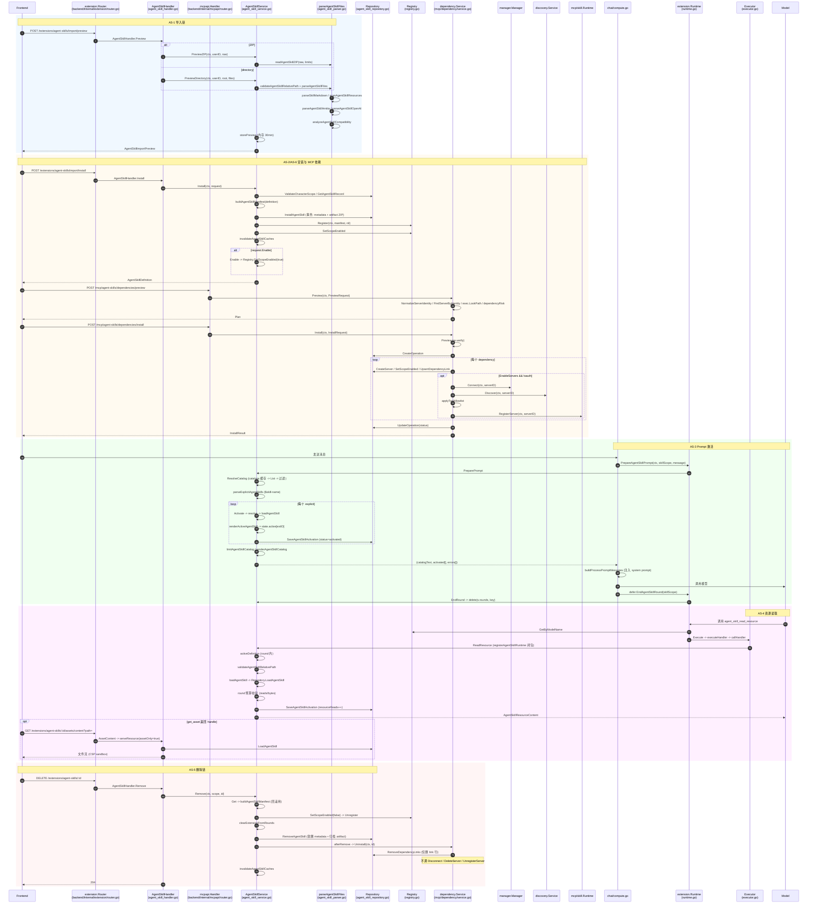

# Agent Skill 调用链地图

> 审计依据：.trae/Amitia_扩展系统重构_第2步_建立现有系统调用链地图.md
> 审计日期：2026-07-25
> 状态：第2步调用链地图（只审计不修改）

## 一、涉及文件清单

| 文件 | 职责 | 行数 | 关键类型/函数 |
|---|---|---:|---|
| backend/internal/extension/agent_skill_parser.go | ZIP/目录解析、SKILL.md/frontmatter 校验、资源索引、兼容性报告、MCP 依赖解析 | 727 | `parseAgentSkillFiles`、`readAgentSkillZIP`、`parseSkillMarkdown`、`scanAgentSkillResources`、`analyzeAgentSkillCompatibility`、`parseAgentSkillOpenAI`、`parseAgentSkillAmitia`、`validateMCPDependency`、`mapAgentSkillTools` |
| backend/internal/extension/agent_skill_protocol.go | 类型与错误码常量、Limit 默认值、Definition/Activation/Resource 数据结构 | 258 | `AgentSkillDefinition`、`AgentSkillMCPDependency`、`AgentSkillLimits`、`DefaultAgentSkillLimits`、`AgentSkillCompatibilityReport`、`ActivateAgentSkillRequest`、`InstallAgentSkillRequest` |
| backend/internal/extension/agent_skill_service.go | 预览/安装/启用/删除/激活/资源读取/目录解析/缓存管理 | 793 | `AgentSkillService`、`PreviewZIP`、`PreviewDirectory`、`Install`、`Enable`、`Disable`、`Remove`、`Activate`、`PreparePrompt`、`ResolveCatalog`、`ReadResource`、`ListResources`、`loadAgentSkill`、`invalidateAgentSkillCaches` |
| backend/internal/extension/agent_skill_runtime.go | 把 Agent Skill 内部工具注册为 SkillDefinition（含真实 Handler）；Runtime 上暴露 `PrepareAgentSkillPrompt`/`EndAgentSkillRound` | 137 | `registerAgentSkillRuntime`、`internalAgentSkillDefinition`、`Runtime.PrepareAgentSkillPrompt`、`Runtime.EndAgentSkillRound` |
| backend/internal/extension/agent_skill_handler.go | HTTP 入口，装配 gin 路由处理函数 | 251 | `AgentSkillHandler`、`Preview`、`Install`、`List`、`Get`、`Enable`、`Disable`、`Remove`、`Resources`、`ResourceContent`、`AssetContent`、`serveResource`、`Activations`、`Metrics` |
| backend/internal/extension/agent_skill_repository.go | DB 持久化（metadata、artifact ZIP、activation 记录），ZIP 编解码 | 312 | `agentSkillMetadataRecord`、`agentSkillArtifactRecord`、`agentSkillActivationRecord`、`InstallAgentSkill`、`LoadAgentSkill`、`RemoveAgentSkill`、`SaveAgentSkillActivation`、`ListAgentSkillActivations`、`encodeAgentSkillArtifact`、`decodeAgentSkillArtifact` |
| backend/internal/extension/agent_skill_metrics.go | 进程内计数器（无持久化） | 41 | `addAgentSkillMetric`、`agentSkillMetricsSnapshot`、`defaultAgentSkillMetrics` |
| backend/internal/mcp/dependency/service.go | MCP 依赖的 Preview/Install/Uninstall/AuthorizationCompleted | 346 | `Service`、`Preview`、`Install`、`Uninstall`、`AuthorizationCompleted`、`applyToolAllowlist`、`serverInput`、`dependencyRisk` |
| backend/internal/extension/handler.go | 通用 problem/success 辅助，错误码→HTTP 状态映射 | 380 | `Handler`、`problem`、`problemWithResult`、`problemStatus`、`success` |
| backend/internal/extension/router.go | 装配 `/api/extensions/agent-skills/*` 路由 | 128 | `RegisterRouter`、`extensionAuth` |
| backend/internal/mcpapi/router.go | 装配 `/api/mcp/agent-skills/dependencies/*` 路由 | 673 | `Handler.dependencyPreview`、`Handler.dependencyInstall`、`Handler.dependencies`、`Handler.removeDependencies` |
| backend/internal/extension/runtime.go | Runtime 装配；ModelTools 通过 ResolveCatalog 控制 internal 工具可见性 | 192 | `NewRuntime`、`Runtime.ModelTools`、`Runtime.ExecuteModelTool` |
| backend/internal/extension/lifecycle_service.go | 通用 Skill 启用/禁用生命周期，对 instructions Skill 反向委派给 AgentSkillService | 57 | `extensionLifecycleService.setEnabled` |
| backend/internal/chat/compute.go | Chat 流程调用 `PrepareAgentSkillPrompt` 注入目录与激活态指令 | — | `computeFlow`（行 237-257） |
| backend/internal/chat/message_llm.go | 资源读取后回写 PromptTrace.AgentSkills | — | `appendAgentSkillPromptTrace`、`appendAgentSkillResourceTrace` |
| backend/internal/extension/registry.go | Registry.List 过滤 Internal；Available 在 scope 上筛选 | — | `Registry.List`、`Registry.Available`、`Registry.GetByModelName` |
| backend/internal/extension/executor.go | Executor 调用注册的 SkillHandler | — | `Executor.Execute`、`Executor.executeHandler`、`Executor.callHandler` |
| backend/cmd/server/services.go | 装配 AfterRemove→dependencyService.Uninstall | — | 行 301-304 |
| backend/cmd/server/router.go | 装配 mcpapi 路由 | — | 行 92 |

## 二、核心类型与函数索引

| 类型/函数 | 文件:行 | 职责 | 调用者 | 被调用者 |
|---|---|---|---|---|
| `AgentSkillService` | agent_skill_service.go:36 | 串联 preview/install/enable/remove/activate/readResource；维护 previews/rounds/artifacts/catalogs 缓存 | runtime.go、agent_skill_handler.go、lifecycle_service.go、workshop_service.go、package_installer.go、package_lifecycle.go | Repository、Registry、`parseAgentSkillFiles` |
| `AgentSkillService.PreviewZIP` | agent_skill_service.go:59 | 解析 ZIP 包预览 | `AgentSkillHandler.Preview`（ZIP 分支） | `readAgentSkillZIP`、`parseAgentSkillFiles`、`storePreview` |
| `AgentSkillService.PreviewDirectory` | agent_skill_service.go:75 | 解析目录预览 | `AgentSkillHandler.Preview`（directory 分支）、`WorkshopService` | `validateAgentSkillRelativePath`、`parseAgentSkillFiles`、`storePreview` |
| `AgentSkillService.Install` | agent_skill_service.go:137 | 落库 + 注册到 Registry + 作用域绑定 | `AgentSkillHandler.Install` | `Repository.ValidateCharacterScope`、`Repository.GetAgentSkillRecord`、`Repository.LoadAgentSkill`、`setInstalledAgentSkillBinding`、`Repository.InstallAgentSkill`、`Registry.Register`、`Enable`、`invalidateAgentSkillCaches` |
| `AgentSkillService.Restore` | agent_skill_service.go:240 | 启动时从 DB 恢复并重新注册 | `NewRuntime`（runtime.go:63） | `Repository.ListAgentSkillRecords`、`Repository.LoadAgentSkill`、`buildAgentSkillManifest`、`Registry.Register` |
| `AgentSkillService.Enable` | agent_skill_service.go:346 | 启用：先 Get 校验，再 SetScopeEnabled(true)，刷缓存 | `Install`、`AgentSkillHandler.Enable`、`extensionLifecycleService.setEnabled` | `Get`、`Registry.SetScopeEnabled`、`invalidateAgentSkillCaches`、`addAgentSkillMetric` |
| `AgentSkillService.Disable` | agent_skill_service.go:361 | 禁用 + 清理 round | `AgentSkillHandler.Disable`、`extensionLifecycleService.setEnabled` | `Get`、`Registry.SetScopeEnabled`、`clearExtensionFromRounds`、`invalidateAgentSkillCaches` |
| `AgentSkillService.Remove` | agent_skill_service.go:372 | 删除：先 Get → Unregister → 清 round → Repository.RemoveAgentSkill → 调 `afterRemove` 回调 → 刷缓存 | `AgentSkillHandler.Remove` | `Get`、`buildAgentSkillManifest`、`Registry.SetScopeEnabled`、`Registry.Unregister`、`clearExtensionFromRounds`、`Repository.RemoveAgentSkill`、`afterRemove`（= `dependencyService.Uninstall`）、`invalidateAgentSkillCaches` |
| `AgentSkillService.SetAfterRemove` | agent_skill_service.go:49 | 注入删除后回调 | services.go:302 | — |
| `AgentSkillService.ResolveCatalog` | agent_skill_service.go:412 | 返回当前 scope 可见且启用的 Agent Skill 目录（带缓存） | `Runtime.ModelTools`（runtime.go:141）、`AgentSkillService.PreparePrompt` | `List`、`agentSkillCatalogCacheKey` |
| `AgentSkillService.PreparePrompt` | agent_skill_service.go:533 | 构造目录文本 + 激活消息中显式引用的技能 | `Runtime.PrepareAgentSkillPrompt` → `chat/compute.go:242` | `ResolveCatalog`、`parseExplicitAgentSkills`、`Activate`、`limitAgentSkillCatalog`、`renderAgentSkillCatalog` |
| `AgentSkillService.Activate` | agent_skill_service.go:460 | 解析 + 校验 + Token 预算 + 写 round + 持久化 activation | `PreparePrompt`、`registerAgentSkillRuntime` 中 `agent_skill_activate` handler | `resolve`、`roundState`、`estimateTokens`、`renderActiveAgentSkill`、`newAgentSkillActivationRecord`、`ensureRoundLocked`、`Repository.SaveAgentSkillActivation` |
| `AgentSkillService.ReadResource` | agent_skill_service.go:582 | 读取激活态 Agent Skill 的文本资源 | `registerAgentSkillRuntime` 中 `agent_skill_read_resource` handler | `activeDefinition`、`validateAgentSkillRelativePath`、`loadAgentSkill`、`ensureRoundLocked`、`Repository.SaveAgentSkillActivation` |
| `AgentSkillService.ListResources` | agent_skill_service.go:568 | 列出激活态 Agent Skill 的资源 | `registerAgentSkillRuntime` 中 `agent_skill_list_resources` handler | `activeDefinition` |
| `AgentSkillService.activeDefinition` | agent_skill_service.go:640 | 在 round 内通过 name/ID 找激活态定义 | `ReadResource`、`ListResources`、`registerAgentSkillRuntime` 中 `agent_skill_get_asset` handler | `roundState` |
| `registerAgentSkillRuntime` | agent_skill_runtime.go:21 | 注册 4 个 internal SkillDefinition（activate/list_resources/read_resource/get_asset），均带真实 SkillHandler 闭包 | `NewRuntime`（runtime.go:66） | `registry.Register`、`service.Activate`、`service.ListResources`、`service.ReadResource`、`service.activeDefinition`、`validateAgentSkillRelativePath` |
| `internalAgentSkillDefinition` | agent_skill_runtime.go:113 | 构造 internal SkillDefinition（`Internal: true`、`Source: SkillSourceBuiltin`、`Triggers: [TriggerLLM]`、`Enabled: true`） | `registerAgentSkillRuntime` | — |
| `Runtime.ModelTools` | runtime.go:137 | 通过 ResolveCatalog 决定 internal 工具是否对模型可见 | `chat/compute.go:308` | `AgentSkills.ResolveCatalog`、`Registry.Available`、`Permissions.PreviewExecution` |
| `Runtime.PrepareAgentSkillPrompt` | agent_skill_runtime.go:127 | 包装 `AgentSkills.PreparePrompt` | `chat/compute.go:242` | `AgentSkills.PreparePrompt` |
| `Runtime.EndAgentSkillRound` | agent_skill_runtime.go:133 | 包装 `AgentSkills.EndRound` | `chat/compute.go:256`（defer） | `AgentSkills.EndRound` |
| `Repository.InstallAgentSkill` | agent_skill_repository.go:96 | 事务写入 metadata + artifact（ZIP） | `AgentSkillService.Install` | `encodeAgentSkillArtifact` |
| `Repository.LoadAgentSkill` | agent_skill_repository.go:144 | 读 metadata + artifact，解压，校验 checksum，提取 body | `AgentSkillService.loadAgentSkill`、`AgentSkillService.Install`（已存在分支）、`AgentSkillHandler.serveResource`、`AgentSkillService.Restore` | `GetAgentSkillRecord`、`decodeAgentSkillArtifact`、`hashAgentSkillFiles`、`extractAgentSkillBody` |
| `Repository.RemoveAgentSkill` | agent_skill_repository.go:182 | 软删 metadata + 归档 artifact + 归档 extensionRecord | `AgentSkillService.Remove` | — |
| `Repository.SaveAgentSkillActivation` | agent_skill_repository.go:199 | upsert activation 记录 | `AgentSkillService.Activate`、`AgentSkillService.ReadResource`、`AgentSkillService.saveFailedAgentSkillActivation` | — |
| `dependency.Service.Preview` | mcp/dependency/service.go:73 | 生成安装计划（查找现有 Server、风险评级、命令可用性） | `mcpapi.Handler.dependencyPreview`、`dependency.Service.Install` | `serverInput`、`mcp.NormalizeServerIdentity`、`repository.FindServerByIdentity`、`exec.LookPath`、`dependencyRisk` |
| `dependency.Service.Install` | mcp/dependency/service.go:110 | 执行安装：CreateServer→SetScopeEnabled→UpsertDependencyLink→Connect→Discover→applyToolAllowlist→RegisterServer；失败回滚 | `mcpapi.Handler.dependencyInstall` | `Preview`、`repository.CreateOperation`、`repository.CreateServer`、`repository.SetScopeEnabled`、`repository.UpsertDependencyLink`、`connections.Connect`、`discovery.Discover`、`applyToolAllowlist`、`skills.RegisterServer`、`repository.UpdateOperation`、`fail`（回滚） |
| `dependency.Service.Uninstall` | mcp/dependency/service.go:268 | 仅删除 DependencyLink 行，返回受影响 serverID 列表（不删除/禁用 Server，不调用 Registry 清理） | `AgentSkillService.afterRemove`（services.go:303）、`mcpapi.Handler.removeDependencies` | `repository.RemoveDependencyLinks` |
| `dependency.Service.AuthorizationCompleted` | mcp/dependency/service.go:271 | OAuth 回调后更新 link 状态并推进 operation | `mcpapi.Handler.oauthCallback`（router.go:512） | `repository.ListDependencyLinksByServer`、`repository.UpsertDependencyLink`、`repository.ListAgentSkillOperations`、`repository.UpdateOperation` |

### Agent Skill → SkillDefinition 转换点

| 转换点 | 文件:行 | 是否带真实 Handler | 说明 |
|---|---|---|---|
| `buildAgentSkillManifest` | agent_skill_service.go:232 | 否（注册时 handler 传 `nil`） | 用户安装的 Agent Skill 转为 `Kind: "Skill"`、`Source: SkillSourceInstructions`、`Entry.Kind: "instructions"` 的 SkillDefinition；`Registry.Register(ctx, manifest, nil)` 在 `AgentSkillService.Install`（行 196）与 `Restore`（行 264）调用 |
| `internalAgentSkillDefinition` | agent_skill_runtime.go:113 | 是（4 个 internal 工具均带 handler 闭包） | 4 个 internal 工具（activate/list_resources/read_resource/get_asset）转为 `Source: SkillSourceBuiltin`、`Internal: true`、`Triggers: [TriggerLLM]` 的 SkillDefinition；handler 在 `registerAgentSkillRuntime`（行 21-111）中通过 `registry.Register(ctx, item.definition, item.handler)` 注册 |

## 三、调用链

### 链路 AS-1：导入链

链路编号：AS-1
链路名称：Agent Skill 导入（ZIP / 目录）
触发条件：前端 `POST /api/extensions/agent-skills/import/preview`（source=directory 走目录分支，缺省走 ZIP 分支）
最终结果：返回 `AgentSkillImportPreview`（previewId 30 分钟内有效），不落库、不注册到 Registry

| 顺序 | 层级 | 文件 | 类型/函数 | 输入 | 输出/状态变化 | 错误处理 | 备注 |
|---:|---|---|---|---|---|---|---|
| 1 | HTTP 入口 | backend/internal/extension/router.go:41 | `RegisterRouter` 注册 `POST /extensions/agent-skills/import/preview` → `AgentSkillHandler.Preview` | gin.Context | 路由可达 | — | 走 `extensionAuth` 中间件 |
| 2 | 鉴权 | backend/internal/extension/router.go:107 | `extensionAuth` | Authorization: Bearer | `c.Set(authenticatedUserKey, me.ID)` | 401 problem | — |
| 3 | Handler | backend/internal/extension/agent_skill_handler.go:33 | `AgentSkillHandler.Preview` | multipart form | 调用 service | `MaxBytesReader 55MB`；`ParseMultipartForm 55MB` 失败→`ErrAgentSkillArchiveLimit` | source=directory 走 directory 分支；否则走 ZIP 分支 |
| 4a | Handler（ZIP 分支） | agent_skill_handler.go:71-92 | `header.Open()` + `io.ReadAll(LimitReader 55MB)` | FormFile "file" | raw []byte | 读失败→problem | — |
| 4b | Handler（目录分支） | agent_skill_handler.go:42-69 | 解析 `paths` JSON + 循环 `header.Open()` + `LimitReader MaxResourceBytes+1` | files[]+paths[] | map[paths[i]]content | 路径数不匹配→`ErrAgentSkillInvalidArchive` | — |
| 5 | Service | agent_skill_service.go:59（ZIP）/ 75（目录） | `AgentSkillService.PreviewZIP` / `PreviewDirectory` | ctx, userID, raw/files | `AgentSkillImportPreview` | defer 失败时 `addAgentSkillMetric(agentSkillMetricImportFailure, 1)` | — |
| 6 | 安全检查（ZIP） | agent_skill_parser.go:218 | `readAgentSkillZIP` | raw, limits | files map, root string | `ErrAgentSkillInvalidArchive`/`ErrAgentSkillArchiveLimit`/`ErrAgentSkillMissingSkillMD`/`ErrAgentSkillPathTraversal` | 校验：单根目录、无 symlink、无 `..`/`\`/Windows 盘符、NFC 规范化、压缩比、总大小 |
| 6' | 安全检查（目录） | agent_skill_service.go:87-102 | 循环 `validateAgentSkillRelativePath` + NFC 规范化 + 大小累计 | files map | normalized map | `ErrAgentSkillInvalidArchive`/`ErrAgentSkillArchiveLimit` | — |
| 7 | 解析核心 | agent_skill_parser.go:47 | `parseAgentSkillFiles` | files, root, source, limits | `parsedAgentSkill{Definition, Report, Files}` | 多种 `ErrAgentSkill*` | 顺序：明文密钥扫描→SKILL.md 存在性→大小→Markdown 解析→名称校验→描述校验→资源扫描→OpenAI/Amitia YAML 解析→工具映射→兼容性报告 |
| 8 | 密钥扫描 | agent_skill_parser.go:48-52 | 遍历 files，匹配 `secretPattern` | files | — | `ErrAgentSkillArtifactInvalid` "suspected plaintext secret" | `secretPattern` 定义在别处 |
| 9 | SKILL.md 校验 | agent_skill_parser.go:53-59 | 检查 `files["SKILL.md"]` 存在 + 大小 | — | — | `ErrAgentSkillMissingSkillMD`/`ErrAgentSkillArchiveLimit` | — |
| 10 | Frontmatter 解析 | agent_skill_parser.go:118 | `parseSkillMarkdown` | raw, limits | (frontmatter, extra, body, rawFrontmatter, warnings, err) | `ErrAgentSkillFrontmatter`（多种子原因） | BOM 去除、UTF-8 校验、`---` 起止、YAML 安全解码（禁 alias/anchor/custom tag/merge key）、未知字段保留到 extra、metadata key/value 长度限制、metadata.version SemVer 校验 |
| 11 | 名称校验 | agent_skill_parser.go:64-69 | `agentSkillNamePattern` + `reservedAgentSkillName` + root 名一致性 | frontmatter.Name | — | `ErrAgentSkillNameInvalid`/`ErrAgentSkillNameMismatch` | 名称必须 `^[a-z0-9]+(?:-[a-z0-9]+)*$`，≤64 字符，非保留名 |
| 12 | 描述校验 | agent_skill_parser.go:370 | `validateAgentSkillDescription` | frontmatter.Description | — | `ErrAgentSkillDescription` | trim 非空、≤1024、无控制字符 |
| 13 | 资源索引 | agent_skill_parser.go:313 | `scanAgentSkillResources` | files, limits | `[]AgentSkillResource`+warnings | `ErrAgentSkillArchiveLimit` | 分类 skill/reference/asset/script/agent_metadata；MIME 探测；文本可读性；sha256；script 标记 Executable=false 并加 `SCRIPT_EXECUTION_DISABLED` 警告 |
| 14 | OpenAI YAML 解析 | agent_skill_parser.go:548 | `parseAgentSkillOpenAI` | files, limits | `*parsedOpenAIYAML`+warnings | `ErrAgentSkillFrontmatter`/`ErrAgentSkillPathTraversal`/`ErrAgentSkillResourceNotFound` | 解析 `agents/openai.yaml`：interface 字段、icon 必须本地 assets、dependencies 仅接受 type=mcp，强制 `RequiresManualConfirmation=true` |
| 15 | Amitia YAML 解析 | agent_skill_parser.go:619 | `parseAgentSkillAmitia` | files, limits | `[]AgentSkillMCPDependency`+warnings | `ErrAgentSkillFrontmatter` | 解析 `agents/amitia.yaml`：version 必须为 "1"、≤20 依赖、stdio 强制 `RequiresManualConfirmation=true` + `AutoConfigure=false` |
| 16 | MCP 依赖校验 | agent_skill_parser.go:698 | `validateMCPDependency` | dependency | — | `ErrAgentSkillFrontmatter` | id 正则、transport 限制（streamable_http/stdio）、auth type 限制、scope 限制（global/character）、URL 必须 https 或 localhost、stdio 必须 command |
| 17 | 工具映射 | agent_skill_parser.go:428 | `mapAgentSkillTools` | frontmatter.AllowedTools | `[]AgentSkillToolMapping` | — | `read`→mapped 到 `dev.amitia.skill.agent-skill-read-resource`；`websearch`→partially_mapped；`bash/shell/python/node`→blocked；`mcp(...)`→unsupported（仅元数据） |
| 18 | 兼容性报告 | agent_skill_parser.go:457 | `analyzeAgentSkillCompatibility` | body, files, resources, mappings, warnings | `AgentSkillCompatibilityReport` | — | 扫描 markdown 链接 + 路径引用→缺失文件/必需脚本；危险关键词扫描（PROMPT_OVERRIDE/SYSTEM_PROMPT_LEAK/SHELL_REQUIRED 等）；token 估算；HTML 活跃内容→Errors；SVG unsafe→Errors；最终 Status: compatible/compatible_with_warnings/partially_compatible/blocked |
| 19 | Definition 构造 | agent_skill_parser.go:104-115 | 构造 `AgentSkillDefinition`（Enabled=false、ContentHash=`hashAgentSkillFiles`） | 各步骤产物 | parsedAgentSkill.Definition | — | — |
| 20 | 预览存储 | agent_skill_service.go:109 | `storePreview` | userID, parsed | `AgentSkillImportPreview`（previewId, ExpiresAt=now+30min） | — | 顺带清理过期 preview；累加 metrics（import_total、blocked、script_detected、unsupported_tool） |
| 21 | 响应 | agent_skill_handler.go:68/92 | `success(c, preview)` | — | 200 JSON | — | — |

**关键发现**：导入链只生成内存 preview，不落 DB、不注册 Registry；previewId 必须配合 `InstallAgentSkillRequest` 在 30 分钟内消费。

### 链路 AS-2：启用与作用域链

链路编号：AS-2
链路名称：Agent Skill 启用与作用域切换
触发条件：
- 前端 `POST /api/extensions/agent-skills/:id/enable` 或 `POST /api/extensions/agent-skills/:id/disable`
- 通用 Skill 启用接口 `POST /api/extensions/skills/:id/enable`（当目标 Skill 来源为 `SkillSourceInstructions` 时由 `extensionLifecycleService` 委派给 `AgentSkillService`）

最终结果：Registry 中该 scope 的 Enabled 标志被更新；artifacts/catalogs 缓存失效；下一轮 `ResolveCatalog` 重新计算。

| 顺序 | 层级 | 文件 | 类型/函数 | 输入 | 输出/状态变化 | 错误处理 | 备注 |
|---:|---|---|---|---|---|---|---|
| 1 | HTTP 入口 | router.go:46 | `POST /extensions/agent-skills/:id/enable` → `AgentSkillHandler.Enable` | :id, scope query | — | — | — |
| 2 | Handler | agent_skill_handler.go:133 | `AgentSkillHandler.Enable` | c | 调用 `service.Enable` | problem | scope 由 `h.scope(c)` 构造（UserID/CharacterID/ConversationID/Channel/TraceID） |
| 3 | Service | agent_skill_service.go:346 | `AgentSkillService.Enable` | ctx, scope, id | — | — | — |
| 4 | 校验+取定义 | agent_skill_service.go:321 | `AgentSkillService.Get` | ctx, scope, id | AgentSkillDefinition | `ErrAgentSkillNotFound`/`ErrAgentSkillScopeForbidden` | `Repository.ValidateCharacterScope` + `Repository.GetAgentSkillRecord` + `loadAgentSkill` + `Registry.GetScoped`（若 `EffectiveScopeType==""` 报 scope forbidden） |
| 5 | 阻断校验 | agent_skill_service.go:351 | 检查 `definition.CompatibilityStatus == AgentSkillBlocked` | — | — | `ErrAgentSkillBlocked` "Blocked Agent Skill cannot be enabled" | blocked 技能不可启用 |
| 6 | 作用域更新 | agent_skill_service.go:354 | `Registry.SetScopeEnabled(ctx, id, scope, true)` | id, scope, true | Registry 内部 scope binding 更新 | — | — |
| 7 | 缓存失效 | agent_skill_service.go:357 | `invalidateAgentSkillCaches` | — | artifacts、catalogs map 清空 | — | — |
| 8 | 指标 | agent_skill_service.go:358 | `addAgentSkillMetric(agentSkillMetricEnabled, 1)` | — | — | — | — |
| 9 | 响应 | agent_skill_handler.go:138 | `success(c, {enabled: true})` | — | 200 JSON | — | — |

**禁用分支差异**（`Disable`）：无 blocked 校验；额外调用 `clearExtensionFromRounds(id)` 清理所有 round 内激活态；不写 metric。

**生命周期委派路径**（`POST /extensions/skills/:id/enable`）：
- `Handler.EnableSkill`（handler.go:74）→ `Service.EnableSkill` → `extensionLifecycleService.setEnabled`（lifecycle_service.go:32）
- 行 50-55：若 `item.Definition.Source == SkillSourceInstructions && s.agentSkills != nil` 则委派给 `agentSkills.Enable/Disable`，否则直接 `Registry.SetScopeEnabled`
- 注意：`extensionLifecycleService.setEnabled` 行 42-44 还会校验 `Compatible` 与 `Dependencies`，但 `AgentSkillService.Enable` 内部已自行 Get 校验，存在重复校验。

### 链路 AS-3：Prompt 激活链

链路编号：AS-3
链路名称：Agent Skill Prompt 激活
触发条件：用户发送聊天消息（`chat/compute.go` 触发 `PrepareAgentSkillPrompt`）
最终结果：
1. 模型 system prompt 中注入 `<available_agent_skills>` 目录（如目录非空）
2. 显式引用的 `$skill-name` 被激活，注入 `<active_agent_skill>` 指令块
3. activation 记录写入 DB；round 状态建立
4. round 结束时（defer）`EndAgentSkillRound` 清理内存 round

| 顺序 | 层级 | 文件 | 类型/函数 | 输入 | 输出/状态变化 | 错误处理 | 备注 |
|---:|---|---|---|---|---|---|---|
| 1 | Chat 流程 | backend/internal/chat/compute.go:241 | `s.skillRuntime != nil` 判空 | — | — | — | skillRuntime 即 `*extension.Runtime` |
| 2 | Chat 流程 | compute.go:242 | `s.skillRuntime.PrepareAgentSkillPrompt(ctx, skillScope, req.Message)` | ctx, scope, message | (catalog, activated, errorsList) | 错误收集到 errorsList 不中断主流程 | — |
| 3 | Runtime 包装 | agent_skill_runtime.go:127 | `Runtime.PrepareAgentSkillPrompt` | 同上 | 委派 `AgentSkills.PreparePrompt` | nil 检查 | — |
| 4 | Service | agent_skill_service.go:533 | `AgentSkillService.PreparePrompt` | ctx, scope, message | (catalogRendered, activated, errorsList) | `ResolveCatalog` 失败时返回 err 列表 | — |
| 5 | 目录解析 | agent_skill_service.go:412 | `ResolveCatalog` | ctx, scope | `[]AgentSkillCatalogEntry` | — | 先查 `catalogs` 缓存；未命中调 `List(scope, filter{page:1,pageSize:100})`；过滤 Enabled 非 blocked；按 `agentSkillPriority`（character>非 bundled>bundled）去重；写回缓存 |
| 6 | 显式技能识别 | agent_skill_service.go:554 | `parseExplicitAgentSkills` | message | []string | — | 正则 `(?:^|[\s])\$([a-z0-9]+(?:-[a-z0-9]+)*)(?:\b|$)` 提取 `$skill-name` |
| 7 | 激活循环 | agent_skill_service.go:541-547 | 循环 `s.Activate(ActivateAgentSkillRequest{Scope, NameOrID: name, Explicit: true})` | 每个 name | ActivatedAgentSkill | 错误加入 errorsList 跳过 | — |
| 8 | 激活核心 | agent_skill_service.go:460 | `AgentSkillService.Activate` | request | ActivatedAgentSkill | 失败时 `saveFailedAgentSkillActivation` 写 DB | — |
| 9 | 解析定义 | agent_skill_service.go:654 | `resolve` | ctx, scope, nameOrID | AgentSkillDefinition | `ErrAgentSkillNotFound` | 内部调 `List` 找匹配项（按 ExtensionID 或 Name），按 priority 选最优；按需调 `loadAgentSkill` |
| 10 | 已激活检查 | agent_skill_service.go:467-473 | `state.active[extensionID]` 命中则直接返回 | — | — | — | — |
| 11 | 激活上限 | agent_skill_service.go:474 | `activeCount >= limits.MaxActivations`（默认 3） | — | — | `ErrAgentSkillActivationLimit` | — |
| 12 | 启用校验 | agent_skill_service.go:479 | `!definition.Enabled` | — | — | `ErrAgentSkillDisabled` | — |
| 13 | 兼容性校验 | agent_skill_service.go:484 | `CompatibilityStatus == AgentSkillBlocked` | — | — | `ErrAgentSkillBlocked` | — |
| 14 | Token 估算 | agent_skill_service.go:489 | `estimateTokens(definition.Body)` | body | tokens | — | `(rune+3)/4` |
| 15 | 单体上限 | agent_skill_service.go:490 | `tokens > limits.MaxBodyTokens`（默认 32768） | — | — | `ErrAgentSkillPromptLimit` | — |
| 16 | Prompt 渲染 | agent_skill_service.go:495 | `renderActiveAgentSkill(definition)` | definition | prompt 字符串 | — | 包装为 `<active_agent_skill id name source>...body...</active_agent_skill>`，前置优先级声明，body 经 `stripAgentSkillHostTags` 过滤 |
| 17 | Round 总量校验 | agent_skill_service.go:500-508 | 累加已有 active.BodyTokens，超 `MaxPromptTokens`（默认 49152） | — | — | `ErrAgentSkillPromptLimit` "prompt budget exceeded" | — |
| 18 | Round 状态写入 | agent_skill_service.go:510-512 | `state.active[extID]=activation; state.records[extID]=record` | — | round 内激活态 | — | — |
| 19 | 持久化 | agent_skill_service.go:513 | `Repository.SaveAgentSkillActivation(ctx, record)` | record | upsert `extension_agent_skill_activations` | 错误被忽略（`_ =`） | activation 状态="activated" |
| 20 | 指标 | agent_skill_service.go:514-515 | `addAgentSkillMetric` | — | — | — | — |
| 21 | 目录裁剪 | agent_skill_service.go:549 | `limitAgentSkillCatalog(catalog, explicitNames, MaxCatalogEntries=100, MaxCatalogTokens=8192)` | — | 裁剪后 catalog | — | 显式技能优先；按 token 估算裁剪 |
| 22 | 目录渲染 | agent_skill_service.go:550 | `renderAgentSkillCatalog(catalog)` | — | `<available_agent_skills>...<skill>...</skill>...</available_agent_skills>` 字符串 | — | 尾部追加"要使用完整指令，请调用 agent_skill_activate"提示 |
| 23 | 返回到 Chat | compute.go:243-256 | `parts` 拼接 catalog + 各 activated.Prompt + errors | — | `agentSkillContext` 字符串 | — | 同步构造 `agentSkillTrace`（每个 activated 一条） |
| 24 | 注入 Prompt | compute.go:274-305 | `buildProcessPromptMessages` 接收 `AgentSkillContext`/`AgentSkillCatalogIncluded`/`AgentSkillTrace` | — | system prompt 包含目录与激活指令 | — | — |
| 25 | Trace 回写 | backend/internal/chat/message_llm.go:135 | `appendAgentSkillPromptTrace` | trace, item | trace.AgentSkills 追加 | — | 按 ActivationID 去重 |
| 26 | Round 清理 | compute.go:256 | `defer s.skillRuntime.EndAgentSkillRound(skillScope)` | — | round 删除 | — | — |

### 链路 AS-4：资源读取链

链路编号：AS-4
链路名称：Agent Skill 资源读取
触发条件：模型在聊天中调用 internal 工具 `agent_skill_list_resources` / `agent_skill_read_resource` / `agent_skill_get_asset`
最终结果：返回资源元数据 / 文本内容 / asset handle（指向 `/api/extensions/agent-skills/:id/assets/content`）

| 顺序 | 层级 | 文件 | 类型/函数 | 输入 | 输出/状态变化 | 错误处理 | 备注 |
|---:|---|---|---|---|---|---|---|
| 1 | 模型工具决策 | runtime.go:137 | `Runtime.ModelTools` | ctx, scope | `[]tool.Tool` | — | 行 140-143：若 `AgentSkills.ResolveCatalog` 返回非空则 `agentSkillToolsAvailable=true`；行 151：`definition.Internal && !agentSkillToolsAvailable` 时跳过该工具 → 没有可用 Agent Skill 时，4 个 internal 工具不暴露给模型 |
| 2 | 工具调度 | runtime.go:178 | `Runtime.ExecuteModelTool` | modelName, input, scope, idempotencyKey | SkillResult | — | `Registry.GetByModelName` → `Executor.Execute` |
| 3 | 执行器 | executor.go:40/192/234/250 | `Executor.Execute` → `executeHandler` → `callHandler` | ExecuteSkillRequest | SkillResult | panic recover | 行 265：`handler(ctx, request)` 实际调用 registerAgentSkillRuntime 注册的闭包 |
| 4a | activate 闭包 | agent_skill_runtime.go:26-39 | handler 输入 `{agentSkill}` → `service.Activate(Explicit: false)` | request | SkillResult{Output, VisibleText} | 错误透传 | 显式工具调用入口（与 PreparePrompt 自动激活并行存在） |
| 4b | list_resources 闭包 | agent_skill_runtime.go:40-54 | handler 输入 `{agentSkill, kind}` → `service.ListResources` | request | SkillResult{Output:{resources}} | 错误透传 | — |
| 4c | read_resource 闭包 | agent_skill_runtime.go:55-69 | handler 输入 `{agentSkill, path}` → `service.ReadResource` | request | SkillResult{Output:content, VisibleText:content.Content} | 错误透传 | — |
| 4d | get_asset 闭包 | agent_skill_runtime.go:70-103 | handler 输入 `{agentSkill, path}` → 内联逻辑 | request | SkillResult{Output:{handle, path, mimeType, size, executable:false}} | `ErrAgentSkillResourceDenied` | 不走 ReadResource；直接 `service.activeDefinition` + 校验 path + 找 asset；executable MIME 拒绝；handle=`/api/extensions/agent-skills/:id/assets/content?...` |
| 5 | 作用域校验 | agent_skill_service.go:640 | `activeDefinition` | scope, nameOrID | AgentSkillDefinition | `ErrAgentSkillResourceDenied` "not active in the current round" | 必须先 Activate 才能读资源 |
| 6 | 路径校验 | agent_skill_service.go:594 | `validateAgentSkillRelativePath(request.Path, limits)` | path | clean | `ErrAgentSkillPathTraversal` | 经 `validateAgentSkillPath`（不允许 `\`、`..`、绝对路径、Windows 盘符、保留名） |
| 7 | 资源匹配 | agent_skill_service.go:599-607 | 遍历 `definition.Resources` 找 Path==clean | — | resource | `ErrAgentSkillResourceNotFound` | — |
| 8 | 文本可读 | agent_skill_service.go:608 | `!resource.TextReadable` | — | — | `ErrAgentSkillResourceDenied` "not readable as text" | 二进制资源不可通过 read_resource 读 |
| 9 | 大小限制 | agent_skill_service.go:611 | `resource.Size > limits.MaxTextResourceBytes`（默认 2MB） | — | — | `ErrAgentSkillResourceTooLarge` | — |
| 10 | 加载文件 | agent_skill_service.go:614 | `loadAgentSkill(ctx, definition)` → `Repository.LoadAgentSkill` | — | files map | `ErrAgentSkillArtifactInvalid`/`ErrAgentSkillChecksumMismatch` | 查 artifacts 缓存；未命中读 DB + decodeAgentSkillArtifact + checksum 校验 |
| 11 | Round 预算 | agent_skill_service.go:622-627 | `state.resourceReads >= MaxResourceReads(20)` 或 `state.resourceBytes+size > MaxResourceReadBytes(4MB)` | — | — | `ErrAgentSkillResourceTooLarge` "round resource budget exceeded" | — |
| 12 | 状态更新 | agent_skill_service.go:628-635 | `state.resourceReads++`、`state.resourceBytes += size`、`state.resourcePaths = append(...)`、record 同步 | — | — | — | — |
| 13 | 持久化 | agent_skill_service.go:636 | `Repository.SaveAgentSkillActivation(ctx, record)` | record | upsert | 错误忽略 | — |
| 14 | 内容包装 | agent_skill_service.go:637 | 返回 `<agent_skill_resource path="..." executable="false">\n` + `stripAgentSkillHostTags(content)` + `\n</agent_skill_resource>` | — | AgentSkillResourceContent | — | — |
| 15 | Trace 回写 | message_llm.go:147 | `appendAgentSkillResourceTrace(trace, name, resourcePath)` | — | trace.AgentSkills[i].ResourceReads++、ResourcePaths append | — | 在 LLM 调用 wrapper 中调用 |
| 16 | Asset 下载（HTTP） | router.go:52 | `GET /extensions/agent-skills/:id/assets/content` → `AgentSkillHandler.AssetContent` | :id, ?path | 文件流 | — | 由前端通过 get_asset 返回的 handle 触发 |
| 17 | Asset 服务 | agent_skill_handler.go:180 | `serveResource(c, assetOnly=true)` | — | `c.Data(mimeType, content)` | `ErrAgentSkillResourceNotFound`/`ErrAgentSkillResourceDenied` | 走 `service.Get` 作用域校验 + `Repository.LoadAgentSkill` 读 artifact + SVG unsafe 拦截 + `Content-Disposition: attachment` + `Content-Security-Policy: default-src 'none'; sandbox` + `X-Content-Type-Options: nosniff` |

### 链路 AS-5：删除链

链路编号：AS-5
链路名称：Agent Skill 删除
触发条件：前端 `DELETE /api/extensions/agent-skills/:id`
最终结果：metadata 软删、artifact 归档、Registry 注销、round 清理、`afterRemove` 回调触发 MCP 依赖清理。

| 顺序 | 层级 | 文件 | 类型/函数 | 输入 | 输出/状态变化 | 错误处理 | 备注 |
|---:|---|---|---|---|---|---|---|
| 1 | HTTP 入口 | router.go:48 | `DELETE /extensions/agent-skills/:id` → `AgentSkillHandler.Remove` | :id, scope | — | — | — |
| 2 | Handler | agent_skill_handler.go:147 | `AgentSkillHandler.Remove` | c | 204 No Content | problem | — |
| 3 | Service | agent_skill_service.go:372 | `AgentSkillService.Remove` | ctx, scope, id | — | — | — |
| 4 | 取定义 | agent_skill_service.go:373 | `Get(ctx, scope, id)` | — | definition | `ErrAgentSkillNotFound`/`ErrAgentSkillScopeForbidden` | 作用域校验 |
| 5 | 构造回滚 manifest | agent_skill_service.go:377-386 | `buildAgentSkillManifest(definition, version)` + Enabled 回写 | — | restoreManifest | — | 用于失败时重新注册 |
| 6 | 作用域禁用 | agent_skill_service.go:387 | `Registry.SetScopeEnabled(ctx, id, scope, false)` | — | — | 错误忽略（`_ =`） | — |
| 7 | Registry 注销 | agent_skill_service.go:388 | `Registry.Unregister(ctx, id)` | — | — | 失败则 return（不删 DB） | — |
| 8 | Round 清理 | agent_skill_service.go:391 | `clearExtensionFromRounds(id)` | — | 所有 round 内 active[id] 删除 | — | — |
| 9 | DB 软删 | agent_skill_service.go:392 | `Repository.RemoveAgentSkill(ctx, id)` | — | metadata `enabled=0, removed_at=now`；artifact `archived_at=now`；extensionRecord `enabled=0, archived_at=now` | 失败则 `Registry.Register(restoreManifest)` 回滚 | 事务内三表更新 |
| 10 | AfterRemove 回调 | agent_skill_service.go:396-401 | `s.afterRemove(ctx, id)` | — | — | — | `afterRemove` 由 services.go:302-304 注入为 `dependencyService.Uninstall(ctx, extensionID)` |
| 11 | MCP 依赖清理 | mcp/dependency/service.go:268 | `dependency.Service.Uninstall` | agentSkillID | serverIDs 列表 | — | **仅删除 `mcp_dependency_links` 表行**；不调用 `connections.Disconnect`、不调用 `repository.DeleteServer`、不调用 `skills.UnregisterServer`、不更新 server.enabled |
| 12 | 缓存失效 | agent_skill_service.go:402 | `invalidateAgentSkillCaches` | — | artifacts/catalogs 清空 | — | — |
| 13 | 响应 | agent_skill_handler.go:152 | `c.Status(http.StatusNoContent)` | — | 204 | — | — |

**前端独立调用 MCP 依赖清理**：
- `DELETE /api/mcp/agent-skills/:skillId/dependencies`（mcpapi/router.go:86）→ `Handler.removeDependencies`（router.go:543）
- 该路径除 `dependencyService.Uninstall` 外，还额外对返回的 serverIDs 调用 `ServerDependencyReferenceCount`，前端可据此判断哪些 server 已无引用并进一步调用 `DELETE /api/mcp/servers/:id` 删除。

### 链路 AS-6：MCP 依赖链

链路编号：AS-6
链路名称：Agent Skill MCP 依赖声明 → Preview → Install → Uninstall
触发条件：
- 导入时由 `parseAgentSkillAmitia`/`parseAgentSkillOpenAI` 解析 `agents/amitia.yaml` 或 `agents/openai.yaml`
- 前端 `POST /api/mcp/agent-skills/dependencies/preview` 触发 Preview
- 前端 `POST /api/mcp/agent-skills/dependencies/install` 触发 Install
- Agent Skill 删除时由 `afterRemove` 触发 `Uninstall`
- OAuth 完成时由 `mcpapi.oauthCallback` 触发 `AuthorizationCompleted`

最终结果：MCP Server 创建/复用、DependencyLink 建立、Server 连接、Discovery、Tool Allowlist 应用、Skill 注册到 Registry。

| 顺序 | 层级 | 文件 | 类型/函数 | 输入 | 输出/状态变化 | 错误处理 | 备注 |
|---:|---|---|---|---|---|---|---|
| 1 | 声明解析（导入期） | agent_skill_parser.go:619/548 | `parseAgentSkillAmitia`/`parseAgentSkillOpenAI` | files | `[]AgentSkillMCPDependency` | `ErrAgentSkillFrontmatter` | Amitia YAML 优先；否则用 OpenAI YAML |
| 2 | 落到 Definition | agent_skill_parser.go:94-99 / 161 | `Definition.MCPDependencies` 字段 | — | 持久化到 metadata 的 mcpDependencies（通过 Definition 序列化） | — | **注意**：`agent_skill_metadata_record` 表无 mcp_dependencies 列；MCPDependencies 仅通过 `Definition.MCPDependencies` 内存对象传递，**未持久化到 DB**（仓库 `InstallAgentSkill` 行 113 的 record 字段列表中无 MCPDependencies） |
| 3 | Preview HTTP | mcpapi/router.go:83 | `POST /mcp/agent-skills/dependencies/preview` → `Handler.dependencyPreview` | PreviewRequest | Plan | 400 `MCP_DEPENDENCY_PLAN_INVALID` | — |
| 4 | Preview Handler | mcpapi/router.go:520 | `Handler.dependencyPreview` | c | 200 Plan | — | — |
| 5 | Preview Service | mcp/dependency/service.go:73 | `Service.Preview` | PreviewRequest | Plan{Items, RequiredMissing, RiskLevel} | — | 对每个 dependency：构造 `serverInput`、`NormalizeServerIdentity`、`FindServerByIdentity` 查现有 Server；stdio 用 `exec.LookPath` 检查 command 可用性；计算 `dependencyRisk`（stdio/custom_headers/stdio_env=high，工具名含 delete/send/create/update=high，oauth/bearer=medium，其余 low）；聚合 RequiredMissing 与 RiskLevel |
| 6 | Install HTTP | mcpapi/router.go:84 | `POST /mcp/agent-skills/dependencies/install` → `Handler.dependencyInstall` | InstallRequest | InstallResult | 400 | — |
| 7 | Install Handler | mcpapi/router.go:529 | `Handler.dependencyInstall` | c | 200 InstallResult | — | — |
| 8 | Install Service 入口 | mcp/dependency/service.go:110 | `Service.Install` | InstallRequest | InstallResult | — | — |
| 9 | 重新 Preview | service.go:118 | 内部调 `Preview` 校验 plan | — | verified plan 替换 request.Plan | — | 防止前端伪造 plan |
| 10 | Operation 持久化 | service.go:123 | `repository.CreateOperation(ctx, "agent_skill_mcp_install", agentSkillID, scopeType, scopeID, plan)` | — | operation 记录 + ID | — | 表 `mcp_operations` |
| 11 | 循环安装 | service.go:144-229 | 遍历 `request.Plan.Items` | — | — | — | 跳过逻辑：非必需且 `!InstallOptional` → 加入 Missing |
| 12 | 复用或创建 Server | service.go:150-181 | `item.ServerID != ""` 复用；否则按 transport 创建 | — | serverID | `MCP_DEPENDENCY_REQUIRED_MISSING`/`MCP_DEPENDENCY_INSTALL_FAILED` | stdio 必须 `ConfirmStdio && CommandAvailable`；http 必须 `ConfirmHTTP && URL!=""`；其他 transport 直接 Missing |
| 13 | CreateServer | mcp/repository.go:97 | `Repository.CreateServer(ctx, serverInput(dependency))` | ServerInput | Server{ID} | — | `serverInput` 把 dependency 转为 ServerInput（Source="agent_skill", Enabled=false） |
| 14 | 作用域启用 | service.go:182-191 | `repository.SetScopeEnabled(ctx, serverID, bindingScope, bindingID, EnableServers)` | — | server scope binding | `MCP_DEPENDENCY_SCOPE_INVALID`/`MCP_DEPENDENCY_INSTALL_FAILED` | character scope 必须有 CharacterID |
| 15 | Link 持久化 | service.go:193-201 | `repository.UpsertDependencyLink(link)` | link{AgentSkillExtensionID, ServerID, DependencyName, Required, InstallStatus, BindingStatus} | upsert `mcp_dependency_links` | `MCP_DEPENDENCY_INSTALL_FAILED` | OAuth 时 InstallStatus="authorization_required" |
| 16 | 失败回滚 | service.go:130-143 | `fail(code, cause)` | — | 删除已 created links、对无引用的 created server 调 `DeleteServer`、operation 状态="failed" | — | 事务性回滚 |
| 17 | Connect（条件） | service.go:209-215 | `EnableServers && AuthType != "oauth"` 时 `connections.Connect(ctx, serverID)` | — | 连接建立 | 必需失败→`MCP_DEPENDENCY_CONNECT_FAILED`；可选失败→continue | — |
| 18 | Discovery | service.go:216-221 | `discovery.Discover(ctx, serverID)` | — | 工具/资源/prompts 入库 | 必需失败→`MCP_DEPENDENCY_DISCOVERY_FAILED` | — |
| 19 | Tool Allowlist | service.go:222-224 | `applyToolAllowlist(ctx, serverID, dependency.ToolAllowlist)` | — | `SetToolEnabled(true)` for matched tools | `MCP_DEPENDENCY_INSTALL_FAILED` | 仅启用匹配工具，不禁用其他工具 |
| 20 | Skill 注册 | service.go:225-227 | `skills.RegisterServer(ctx, serverID)` | — | MCP tools 注册为 SkillDefinition 到 extension.Registry | `MCP_DEPENDENCY_INSTALL_FAILED` | 经 `mcp/skill.Runtime` 桥接 |
| 21 | OAuth 等待分支 | service.go:230-234 | `len(AuthorizationServerIDs) > 0` → 状态="awaiting_authorization" | — | operation 更新 | — | 不进入 completed/degraded |
| 22 | 完成状态 | service.go:235-243 | `len(Missing)>0`→"degraded"；否则 "completed" | — | operation 更新 | — | — |
| 23 | OAuth 回调 | mcpapi/router.go:485 | `GET /mcp/oauth/callback` → `Handler.oauthCallback` | session/state/code | — | — | 流程：`Auth.Callback` → `Connections.Connect` → `Dependencies.AuthorizationCompleted` |
| 24 | AuthorizationCompleted | mcp/dependency/service.go:271 | 对该 server 的所有 link 设置 InstallStatus="installed"；若该 agent skill 无 awaiting link，则把所有 `awaiting_authorization` operation 推进为 "completed" | — | link + operation 更新 | — | — |
| 25 | Uninstall（删除期） | service.go:268 | `Service.Uninstall(ctx, agentSkillID)` | agentSkillID | serverIDs 列表 | — | **仅删除 `mcp_dependency_links` 表行**；不调 `connections.Disconnect`、不调 `repository.DeleteServer`、不调 `skills.UnregisterServer`、不更新 server.enabled；遗留 Server 仍 enabled，工具仍注册 |
| 26 | 前端补刀 | mcpapi/router.go:543-557 | `Handler.removeDependencies` 额外计算 unreferenced serverIDs 返回前端 | — | 前端可继续调 `DELETE /mcp/servers/:id` | — | 即便如此，`deleteServer`（router.go:183）也不调 `skills.UnregisterServer`，仅 Disconnect+DeleteServer+删 credential；Registry 中的 MCP SkillDefinition 不会被清理 |

## 四、Mermaid 图

## 五、关键发现与风险

### P0（阻断性，必须修复）

**P0-1：删除链不清理 MCP Server 与 Registry 注册项**
- 文件：backend/internal/mcp/dependency/service.go:268-270
- 函数：`dependency.Service.Uninstall`
- 证据：函数体仅 `return s.repository.RemoveDependencyLinks(ctx, agentSkillID)`，未调用 `connections.Disconnect`、`repository.DeleteServer`、`repository.SetScopeEnabled(false)`、`skills.UnregisterServer`、`Registry.Unregister`
- 影响链路：AS-5、AS-6
- 后续建议处理步骤：删除 Agent Skill 后，MCP Server 仍保持连接、工具仍注册到 Registry、`mcp_servers.enabled` 仍为 1；后续同名 dependency 复用 Server 时 `FindServerByIdentity` 命中已存在 Server，跳过创建，但 Link 已被删除导致 `ListDependencyLinks` 返回空，引用计数 `ServerDependencyReferenceCount` 为 0，前端 `removeDependencies` 路径会返回 unreferenced 但不会自动清理 Registry。需在 `Uninstall` 中对 unreferenced server 串行执行 Disconnect→UnregisterServer→DeleteServer，并补 `Registry.Unregister`。

**P0-2：Agent Skill 的 MCPDependencies 未持久化到 DB**
- 文件：backend/internal/extension/agent_skill_repository.go:21-52、96-128
- 函数：`agentSkillMetadataRecord`、`Repository.InstallAgentSkill`
- 证据：`agentSkillMetadataRecord` 字段列表无 `mcp_dependencies` 列；`InstallAgentSkill` 构造 record 时未写入 `definition.MCPDependencies`
- 影响链路：AS-6（声明→Preview 链路在重启后断开）
- 后续建议处理步骤：服务重启后 `Restore`（agent_skill_service.go:240）调用 `LoadAgentSkill` 重建 Definition，但 MCPDependencies 字段为空；前端无法通过 `GET /api/extensions/agent-skills/:id` 拿到依赖声明来发起 Preview/Install；只有当用户保留原 ZIP 才能重新预览。需在 `agentSkillMetadataRecord` 增加 `mcp_dependencies_json` 列，并在 `InstallAgentSkill`/`agentSkillDefinitionFromRecord` 序列化/反序列化。

### P1（高优先级）

**P1-1：`agent_skill_get_asset` handler 绕过 ReadResource 的 round 预算统计**
- 文件：backend/internal/extension/agent_skill_runtime.go:70-103
- 函数：`registerAgentSkillRuntime` 中 get_asset 闭包
- 证据：handler 内联调用 `service.activeDefinition` + `validateAgentSkillRelativePath` + 找资源 + 返回 handle；不调 `service.ReadResource`，不更新 `state.resourceReads`/`state.resourceBytes`/`record.ResourceReads`
- 影响链路：AS-4
- 后续建议处理步骤：模型可反复调用 get_asset 获取 handle，绕过 `MaxResourceReads(20)`/`MaxResourceReadBytes(4MB)` 限制；handle 本身不消耗预算，但实际下载流（`serveResource`）也不计 round 预算。需统一在 `activeDefinition` 或新增 `service.RecordAssetAccess` 中计数。

**P1-2：`activate` handler 显式工具调用绕过 PreparePrompt 的 token 总量预算**
- 文件：backend/internal/extension/agent_skill_runtime.go:26-39
- 函数：activate 闭包
- 证据：闭包调用 `service.Activate(Explicit: false)`，`Activate` 内部虽然检查 `total > MaxPromptTokens`，但只在 round 已有 active 累加基础上判断；模型可在 round 内反复触发 activate 直到 3 个上限，每次都重新进入 token 总量校验，但首次激活时若 round 为空则只校验单体上限
- 影响链路：AS-3、AS-4
- 后续建议处理步骤：行为本身符合限制，但 `Explicit: false` 标记会让 activation 记录 `TriggerType="automatic"`，与 PreparePrompt 的 `Explicit: true` 不一致；建议统一显式入口的 Explicit 字段。

**P1-3：`extensionLifecycleService.setEnabled` 与 `AgentSkillService.Enable` 重复校验且行为不完全一致**
- 文件：backend/internal/extension/lifecycle_service.go:32-57
- 函数：`extensionLifecycleService.setEnabled`
- 证据：行 42-44 校验 `Compatible` 与 `Dependencies`；行 50-55 委派给 `agentSkills.Enable/Disable`，后者在 agent_skill_service.go:346 中又调 `Get` 重复校验。但 `extensionLifecycleService` 行 45-49 校验的是 `item.Definition.Dependencies`（即 Manifest 中声明的 Skill 依赖），而 Agent Skill Manifest 中 `Dependencies` 字段为空（buildAgentSkillManifest 未设置），该校验形同虚设
- 影响链路：AS-2
- 后续建议处理步骤：统一校验入口，删除 `extensionLifecycleService` 中对 Agent Skill 的冗余校验，或在 buildAgentSkillManifest 中显式声明 Dependencies。

### P2（中优先级）

**P2-1：`AgentSkillService.ReadResource` 中 `Repository.SaveAgentSkillActivation` 错误被忽略**
- 文件：backend/internal/extension/agent_skill_service.go:636
- 证据：`_ = s.repository.SaveAgentSkillActivation(ctx, record)`
- 影响链路：AS-4
- 后续建议处理步骤：activation 的资源读取计数可能丢失，影响审计完整性；建议至少 log.Warn。

**P2-2：`AgentSkillService.Install` 中现有同名同 hash 时跳过 Register**
- 文件：backend/internal/extension/agent_skill_service.go:162-182
- 证据：当 `existing.ContentHash == definition.ContentHash` 时走"已存在分支"，仅调 `setInstalledAgentSkillBinding` + 可选 `Enable`，**不重新调 `Registry.Register`**
- 影响链路：AS-1→AS-2
- 后续建议处理步骤：若服务重启后 Registry 未恢复（Restore 失败时只 log.Warn 不阻断），重新安装同名同 hash Agent Skill 不会重新注册到 Registry，导致后续 `ResolveCatalog`/`Activate` 找不到该 skill；建议在已存在分支也补一次 `Registry.Register`。

**P2-3：`Restore` 中 `Registry.Register` 失败直接 return 中断后续恢复**
- 文件：backend/internal/extension/agent_skill_service.go:264-266
- 证据：`if err := s.registry.Register(ctx, manifest, nil); err != nil { return err }`
- 影响链路：启动期
- 后续建议处理步骤：单个 Agent Skill 注册失败会导致后续所有 Agent Skill 不被恢复；建议改为 log.Warn + continue。

**P2-4：`Registry.Available` 过滤 `Entry.Kind == "instructions"`**
- 文件：backend/internal/extension/registry.go:188
- 证据：`if scoped.Definition.Enabled && scoped.Definition.Compatible && scoped.Definition.Entry.Kind != "instructions" { result = append(result, ...) }`
- 影响链路：AS-4 步骤 1（ModelTools）
- 后续建议处理步骤：用户安装的 Agent Skill（`Entry.Kind: "instructions"`）不会出现在 `Registry.Available` 返回结果中，因此不会作为模型工具暴露；这是设计意图（Agent Skill 通过 prompt 注入而非工具暴露），但与 `Runtime.ModelTools` 行 151 的 `definition.Internal && !agentSkillToolsAvailable` 判断结合后，4 个 internal 工具的可见性只取决于是否有任何 Agent Skill 启用，而与具体 Agent Skill 是否在当前 scope 可见无关——只要任何 scope 有启用项，所有聊天会话都能看到 4 个 internal 工具。建议在 `ResolveCatalog` 失效缓存时按 scope 区分，并在 `ModelTools` 中使用 scope-specific 判断。

### P3（低优先级，记录备查）

**P3-1：`agentSkillMetricsSnapshot` 是进程内全局变量，不持久化**
- 文件：backend/internal/extension/agent_skill_metrics.go
- 影响：重启后指标归零；`GET /extensions/agent-skills/metrics` 仅反映当前进程数据
- 后续建议处理步骤：如需历史趋势，接入持久化指标系统。

**P3-2：`parseExplicitAgentSkills` 正则不识别中文/全角前缀**
- 文件：backend/internal/extension/agent_skill_service.go:554-566
- 证据：`(?:^|[\s])\$([a-z0-9]+(?:-[a-z0-9]+)*)(?:\b|$)`
- 后续建议处理步骤：用户在中文消息中输入 `我需要$skill-name` 可以识别（`$` 前是空格），但 `我需要$skill-name后面` 不识别（无空格分隔）；建议在文档中明确触发语法。

**P3-3：`stripAgentSkillHostTags` 用正则替换可能被嵌套构造绕过**
- 文件：backend/internal/extension/agent_skill_service.go:782-793
- 证据：`<\s*/?\s*active_agent_skill(?:\s[^>]*)?>` 替换为 `[filtered]`
- 后续建议处理步骤：嵌套如 `<active_agent_skill<active_agent_skill>>` 在一次替换后仍可能残留片段；建议结合 HTML 解析器或多次扫描。

**P3-4：`descriptionHasTrigger` 关键词列表硬编码**
- 文件：backend/internal/extension/agent_skill_parser.go:383-391
- 后续建议处理步骤：仅作为 warning，不影响导入；可考虑抽取为配置。

## 六、未确认项

| 项 | 说明 | 需要何种手段确认 |
|---|---|---|
| `secretPattern` 实际匹配范围 | agent_skill_parser.go:48 引用 `secretPattern`，但定义不在本文件，无法确认其覆盖的密钥格式（API key/private key/JWT 等） | 静态搜索 `secretPattern =` 定义位置；运行时构造包含各类密钥样本的 ZIP 验证 |
| 4 个 internal 工具是否被 Permissions 系统自动 allow | runtime.go:50-57 中 `NewLegacyToolAdapter().RegisterAll` 注册的工具会按 capability 风险授予 system policy；但 `registerAgentSkillRuntime` 注册的 4 个 internal 工具在 `NewRuntime` 中位于行 66，**在 Permissions 系统初始化（行 41-58）之后**，未走 capability 授权流程 | 运行时验证：模型调用 `agent_skill_activate` 时 `Executor.Execute` 中 `Permissions.PreviewExecution` 是否返回 Deny |
| `Registry.Register` 对 Agent Skill Manifest（handler=nil）的实际行为 | agent_skill_service.go:196/264 传入 `nil` handler；`Registry.Register` 是否允许 handler 为 nil 决定了 Agent Skill 能否通过 `Executor.Execute` 直接执行（即用户安装的 Agent Skill 是否会被误当作可执行 Skill） | 阅读 `Registry.Register` 实现；运行时尝试 `POST /extensions/skills/:id/execute` 触发 Agent Skill |
| `Restore` 在 `extension_agent_skill_metadata` 表不存在时的行为 | agent_skill_service.go:242-244：`HasTable` 为 false 时直接返回 nil；但 `Restore` 在 `NewRuntime` 行 63 调用，若表不存在，`ListAgentSkillRecords` 不会被调用——需确认 migration 是否在 NewRuntime 之前执行 | 检查 `cmd/server/services.go` 中 migration 与 `extension.NewRuntime` 的调用顺序 |
| `mcp/skill.Runtime.RegisterServer` 是否会触发 Permissions 授权 | AS-6 步骤 20 调用，但未授权；MCP 工具作为 SkillDefinition 注册后，`Runtime.ModelTools` 行 156-161 会做 `Permissions.PreviewExecution` 检查，若未授予 system policy 则会被 Deny | 运行时安装带 MCP 依赖的 Agent Skill，观察 MCP 工具是否对模型可见 |
| `afterRemove` 回调是否在事务外执行 | agent_skill_service.go:396-401 在 `Repository.RemoveAgentSkill` 成功后调用，若 `dependencyService.Uninstall` 失败，Agent Skill 已被删除但 MCP link 残留 | 运行时构造 Link 删除失败的样本（如 DB 锁） |
| `parseAgentSkillOpenAI` 解析 OpenAI YAML 中 dependencies.tools 的字段 | agent_skill_parser.go:595-612 仅识别 `type/value/description/transport/url`，其他字段（如 `headers`/`env`）被丢弃 | 静态阅读 OpenAI Agent Skill 规范文档 |
| `EstimateTokens` 与实际模型 tokenizer 的偏差 | agent_skill_service.go:742 使用 `(rune+3)/4` 粗估；不同模型 tokenizer 差异较大 | 使用真实模型 tokenizer 比对 |
| `Registry.Unregister` 失败时 Agent Skill DB 状态 | agent_skill_service.go:388-390：`Unregister` 失败直接 return，DB 未被软删，但 `SetScopeEnabled(false)` 已执行；状态是否一致 | 运行时构造 Registry.Unregister 失败场景 |
| `WorkshopService.storePreview` 复用 AgentSkillService 的 preview 缓存 | workshop_service.go:59-63 调用 `s.agentSkills.storePreview`；workshop 生成的 Agent Skill 是否会污染用户导入的 previewId 空间 | 运行时同时进行 workshop 生成与导入预览 |
| `package_installer.go`/`package_lifecycle.go` 中 `parseAgentSkillFiles` 的二次解析 | 多处调用 `parseAgentSkillFiles`/`parseNativeAgentSkills`；包导入路径与 Agent Skill 直接入口是否产生重复注册 | 运行时通过包导入包含 Agent Skill 的 ZIP，观察 Registry 是否重复注册 |
