# MCP 调用链地图

> 审计依据：.trae/Amitia_扩展系统重构_第2步_建立现有系统调用链地图.md
> 审计日期：2026-07-25
> 状态：第2步调用链地图（只审计不修改）
> 审计员：Amitia 扩展系统审计员

## 一、涉及文件清单

| 文件 | 职责 | 行数 | 关键类型/函数 |
|---|---|---:|---|
| backend/internal/mcp/repository.go | MCP 持久化仓储（gorm），Server/Tool/Resource/Prompt/Capability/Credential/OAuth/Task/Audit/Operation/DependencyLink CRUD | 764 | Repository, ServerInput, NormalizeServerIdentity, ServerConfigurationHash, CreateServer, UpdateServer, DeleteServer, SetServerStatus, SetScopeEnabled, ResolveScopeEnabled, SyncTools, SyncResources, SyncPrompts, PutCredentialReference, CreateOAuthSession, ConsumeOAuthSession, UpsertTask, AddAuditLog |
| backend/internal/mcp/model.go | MCP 数据模型（gorm 表结构） | 222 | Server, ServerScopeBinding, ServerCredential, ServerCapability, ToolDefinition, ResourceDefinition, ResourceTemplate, PromptDefinition, DependencyLink, Operation, OAuthSession, Task, AuditLog |
| backend/internal/mcp/manager/manager.go | MCP 连接管理器：连接/断开/重连/调用/关闭，Ready Handler 通知 | 375 | Manager, DefaultFactory, Factory, Config, New, Restore, Connect, connect, Disconnect, Reconnect, Connection, Call, Close, scheduleReconnect, recordFailure, clientCapabilities |
| backend/internal/mcp/client/connection.go | 单条 MCP 连接的 JSON-RPC 状态机：initialize、收发循环、服务端请求/通知 | 338 | Connection, State, Config, NewConnection, Connect, Call, RegisterRequestHandler, RegisterNotificationHandler, Close, receiveLoop, handleNotification, handleServerRequest, failInitialization |
| backend/internal/mcp/client/request_manager.go | JSON-RPC 请求-响应配对、进度、取消、FailAll | 230 | RequestManager, CallOptions, pendingCall, Call, HandleResponse, HandleProgress, FailAll, sendCancellation, withProgressToken, canonicalToken |
| backend/internal/mcp/transport/transport.go | MCPTransport 接口与 State 枚举 | 29 | MCPTransport, State（StateStopped/Starting/Running/Closing/Error） |
| backend/internal/mcp/transport/stdio.go | Stdio 子进程传输：exec.Cmd、stdin/stdout/stderr、超时、限流 | 354 | Stdio, StdioConfig, NewStdio, Start, Send, Receive, Close, readStdout, readStderr, waitProcess, stopProcess, validateStdioCommand, minimalEnvironment |
| backend/internal/mcp/transport/streamable_http.go | Streamable HTTP 传输：POST/GET/DELETE，SSE 流，session id，重试 | 396 | StreamableHTTP, HTTPConfig, NewStreamableHTTP, Start, Send, StartServerStream, SetProtocolVersion, Close, readJSON, readSSE, applyHeaders, failStream, validateSessionID |
| backend/internal/mcp/transport/process_windows.go | Windows 子进程 Job Object 绑定与终止 | 52 | configureProcess, attachProcessTree, terminateProcessTree, closeProcessTree |
| backend/internal/mcp/transport/process_unix.go | Unix 子进程 setpgid 与组 kill | 19 | configureProcess, attachProcessTree, terminateProcessTree, closeProcessTree |
| backend/internal/mcp/transport/security.go | 端点安全分类、IP 解析、安全 HTTP 客户端（限制重定向、固定 IP） | 173 | EndpointClass, EndpointPolicy, EndpointSecurity, ValidateEndpoint, NewSecureHTTPClient, resolveEndpoint, classifyEndpoint, isPrivateNetworkIP, prohibitedMetadataIP |
| backend/internal/mcp/auth/oauth.go | OAuth 2.1 + PKCE 流程：Discovery、Begin、Callback、AccessToken、Refresh、Revoke | 572 | Manager, BeginRequest, BeginResult, Token, StoredToken, PendingSession, SessionStore, NewManager, Discover, Begin, Callback, AccessToken, Refresh, Revoke, registerClient, exchange, GeneratePKCE, GenerateState, HashState |
| backend/internal/mcp/auth/token_store.go | AES-GCM 加密文件型密钥存储（SecretStore 实现） | 227 | ErrSecretNotFound, SecretStore, EncryptedFileStore, NewEncryptedFileStore, Put, Get, Delete, loadOrCreateKey, sanitizeNamespace |
| backend/internal/mcp/discovery/service.go | 工具/资源/提示词发现、分页、风险分级、SkillID 生成、SyncXxx 调用 | 329 | Service, Tool, Resource, ResourceTemplate, Prompt, New, Discover, Watch, refresh, discoverTools, discoverResources, discoverPrompts, pages, StableSkillID, classifyRisk, validSchema, hashJSON |
| backend/internal/mcp/skill/runtime.go | MCP Tool → extension.SkillDefinition 转换、Tool 调用 handler、SideEffect 推断、内容标准化与脱敏、Task 落库 | 304 | Runtime, toolCallResult, remoteTask, contentItem, New, RegisterAll, RegisterServer, build, normalizeResult, capabilities, sideEffectRecords, modelName, normalize, skillSegment, redact, safeError, validTaskStatus, sensitiveValuePattern |
| backend/internal/mcp/features/service.go | MCP 资源读取、提示词获取、补全、订阅、Ping 等正向特性调用 | 205 | Service, ResourceReadResult, ResourceContent, PromptResult, PromptMessage, CompletionResult, New, ReadResource, GetPrompt, Complete, Subscribe, Unsubscribe, Ping, authorize, sensitiveCompletion |
| backend/internal/mcp/host/service.go | Host 反向能力（roots/sampling/elicitation/tasks）注册到 Connection，处理服务端请求与通知 | 471 | Service, Root, RootsProvider, SamplingProvider, ElicitationProvider, New, Attach, serverLog, resourceUpdated, rootsList, createMessage, elicit, getTask, taskResult, listTasks, cancelTask, taskStatus, tasksEnabled, acquire, release, validateElicitation, taskConfiguration, samplingConfiguration, limitSamplingRequest |
| backend/internal/mcp/host/interaction.go | Host 反向能力的用户交互 Broker（sampling/elicitation 等待用户决策） | 240 | Broker, PendingInteraction, InteractionDecision, pendingEntry, NewBroker, CreateMessage, Elicit, await, List, Resolve, validateElicitationDecision |
| backend/internal/mcp/host/roots.go | Roots Provider 实现：从 ServerCapability 读取已配置的 roots | 33 | ConfiguredRoots, NewConfiguredRoots, Roots |
| backend/internal/mcp/protocol/message.go | JSON-RPC 2.0 消息编解码、ID 规范化 | 188 | Message, MessageKind, Request, Notification, Response, ErrorResponse, Kind, Validate, Decode, Encode, MarshalID, CanonicalID |
| backend/internal/mcp/protocol/errors.go | RPC 错误码与 sentinel error | 49 | RPCError, ErrorXxx 常量, ErrXxx sentinel |
| backend/internal/mcp/protocol/version.go | 协议版本与 InitializeParams/Result、ClientCapabilities、ProgressParams、CancelledParams | 52 | LatestProtocolVersion="2025-11-25", SupportedProtocolVersions, SupportsVersion, Implementation, ClientCapabilities, InitializeParams, InitializeResult, ProgressParams, CancelledParams |
| backend/internal/mcpapi/router.go | MCP HTTP API 路由与 Handler（gin），创建/更新/删除 Server、连接控制、OAuth、Tool/Resource/Prompt/Capability/Task/Interaction/Dependency 接口 | 673 | Services, Handler, serverRequest, RegisterRouter, authentication, createServer, updateServer, deleteServer, testServer, connectServer, disconnectServer, reconnectServer, refreshServer, tools, resources, prompts, readResource, getPrompt, complete, logs, serverScope, toolScope, toolPermissions, capabilities, capability, tasks, cancelRemoteTask, oauthStart, oauthCallback, oauthRevoke, dependencyPreview, dependencyInstall, dependencies, removeDependencies, operations, operation, interactions, resolveInteraction, storeCredential, respond, problem |
| backend/cmd/server/services.go:288-320 | 装配入口：构造 Repository、SecretStore、OAuthManager、connectionManager、discoveryService、skillRuntime、featureService、interactionBroker、hostService、dependencyService，注册 Ready Handler，执行 RegisterAll 与 Restore | - | （非 MCP 包内文件，仅作装配上下文） |
| backend/cmd/server/main.go:108-113 | 关闭：defer services.MCPConnections.Close(shutdownCtx) | - | （非 MCP 包内文件，仅作关闭上下文） |

## 二、核心类型与函数索引

| 类型/函数 | 文件:行 | 职责 | 调用者 | 被调用者 |
|---|---|---|---|---|
| Repository | mcp/repository.go:26 | gorm 仓储 | services.go:288, mcpapi/router.go (Handler.services), manager.DefaultFactory, discovery.Service, skill.Runtime, features.Service, host.Service, dependency.Service | gorm.DB |
| NormalizeServerIdentity | mcp/repository.go:46 | 标准化 Server 身份键 | CreateServer, UpdateServer, ServerConfigurationHash | url.Parse, json.Marshal |
| ServerConfigurationHash | mcp/repository.go:79 | 计算 Server 配置 sha256 | CreateServer, UpdateServer | NormalizeServerIdentity |
| Repository.CreateServer | mcp/repository.go:97 | 创建 Server 记录 | router.createServer:132 | NormalizeServerIdentity, ServerConfigurationHash, db.Create |
| Repository.UpdateServer | mcp/repository.go:129 | 更新 Server 记录 | router.updateServer:162 | db.First, NormalizeServerIdentity, db.Updates, GetServer |
| Repository.DeleteServer | mcp/repository.go:174 | 事务删除 Server 与级联数据（DependencyLink 检查） | router.deleteServer:193 | db.Transaction, db.Delete (ServerScopeBinding, ServerCredential, ServerCapability, ToolDefinition, ResourceDefinition, ResourceTemplate, PromptDefinition, OAuthSession, Task, Server) |
| Repository.SetServerStatus | mcp/repository.go:193 | 写 status/last_error/last_connected_at/protocol_version 等 | manager.connect, manager.recordFailure, manager.scheduleReconnect, manager.Disconnect | db.Updates |
| Repository.SetScopeEnabled | mcp/repository.go:207 | 设置 Server 全局/character 作用域启用 | router.createServer, router.updateServer, router.serverScope | db.Transaction, clause.OnConflict |
| Repository.ResolveScopeEnabled | mcp/repository.go:230 | 解析 character 优先、回退 global 的启用状态 | skill.Runtime.handler, features.authorize | db.First |
| Repository.SyncTools | mcp/repository.go:421 | 同步 ToolDefinition（保留 enabled/hash 兼容） | discovery.discoverTools:153 | db.Transaction, clause.OnConflict |
| Repository.SyncResources | mcp/repository.go:456 | 同步 ResourceDefinition + ResourceTemplate | discovery.discoverResources:199 | db.Transaction, clause.OnConflict |
| Repository.SyncPrompts | mcp/repository.go:497 | 同步 PromptDefinition | discovery.discoverPrompts:228 | db.Transaction, clause.OnConflict |
| Repository.PutCredentialReference | mcp/repository.go:315 | 写 ServerCredential（替换同 type 旧值） | router.storeCredential:624, Repository.SaveOAuthTokenReference | db.Transaction |
| Repository.CreateOAuthSession | mcp/repository.go:362 | 落 pending OAuth Session | auth.Manager.Begin:231 | db.Create |
| Repository.ConsumeOAuthSession | mcp/repository.go:369 | 事务消费 OAuth Session（state hash 校验） | auth.Manager.Callback:256 | db.Transaction, db.Updates |
| Repository.UpsertTask | mcp/repository.go:598 | 落/更新 Task | skill.Runtime.handler:188, host.taskStatus:309, host.cancelTask:254, router.cancelRemoteTask:462 | clause.OnConflict |
| Repository.AddAuditLog | mcp/repository.go:560 | 写审计日志 | skill.Runtime.handler:142, host.serverLog:100, host.resourceUpdated:113 | db.Create |
| Manager | mcp/manager/manager.go:137 | 连接管理器 | services.go:295, router (Handler.services.Connections) | Repository, Factory, client.Connection |
| Manager.New | mcp/manager/manager.go:159 | 构造 Manager（默认 backoff） | services.go:295 | context.WithCancel |
| Manager.Restore | mcp/manager/manager.go:170 | 启动时恢复所有 enabled Server 连接 | services.go:318 | Repository.ListEnabledServers, go connect |
| Manager.Connect | mcp/manager/manager.go:186 | 通过 serverID 连接 | router.connectServer:229, router.testServer:222, router.oauthCallback:509, router.createServer:150 | Repository.GetServer, connect |
| Manager.connect | mcp/manager/manager.go:194 | 实际连接流程 | Manager.Connect, Manager.Restore, Manager.scheduleReconnect | factory.Build, client.NewConnection, connection.Connect, Repository.SetServerStatus, scheduleReconnect, Ready Handlers |
| Manager.Disconnect | mcp/manager/manager.go:277 | 主动断开 | router.disconnectServer:232, router.deleteServer:190, router.updateServer:176, Manager.Reconnect | connection.Close, Repository.SetServerStatus |
| Manager.Reconnect | mcp/manager/manager.go:291 | Disconnect + Connect | router.reconnectServer:235, router.updateServer:174, router.capability:425 | Disconnect, Connect |
| Manager.Call | mcp/manager/manager.go:305 | 通用 JSON-RPC 调用入口 | discovery.pages, skill.Runtime.handler, features.ReadResource/GetPrompt/Complete/Subscribe/Unsubscribe/Ping, router.cancelRemoteTask | Connection, scheduleReconnect |
| Manager.Close | mcp/manager/manager.go:320 | 关闭所有连接 | main.go:111 | connection.Close (循环) |
| Manager.scheduleReconnect | mcp/manager/manager.go:339 | 退避重连 | Manager.connect 失败, Manager.Call 失败, connection.Done | Repository.GetServer, connect |
| Manager.recordFailure | mcp/manager/manager.go:368 | 写失败状态 | Manager.connect | Repository.SetServerStatus |
| DefaultFactory.Build | mcp/manager/manager.go:37 | 构造 streamable_http / stdio 传输 | Manager.connect:206 | httpHeaders, stdioEnvironment, transport.NewStreamableHTTP, transport.NewStdio, Repository.ServerCapabilityEnabled |
| client.Connection | mcp/client/connection.go:41 | 单连接状态机 | Manager | transport.MCPTransport, RequestManager |
| client.NewConnection | mcp/client/connection.go:57 | 构造连接 | Manager.connect:213 | NewRequestManager |
| Connection.Connect | mcp/client/connection.go:70 | initialize 握手 | Manager.connect:214 | transport.Start, requests.Call, transport.Send, SetProtocolVersion, StartServerStream |
| Connection.Call | mcp/client/connection.go:138 | ready 状态调用 | Manager.Call | requests.Call |
| Connection.Close | mcp/client/connection.go:171 | 关闭连接 | Manager.Disconnect, Manager.Close, Manager.connect (老连接) | requests.FailAll, transport.Close |
| Connection.receiveLoop | mcp/client/connection.go:187 | 收消息循环 | Connection.Connect (go) | requests.HandleResponse, handleNotification, handleServerRequest |
| Connection.handleNotification | mcp/client/connection.go:220 | progress/cancelled/自定义通知 | receiveLoop | requests.HandleProgress, notifyHooks |
| Connection.handleServerRequest | mcp/client/connection.go:252 | 处理服务端反向请求 | receiveLoop (go) | requestHooks, transport.Send |
| RequestManager.Call | mcp/client/request_manager.go:47 | 发送请求 + 等待响应 + 取消 | Connection.Call, Connection.Connect | transport.Send, register, sendCancellation |
| transport.Stdio | mcp/transport/stdio.go:31 | Stdio 子进程传输 | DefaultFactory.Build | exec.Cmd, attachProcessTree, terminateProcessTree |
| Stdio.Start | mcp/transport/stdio.go:62 | 启动子进程 | Connection.Connect | validateStdioCommand, exec.LookPath, configureProcess, attachProcessTree, readStdout, readStderr, waitProcess |
| Stdio.Close | mcp/transport/stdio.go:190 | 关闭子进程 | Connection.Close | terminateProcessTree, closeProcessTree, processCancel |
| transport.StreamableHTTP | mcp/transport/streamable_http.go:27 | HTTP 传输 | DefaultFactory.Build | http.Client, ValidateEndpoint, NewSecureHTTPClient |
| StreamableHTTP.Start | mcp/transport/streamable_http.go:51 | 校验端点 + 创建 client | Connection.Connect | ValidateEndpoint, NewSecureHTTPClient |
| StreamableHTTP.Send | mcp/transport/streamable_http.go:72 | POST 请求 | RequestManager.Call | readJSON / readSSE |
| StreamableHTTP.StartServerStream | mcp/transport/streamable_http.go:123 | GET 长连接 SSE | Connection.Connect | readSSE |
| StreamableHTTP.Close | mcp/transport/streamable_http.go:196 | DELETE 会话 | Connection.Close | streamCancel, streamWG.Wait, http.DELETE |
| auth.Manager | mcp/auth/oauth.go:89 | OAuth 管理器 | services.go:294, router.oauthStart/Callback/Revoke | Secrets, sessions |
| auth.Manager.Begin | mcp/auth/oauth.go:192 | 启动 OAuth 授权 | router.oauthStart:481 | Discover, registerClient, secrets.Put, sessions.CreateOAuthSession |
| auth.Manager.Callback | mcp/auth/oauth.go:252 | 处理 OAuth 回调 | router.oauthCallback:507 | sessions.ConsumeOAuthSession, secrets.Get, exchange, secrets.Put, sessions.SaveOAuthTokenReference |
| auth.Manager.AccessToken | mcp/auth/oauth.go:309 | 取 access token（含 refresh） | DefaultFactory.httpHeaders:72 | sessions.OAuthTokenReference, secrets.Get, Refresh |
| auth.Manager.Refresh | mcp/auth/oauth.go:331 | 刷新 token | auth.Manager.AccessToken | sessions.OAuthTokenReference, secrets.Get, exchange, secrets.Put |
| auth.Manager.Revoke | mcp/auth/oauth.go:380 | 撤销 token | router.oauthRevoke:518 | sessions.OAuthTokenReference, secrets.Get, secrets.Delete, sessions.DeleteOAuthTokenReference |
| discovery.Service | mcp/discovery/service.go:28 | 工具/资源/Prompt 发现 | services.go:296, router (Handler.services.Discovery) | Repository, Caller |
| discovery.Discover | mcp/discovery/service.go:71 | 总入口 | router.testServer:224, router.refreshServer:238, Ready Handler, refresh | Repository.GetServer, discoverTools, discoverResources, discoverPrompts, Watch |
| discovery.discoverTools | mcp/discovery/service.go:121 | tools/list 分页 + SyncTools | discovery.Discover | pages, SyncTools, StableSkillID, classifyRisk, hashJSON |
| discovery.StableSkillID | mcp/discovery/service.go:259 | "mcp." + skillSegment(serverID) + "." + skillSegment(toolName) | discoverTools | skillSegment |
| discovery.classifyRisk | mcp/discovery/service.go:302 | 基于 readOnlyHint/destructiveHint/idempotentHint/openWorldHint 输出 risk + hints | discoverTools | json.Unmarshal |
| skill.Runtime | mcp/skill/runtime.go:27 | MCP Skill 注册与执行 | services.go:297, router (Handler.services.Skills) | Repository, Caller, extensions.Runtime |
| skill.RegisterAll | mcp/skill/runtime.go:61 | 启动时恢复所有 Server 的 Skill | services.go:315 | Repository.ListServers, RegisterServer |
| skill.RegisterServer | mcp/skill/runtime.go:74 | 同步某 Server 的 Tool 到 Registry | router.refreshServer:240, router.toolScope:360, Ready Handler | Repository.ListTools, extensions.Registry.List/Unregister/Get/Register/SetEnabled, build |
| skill.build | mcp/skill/runtime.go:114 | 构造 SkillDefinition + handler | RegisterServer | capabilities, modelName, manifest |
| skill handler (闭包) | mcp/skill/runtime.go:132 | 执行 tools/call + 标准化 + 审计 | extension.Registry 调度 | ResolveScopeEnabled, GetToolBySkillID, caller.Call, normalizeResult, UpsertTask, AddAuditLog, sideEffectRecords |
| skill.normalizeResult | mcp/skill/runtime.go:197 | 标准化 MCP 返回 + 脱敏 | skill handler | redact, sensitiveValuePattern |
| skill.capabilities | mcp/skill/runtime.go:235 | 推断 capability 列表 + sideEffects + idempotent | skill.build | normalize |
| skill.sideEffectRecords | mcp/skill/runtime.go:267 | 输出 SideEffectRecord 列表 | skill handler | - |
| skill.modelName | mcp/skill/runtime.go:279 | "mcp_" + normalize(serverID) + "_" + normalize(toolName) | skill.build | normalize |
| features.Service | mcp/features/service.go:22 | MCP 正向特性调用 | services.go:298, router (Handler.services.Features) | Repository, Caller |
| features.ReadResource | mcp/features/service.go:58 | resources/read | router.readResource:265 | authorize, caller.Call |
| features.GetPrompt | mcp/features/service.go:86 | prompts/get | router.getPrompt:302 | authorize, Repository.GetPromptByName, caller.Call |
| features.Complete | mcp/features/service.go:140 | completion/complete | router.complete:316 | authorize, caller.Call, sensitiveCompletion |
| host.Service | mcp/host/service.go:38 | Host 反向能力注册与处理 | services.go:300 | Repository, ConnectionProvider, RootsProvider, SamplingProvider, ElicitationProvider |
| host.Attach | mcp/host/service.go:53 | 向 Connection 注册反向 handler | Ready Handler (services.go:306) | connection.RegisterRequestHandler/RegisterNotificationHandler |
| host.Broker | mcp/host/interaction.go:39 | sampling/elicitation 用户交互 Broker | services.go:299, router (Handler.services.Interactions) | SamplingExecutor |
| host.Broker.CreateMessage | mcp/host/interaction.go:49 | sampling 双段等待 | host.createMessage | await, executor.GenerateMCPSampling |
| host.Broker.Elicit | mcp/host/interaction.go:78 | elicitation 等待 | host.elicit | await |
| host.Broker.Resolve | mcp/host/interaction.go:141 | 用户决策回写 | router.resolveInteraction:604 | validateElicitationDecision |
| protocol.Message | mcp/protocol/message.go:26 | JSON-RPC 消息 | 全 transport/client | - |
| protocol.Request/Notification/Response/ErrorResponse | mcp/protocol/message.go:35-69 | 消息构造 | client.RequestManager, Connection | MarshalID, marshalOptional, Validate |
| mcpapi.Handler | mcpapi/router.go:41 | HTTP API handler | router.RegisterRouter | Services |
| mcpapi.createServer | mcpapi/router.go:126 | POST /mcp/servers | router | Repository.CreateServer, storeCredential, SetScopeEnabled, SetServerCapability, Connections.Connect |
| mcpapi.updateServer | mcpapi/router.go:156 | PUT /mcp/servers/:id | router | Repository.UpdateServer, storeCredential, SetScopeEnabled, SetServerCapability, Connections.Reconnect/Disconnect |
| mcpapi.deleteServer | mcpapi/router.go:183 | DELETE /mcp/servers/:id | router | Repository.CredentialReferences, cancelServerTasks, Connections.Disconnect, Repository.DeleteServer, Secrets.Delete |
| mcpapi.storeCredential | mcpapi/router.go:608 | 写 Secret + CredentialReference | createServer, updateServer | Secrets.Put, Repository.PutCredentialReference |

## 三、调用链

### 链路 MCP-1：创建 Server

链路编号：MCP-1
链路名称：前端 MCP 表单 → API → Repository 持久化 → 凭据/作用域/能力 → 异步连接
触发条件：用户在前端 MCP Server 创建表单提交，POST /api/mcp/servers
最终结果：Server 记录入库（status=disconnected），凭据写入 EncryptedFileStore，作用域与 private_network 能力落库；若 Enabled=true 则异步触发连接（链路 MCP-2）
备注：oauth 类型跳过凭据写入（由 OAuth 流程在 Callback 后写入）。

| 顺序 | 层级 | 文件 | 类型/函数 | 输入 | 输出/状态变化 | 错误处理 | 备注 |
|---:|---|---|---|---|---|---|---|
| 1 | 入口 | backend/internal/mcpapi/router.go:56 | routes.POST("/servers", handler.createServer) | gin.Context | 路由分发 | - | 走 authentication 中间件 |
| 2 | Handler | backend/internal/mcpapi/router.go:126 | Handler.createServer | serverRequest{ServerInput, Credential, PrivateNetworkConfirmed} | record 或 err | ShouldBindJSON 失败 → 400 MCP_SERVER_CONFIGURATION_INVALID | - |
| 3 | Repository | backend/internal/mcp/repository.go:97 | Repository.CreateServer(ctx, request.ServerInput) | ServerInput | Server{Status:"disconnected", Source 默认 "manual"} | NormalizeServerIdentity 失败 → MCP_SERVER_CONFIGURATION_INVALID；name 空 → MCP_SERVER_CONFIGURATION_INVALID；db.Create 失败 → 透传 | 调用 NormalizeServerIdentity:46 与 ServerConfigurationHash:79 |
| 4 | Handler | backend/internal/mcpapi/router.go:608 | Handler.storeCredential(ctx, record, request.Credential) | server, json.RawMessage | Secret 写入 + ServerCredential 记录 | bearer_token 解析失败 → MCP_SERVER_CONFIGURATION_INVALID；Secrets.Put 失败 → 透传；PutCredentialReference 失败 → 回滚 Secrets.Delete | oauth/none/null 跳过；写入命名空间 server.ID+"-"+server.AuthType |
| 5 | Repository | backend/internal/mcp/repository.go:207 | Repository.SetScopeEnabled(ctx, record.ID, "global", "", request.Enabled) | serverID, scopeType=global, scopeID="", enabled | ServerScopeBinding + Server.enabled 同步更新 | scopeType 非法 → MCP_SERVER_CONFIGURATION_INVALID | global 同步更新 Server.enabled |
| 6 | Repository | backend/internal/mcp/repository.go:279 | Repository.SetServerCapability(ctx, record.ID, "private_network", request.PrivateNetworkConfirmed, {}) | serverID, capability=private_network | ServerCapability 记录 | capability 非法 → MCP_SERVER_CONFIGURATION_INVALID | normal 已包含 private_network |
| 7 | 错误回滚 | backend/internal/mcpapi/router.go:142-148 | if err != nil { DeleteServer } | record.ID | 删除半成品 Server | 仅当 record.ID != "" | 凭据残留风险（storeCredential 已写的 Secret 不会被回滚） |
| 8 | 异步连接 | backend/internal/mcpapi/router.go:149-151 | if request.Enabled { go h.services.Connections.Connect(...) } | context.Background, record.ID | 异步进入链路 MCP-2 | - | 不阻塞响应 |
| 9 | 响应 | backend/internal/mcpapi/router.go:153 | c.JSON(201, {data: record}) | record + PrivateNetworkConfirmed | 返回给前端 | - | - |

### 链路 MCP-2：连接 Server

链路编号：MCP-2
链路名称：Connect API/启动恢复 → Manager.connect → Factory.Build → Transport 启动 → MCP initialize → Capability 落库 → Ready Handler 触发
触发条件：①创建 Server 时 Enabled=true 异步；②前端 POST /mcp/servers/:id/connect；③前端 POST /mcp/servers/:id/test；④OAuth Callback 成功后；⑤启动时 Restore；⑥重连（链路 MCP-3）
最终结果：Connection 进入 StateReady，Server.status=ready，protocol_version/server_info/capabilities/instructions 落库，老连接被关闭，Ready Handler 异步触发 hostService.Attach + discoveryService.Discover + skillRuntime.RegisterServer
备注：连接失败走 recordFailure；断线后由 connection.Done 触发 scheduleReconnect。

| 顺序 | 层级 | 文件 | 类型/函数 | 输入 | 输出/状态变化 | 错误处理 | 备注 |
|---:|---|---|---|---|---|---|---|
| 1 | 入口 | backend/internal/mcp/manager/manager.go:186 | Manager.Connect(ctx, serverID) | serverID | 进入 connect | GetServer 失败 → 透传 | API 入口 |
| 1' | 入口 | backend/internal/mcp/manager/manager.go:170 | Manager.Restore(ctx) | - | 遍历 ListEnabledServers，go connect(m.root, server) | 单个失败 → scheduleReconnect(server.ID, 1) | 启动时由 services.go:318 调用 |
| 2 | 状态检查 | backend/internal/mcp/manager/manager.go:194-204 | Manager.connect（前置） | server | 若已存在 Ready 连接直接返回 nil | m.closed → MCP manager closed | - |
| 3 | 状态写 | backend/internal/mcp/manager/manager.go:205 | Repository.SetServerStatus(ctx, server.ID, "connecting", "", "", nil) | serverID, status=connecting | Server.status=connecting | 忽略错误 | 用 context.Background |
| 4 | 工厂 | backend/internal/mcp/manager/manager.go:206 | m.factory.Build(ctx, server) | server | transport.MCPTransport | 失败 → recordFailure + 透传 | - |
| 4a | 工厂分支 | backend/internal/mcp/manager/manager.go:37 | DefaultFactory.Build | server | transport | transport 非法 → MCP_SERVER_CONFIGURATION_INVALID: transport | - |
| 4b | 工厂-HTTP | backend/internal/mcp/manager/manager.go:64 | DefaultFactory.httpHeaders | server | headers map | authType=oauth → OAuth.AccessToken；bearer_token/custom_headers → resolveCredential → SecretStore.Get | OAuth.AccessToken 失败 → 透传；custom header 含 host/origin/mcp-/CRLF → MCP_SERVER_CONFIGURATION_INVALID: restricted header |
| 4c | 工厂-HTTP | backend/internal/mcp/manager/manager.go:48 | transport.NewStreamableHTTP(HTTPConfig{Endpoint, Headers, Timeout:30s, MaxMessageBytes:4MB, Policy:{AllowLoopback:true, AllowPrivate, MaxRedirects:3}}) | config | *StreamableHTTP | - | AllowPrivate 来自 ServerCapabilityEnabled("private_network") |
| 4d | 工厂-stdio | backend/internal/mcp/manager/manager.go:105 | DefaultFactory.stdioEnvironment | server | environment map | authType=stdio_env → resolveCredential；json 解析失败 → MCP_SERVER_CONFIGURATION_INVALID: stdio env | - |
| 4e | 工厂-stdio | backend/internal/mcp/manager/manager.go:58 | transport.NewStdio(StdioConfig{Command, Args, WorkDir, Environment, StartTimeout:10s, ShutdownTimeout:3s, MaxMessageBytes:4MB}) | config | *Stdio | - | - |
| 5 | Capability 组装 | backend/internal/mcp/manager/manager.go:247 | Manager.clientCapabilities | ctx, serverID | protocol.ClientCapabilities（roots/sampling/elicitation/tasks 按 ServerCapability 过滤） | - | 即使 ServerCapability enabled，也只是把 configured.X 透传 |
| 6 | 连接构造 | backend/internal/mcp/manager/manager.go:213 | client.NewConnection(target, connectionConfig) | transport, Config | *Connection | - | 默认 ClientInfo={amitia, Amitia, 1.0.0}，InitializationTimeout=15s，ping handler 内置 |
| 7 | 连接握手 | backend/internal/mcp/manager/manager.go:214 | connection.Connect(ctx) | ctx | 进入 StateReady | 失败 → recordFailure + 透传 | 详见 7a-7h |
| 7a | Transport 启动 | backend/internal/mcp/client/connection.go:74 | c.transport.Start(ctx) | ctx | transport.State=Running | 失败 → setState(Disconnected) + 透传 | stdio/streamable_http 各自实现 |
| 7a-stdio | Stdio 启动 | backend/internal/mcp/transport/stdio.go:62 | Stdio.Start | ctx | 子进程运行；command/stdin/processTree 落字段；启动 readStdout/readStderr/waitProcess | validateStdioCommand 失败 → MCP_SERVER_CONFIGURATION_INVALID；exec.LookPath 失败 → MCP_STDIO_PROCESS_EXITED；WorkDir 非目录 → MCP_SERVER_CONFIGURATION_INVALID；Start 超时 → MCP_TRANSPORT_TIMEOUT；attachProcessTree 失败 → MCP_TRANSPORT_START_FAILED | shell 命令被禁（sh/bash/zsh/fish/cmd/powershell/pwsh） |
| 7a-http | HTTP 启动 | backend/internal/mcp/transport/streamable_http.go:51 | StreamableHTTP.Start | ctx | 创建 security 与 secure http client | ValidateEndpoint 失败 → setState(Error) + 透传 | 校验 scheme/host/port/IP 分类；loopback 默认放行，private 需 AllowPrivate，public HTTP 被禁 |
| 7b | 收消息循环 | backend/internal/mcp/client/connection.go:79 | c.loopOnce.Do(go c.receiveLoop) | - | goroutine 持续读 transport.Receive | - | 仅注册一次 |
| 7c | Done 监听 | backend/internal/mcp/client/connection.go:80-93 | （匿名 goroutine） | - | transport.Done → FailAll + cancelInbound + close(stop) + setState(Disconnected) | - | 仅当 transport 实现 Done() |
| 7d | initialize | backend/internal/mcp/client/connection.go:94-101 | c.requests.Call(initCtx, "initialize", InitializeParams{ProtocolVersion:"2025-11-25", Capabilities, ClientInfo}, CallOptions{}) | initCtx (15s 超时) | InitializeResult | 失败 → failInitialization + ErrInitialization | - |
| 7d' | 请求管理器 | backend/internal/mcp/client/request_manager.go:47 | RequestManager.Call | ctx, method, params, options | json.RawMessage | 注册 pending、transport.Send、等待 result channel；ctx 超时 → sendCancellation + ErrRequestTimeout | - |
| 7d'' | Transport 发送 | backend/internal/mcp/transport/stdio.go:157 | Stdio.Send (或 StreamableHTTP.Send) | ctx, Message | 写入子进程 stdin / HTTP POST | State != Running → ErrTransportClosed | - |
| 7e | 版本校验 | backend/internal/mcp/client/connection.go:102-115 | json.Unmarshal + SupportsVersion + ServerInfo 校验 | result | initialized | 版本不支持 → ErrUnsupportedVersion；ServerInfo.Name/Version 空 → ErrInitialization | SupportedProtocolVersions: 2025-11-25, 2025-06-18, 2025-03-26, 2024-11-05 |
| 7f | initialized 通知 | backend/internal/mcp/client/connection.go:116-124 | protocol.Notification("notifications/initialized", nil) + transport.Send | - | - | Send 失败 → failInitialization | - |
| 7g | 状态就绪 | backend/internal/mcp/client/connection.go:125-131 | c.state = StateReady；c.initialized = initialized；transport.SetProtocolVersion | - | - | - | - |
| 7h | SSE 长连接 | backend/internal/mcp/client/connection.go:132-134 | starter.StartServerStream(ctx) | - | 启动 GET SSE goroutine | 忽略错误 | 仅 streamable_http 实现 |
| 8 | 持久化结果 | backend/internal/mcp/manager/manager.go:218-225 | Repository.SetServerStatus(ctx, server.ID, "ready", "", "", persisted{ProtocolVersion, ServerInfoJSON, CapabilitiesJSON, Instructions}) | serverID, initialized | Server.status=ready，last_connected_at=now，protocol_version/server_info_json/capabilities_json/instructions 写入 | 失败 → connection.Close + 透传 | - |
| 9 | 连接入表 | backend/internal/mcp/manager/manager.go:226-234 | m.connections[server.ID] = connection；reconnecting=false；老连接 Close | serverID | 替换旧连接 | - | - |
| 10 | 断线监听 | backend/internal/mcp/manager/manager.go:235-240 | go func() { <-connection.Done(); if state != Stopping { scheduleReconnect(server.ID, 1) } }() | - | 触发链路 MCP-3 | - | - |
| 11 | Ready 通知 | backend/internal/mcp/manager/manager.go:241-243 | for handler := range readyHandlers { go handler(m.root, server.ID) } | - | 异步触发 hostService.Attach + discoveryService.Discover + skillRuntime.RegisterServer | - | services.go:305-314 注册的闭包 |
| 11a | Host Attach | backend/internal/mcp/host/service.go:53 | hostService.Attach(serverID) | serverID | 注册 roots/list、sampling/createMessage、elicitation/create、tasks/get、tasks/result、tasks/list、tasks/cancel、notifications/tasks/status、notifications/message、notifications/resources/updated | - | Connection 不存在直接 return；每次重连都会重复注册（覆盖旧 handler） |
| 11b | Discovery | backend/internal/mcp/discovery/service.go:71 | discoveryService.Discover(ctx, serverID) | ctx, serverID | 链路 MCP-5 | - | - |
| 11c | Skill 注册 | backend/internal/mcp/skill/runtime.go:74 | skillRuntime.RegisterServer(ctx, serverID) | ctx, serverID | 链路 MCP-5 后半段 | - | - |

### 链路 MCP-3：断线与重连

链路编号：MCP-3
链路名称：连接失败/断开 → recordFailure/scheduleReconnect → 退避重试 → 重新发现/注册
触发条件：①factory.Build 失败；②connection.Connect 失败；③connection.Done 触发且 state != Stopping；④Manager.Call 失败（非 RPC/Cancel/Deadline）
最终结果：Server.status 在 disconnected/degraded 之间切换；重连成功后重新进入链路 MCP-2 并触发 Ready Handler；超过 MaxReconnectAttempts=6 后落 degraded
备注：重连与原连接共享 serverID，老连接会被 connect 中"老连接 Close"逻辑关闭；重连成功会再次触发 Ready Handler（重复 Attach/Discover/RegisterServer）。

| 顺序 | 层级 | 文件 | 类型/函数 | 输入 | 输出/状态变化 | 错误处理 | 备注 |
|---:|---|---|---|---|---|---|---|
| 1 | 失败写 | backend/internal/mcp/manager/manager.go:368 | Manager.recordFailure(serverID, err) | serverID, err | Server.status=disconnected，last_error_code/message 写入 | - | code 提取自 "MCP_xxx:..." 前缀，默认 MCP_TRANSPORT_START_FAILED |
| 2 | 触发器 A | backend/internal/mcp/manager/manager.go:208/215 | Manager.connect 内 Build/Connect 失败 → recordFailure + return | - | 链路 MCP-2 中止 | - | 注意：失败时未走 scheduleReconnect，依赖外部 Restore 或 API 重连 |
| 3 | 触发器 B | backend/internal/mcp/manager/manager.go:235-240 | <-connection.Done() 且 state != Stopping → scheduleReconnect(serverID, 1) | serverID | 进入重连循环 | - | state==StateStopping 时不重连（避免主动 Close 后重连） |
| 4 | 触发器 C | backend/internal/mcp/manager/manager.go:313-316 | Manager.Call 错误且非 RPCError/Cancel/Deadline → scheduleReconnect(serverID, 1) | serverID | 进入重连循环 | - | RPCError 不重连（业务错误） |
| 5 | 重连入口 | backend/internal/mcp/manager/manager.go:339 | Manager.scheduleReconnect(serverID, attempt) | serverID, attempt=1 | 启动 goroutine | m.closed 或已 reconnecting → 直接 return | - |
| 6 | 重连循环 | backend/internal/mcp/manager/manager.go:347-365 | for current := attempt; current <= MaxReconnectAttempts(6); current++ | - | 退避等待 → GetServer → connect | - | - |
| 6a | 退避 | backend/internal/mcp/manager/manager.go:350-355 | delay := Backoff[min(current-1, 5)]；select { time.After(delay) / m.root.Done() } | - | 等待 1s/2s/5s/10s/30s/60s | m.root.Done → return | Backoff 默认 [1s,2s,5s,10s,30s,60s] |
| 6b | Server 检查 | backend/internal/mcp/manager/manager.go:356-359 | Repository.GetServer(m.root, serverID)；if server.Enabled != 1 → return | - | 跳过禁用 Server | - | Enabled != 1 即停止重连 |
| 6c | 重新连接 | backend/internal/mcp/manager/manager.go:360 | m.connect(m.root, server) | server | 成功 → return；失败 → 继续下一轮 | - | 进入链路 MCP-2 |
| 7 | 重连上限 | backend/internal/mcp/manager/manager.go:364 | Repository.SetServerStatus(ctx, serverID, "degraded", "MCP_RECONNECT_LIMIT_REACHED", "reconnect limit reached", nil) | serverID | Server.status=degraded | - | 6 次失败后落 degraded，不再重试 |
| 8 | 重连成功 | backend/internal/mcp/manager/manager.go:347-348 | defer { m.reconnecting[serverID] = false } | - | 允许下次再次重连 | - | - |
| 9 | 重新注册 | （链路 MCP-2 步骤 11） | Ready Handler 再次触发 Attach/Discover/RegisterServer | - | Host handler 覆盖；Tool SyncTools 保留 enabled（byName + Hash 比对）；Skill Register 先 Unregister 再 Register | - | 重连成功会重复 Attach，但 handler 是覆盖式 |

### 链路 MCP-4：关闭

链路编号：MCP-4
链路名称：应用关闭/用户删除/用户断开 → Manager.Close/Disconnect → Connection.Close → Transport/子进程终止 → 状态回写
触发条件：①main.go defer services.MCPConnections.Close(shutdownCtx)；②DELETE /mcp/servers/:id；③POST /mcp/servers/:id/disconnect；④PUT /mcp/servers/:id（禁用时）；⑤capability 修改后 Reconnect（先 Disconnect）
最终结果：所有连接关闭，子进程终止（Windows Job / Unix setpgid），HTTP session DELETE，Server.status=disconnected
备注：应用关闭用 5s 超时 context；deleteServer 还会级联删除 Task/Credential 等。

| 顺序 | 层级 | 文件 | 类型/函数 | 输入 | 输出/状态变化 | 错误处理 | 备注 |
|---:|---|---|---|---|---|---|---|
| 1 | 应用关闭 | backend/cmd/server/main.go:108-113 | defer { shutdownCtx(5s); services.MCPConnections.Close(shutdownCtx) } | - | 所有连接关闭 | - | main 退出时 |
| 2 | Manager 关闭 | backend/internal/mcp/manager/manager.go:320 | Manager.Close(ctx) | ctx | m.cancel()；m.closed=true；遍历 connections Close | 返回第一个错误 | m.cancel 触发 m.root.Done，会让 scheduleReconnect 立即 return |
| 3 | 用户删除 | backend/internal/mcpapi/router.go:183 | Handler.deleteServer | id | 级联清理 | - | - |
| 3a | 凭据列表 | backend/internal/mcpapi/router.go:185 | Repository.CredentialReferences(ctx, id) | serverID | references []string | - | - |
| 3b | Task 取消 | backend/internal/mcpapi/router.go:203 | Handler.cancelServerTasks(ctx, id) | ctx, serverID | 遍历 ListTasks，对 working/input_required 调用 tasks/cancel | 3s 超时；每调用 1s 超时 | - |
| 3c | 断开连接 | backend/internal/mcpapi/router.go:190 | Connections.Disconnect(ctx, id) | ctx, serverID | connection.Close + Server.status=disconnected | - | 进入步骤 5 |
| 3d | 删除记录 | backend/internal/mcpapi/router.go:193 | Repository.DeleteServer(ctx, id) | serverID | 事务删除 Server + ServerScopeBinding + ServerCredential + ServerCapability + ToolDefinition + ResourceDefinition + ResourceTemplate + PromptDefinition + OAuthSession + Task | DependencyLink 存在 → MCP_SERVER_IN_USE | - |
| 3e | 凭据清理 | backend/internal/mcpapi/router.go:196-199 | for reference := range references { Secrets.Delete } | references | 删除 SecretStore 中的密钥 | 忽略错误 | - |
| 4 | 用户断开 | backend/internal/mcpapi/router.go:231 | Handler.disconnectServer → Connections.Disconnect | serverID | 同 3c | - | 不删除记录 |
| 5 | Manager 断开 | backend/internal/mcp/manager/manager.go:277 | Manager.Disconnect(ctx, serverID) | ctx, serverID | connections 删除；reconnecting=false；connection.Close；Server.status=disconnected | connection.Close 失败 → 透传 | - |
| 6 | Connection 关闭 | backend/internal/mcp/client/connection.go:171 | Connection.Close(ctx) | ctx | state=StateStopping；requests.FailAll；cancelInbound；close(stop)；transport.Close；state=StateDisconnected | 已 Disconnected → 直接 nil | - |
| 7 | Transport 关闭 (stdio) | backend/internal/mcp/transport/stdio.go:190 | Stdio.Close(ctx) | ctx | 关闭 stdin；等 waitDone 或 ShutdownTimeout(3s) → terminateProcessTree；closeProcessTree；state=StateStopped | - | ctx 超时也会强制 terminateProcessTree |
| 7a | 进程终止 (Windows) | backend/internal/mcp/transport/process_windows.go:41 | terminateProcessTree(command, processTree) | - | TerminateJobObject(job, 1) | - | Job Object 含 KILL_ON_JOB_CLOSE |
| 7b | 进程终止 (Unix) | backend/internal/mcp/transport/process_unix.go:16 | terminateProcessTree(command, _) | - | syscall.Kill(-pid, SIGKILL) | - | setpgid 设置的进程组 |
| 7c | Job 关闭 (Windows) | backend/internal/mcp/transport/process_windows.go:48 | closeProcessTree(processTree) | - | CloseHandle(job) | - | - |
| 8 | Transport 关闭 (http) | backend/internal/mcp/transport/streamable_http.go:196 | StreamableHTTP.Close(ctx) | ctx | state=StateClosing；streamCancel；streamWG.Wait；session 非空 → DELETE endpoint；sessionID/protocolVersion 清空；state=StateStopped | - | DELETE 请求失败被忽略 |
| 9 | 状态回写 | backend/internal/mcp/manager/manager.go:288 | Repository.SetServerStatus(ctx, serverID, "disconnected", "", "", nil) | serverID | Server.status=disconnected | - | 仅 Disconnect 路径，Close 路径不写 |

### 链路 MCP-5：Discovery 与 Tool 注册

链路编号：MCP-5
链路名称：Ready Handler → Discovery（tools/list、resources/list、resources/templates/list、prompts/list）→ SyncXxx → Skill Runtime.RegisterServer → extension.SkillDefinition → Registry 注册 → 模型工具列表可见
触发条件：Ready Handler（链路 MCP-2 步骤 11b/11c）；refreshServer API；list_changed 通知；testServer API
最终结果：ToolDefinition/ResourceDefinition/ResourceTemplate/PromptDefinition 落库；Tool 转换为 SkillDefinition 并 Register 到 extension.Registry；模型工具列表可见
备注：SyncTools 保留旧 enabled（按 RemoteName + Hash 比对）；RegisterServer 先 Unregister 再 Register 避免重复。

| 顺序 | 层级 | 文件 | 类型/函数 | 输入 | 输出/状态变化 | 错误处理 | 备注 |
|---:|---|---|---|---|---|---|---|
| 1 | Discovery 入口 | backend/internal/mcp/discovery/service.go:71 | Service.Discover(ctx, serverID) | ctx, serverID | tools/resources/prompts 同步；Watch 注册 | GetServer 失败 → 透传 | Ready Handler 中失败仅 log.Warn |
| 2 | Capability 解析 | backend/internal/mcp/discovery/service.go:76-92 | json.Unmarshal(server.CapabilitiesJSON) | capabilities map | 按需进入 discoverTools/Resources/Prompts | - | 缺失某 key 则跳过 |
| 3 | tools/list | backend/internal/mcp/discovery/service.go:121 | Service.discoverTools(ctx, server) | ctx, server | []ToolDefinition → SyncTools | - | - |
| 3a | 分页 | backend/internal/mcp/discovery/service.go:231 | Service.pages(ctx, serverID, "tools/list", consume) | method | 累积 items；nextCursor 循环 | 单页 Call 失败 → 透传；cursor 循环 → MCP pagination cursor cycle；100 页 → MCP pagination limit exceeded | 每页 caller.Call → Manager.Call → Connection.Call → RequestManager.Call → transport.Send |
| 3b | 工具构造 | backend/internal/mcp/discovery/service.go:137-152 | for item := range items → ToolDefinition{RemoteName, SkillID, Title, Description, InputSchemaJSON, OutputSchemaJSON, AnnotationsJSON, ExecutionJSON:{provider:mcp, serverId, toolName}, CapabilityHintsJSON, RiskLevel, Enabled:0, Hash} | items | []ToolDefinition | name 空 / schema 非 object → MCP_TOOL_INPUT_INVALID；output schema 非法 → MCP_TOOL_OUTPUT_INVALID | Enabled 默认 0，SyncTools 会保留旧 enabled |
| 3c | SkillID 生成 | backend/internal/mcp/discovery/service.go:259 | StableSkillID(serverID, toolName) = "mcp." + skillSegment(serverID) + "." + skillSegment(toolName) | serverID, toolName | "mcp.xxx.yyy" | - | skillSegment 把非 [a-z0-9_] 替换为 _，再转为 -，超过 40 字符截断 31+sha256 前 4 字节 |
| 3d | 风险分级 | backend/internal/mcp/discovery/service.go:302 | classifyRisk(annotations) | annotations | riskLevel + hints | - | readOnlyHint → low；destructiveHint/openWorldHint → high；其他 → medium |
| 3e | SyncTools | backend/internal/mcp/repository.go:421 | Repository.SyncTools(ctx, serverID, definitions) | serverID, []ToolDefinition | 事务：先把所有 ToolDefinition.enabled=0；按 (server_id, remote_name) upsert；旧记录 hash 相同则保留 enabled | - | byName + Hash 比对 |
| 4 | resources/list | backend/internal/mcp/discovery/service.go:156 | Service.discoverResources | ctx, server | ResourceDefinition + ResourceTemplate → SyncResources | URI 空 → MCP_RESOURCE_NOT_FOUND | - |
| 4a | SyncResources | backend/internal/mcp/repository.go:456 | Repository.SyncResources | serverID, resources, templates | 事务 upsert | - | enabled 默认 1（注意与 tools 不同） |
| 5 | prompts/list | backend/internal/mcp/discovery/service.go:202 | Service.discoverPrompts | ctx, server | PromptDefinition → SyncPrompts | name 空 → MCP_PROMPT_NOT_FOUND | - |
| 5a | SyncPrompts | backend/internal/mcp/repository.go:497 | Repository.SyncPrompts | serverID, prompts | 事务 upsert | - | enabled 默认 1 |
| 6 | Watch | backend/internal/mcp/discovery/service.go:97 | Service.Watch(serverID) | serverID | 注册 notifications/tools/list_changed、resources/list_changed、prompts/list_changed → refresh(serverID) | Connection 不存在 → return | 重复注册会覆盖 |
| 7 | Skill 注册入口 | backend/internal/mcp/skill/runtime.go:74 | Runtime.RegisterServer(ctx, serverID) | ctx, serverID | 同步 Registry 与 DB ToolDefinition | GetServer/ListTools/List 失败 → 透传 | Ready Handler 中失败仅 log.Warn |
| 8 | 旧 Skill 清理 | backend/internal/mcp/skill/runtime.go:79-95 | ListTools + extensions.Registry.List(Source=MCP, IncludeInternal=true)；desired = current tools 的 SkillID；对前缀 "mcp."+skillSegment(serverID)+"." 且不在 desired 的 current → Unregister | - | 删除已不存在的 Tool Skill | - | 注意：使用 skillSegment(serverID) 而非 serverID 本身，前缀可能不一致 |
| 9 | Tool 注册 | backend/internal/mcp/skill/runtime.go:96-110 | for tool := range tools { Registry.Get → 若存在 Unregister；build → Register；SetEnabled(tool.Enabled == 1) } | tools | 每个工具注册到 Registry | build 失败 → 透传；Register/SetEnabled 失败 → 透传 | 先 Unregister 再 Register |
| 10 | Skill 构造 | backend/internal/mcp/skill/runtime.go:114 | Runtime.build(server, tool) | server, tool | (SkillDefinition, handler, error) | manifest marshal 失败 → 透传 | - |
| 10a | capabilities 推断 | backend/internal/mcp/skill/runtime.go:235 | capabilities(server, tool) | server, tool | ([]string, sideEffects bool, idempotent bool) | - | base="mcp.server."+normalize(server.ID)+"."+"mcp.tool."+normalize(serverID)+"."+normalize(tool.RemoteName)；transport=http 加 network.remote；name 含 delete/remove → data.delete；send/message/publish → message.send；pay/purchase/transfer → financial.action；write_file/save_file → filesystem.write；read_file/list_file → filesystem.read；sideEffects = RiskLevel != "low" |
| 10b | modelName 生成 | backend/internal/mcp/skill/runtime.go:279 | modelName(serverID, toolName) = "mcp_" + normalize(serverID) + "_" + normalize(toolName)，超 64 截断 55+sha256 前 4 字节 | - | "mcp_xxx_yyy" | - | 与 SkillID 用不同 normalize 函数（这里只保留 [a-z0-9]） |
| 10c | manifest | backend/internal/mcp/skill/runtime.go:126 | extension.Manifest{...} | - | manifestRaw | - | TimeoutMS:30000；HasSideEffects；Retryable: idempotent && !sideEffects |
| 10d | SkillDefinition | backend/internal/mcp/skill/runtime.go:131 | extension.SkillDefinition{ID: tool.SkillID, ModelName, Name, Description, Version:"1.0.0", Source:SkillSourceMCP, ...} | - | definition | - | - |
| 10e | handler 闭包 | backend/internal/mcp/skill/runtime.go:132-193 | func(ctx, request) (SkillResult, error) | - | 链路 MCP-6 | - | 捕获 server/tool 闭包变量 |
| 11 | Registry 注册 | （extension 包，未在本次审计范围） | extensions.Registry.Register(ctx, definition, handler) | - | Skill 可被模型/手动调用 | - | 模型工具列表来自 Registry |

### 链路 MCP-6：Tool 调用

链路编号：MCP-6
链路名称：模型/手动 Tool Call → extension.Registry → skill handler → Manager.Call("tools/call") → 结果标准化 → SideEffect 推断 → 错误脱敏 → 审计回写
触发条件：模型生成 tool_call 或前端手动触发（extension.Registry 调度 handler）
最终结果：MCP Server 收到 tools/call；返回内容标准化为 SkillResult；审计日志写入；Task（若返回）写入
备注：handler 内部对 Server scope、Tool enabled 双重校验。

| 顺序 | 层级 | 文件 | 类型/函数 | 输入 | 输出/状态变化 | 错误处理 | 备注 |
|---:|---|---|---|---|---|---|---|
| 1 | 触发 | （extension.Registry 调度） | skill handler (闭包) | ctx, ExecuteSkillRequest{Input, Scope} | SkillResult | - | 由模型 tool_call 或手动触发 |
| 2 | 审计 defer | backend/internal/mcp/skill/runtime.go:133-143 | defer func() { AddAuditLog(...) } | - | 操作结束写审计（succeeded/failed + duration + summary） | - | status 默认 succeeded，runErr != nil → failed + MCP_TOOL_CALL_FAILED |
| 3 | Server scope 校验 | backend/internal/mcp/skill/runtime.go:144-150 | Repository.ResolveScopeEnabled(ctx, server.ID, request.Scope.CharacterID) | serverID, characterID | enabled bool | scopeErr → 透传；!enabled → ErrSkillPermissionDenied "MCP Server is not enabled for this role" | character 优先回退 global |
| 4 | Tool 查询 | backend/internal/mcp/skill/runtime.go:151-157 | Repository.GetToolBySkillID(ctx, tool.SkillID) | skillID | ToolDefinition | 失败 → ErrSkillNotFound "MCP Tool not found"；current.Enabled != 1 → ErrSkillDisabled "MCP Tool is disabled" | 重新查询避免使用过期闭包变量 |
| 5 | 入参解析 | backend/internal/mcp/skill/runtime.go:158-161 | json.Unmarshal(request.Input, &arguments) | request.Input | arguments any | 失败 → ErrSkillInputInvalid "MCP Tool input is invalid" | - |
| 6 | 远程调用 | backend/internal/mcp/skill/runtime.go:162-165 | r.caller.Call(ctx, server.ID, "tools/call", {name: current.RemoteName, arguments}, CallOptions{}) | method=tools/call | raw json.RawMessage | callErr → ErrSkillExecutionFailed "MCP Tool remote error"，safeError(callErr) | 进入 Manager.Call |
| 6a | Manager.Call | backend/internal/mcp/manager/manager.go:305 | Manager.Call(ctx, serverID, method, params, options) | - | json.RawMessage | Connection 不存在 → MCP_SERVER_NOT_READY；err 非 RPCError/Cancel/Deadline → scheduleReconnect(serverID, 1) | RPC 错误不触发重连 |
| 6b | Connection.Call | backend/internal/mcp/client/connection.go:138 | Connection.Call(ctx, method, params, options) | - | json.RawMessage | state != StateReady → MCP_SERVER_NOT_READY: state | - |
| 6c | RequestManager.Call | backend/internal/mcp/client/request_manager.go:47 | RequestManager.Call → transport.Send → 等 result | - | json.RawMessage | timeout → ErrRequestTimeout；cancel → ErrRequestCancelled | - |
| 7 | 结果标准化 | backend/internal/mcp/skill/runtime.go:166-169 | normalizeResult(raw) | raw | (SkillResult, remoteError bool, error) | normalizeErr → 透传；remoteError → ErrSkillExecutionFailed "MCP Tool reported an error"，result.VisibleText | 详见 7a-7e |
| 7a | 长度检查 | backend/internal/mcp/skill/runtime.go:198-200 | if len(raw) > 4MB | - | - | → ErrSkillOutputInvalid "MCP Tool output is too large" | - |
| 7b | 解析 | backend/internal/mcp/skill/runtime.go:201-207 | json.Unmarshal(raw, &toolCallResult) | - | - | 失败 → ErrSkillOutputInvalid "MCP Tool output is invalid"；content > 32 → ErrSkillOutputInvalid "MCP Tool returned too many content items" | toolCallResult{Content, StructuredContent, IsError, Task} |
| 7c | 单项校验 | backend/internal/mcp/skill/runtime.go:209-216 | for item := range Content | - | - | text > 256KB / data > 2MB / resource > 512KB → ErrSkillOutputInvalid "MCP Tool content is too large"；type 非 text/image/audio/resource_link/resource → ErrSkillOutputInvalid "MCP Tool content type is invalid" | - |
| 7d | 文本拼接 + 脱敏 | backend/internal/mcp/skill/runtime.go:217-224 | visible.WriteString(item.Text)；visibleText = redact(visible.String()) | - | - | - | redact 用 sensitiveValuePattern 替换为 [REDACTED] |
| 7e | 输出脱敏 | backend/internal/mcp/skill/runtime.go:225-231 | output = StructuredContent 或 {"content": Content}；if sensitiveValuePattern.Match(output) → output = {"redacted":true} | - | - | - | 检测 bearer/api_key/access_token/refresh_token/password/secret |
| 8 | Long Task 处理 | backend/internal/mcp/skill/runtime.go:174-190 | if response.Task != nil && TaskID != "" && validTaskStatus(Status) → ServerCapabilityEnabled("tasks") → UpsertTask | - | Task 落库（result 截断 2MB；expires 24h~7d） | - | validTaskStatus: working/input_required/completed/failed/cancelled |
| 9 | SideEffect 回写 | backend/internal/mcp/skill/runtime.go:191 | result.SideEffects = sideEffectRecords(capabilities, sideEffects) | - | []SideEffectRecord | - | 仅当 sideEffects=true 才生成；记录 data.delete/message.send/financial.action/filesystem.write/external.account.write |
| 10 | 返回 | backend/internal/mcp/skill/runtime.go:192 | return result, nil | - | SkillResult{Status:RunSucceeded, Output, VisibleText, SideEffects} | - | - |
| 11 | 审计落库 | （步骤 2 defer） | Repository.AddAuditLog(ctx, AuditLog{ServerID, Operation:"tools/call", ToolName, CharacterID, ConversationID, Channel, TraceID, OperationID, Status, DurationMS, ErrorCode, SummaryJSON:{inputBytes, outputBytes, sideEffects}}) | - | mcp_audit_logs 记录 | - | 上下文用 context.Background 不受请求 ctx 取消影响 |

### 链路 MCP-7：Resources / Prompts / Resource Templates 发现与调用

链路编号：MCP-7
链路名称：Discovery → resources/list + resources/templates/list + prompts/list → SyncXxx → features.Service 正向调用（resources/read、prompts/get、completion/complete、resources/subscribe/unsubscribe、ping）
触发条件：①Ready Handler Discovery；②list_changed 通知 refresh；③前端 GET/POST 对应 API
最终结果：资源/模板/提示词落库；前端可读取资源、获取提示词、补全、订阅/取消订阅、Ping
备注：所有正向调用都走 features.authorize（ResolveScopeEnabled）做 Server scope 校验。

| 顺序 | 层级 | 文件 | 类型/函数 | 输入 | 输出/状态变化 | 错误处理 | 备注 |
|---:|---|---|---|---|---|---|---|
| 1 | 资源发现 | backend/internal/mcp/discovery/service.go:156 | Service.discoverResources | ctx, server | resources + templates → SyncResources | - | 见链路 MCP-5 步骤 4 |
| 2 | 资源读取 | backend/internal/mcpapi/router.go:256 | Handler.readResource → features.ReadResource | serverID, characterID, uri | ResourceReadResult | URI 空 → MCP_RESOURCE_NOT_FOUND；authorize 失败 → MCP_SERVER_SCOPE_DENIED；Call 失败 → 透传；raw > 4MB → MCP_RESOURCE_TOO_LARGE；content > 32 / URI 空 / text > 512KB / blob > 2MB → MCP_RESOURCE_TOO_LARGE | ExternalUntrusted=true；SourceServerID 标记 |
| 2a | 鉴权 | backend/internal/mcp/features/service.go:196 | Service.authorize | serverID, characterID | - | ResolveScopeEnabled 失败 → 透传；!enabled → MCP_SERVER_SCOPE_DENIED | - |
| 2b | 调用 | backend/internal/mcp/features/service.go:65 | caller.Call(ctx, serverID, "resources/read", {uri}, CallOptions{}) | - | raw | - | 进入链路 MCP-6 步骤 6a |
| 3 | 提示词发现 | backend/internal/mcp/discovery/service.go:202 | Service.discoverPrompts | ctx, server | prompts → SyncPrompts | - | 见链路 MCP-5 步骤 5 |
| 4 | 提示词获取 | backend/internal/mcpapi/router.go:292 | Handler.getPrompt → features.GetPrompt | serverID, characterID, name, arguments | PromptResult | name 空 → MCP_PROMPT_NOT_FOUND；authorize 失败 → MCP_SERVER_SCOPE_DENIED；GetPromptByName 失败 → MCP_PROMPT_NOT_FOUND；required 缺失 → MCP_PROMPT_ARGUMENT_REQUIRED；多余参数 → MCP_PROMPT_ARGUMENT_INVALID；raw > 2MB / Messages > 64 / Role 非法 / content > 512KB → MCP_PROMPT_RESULT_INVALID | ExternalUntrusted=true |
| 4a | 定义查询 | backend/internal/mcp/features/service.go:93 | Repository.GetPromptByName | serverID, name | PromptDefinition | - | 仅 enabled=1 |
| 4b | 调用 | backend/internal/mcp/features/service.go:116 | caller.Call(ctx, serverID, "prompts/get", {name, arguments}, CallOptions{}) | - | raw | - | - |
| 5 | 补全 | backend/internal/mcpapi/router.go:305 | Handler.complete → features.Complete | serverID, characterID, ref, argument, contextArguments | CompletionResult | authorize 失败 → MCP_SERVER_SCOPE_DENIED；argument.name > 200 / value > 2000 / sensitiveCompletion → MCP_COMPLETION_INVALID；5s 超时；raw > 256KB / values > 100 → MCP_COMPLETION_INVALID；逐 value 过滤敏感词 | - |
| 5a | 调用 | backend/internal/mcp/features/service.go:149 | caller.Call(limited, serverID, "completion/complete", {ref, argument, context}, CallOptions{Timeout:5s}) | - | raw | - | - |
| 6 | 订阅 | backend/internal/mcpapi/router.go:268 | Handler.subscribeResource → features.Subscribe | serverID, characterID, uri | - | URI 空 / ShouldBind 失败 → MCP_RESOURCE_NOT_FOUND；authorize 失败 → MCP_SERVER_SCOPE_DENIED；Call 失败 → 透传 | - |
| 6a | 调用 | backend/internal/mcp/features/service.go:181 | caller.Call(ctx, serverID, "resources/subscribe", {uri}, CallOptions{}) | - | - | - | - |
| 7 | 取消订阅 | backend/internal/mcpapi/router.go:280 | Handler.unsubscribeResource → features.Unsubscribe | serverID, characterID, uri | - | 同上 | - |
| 7a | 调用 | backend/internal/mcp/features/service.go:188 | caller.Call(ctx, serverID, "resources/unsubscribe", {uri}, CallOptions{}) | - | - | - | - |
| 8 | Ping | backend/internal/mcp/features/service.go:191 | Service.Ping | serverID | - | - | 未在 router 中暴露 HTTP 入口（仅内部能力） |

### 链路 MCP-8：Tool 更新同步 / Tool 删除清理 / Tool Enabled 与 Skill Scope Enabled 组合

链路编号：MCP-8
链路名称：list_changed 通知 → refresh → Discover → SyncTools（保留 enabled）；DeleteServer → Repository 级联删除（Registry 不主动清理）；SetToolEnabled → Registry.SetEnabled；Registry.SetScopeEnabled（character 级）
触发条件：①notifications/tools/list_changed；②refreshServer API；③DELETE /mcp/servers/:id；④PUT /mcp/servers/:id/tools/:toolId/scope（characterID 为空时切换 tool enabled）
最终结果：Tool 增量同步、Registry 与 DB 一致；Server 删除时 Registry 中的 Skill 残留直至下次 RegisterServer/RegisterAll
备注：DeleteServer 不触发 RegisterServer，导致 Registry 中遗留孤儿 Skill（详见第六节 P1 风险）。

| 顺序 | 层级 | 文件 | 类型/函数 | 输入 | 输出/状态变化 | 错误处理 | 备注 |
|---:|---|---|---|---|---|---|---|
| 1 | 通知监听 | backend/internal/mcp/discovery/service.go:102-104 | connection.RegisterNotificationHandler("notifications/tools/list_changed", func{ s.refresh(serverID) }) | - | 触发 refresh | - | Watch 时注册 |
| 2 | refresh 防抖 | backend/internal/mcp/discovery/service.go:107 | Service.refresh(serverID) | serverID | 若 refreshing[serverID]=true → 跳过；否则启动 goroutine → Discover | - | 单 Server 串行 |
| 3 | 重新 Discover | backend/internal/mcp/discovery/service.go:117 | Service.Discover(ctx, serverID) | - | 链路 MCP-5 步骤 1-3 | - | - |
| 4 | SyncTools 保留 | backend/internal/mcp/repository.go:421-454 | Repository.SyncTools | serverID, definitions | 旧记录 hash 相同 → 保留 enabled；hash 不同 → enabled=0（重置为默认） | - | byName + Hash 比对 |
| 5 | RegisterServer 同步 | backend/internal/mcp/skill/runtime.go:74 | Runtime.RegisterServer | ctx, serverID | 链路 MCP-5 步骤 7-11 | - | 需要外部触发（Ready Handler / refreshServer API / toolScope API） |
| 6 | list_changed 不触发 RegisterServer | （链路 MCP-5 步骤 6 仅注册 Watch，refresh 仅 Discover） | - | - | SyncTools 后 Skill 不会立即同步到 Registry | - | **已确认缺陷**：list_changed 仅 Discover，不调 RegisterServer；Tool 在 DB 中已变化，但 Registry 中的 SkillDefinition 不会更新 |
| 7 | Tool 删除（API 无） | - | - | - | - | - | router.go 中没有 DELETE /mcp/servers/:id/tools/:toolId 接口；Tool 删除只能通过 SyncTools（enabled=0）或 DeleteServer |
| 8 | DeleteServer 级联 | backend/internal/mcp/repository.go:174-191 | Repository.DeleteServer | serverID | 事务删除 ToolDefinition 等 | DependencyLink 存在 → MCP_SERVER_IN_USE | **不触发 Registry.Unregister** |
| 9 | DeleteServer 后 Registry 清理 | - | - | - | - | - | **未接通**：DeleteServer 后 Registry 中的 SkillDefinition 残留，直到下次 RegisterAll（应用重启）或同 serverID 的 RegisterServer（已不可能，因 Server 已删） |
| 10 | Tool Enabled（全局） | backend/internal/mcpapi/router.go:339-366 | Handler.toolScope → if CharacterID == "" → Repository.SetToolEnabled(tool.ID, enabled) → Skills.RegisterServer(tool.ServerID) | toolID, enabled | ToolDefinition.enabled 更新；Registry.SetEnabled 同步 | GetTool 失败 → 透传；tool.ServerID != id → 404 MCP_TOOL_NOT_FOUND | 走 RegisterServer 重新注册，会触发 build 重新生成 SkillDefinition |
| 11 | Tool Scope（character） | backend/internal/mcpapi/router.go:363 | Handler.toolScope → else → Extensions.Registry.SetScopeEnabled(ctx, tool.SkillID, ExecutionScope{CharacterID}, enabled) | skillID, characterID, enabled | Registry 中该 character 的 scope 启用状态 | - | 不影响 ToolDefinition.enabled |
| 12 | Skill Scope 组合校验 | backend/internal/mcp/skill/runtime.go:144-150 | handler 内 ResolveScopeEnabled(serverID, characterID) | serverID, characterID | enabled = character binding 优先，回退 global binding | !enabled → ErrSkillPermissionDenied | Server 级开关 |
| 13 | Tool Enabled 组合校验 | backend/internal/mcp/skill/runtime.go:151-157 | handler 内 GetToolBySkillID + current.Enabled != 1 检查 | skillID | enabled = ToolDefinition.enabled | !enabled → ErrSkillDisabled | Tool 级开关 |
| 14 | Permission Grants | backend/internal/mcpapi/router.go:368-381 | Handler.toolPermissions → Extensions.Repository.ReplaceGrants(ctx, tool.SkillID, grants) | toolID, grants | 权限 grants 替换 | GetTool 失败 / tool.ServerID != id → 404 | 与 scope enabled 是两套机制 |

## 四、Windows / Unix 子进程处理差异

| 维度 | Windows (process_windows.go) | Unix (process_unix.go) |
|---|---|---|
| 构建标签 | //go:build windows | //go:build !windows |
| 进程创建标志 | configureProcess: SysProcAttr{CreationFlags: CREATE_NEW_PROCESS_GROUP} | configureProcess: SysProcAttr{Setpgid: true} |
| 进程树句柄 | attachProcessTree: 创建 Job Object（JOB_OBJECT_LIMIT_KILL_ON_JOB_CLOSE），OpenProcess(PROCESS_SET_QUOTA|PROCESS_TERMINATE)，AssignProcessToJobObject；返回 uintptr(job) | attachProcessTree: 直接返回 (0, nil)，无操作 |
| 终止进程树 | terminateProcessTree: TerminateJobObject(job, 1)；若 processTree==0 则 command.Process.Kill() | terminateProcessTree: syscall.Kill(-pid, SIGKILL)（杀整个进程组） |
| 句柄清理 | closeProcessTree: CloseHandle(job) | closeProcessTree: 空操作 |
| 子进程组归属 | 通过 Job Object 绑定，进程及其子进程都进 Job | 通过 setpgid 创建新进程组，子进程默认同组 |
| 父进程退出影响 | Job 句柄关闭时自动 KILL_ON_JOB_CLOSE（保险机制） | 无等价机制；若 AmitiaCore 崩溃，子进程可能成为孤儿 |
| Stdio.Close 强制终止路径 | ShutdownTimeout(3s) 超时 → terminateProcessTree → closeProcessTree | 同左，但 terminateProcessTree 用 syscall.Kill |
| 平台依赖库 | golang.org/x/sys/windows | syscall（标准库） |
| 错误返回 | attachProcessTree 失败 → MCP_TRANSPORT_START_FAILED: process tree；启动时即 Kill+Wait+Cancel | 不会失败（恒返回 nil） |
| 父子进程隔离 | Job Object 强隔离 | 进程组隔离，但子进程的子进程若自己 setpgid 则脱离 |

## 五、Mermaid 图

```mermaid
flowchart TD
    subgraph Frontend["前端"]
        FE[前端 MCP 表单]
    end

    subgraph API["mcpapi (HTTP API)"]
        H[mcpapi.Handler.createServer<br/>router.go:126]
        HUpd[Handler.updateServer<br/>router.go:156]
        HDel[Handler.deleteServer<br/>router.go:183]
        HConn[Handler.connectServer<br/>router.go:228]
        HDisc[Handler.disconnectServer<br/>router.go:231]
        HRe[Handler.reconnectServer<br/>router.go:234]
        HRef[Handler.refreshServer<br/>router.go:237]
        HOAuth[Handler.oauthStart/oauthCallback<br/>router.go:468/485]
        HToolScope[Handler.toolScope<br/>router.go:339]
    end

    subgraph Repo["mcp/repository.go"]
        RCreate[Repository.CreateServer:97]
        RUpd[Repository.UpdateServer:129]
        RDel[Repository.DeleteServer:174]
        RStatus[Repository.SetServerStatus:193]
        RScope[Repository.SetScopeEnabled:207<br/>ResolveScopeEnabled:230]
        RSynT[Repository.SyncTools:421]
        RSynR[Repository.SyncResources:456]
        RSynP[Repository.SyncPrompts:497]
        RCred[Repository.PutCredentialReference:315]
        RTask[Repository.UpsertTask:598]
        RAudit[Repository.AddAuditLog:560]
        RCap[Repository.SetServerCapability:279]
    end

    subgraph Mgr["mcp/manager/manager.go"]
        MNew[Manager.New:159]
        MRest[Manager.Restore:170]
        MConn[Manager.Connect:186]
        MConnI[Manager.connect:194]
        MDisc[Manager.Disconnect:277]
        MRe[Manager.Reconnect:291]
        MCall[Manager.Call:305]
        MClose[Manager.Close:320]
        MSched[Manager.scheduleReconnect:339]
        MRec[Manager.recordFailure:368]
        MFact[DefaultFactory.Build:37]
    end

    subgraph Client["mcp/client"]
        CNew[client.NewConnection:57]
        CConn[Connection.Connect:70]
        CCall[Connection.Call:138]
        CClose[Connection.Close:171]
        CLoop[Connection.receiveLoop:187]
        CReq[RequestManager.Call:47]
    end

    subgraph Transport["mcp/transport"]
        TStdio[Stdio.Start:62 / Send:157 / Close:190]
        THTTP[StreamableHTTP.Start:51 / Send:72 / Close:196]
        TSec[ValidateEndpoint:38<br/>NewSecureHTTPClient:79]
        TWin[process_windows.go<br/>attachProcessTree/terminateProcessTree]
        TUnix[process_unix.go<br/>terminateProcessTree]
    end

    subgraph Auth["mcp/auth"]
        OAuthMgr[auth.Manager.Begin:192<br/>Callback:252<br/>AccessToken:309<br/>Refresh:331]
        TokenStore[EncryptedFileStore.Put/Get/Delete<br/>token_store.go]
    end

    subgraph Disc["mcp/discovery/service.go"]
        DDisc[Service.Discover:71]
        DTools[Service.discoverTools:121]
        DRes[Service.discoverResources:156]
        DPrm[Service.discoverPrompts:202]
        DPages[Service.pages:231]
        DWatch[Service.Watch:97]
        DRefresh[Service.refresh:107]
        DSkillID[StableSkillID:259]
        DRisk[classifyRisk:302]
    end

    subgraph Skill["mcp/skill/runtime.go"]
        SRegAll[Runtime.RegisterAll:61]
        SReg[Runtime.RegisterServer:74]
        SBuild[Runtime.build:114]
        SHandler[skill handler 闭包:132]
        SNorm[normalizeResult:197]
        SCap[capabilities:235]
        SModel[modelName:279]
        SRedact[redact:300<br/>safeError:301]
    end

    subgraph Feat["mcp/features/service.go"]
        FRead[Service.ReadResource:58]
        FPrm[Service.GetPrompt:86]
        FComp[Service.Complete:140]
        FSub[Service.Subscribe/Unsubscribe]
    end

    subgraph Host["mcp/host"]
        HAtt[Service.Attach:53]
        HRoots[Service.rootsList:117]
        HSamp[Service.createMessage:139]
        HElic[Service.elicit:166]
        HTask[Service.taskStatus:260]
        HLog[Service.serverLog:77]
        Broker[Broker.CreateMessage:49<br/>Elicit:78<br/>Resolve:141]
    end

    subgraph Ext["extension.Runtime (外部包)"]
        ExtReg[extensions.Registry.Register/Unregister/SetEnabled]
        ExtExec[extensions.Registry 调度 SkillHandler]
    end

    subgraph External["外部进程/网络"]
        MCPStdioServer[MCP Server 子进程]
        MCPHTTPServer[MCP Server HTTP]
        OAuthServer[OAuth Authorization Server]
        LLM[模型路由 chatSvc]
        User[用户决策]
    end

    subgraph Lifecycle["生命周期"]
        Startup[services.go:288-320 装配]
        Shutdown[main.go:111 defer Close]
    end

    FE -->|POST /mcp/servers| H
    H --> RCreate
    H --> RCred
    H --> RScope
    H --> RCap
    H -->|Enabled| MConn
    H -.->|err| RDel

    Startup --> MNew
    Startup --> MRest
    Startup --> SRegAll
    Startup -->|RegisterReadyHandler| HAtt
    Startup -->|RegisterReadyHandler| DDisc
    Startup -->|RegisterReadyHandler| SReg
    Shutdown --> MClose

    MRest -->|go| MConnI
    MConn --> MConnI
    MConnI -->|status=connecting| RStatus
    MConnI --> MFact
    MFact -->|streamable_http| THTTP
    MFact -->|stdio| TStdio
    MFact -->|oauth| OAuthMgr
    MFact -->|bearer/custom| TokenStore
    THTTP --> TSec
    TStdio --> TWin
    TStdio --> TUnix
    MConnI --> CNew
    MConnI --> CConn
    CConn -->|Start| THTTP
    CConn -->|Start| TStdio
    CConn -->|initialize| CReq
    CReq -->|Send| THTTP
    CReq -->|Send| TStdio
    CConn -->|go| CLoop
    CLoop -->|Response| CReq
    CLoop -->|Notification| DRefresh
    CLoop -->|ServerRequest| HAtt
    MConnI -->|ready| RStatus
    MConnI -->|go Done| MSched
    MSched -->|backoff| MConnI
    MConnI -->|go Ready| HAtt
    MConnI -->|go Ready| DDisc
    MConnI -->|go Ready| SReg

    DDisc --> DTools
    DDisc --> DRes
    DDisc --> DPrm
    DTools --> DPages
    DPages --> MCall
    DTools --> DSkillID
    DTools --> DRisk
    DTools --> RSynT
    DRes --> RSynR
    DPrm --> RSynP
    DDisc --> DWatch
    DWatch -->|list_changed| DRefresh

    SReg --> SBuild
    SBuild --> SCap
    SBuild --> SModel
    SBuild --> SHandler
    SReg --> ExtReg

    ExtExec -->|tool_call| SHandler
    SHandler --> RScope
    SHandler --> MCall
    SHandler --> SNorm
    SNorm --> SRedact
    SHandler --> RTask
    SHandler --> RAudit
    SHandler --> ExtReg

    MCall --> CCall
    CCall --> CReq
    CReq -->|Send| THTTP
    CReq -->|Send| TStdio
    MCall -->|err 非 RPC| MSched

    HDel --> MDisc
    HDel --> RDel
    HDel --> TokenStore
    HDisc --> MDisc
    MDisc --> CClose
    CClose --> THTTP
    CClose --> TStdio
    MDisc --> RStatus
    MClose --> CClose

    HRe --> MDisc
    HRe --> MConn

    HRef --> DDisc
    HRef --> SReg

    HOAuth --> OAuthMgr
    OAuthMgr --> TokenStore
    OAuthMgr -->|Callback| MConn
    OAuthMgr --> OAuthServer

    HToolScope --> RScope
    HToolScope --> ExtReg

    HAtt --> HRoots
    HAtt --> HSamp
    HAtt --> HElic
    HAtt --> HTask
    HAtt --> HLog
    HSamp --> Broker
    HElic --> Broker
    Broker --> LLM
    Broker --> User
    HRoots --> RCap

    FRead --> MCall
    FPrm --> MCall
    FComp --> MCall
    FSub --> MCall

    THTTP -.->|HTTP/SSE| MCPHTTPServer
    TStdio -.->|stdin/stdout| MCPStdioServer

    style External fill:#fff3e0
    style Startup fill:#e8f5e9
    style Shutdown fill:#ffebee
```

## 六、关键发现与风险

### P0（阻断性，需优先处理）

无明确 P0 阻断性问题。MCP 子系统整体调用链已闭环，可正常运行。

### P1（高优先级，存在功能缺陷或数据一致性问题）

| 编号 | 文件:函数 | 证据 | 影响链路 | 后续建议处理步骤（只记录不修复） |
|---|---|---|---|---|
| P1-1 | mcp/repository.go:174 Repository.DeleteServer | DeleteServer 事务删除 ToolDefinition，但未调用 skill.Runtime.RegisterServer 或 extensions.Registry.Unregister | MCP-8 步骤 8-9 | 删除 Server 后，Registry 中的 SkillDefinition 残留（孤儿 Skill），模型仍可能调用 → 调用时报 ErrSkillNotFound（GetToolBySkillID 查不到）。建议：DeleteServer 后由 router.deleteServer 显式调用 skillRuntime.RegisterServer(serverID) 或直接遍历 Registry.Unregister("mcp."+skillSegment(serverID)+".*")。注意 RegisterServer 内部 GetServer 会失败（已删），需要单独的清理路径。 |
| P1-2 | mcp/discovery/service.go:97 Service.Watch / service.go:107 Service.refresh | list_changed 通知仅触发 Discover → SyncTools，不触发 skill.Runtime.RegisterServer | MCP-8 步骤 1-6 | Server 端新增/修改 Tool 后，DB 中 ToolDefinition 已更新，但 Registry 中的 SkillDefinition 未更新（旧 handler 仍引用旧 tool 闭包；新 Tool 不可见）。建议：discovery.Service 持有 skillRuntime 引用，refresh 末尾调用 skillRuntime.RegisterServer；或在 Ready Handler 中将 list_changed 也绑定到 RegisterServer。 |
| P1-3 | mcp/repository.go:174 Repository.DeleteServer vs repository.go:183 | DeleteServer 删除 OAuthSession 但未调用 auth.Manager.Revoke 撤销远端 token；router.deleteServer 也未调用 oauthRevoke | MCP-4 步骤 3 | 删除 OAuth 类型 Server 后，远端 Authorization Server 的 token 仍有效，存在安全残留。建议：deleteServer 流程中检查 AuthType==oauth 并调用 Auth.Revoke。 |
| P1-4 | mcp/manager/manager.go:194 Manager.connect vs manager.go:232 | connect 成功后关闭旧 connection 时，若旧 connection 正在被调用，调用方会收到 ErrTransportClosed 但不会被 scheduleReconnect 拦截（因为新连接已就位） | MCP-2 步骤 9 / MCP-6 步骤 6a | 旧 connection.Close → requests.FailAll → 所有进行中的 Call 返回 ErrTransportClosed；调用方 skill handler 会包装为 ErrSkillExecutionFailed。这是预期行为但用户感知为偶发失败。建议：文档化或加重试包装。 |
| P1-5 | mcp/skill/runtime.go:92 RegisterServer 旧 Skill 清理 | 使用 strings.HasPrefix(current.Definition.ID, "mcp."+skillSegment(serverID)+".") 判断前缀，但 skillSegment(serverID) 是 normalize+替换_为-，与 Registry 中实际 SkillID 的前缀必须完全一致 | MCP-5 步骤 8 / MCP-8 | 若 StableSkillID 算法变更或 Registry 中存在历史 Skill（如旧版本 normalize 不同），清理会漏掉。建议：增加 SkillSource=MCP + ServerID 字段过滤，而非依赖前缀字符串匹配。 |

### P2（中优先级，健壮性或可观测性问题）

| 编号 | 文件:函数 | 证据 | 影响链路 | 后续建议处理步骤（只记录不修复） |
|---|---|---|---|---|
| P2-1 | mcpapi/router.go:142-148 createServer 错误回滚 | storeCredential 写入 Secret 后若 SetScopeEnabled/SetServerCapability 失败，只 DeleteServer 不 Delete Secret | MCP-1 步骤 4-7 | SecretStore 残留孤儿密钥。建议：回滚时遍历已写入的 reference 调用 Secrets.Delete。 |
| P2-2 | mcp/manager/manager.go:347 scheduleReconnect | defer 中 m.reconnecting[serverID] = false 在 return 后执行，但循环内 connect 失败会继续下一轮，期间 reconnecting 标志保持 true | MCP-3 步骤 5-8 | 语义正确，但若 connect 成功后 Ready Handler 异步触发期间又断线，scheduleReconnect 会被 reconnecting=true 阻挡一次。建议：在 connect 成功后立即清 reconnecting，而非等 goroutine 退出。 |
| P2-3 | mcp/host/service.go:53 Service.Attach | 每次重连都重复 RegisterRequestHandler/RegisterNotificationHandler，覆盖旧 handler | MCP-2 步骤 11a | 闭包捕获 serverID，行为正确；但若 Attach 期间有并发请求，可能命中新 handler 与旧 handler 交替。建议：Attach 加锁或在 Connection 级别去重。 |
| P2-4 | mcp/manager/manager.go:368 recordFailure | 错误码提取 strings.Index(message, ":") 仅取首个 ":" 前缀，若错误消息中含 ":" 但非 MCP_ 前缀，会用默认 MCP_TRANSPORT_START_FAILED | MCP-3 步骤 1 | 错误码归类不准确。建议：用正则 ^MCP_[A-Z_]+ 提取。 |
| P2-5 | mcp/discovery/service.go:121 discoverTools | 单页 Call 失败直接 return，已累积 items 丢失 | MCP-5 步骤 3a | 部分分页失败导致整批 Tool 不写入。建议：先写入已累积部分，再标记 partial。 |
| P2-6 | mcp/skill/runtime.go:181 Task result 截断 | len(taskResult) > 2MB → taskResult = `{"truncated":true}`，丢失原始结果 | MCP-6 步骤 8 | 大 Task 结果完全丢失。建议：写入截断标记 + 部分内容。 |
| P2-7 | mcp/transport/stdio.go:313 validateStdioCommand | 仅禁 shell 命令，未禁 rm/del/format 等危险命令 | MCP-2 步骤 7a | 用户可配置任意可执行文件作为 stdio command。建议：增加命令白名单或签名校验。 |
| P2-8 | mcp/host/service.go:77 serverLog | 日志窗口 60 条/分钟，超过丢弃；redacted 后若非合法 JSON 会包装为 {"message": redacted} | MCP-2 步骤 11a | 高频日志 Server 会被静默截断。建议：增加丢弃计数告警。 |
| P2-9 | mcp/manager/manager.go:226-234 | connect 成功后老连接 Close 在持有 m.mu 之外，但 m.connections 已替换为新连接；旧连接的 Done 监听 goroutine 可能在 Close 前已触发 scheduleReconnect | MCP-2 步骤 9-10 | 极端情况下会启动无用的重连 goroutine，但 scheduleReconnect 内会检查 reconnecting 并跳过。建议：在 connect 早期标记 reconnecting=false 已有部分缓解。 |

### P3（低优先级，优化建议）

| 编号 | 文件:函数 | 证据 | 影响链路 | 后续建议处理步骤（只记录不修复） |
|---|---|---|---|---|
| P3-1 | mcp/manager/manager.go:159 New | Backoff 与 MaxReconnectAttempts 硬编码默认值，Config 中可覆盖但 services.go 未传入自定义值 | MCP-3 | 建议通过配置文件暴露。 |
| P3-2 | mcp/skill/runtime.go:279 modelName | 长度超 64 截断为 55+sha256 前 4 字节（8 hex 字符），但截断后可读性差 | MCP-5 步骤 10b | 建议保留 serverID 全量，仅截断 toolName。 |
| P3-3 | mcp/discovery/service.go:259 StableSkillID | skillSegment 截断 31 字符 + sha256 前 4 字节（8 hex），不同 toolName 可能碰撞 | MCP-5 步骤 3c | 建议增加碰撞检测或扩大 hash 长度。 |
| P3-4 | mcp/transport/streamable_http.go:170 StartServerStream | SSE 重试 6 次失败后 failStream 关闭 done，但 Server 端可能仍存活 | MCP-2 步骤 7h | 建议区分网络错误与服务端错误。 |
| P3-5 | mcp/features/service.go:191 Service.Ping | 未在 router 中暴露 HTTP 入口 | MCP-7 步骤 8 | 建议增加 GET /mcp/servers/:id/ping 用于健康检查。 |
| P3-6 | mcp/repository.go:421 SyncTools | 全量 enabled=0 后再 upsert，期间查询会看到全部禁用 | MCP-5 步骤 3e | 事务内不可见，但长事务可能阻塞。建议：按差集更新。 |
| P3-7 | mcp/host/service.go:53 Service.Attach | 注册 6 个 RequestHandler + 3 个 NotificationHandler，每次重连都重新设置 map | MCP-2 步骤 11a | 建议在 Connection 内部做幂等。 |
| P3-8 | mcpapi/router.go:608 storeCredential | bearer_token 类型要求 value 是 JSON 字符串，custom_headers/stdio_env 要求是 JSON 对象，但无文档 | MCP-1 步骤 4 | 建议在 problem 中返回字段期望。 |
| P3-9 | mcp/manager/manager.go:247 clientCapabilities | 即使 ServerCapability enabled，也仅透传 configured.X，而 services.go:295 传入的 configured 全是空 map | MCP-2 步骤 5 | ServerCapability 的 configuration JSON 不会被注入到 ClientCapabilities，仅作为开关。建议：若需要传 listChanged 等字段，从 configuration 解析。 |

## 七、未确认项

| 编号 | 项 | 状态 | 说明 |
|---|---|---|---|
| U-1 | extension.Runtime / Registry / AgentSkills 的具体实现 | 未确认 | 不在本次审计范围；Skill 注册到 Registry 后如何被模型工具列表消费、SetEnabled/SetScopeEnabled 的具体行为，需要 extension 包单独审计。 |
| U-2 | chatSvc.GenerateMCPSampling 实现 | 未确认 | host.Broker.CreateMessage 调用 SamplingExecutor.GenerateMCPSampling，需 chat 包审计。 |
| U-3 | dependency.Service 的 Install/Uninstall/AuthorizationCompleted 实现 | 未确认 | router 中调用但未审计 dependency 包；Uninstall 返回的 serverIDs 与 RemoveDependencyLinks 的关系未验证。 |
| U-4 | features.Service.Ping 是否被其他内部模块调用 | 未确认 | router 未暴露，但 features.Service.Ping 公开，可能被定时任务调用。 |
| U-5 | mcpDataDirectory 的具体路径与权限 | 未确认 | services.go:371 mcpDataDirectory(ctx) 返回值未审计；SecretStore 文件路径与权限依赖此函数。 |
| U-6 | connection.SetProtocolVersion / StartServerStream 的接口断言 | 部分确认 | Connection.Connect 通过类型断言调用 transport 的 SetProtocolVersion 与 StartServerStream；Stdio 未实现这两个接口（断言失败被忽略），StreamableHTTP 实现了。已确认。 |
| U-7 | 重连后 hostService.Attach 重复注册是否会导致内存泄漏 | 部分确认 | RegisterRequestHandler 用 map 覆盖，不会泄漏；但旧 handler 闭包若持有资源（如 roots 中的 channel），可能延迟 GC。已确认无 map 泄漏，资源泄漏待 host 包详细审计。 |
| U-8 | DeleteServer 后孤儿 Skill 的实际表现 | 已确认 | handler 调用时 GetToolBySkillID 返回 gorm.ErrRecordNotFound → skill handler 返回 ErrSkillNotFound；模型会收到错误，但 Skill 仍出现在工具列表中（Registry 未清理）。 |
| U-9 | OAuth Callback 中 serverID 为空字符串的路径 | 部分确认 | router.oauthCallback:494 当 sessionID 为空时通过 FindOAuthSessionByStateHash 查找；若 state 不匹配任何 session，serverID 保持 ""，后续 Connections.Connect("") 会失败。已确认。 |
| U-10 | Stdio.readStdout 解析失败时 stopProcess 的副作用 | 已确认 | readStdout:255 解析失败 → setState(Error) + stopProcess → terminateProcessTree；transport.Done 不会 close（Stdio.done 仅在 waitProcess 中 close），但 Connection 的 lifecycle.Done 监听会因 transport.State != Running 而无触发；实际靠 waitProcess 推进。已确认行为。 |
