# Plugin 调用链地图

> 审计依据：.trae/Amitia_扩展系统重构_第2步_建立现有系统调用链地图.md
> 审计日期：2026-07-25
> 状态：第2步调用链地图（只审计不修改）

## 一、涉及文件清单

| 文件 | 职责 | 行数 | 关键类型/函数 |
|---|---|---:|---|
| `backend/internal/extension/plugin_protocol.go` | Plugin 协议类型定义（Manifest、Host 接口、Hook 接口、View 类型） | 364 | `PluginManifest`、`Plugin`、`PluginFactory`、`PluginHost`、`LoadHook`/`EnableHook`/`BeforePromptHook`/`AfterReplyHook`/`EventHook`/`ScheduleHook`/`DisableHook`/`UnloadHook`、`StateMigrator`、`SurfaceDocument`、`PluginHealth`、`PluginRunView` |
| `backend/internal/extension/plugin_registry.go` | Plugin 注册表（注册、查询、列表、卸载、Manifest 校验、兼容性判定） | 281 | `RegisteredPlugin`、`PluginRegistry`、`NewPluginRegistry`、`(*PluginRegistry).Register`、`Get`、`List`、`Unregister`、`validate`、`compatibility`、`implementsPluginHook` |
| `backend/internal/extension/plugin_manager.go` | Plugin 运行时管理器（启停、生命周期、Hook 分发、Event/Schedule Worker、断路器调用、状态迁移、Invoke 包装） | 775 | `PluginManager`、`pluginRuntimeEntry`、`NewPluginManager`、`Start`、`Stop`、`load`、`Enable`、`Disable`、`Reload`、`ResetCircuit`、`DispatchBeforePrompt`、`DispatchAfterReply`、`EmitSystemEvent`、`persistEvent`、`invoke`、`afterReplyWorker`、`eventWorker`、`eventIngressWorker`、`scheduleWorker`、`processPendingEvents`、`processDueSchedules`、`migrateStates`、`emitLifecycleEvent`、`sortedEntriesForHook`、`sortedEntriesForEvent` |
| `backend/internal/extension/plugin_host.go` | PluginHost 接口实现（Skill 注册、Skill 调用、Snapshot/Config/State 读写、Event 发射、Schedule 管理、Capability 鉴权） | 318 | `pluginHost`、`(*pluginHost).RegisterSkill`、`CallSkill`、`ReadSnapshot`、`ReadConfig`、`ReadState`、`WriteState`、`EmitEvent`、`RegisterSchedule`、`RemoveSchedule`、`authorize`、`requireCapability`、`verifyRegisteredSkills`、`pluginBoundLogger`、`pluginBoundTracer` |
| `backend/internal/extension/plugin_service.go` | ExtensionService 的 Plugin 方法层（List/Get/Enable/Disable/Reload/Config/Permissions/Health/Circuit/State/Surface/Schedules/Events/Action） | 371 | `(*ExtensionService).ListPlugins`、`GetPlugin`、`EnablePlugin`、`DisablePlugin`、`ReloadPlugin`、`GetPluginConfig`、`UpdatePluginConfig`、`ResetPluginConfig`、`GetPluginPermissions`、`UpdatePluginPermissions`、`GetPluginHealth`、`ResetPluginCircuit`、`GetPluginStates`、`GetPluginSurface`、`GetPluginSchedules`、`SetPluginScheduleEnabled`、`GetPluginEvents`、`RetryPluginEvent`、`ExecutePluginSurfaceAction`、`pluginViewFromEntry`、`pluginConfigScope`、`filterPluginGrants` |
| `backend/internal/extension/plugin_repository.go` | Plugin 持久化层（extensionRecord、State CAS、Event/Delivery、Schedule、Run、Audit） | 447 | `pluginStateRecord`、`pluginEventRecord`、`pluginDeliveryRecord`、`pluginScheduleRecord`、`pluginRunRecord`、`pluginAuditRecord`、`(*Repository).UpsertPlugin`、`UpdatePluginLifecycle`、`ReadPluginState`、`CompareAndSwapPluginState`、`ListPluginStates`、`AllPluginStates`、`CreatePluginEvent`、`PendingPluginDeliveries`、`PluginEvent`、`UpdatePluginDelivery`、`ListPluginEvents`、`RetryPluginEvent`、`UpsertPluginSchedule`、`DeletePluginSchedule`、`SetPluginScheduleEnabled`、`PluginScheduleScope`、`ListPluginSchedules`、`DuePluginSchedules`、`CompletePluginSchedule`、`CreatePluginRun`、`ListPluginRuns`、`AuditPlugin` |
| `backend/internal/extension/plugin_surface.go` | Surface Schema 校验与 Action 解析 | 65 | `surfaceComponents`、`surfaceSectionTypes`、`validateSurface`、`surfaceActionSkill` |
| `backend/internal/extension/plugin_builtin_diagnostic.go` | 内置诊断插件实现（dev.amitia.plugin.diagnostic），唯一被注册的 Plugin | 102 | `diagnosticPlugin`、`newDiagnosticPlugin`、`(*diagnosticPlugin).Manifest`、`OnLoad`、`OnEnable`、`BeforePrompt`、`AfterReply`、`OnEvent`、`OnSchedule`、`OnDisable`、`OnUnload`、`CurrentVersion`、`Migrate`、`diagnosticSkill` |
| `backend/internal/extension/plugin_circuit.go` | 断路器（Closed/Open/HalfOpen 状态机） | 91 | `pluginCircuit`、`newPluginCircuit`、`Allow`、`Success`、`Failure`、`Reset`、`View` |
| `backend/internal/extension/plugin_handler.go` | Plugin HTTP Handler（Gin） | 284 | `(*Handler).ListPlugins`、`GetPlugin`、`EnablePlugin`、`DisablePlugin`、`ReloadPlugin`、`GetPluginConfig`、`UpdatePluginConfig`、`ResetPluginConfig`、`GetPluginPermissions`、`UpdatePluginPermissions`、`GetPluginHealth`、`ResetPluginCircuit`、`GetPluginState`、`GetPluginSurface`、`GetPluginSchedules`、`PausePluginSchedule`、`ResumePluginSchedule`、`GetPluginEvents`、`GetPluginDeadLetters`、`RetryPluginEvent`、`ExecutePluginSurfaceAction` |
| `backend/internal/extension/handler.go` | Handler 通用工具（problem、scope、problemStatus） | 380 | `Handler`、`NewHandler`、`queryScope`、`baseScope`、`problem`、`problemWithResult`、`problemStatus`、`success` |
| `backend/internal/extension/router.go` | 路由注册（Plugin 路由 + extensionAuth 中间件） | 128 | `RegisterRouter`、`extensionAuth` |
| `backend/internal/extension/runtime.go` | Extension Runtime 装配、Close、BeforePrompt、AfterReply、EmitSystemEvent 入口 | 192 | `Runtime`、`NewRuntime`、`(*Runtime).Close`、`BeforePrompt`、`AfterReply`、`pluginSnapshot` |
| `backend/internal/extension/service.go` | Service 接口与 ExtensionService 主体（含 AttachPluginManager） | — | `Service`、`ExtensionService`、`AttachPluginManager` |
| `backend/cmd/server/services.go` | 进程服务装配（NewRuntime 调用点） | — | `NewAppServices` |
| `backend/cmd/server/main.go` | 进程入口与关闭编排（Extension.Close 调用点） | — | `main` |
| `backend/internal/extension/plugin_runtime_test.go` | 测试（仅测试用，不进入运行时调用链） | — | `TestPluginRegistryRejectsInvalidAndDuplicateManifests`、`TestPluginRuntimeLifecycleStateAndSurface`、`TestPluginCircuitTransitions`、`TestPluginContributionValidation`、`TestPluginEventPersistenceKeepsValidRedactedJSONAndRoleIsolation` |
| `front/src/views/extensions/components/SchemaSurfaceRenderer.vue` | 前端 Surface 总渲染器（按 section.type 分发到子组件） | 83 | 默认导出 SFC |
| `front/src/views/extensions/components/SurfaceForm.vue` | 前端 form section 渲染（含 secret 字段） | 47 | 默认导出 SFC |
| `front/src/views/extensions/PluginDetailView.vue` | 前端 Plugin 详情页（含 Surface 渲染、Action 触发） | 701 | 默认导出 SFC |

---

## 二、核心类型与函数索引

| 类型/函数 | 文件:行 | 职责 | 调用者 | 被调用者 |
|---|---|---|---|---|
| `PluginManifest` | `plugin_protocol.go:70` | 插件清单结构 | `Plugin.Manifest()`、`RegisteredPlugin` | — |
| `Plugin` | `plugin_protocol.go:103` | 插件接口（仅 `Manifest()`） | `PluginFactory` | — |
| `PluginFactory` | `plugin_protocol.go:107` | 工厂函数类型 | `RegisteredPlugin.Factory`、`PluginManager.load` | — |
| `PluginHost` | `plugin_protocol.go:341` | Host 能力接口 | `pluginHost` 实现 | `LoadHook.OnLoad`、插件内部 |
| `PluginRegistry` | `plugin_registry.go:30` | 注册表 | `Runtime.Plugins` | `NewRuntime`、`PluginManager` |
| `(*PluginRegistry).Register` | `plugin_registry.go:44` | 注册 Plugin | `NewRuntime:70`、测试 | `validate`、`compatibility` |
| `(*PluginRegistry).validate` | `plugin_registry.go:108` | Manifest 校验 | `Register` | `validator.ValidateManifest`、`validateSurface` |
| `PluginManager` | `plugin_manager.go:42` | 运行时管理器 | `Runtime.PluginManager` | `NewRuntime`、`ExtensionService.plugins` |
| `(*PluginManager).Start` | `plugin_manager.go:64` | 启动管理器与 4 个 Worker | `NewRuntime:79` | `registry.List`、`load`、`afterReplyWorker`/`eventIngressWorker`/`eventWorker`/`scheduleWorker` |
| `(*PluginManager).Stop` | `plugin_manager.go:90` | 停止管理器与 Worker、调用 OnUnload | `Runtime.Close:102` | `m.cancel`、`m.wg.Wait`、`invoke` |
| `(*PluginManager).load` | `plugin_manager.go:130` | 加载单个 Plugin 实例 | `Start`、`Reload` | `repository.UpsertPlugin`、`invoke(OnLoad)`、`verifyRegisteredSkills`、`migrateStates`、`Enable` |
| `(*PluginManager).Enable` | `plugin_manager.go:180` | 启用插件 | `load`、`Reload`、Service | `invoke(OnEnable)`、`skills.SetEnabled`、`UpdatePluginLifecycle`、`AuditPlugin`、`emitLifecycleEvent` |
| `(*PluginManager).Disable` | `plugin_manager.go:225` | 禁用插件 | `Reload`、Service | `skills.SetEnabled`、`invoke(OnDisable)`、`UpdatePluginLifecycle`、`AuditPlugin`、`emitLifecycleEvent` |
| `(*PluginManager).Reload` | `plugin_manager.go:269` | 重载插件 | Service | `Disable`、`invoke(OnUnload)`、`skills.Unregister`、`load`、`Enable` |
| `(*PluginManager).ResetCircuit` | `plugin_manager.go:301` | 重置断路器 | Service | `circuit.Reset`、`AuditPlugin` |
| `(*PluginManager).DispatchBeforePrompt` | `plugin_manager.go:313` | 同步分发 BeforePrompt Hook | `Runtime.BeforePrompt:113` | `sortedEntriesForHook`、`invoke`、`validateContribution` |
| `(*PluginManager).DispatchAfterReply` | `plugin_manager.go:361` | 异步派发 AfterReply（入队） | `Runtime.AfterReply:124` | 写入 `afterReplyQ` |
| `(*PluginManager).EmitSystemEvent` | `plugin_manager.go:377` | 系统事件入队 | `Runtime.AfterReply:126` | 写入 `eventIngress` |
| `(*PluginManager).persistEvent` | `plugin_manager.go:394` | 持久化事件 + 创建 deliveries + 唤醒 worker | `eventIngressWorker`、`emitLifecycleEvent`、`pluginHost.EmitEvent` | `sortedEntriesForEvent`、`repository.CreatePluginEvent`、写 `eventWake` |
| `(*PluginManager).invoke` | `plugin_manager.go:431` | Hook 调用包装（超时、信号量、断路器、Run 记录） | 所有 Hook 调用点 | `circuit.Allow/Failure/Success`、`repository.CreatePluginRun` |
| `(*PluginManager).afterReplyWorker` | `plugin_manager.go:491` | AfterReply 异步处理 | `Start`（goroutine） | `sortedEntriesForHook`、`invoke` |
| `(*PluginManager).eventIngressWorker` | `plugin_manager.go:524` | 事件持久化 Worker | `Start`（goroutine） | `persistEvent` |
| `(*PluginManager).eventWorker` | `plugin_manager.go:508` | 事件投递 Worker | `Start`（goroutine） | `processPendingEvents` |
| `(*PluginManager).processPendingEvents` | `plugin_manager.go:538` | 处理 pending/failed 投递 | `eventWorker` | `repository.PendingPluginDeliveries`、`repository.PluginEvent`、`invoke(OnEvent)`、`repository.UpdatePluginDelivery` |
| `(*PluginManager).scheduleWorker` | `plugin_manager.go:576` | 调度 Worker | `Start`（goroutine） | `processDueSchedules` |
| `(*PluginManager).processDueSchedules` | `plugin_manager.go:590` | 处理到期调度 | `scheduleWorker` | `repository.DuePluginSchedules`、`invoke(OnSchedule)`、`nextScheduleRun`、`repository.CompletePluginSchedule` |
| `(*PluginManager).migrateStates` | `plugin_manager.go:684` | 状态版本迁移 | `load` | `repository.AllPluginStates`、`StateMigrator.Migrate`、`validator.Validate`、`repository.CompareAndSwapPluginState` |
| `(*PluginManager).emitLifecycleEvent` | `plugin_manager.go:679` | 发射生命周期事件 | `Enable`、`Disable` | `persistEvent` |
| `pluginHost` | `plugin_host.go:20` | PluginHost 实现 | `pluginManager.load:144` | — |
| `(*pluginHost).RegisterSkill` | `plugin_host.go:30` | 注册 Skill 到 Registry | `diagnosticPlugin.OnLoad` | `manager.skills.Register` |
| `(*pluginHost).CallSkill` | `plugin_host.go:61` | 调用 Skill（含深度限制、Capability 鉴权） | `ExecutePluginSurfaceAction:309`、插件内部 | `repository.ValidateConversationScope`、`manager.skills.Get`、`requireCapability`、`manager.executor.Execute`、`repository.AuditPlugin` |
| `(*pluginHost).EmitEvent` | `plugin_host.go:159` | 插件发射事件 | 插件内部 | `requireCapability`、`manager.persistEvent` |
| `(*pluginHost).RegisterSchedule` | `plugin_host.go:177` | 注册调度 | 插件内部 | `requireCapability`、`repository.UpsertPluginSchedule` |
| `(*pluginHost).requireCapability` | `plugin_host.go:231` | Capability 声明 + 权限评估 | Host 各方法 | `authorize`、`manager.permissions.EvaluateExecution` |
| `pluginCircuit` | `plugin_circuit.go:8` | 断路器状态机 | `pluginRuntimeEntry.circuits` | — |
| `(*pluginCircuit).Allow` | `plugin_circuit.go:22` | 是否允许调用 | `invoke:441` | — |
| `(*pluginCircuit).Failure` | `plugin_circuit.go:51` | 记录失败 | `invoke:478` | — |
| `(*pluginCircuit).Success` | `plugin_circuit.go:41` | 记录成功 | `invoke:484` | — |
| `diagnosticPlugin` | `plugin_builtin_diagnostic.go:13` | 内置诊断插件 | `newDiagnosticPlugin` | — |
| `newDiagnosticPlugin` | `plugin_builtin_diagnostic.go:23` | 工厂函数 | `NewRuntime:70,73` | — |
| `validateSurface` | `plugin_surface.go:15` | Surface Schema 校验 | `PluginRegistry.validate:179` | — |
| `surfaceActionSkill` | `plugin_surface.go:54` | 根据 ActionID 解析 SkillID | `ExecutePluginSurfaceAction:304` | — |
| `(*ExtensionService).AttachPluginManager` | `service.go` | 注入 PluginManager | `NewRuntime:78` | — |
| `(*Runtime).Close` | `runtime.go:98` | 关闭入口 | `main.go:111,240` | `PluginManager.Stop` |
| `(*Runtime).BeforePrompt` | `runtime.go:105` | BeforePrompt 入口 | 聊天流程 | `pluginSnapshot`、`PluginManager.DispatchBeforePrompt` |
| `(*Runtime).AfterReply` | `runtime.go:116` | AfterReply 入口 | 聊天流程 | `pluginSnapshot`、`PluginManager.DispatchAfterReply`、`PluginManager.EmitSystemEvent` |
| `(*Handler).EnablePlugin` | `plugin_handler.go:35` | 启用插件 Handler | `router.go:73` | `service.EnablePlugin` |
| `RegisterRouter` | `router.go:12` | 路由注册 | `setupRouter` | 注册 Plugin 路由 |

---

## 三、调用链

### 链路 PLG-1：注册链

链路编号：PLG-1
链路名称：Plugin 注册链（Factory → Registry → Manifest 校验 → RegisteredPlugin）
触发条件：`NewRuntime` 装配阶段（`runtime.go:69-76`）
最终结果：`PluginRegistry.items` 中新增一条 `RegisteredPlugin`，包含 Manifest 副本、Factory、RawManifest、NormalizedManifest、兼容性信息

| 顺序 | 层级 | 文件 | 类型/函数 | 输入 | 输出/状态变化 | 错误处理 | 备注 |
|---:|---|---|---|---|---|---|---|
| 1 | 装配 | `runtime.go:69` | `NewPluginRegistry(engineVersion, validator)` | engineVersion="1.0.0"、validator | `*PluginRegistry`（items 空） | semver 不合法回退为 "1.0.0" | engineVersion 来自 `services.go:166` 硬编码 "1.0.0" |
| 2 | 装配 | `runtime.go:70` | `pluginRegistry.Register(ctx, newDiagnosticPlugin(), newDiagnosticPlugin)` | ctx、`*diagnosticPlugin` 实例、`newDiagnosticPlugin` 工厂 | 写入 items | 错误返回 → `NewRuntime` 返回错误 panic | 全代码库唯二的 `Register` 调用之一（另一为测试） |
| 3 | 注册 | `plugin_registry.go:44` | `(*PluginRegistry).Register` | ctx、plugin、factory | nil 或 error | nil/factory 为 nil → `ErrPluginManifestInvalid` | — |
| 4 | 注册 | `plugin_registry.go:48` | `plugin.Manifest()` | 无 | `PluginManifest` | — | diagnostic 返回硬编码 Manifest |
| 5 | 注册 | `plugin_registry.go:49` | `json.Marshal(manifest)` | manifest | raw []byte | 编码失败 → `ErrPluginManifestInvalid` | — |
| 6 | 注册 | `plugin_registry.go:53` | `r.validate(plugin, manifest, raw)` | plugin、manifest、raw | nil 或 error | 见下方校验链 | — |
| 7 | 注册 | `plugin_registry.go:56` | `normalizeRawJSON(raw)` | raw | normalized []byte | 失败 → `ErrPluginManifestInvalid` | 用于哈希计算 |
| 8 | 注册 | `plugin_registry.go:60` | `r.compatibility(manifest)` | manifest | (bool, reason) | — | 比对 engineVersion 与 EngineMin/EngineMaxExclusive |
| 9 | 注册 | `plugin_registry.go:61` | 构造 `RegisteredPlugin` | manifest 副本、factory、raw 副本、normalized 副本、compatible、reason | RegisteredPlugin | — | 使用 `clonePluginManifest` 深拷贝 |
| 10 | 注册 | `plugin_registry.go:62-68` | 加锁写入 `r.items[manifest.Metadata.ID]` | pluginID、registered | items 新增 | 重复 ID → `ErrPluginManifestInvalid` "Duplicate plugin ID" | — |

校验子链（步骤 6 内部）：

| 子顺序 | 文件:行 | 检查项 | 失败错误 |
|---:|---|---|---|
| 6.1 | `plugin_registry.go:109` | `manifest.Kind == "Plugin"` 且 `manifest.Entry.Kind == "builtin"` | `ErrPluginManifestInvalid` "Only builtin Plugin entries are allowed" |
| 6.2 | `plugin_registry.go:112` | `skillIDPattern.MatchString(ID)` 且 ID 含 `.plugin.` | `ErrPluginManifestInvalid` "Invalid plugin ID" |
| 6.3 | `plugin_registry.go:115` | version/EngineMin/EngineMaxExclusive 符合 semver | `ErrPluginManifestInvalid` "Invalid plugin version" |
| 6.4 | `plugin_registry.go:118` | Name/Description/Author/License/Entry.Name 非空 | `ErrPluginManifestInvalid` "Plugin metadata is incomplete" |
| 6.5 | `plugin_registry.go:121` | HookTimeoutMS[1,5000]、MaxConcurrency[1,16]、FailureThreshold[1,20]、CircuitOpenMS[100,3600000] | `ErrPluginManifestInvalid` "Plugin execution limits are invalid" |
| 6.6 | `plugin_registry.go:124` | State.SchemaVersion 符合 semver | `ErrPluginManifestInvalid` "Invalid plugin state version" |
| 6.7 | `plugin_registry.go:128-136` | Hook 合法 + 不重复 + `implementsPluginHook`（plugin 实现对应接口） | `ErrPluginManifestInvalid` "Declared plugin hook is not implemented" |
| 6.8 | `plugin_registry.go:137-141` | Capabilities 全部存在于 `Capability` 注册表 | `ErrPluginManifestInvalid` "Unknown capability" |
| 6.9 | `plugin_registry.go:142-146` | Subscriptions 符合 `validEventType` | `ErrPluginManifestInvalid` "Invalid event subscription" |
| 6.10 | `plugin_registry.go:147-151` | RegisteredSkills 在 `pluginSkillPrefix(pluginID)` 命名空间下 | `ErrPluginManifestInvalid` "Plugin skill is outside its namespace" |
| 6.11 | `plugin_registry.go:155` | `validator.ValidateManifest(raw)` | `ErrPluginManifestInvalid` "Invalid plugin manifest" |
| 6.12 | `plugin_registry.go:158-169` | ConfigSchema 合法 + DefaultConfig 符合 schema + DefaultConfig 不含明文 secret | `ErrPluginManifestInvalid` |
| 6.13 | `plugin_registry.go:170-177` | State.Schema 合法 + State.Default 符合 schema | `ErrPluginManifestInvalid` |
| 6.14 | `plugin_registry.go:178-182` | `validateSurface(manifest, manifest.Surface)` | `ErrPluginSurfaceInvalid` |

注册链关键结论：
- **仅内置注册，未接通第三方动态注册**。证据：`plugin_registry.go:109` 强制 `manifest.Entry.Kind == "builtin"`，且 `PluginFactory` 必须返回实现 `Plugin` 接口的 Go 对象（含 `Manifest()` 方法及各 Hook 接口类型断言）。代码库中 `Register` 的运行时调用仅 `runtime.go:70` 一处（`newDiagnosticPlugin`），其余为测试。
- **没有从外部文件、数据库、网络、Wasm、`.so`、JSON 配置加载 Plugin 的路径**。`Repository` 中虽然保存了 `ManifestJSON`，但启动时 `PluginManager.Start` 是从 `PluginRegistry.List`（内存注册表）加载，而非从 DB 反序列化 Plugin 实例。
- **PluginRegistry 不提供运行时 Register 接口给外部**：`PluginRegistry.Register` 仅在 `NewRuntime` 中被调用一次，HTTP/Service 层没有任何 `RegisterPlugin` 入口。

---

### 链路 PLG-2：启动链

链路编号：PLG-2
链路名称：PluginManager 启动链（Start → List → load → State Migration → Host API → OnLoad → Skill 注册 → Enable）
触发条件：`NewRuntime` 中 `pluginManager.Start(ctx)`（`runtime.go:79`）
最终结果：所有已注册 Plugin 加载到 `PluginManager.entries`，启用状态根据 DB 持久化的 `enabled` 字段决定，4 个 Worker goroutine 启动

| 顺序 | 层级 | 文件 | 类型/函数 | 输入 | 输出/状态变化 | 错误处理 | 备注 |
|---:|---|---|---|---|---|---|---|
| 1 | 装配 | `runtime.go:77` | `NewPluginManager(pluginRegistry, registry, executor, permissions, repository, validator)` | 5 个依赖 | `*PluginManager`（entries 空，channels 创建：afterReplyQ cap=128、eventWake cap=1、eventIngress cap=128） | — | — |
| 2 | 装配 | `runtime.go:78` | `service.AttachPluginManager(pluginManager)` | manager | `ExtensionService.plugins = manager` | — | — |
| 3 | 装配 | `runtime.go:79` | `pluginManager.Start(ctx)` | ctx | nil 或 error | 错误 → `NewRuntime` 返回错误 | — |
| 4 | 启动 | `plugin_manager.go:64` | `(*PluginManager).Start` | ctx | accepting=true、m.ctx/m.cancel 设置 | 重复 Start 直接返回 nil（accepting 已 true） | — |
| 5 | 启动 | `plugin_manager.go:73` | `m.registry.List(ctx, PluginFilter{})` | 空过滤 | `[]RegisteredPlugin` | 错误返回 | 当前仅返回 diagnostic 一条 |
| 6 | 启动 | `plugin_manager.go:77-81` | 循环 `m.load(ctx, registered)` | 每个 RegisteredPlugin | 加载到 entries | 失败仅 `applog.Warn`，不中断启动 | — |
| 7 | 加载 | `plugin_manager.go:130` | `m.load(ctx, registered)` | registered | entry 入表、可能 Enable | 见下方 load 子链 | — |
| 8 | 启动 | `plugin_manager.go:82-86` | `m.wg.Add(4)` + 启动 4 个 goroutine | 无 | 4 个 Worker 运行 | — | `afterReplyWorker`/`eventIngressWorker`/`eventWorker`/`scheduleWorker` |

load 子链（步骤 7 内部）：

| 子顺序 | 文件:行 | 函数 | 行为 |
|---:|---|---|---|
| 7.1 | `plugin_manager.go:132` | `registered.Factory()` | 创建 Plugin 实例；nil → `ErrPluginLoadFailed` |
| 7.2 | `plugin_manager.go:136` | `m.repository.UpsertPlugin(ctx, registered, PluginRegistered, "unknown")` | 写入 `extensionRecord`（含 RawManifest、NormalizedManifest），返回 DB 中持久化的 enabled 状态 |
| 7.3 | `plugin_manager.go:140` | 构造 `pluginRuntimeEntry` | lifecycle=PluginRegistered、health="unknown"、enabled=false、semaphore cap=MaxConcurrency、circuits map 为每个 Hook 创建 `newPluginCircuit` |
| 7.4 | `plugin_manager.go:144` | 创建 `&pluginHost{manager, pluginID, version}` | Host 实例，entry.host = host |
| 7.5 | `plugin_manager.go:146-148` | 写入 `m.entries[pluginID]` | — |
| 7.6 | `plugin_manager.go:149-153` | 兼容性检查 | 不兼容 → lifecycle=PluginError、`UpdatePluginLifecycle` 写 DB、返回 `ErrPluginIncompatible` |
| 7.7 | `plugin_manager.go:154-159` | 若实现 `LoadHook` 且声明 `HookOnLoad`，调用 `m.invoke(entry, HookOnLoad, ExecutionScope{}, true, hook.OnLoad(callCtx, host))` | 失败 → `setEntryError(ErrPluginLoadFailed)` 并返回 |
| 7.7.1 | `plugin_builtin_diagnostic.go:32` | `(*diagnosticPlugin).OnLoad(ctx, host)` | 保存 host、loadedAt；构造 `diagnosticSkill` definition+handler；调用 `host.RegisterSkill(ctx, definition, handler)` |
| 7.7.2 | `plugin_host.go:30` | `(*pluginHost).RegisterSkill` | authorize 校验、检查 skillID 在 Manifest.RegisteredSkills 中且在命名空间内、`definition.Enabled=false`、`manager.skills.Register(ctx, definition, handler)`、记录到 `h.registeredSkills` |
| 7.8 | `plugin_manager.go:160` | `host.verifyRegisteredSkills()` | 校验 `h.registeredSkills` 与 `Manifest.RegisteredSkills` 完全一致；不一致 → `ErrPluginLoadFailed` |
| 7.9 | `plugin_manager.go:164-167` | `m.migrateStates(ctx, entry)` | 若实现 `StateMigrator`，迁移所有 scope 的 State 到当前 SchemaVersion；失败 → `setEntryError(ErrPluginStateMigration)` |
| 7.10 | `plugin_manager.go:168-170` | 设置 `entry.lifecycle=PluginLoaded`、`entry.health="healthy"` | — |
| 7.11 | `plugin_manager.go:171-173` | 若 DB 中 enabled=true，调用 `m.Enable(ctx, pluginID, PluginStateScope{Type: ScopeGlobal})` | 进入 PLG-6 启用链 |
| 7.12 | `plugin_manager.go:174-177` | 若 enabled=false，设置 lifecycle=PluginDisabled、`UpdatePluginLifecycle(false, PluginDisabled, "healthy", "")` | — |

migrateStates 子链（步骤 7.9 内部）：

| 子顺序 | 文件:行 | 函数 | 行为 |
|---:|---|---|---|
| 7.9.1 | `plugin_manager.go:685-688` | 类型断言 `StateMigrator`；不实现则返回 nil | — |
| 7.9.2 | `plugin_manager.go:689-691` | `migrator.CurrentVersion()` 必须 == `Manifest.State.SchemaVersion` | 不等 → `ErrPluginStateMigration` |
| 7.9.3 | `plugin_manager.go:692` | `m.repository.AllPluginStates(ctx, pluginID)` | 读取所有 scope 的 State（含密文解密） |
| 7.9.4 | `plugin_manager.go:696-717` | 循环每个 state：若 SchemaVersion 已是当前版本则跳过；否则 `migrator.Migrate(ctx, fromVersion, data)` → 校验新版本号 → 若有 schema 则 `validator.Validate` → `repository.CompareAndSwapPluginState` → `AuditPlugin("plugin.state.migrated")` | 失败立即返回 |

启动链关键结论：
- **Skill 注册完全发生在 OnLoad Hook 内部**，由插件主动调用 `host.RegisterSkill`，而非 PluginManager 自动注册。PluginManager 仅校验声明集合与实际注册集合一致。
- **启用状态由 DB 持久化决定**：`UpsertPlugin` 返回的 `enabled` 来自 `extensionRecord.Enabled`，进程重启后保持一致。
- **diagnostic Plugin 默认 `Enabled: false`**（见 `plugin_builtin_diagnostic.go:29` Manifest），首次启动不会自动 Enable。

---

### 链路 PLG-3：Hook 链

链路编号：PLG-3
链路名称：聊天 Hook 链（BeforePrompt 同步 / AfterReply 异步）
触发条件：聊天流程调用 `Runtime.BeforePrompt` 和 `Runtime.AfterReply`
最终结果：BeforePrompt 返回合并后的 `[]ContextContribution`；AfterReply 入队后由 Worker 异步执行

#### PLG-3a：BeforePrompt 同步链

| 顺序 | 层级 | 文件 | 类型/函数 | 输入 | 输出/状态变化 | 错误处理 | 备注 |
|---:|---|---|---|---|---|---|---|
| 1 | 入口 | `runtime.go:105` | `(*Runtime).BeforePrompt(ctx, scope)` | ctx、scope | `[]ContextContribution` | — | PluginManager 为 nil 返回 nil |
| 2 | 入口 | `runtime.go:109` | `r.pluginSnapshot(ctx, scope)` | ctx、scope | `ExtensionSnapshot` | `ValidateConversationScope` 失败返回 nil | — |
| 3 | 入口 | `runtime.go:113` | `r.PluginManager.DispatchBeforePrompt(ctx, snapshot)` | ctx、snapshot | contributions | — | — |
| 4 | 分发 | `plugin_manager.go:313` | `(*PluginManager).DispatchBeforePrompt` | ctx、snapshot | `[]ContextContribution` | — | — |
| 5 | 分发 | `plugin_manager.go:314-315` | `context.WithTimeout(ctx, 800*time.Millisecond)` | ctx | deadlineCtx + cancel | — | **全局总超时 800ms** |
| 6 | 分发 | `plugin_manager.go:316` | `m.sortedEntriesForHook(HookBeforePrompt)` | hook | `[]*pluginRuntimeEntry`（按 pluginID 排序） | — | 过滤 `enabled && lifecycle==PluginEnabled && hasPluginHook` |
| 7 | 分发 | `plugin_manager.go:318-338` | 循环 entries：`deadlineCtx.Err()` 检查 → `m.invoke(entry, HookBeforePrompt, scope, false, hook.BeforePrompt(callCtx, snapshot))` | entry | 累积 returned contributions | **err != nil → continue**（Hook 失败不中断聊天） | deadline 到期 break |
| 8 | 分发 | `plugin_manager.go:332-337` | 对每个 returned contribution 调用 `validateContribution(pluginID, contribution)` | contribution | 校验通过则加入列表 | 不通过丢弃 | 见下方校验规则 |
| 9 | 分发 | `plugin_manager.go:339-344` | 排序：Priority 降序，相同 Priority 按 Source 升序 | contributions | 排序后列表 | — | — |
| 10 | 分发 | `plugin_manager.go:345-357` | Token 预算控制：估算 token=`(rune_count+3)/4`，上限 1200 | contributions | 截断后列表 | 超预算的 contribution 跳过 | 单条 TokenLimit 上限 512 |

invoke 子链（步骤 7 内部，所有 Hook 共用，见 PLG-3c）

#### PLG-3b：AfterReply 异步链

| 顺序 | 层级 | 文件 | 类型/函数 | 输入 | 输出/状态变化 | 错误处理 | 备注 |
|---:|---|---|---|---|---|---|---|
| 1 | 入口 | `runtime.go:116` | `(*Runtime).AfterReply(scope, reply)` | scope、reply | bool（是否入队成功） | — | — |
| 2 | 入口 | `runtime.go:120` | `r.pluginSnapshot(context.Background(), scope)` | ctx=Background、scope | snapshot | 失败返回 false | — |
| 3 | 入口 | `runtime.go:124` | `r.PluginManager.DispatchAfterReply(snapshot, reply)` | snapshot、reply | bool | — | — |
| 4 | 分发 | `plugin_manager.go:361` | `(*PluginManager).DispatchAfterReply` | snapshot、reply | bool | — | — |
| 5 | 分发 | `plugin_manager.go:362-365` | 检查 `m.accepting` | 无 | 不接受返回 false | — | — |
| 6 | 分发 | `plugin_manager.go:368-374` | `select { case m.afterReplyQ <- invocation: return true; default: Warn; return false }` | invocation | 入队成功/失败 | **队列满（128）静默丢弃，仅 Warn** | 无补偿机制 |
| 7 | 入口 | `runtime.go:125-126` | `r.PluginManager.EmitSystemEvent(context.Background(), ExtensionEvent{...Type: "dev.amitia.reply.completed.v1"...})` | event | 入队 eventIngress | **错误被忽略**（`_ =`） | 进入 PLG-4 Event 链 |
| 8 | Worker | `plugin_manager.go:491` | `(*PluginManager).afterReplyWorker`（goroutine） | 无 | 循环处理 afterReplyQ | — | defer `m.wg.Done()` |
| 9 | Worker | `plugin_manager.go:495` | `select { case invocation := <-m.afterReplyQ: ...; case <-m.ctx.Done(): return }` | — | 取出 invocation | — | — |
| 10 | Worker | `plugin_manager.go:496` | `m.sortedEntriesForHook(HookAfterReply)` | hook | entries | — | — |
| 11 | Worker | `plugin_manager.go:497-500` | 循环 entries：`hook := entry.instance.(AfterReplyHook)` → `m.invoke(entry, HookAfterReply, scopeFromSnapshot(snapshot), false, hook.AfterReply(callCtx, snapshot, reply))` | entry | — | **err 被 `_ =` 忽略**（不中断后续插件） | — |

#### PLG-3c：invoke 包装链（所有 Hook 共用）

| 顺序 | 文件:行 | 函数 | 行为 |
|---:|---|---|---|
| 1 | `plugin_manager.go:432-437` | 读 entry.mu.RLock：enabled、lifecycle、manifest、circuit | — |
| 2 | `plugin_manager.go:438-440` | 若 `!allowDisabled && (!enabled \|\| lifecycle != PluginEnabled)` → 返回 `ErrPluginDisabled` | BeforePrompt/AfterReply/OnEvent/OnSchedule 传 false；OnLoad/OnEnable/OnDisable/OnUnload 传 true |
| 3 | `plugin_manager.go:441-443` | `circuit != nil && !circuit.Allow(time.Now())` → 返回 `ErrPluginCircuitOpen`（retryable=true） | — |
| 4 | `plugin_manager.go:444-445` | `callCtx, cancel := context.WithTimeout(context.Background(), HookTimeoutMS*time.Millisecond)` | **callCtx 基于 Background，不基于 m.ctx** |
| 5 | `plugin_manager.go:446` | `callCtx = context.WithValue(callCtx, pluginIdentityContextKey{}, pluginID)` | 用于 Host.authorize |
| 6 | `plugin_manager.go:447-451` | `select { case entry.semaphore <- struct{}{}: case <-callCtx.Done(): return ErrPluginHookTimeout }` | 信号量等待超时 |
| 7 | `plugin_manager.go:453-462` | 启动 goroutine 执行 `call(callCtx)`，defer `<-semaphore` + `recover()` → "plugin panic" | panic 被捕获转为 error |
| 8 | `plugin_manager.go:463-468` | `select { case err = <-result: case <-callCtx.Done(): err = ErrPluginHookTimeout }` | 等待结果或超时 |
| 9 | `plugin_manager.go:469-485` | 成功：`circuit.Success()`；失败：`circuit.Failure()`，更新 `entry.health="degraded"`、`lastError`、`lastErrorAt` | — |
| 10 | `plugin_manager.go:486-487` | 构造 `PluginRunView` → `m.repository.CreatePluginRun(context.Background(), run)` | **使用 Background ctx**，不基于调用方 ctx |

Hook 链关键结论：
- **BeforePrompt 同步执行，全局总超时 800ms**。单个 Hook 超时由 `Manifest.Execution.HookTimeoutMS` 决定（diagnostic 为 300ms）。
- **Hook 失败不中断聊天**：BeforePrompt 中 `err != nil → continue`；AfterReply 中 `err` 被 `_ =` 忽略。
- **AfterReply 完全异步**：通过 `afterReplyQ`（cap=128）解耦。队列满时静默丢弃并 Warn，无补偿机制。
- **AfterReply 触发 `dev.amitia.reply.completed.v1` 系统事件**：通过 `EmitSystemEvent` 入队 `eventIngress`，错误被 `_ =` 忽略。
- **invoke 使用 `context.Background()` 而非 m.ctx 或调用方 ctx**：这意味着 PluginManager.Stop 时正在执行的 Hook 不会被 m.cancel() 取消，会阻塞到 Hook 自然结束或超时。
- **panic 被捕获**：转成 "plugin panic" 错误，不会导致进程崩溃。
- **Run 记录始终写入 DB**：即使 Hook 失败也记录 status="failed"/"timed_out"。

---

### 链路 PLG-4：Event 链

链路编号：PLG-4
链路名称：Plugin 事件链（系统事件/插件事件 → 持久化 → 投递 → 重试/死信）
触发条件：
- 系统事件：`Runtime.AfterReply` 触发 `dev.amitia.reply.completed.v1`；`PluginManager.Enable/Disable` 触发 `dev.amitia.extension.plugin.enabled.v1`/`disabled.v1`
- 插件事件：插件调用 `host.EmitEvent`
最终结果：事件持久化到 `extension_events`，按订阅者创建 `extension_event_deliveries`，Worker 投递，失败重试 3 次后进入死信

| 顺序 | 层级 | 文件 | 类型/函数 | 输入 | 输出/状态变化 | 错误处理 | 备注 |
|---:|---|---|---|---|---|---|---|
| 1 | 触发源 | `runtime.go:126` | `EmitSystemEvent(Background, event)` | event | — | 错误被 `_ =` 忽略 | AfterReply 触发 |
| 2 | 触发源 | `plugin_manager.go:679` | `emitLifecycleEvent(ctx, entry, eventType)` | eventType | 调用 `persistEvent` | — | Enable/Disable 触发 |
| 3 | 触发源 | `plugin_host.go:159` | `(*pluginHost).EmitEvent(ctx, event)` | event | — | 错误返回给插件 | 插件触发 |
| 4 | 入口 | `plugin_manager.go:377` | `(*PluginManager).EmitSystemEvent(ctx, event)` | event | nil/error | — | — |
| 5 | 入口 | `plugin_manager.go:378-383` | source 默认 `amitia://system`，必须以 `amitia://system` 开头 | event | — | 不符 → `ErrPluginEventInvalid` | — |
| 6 | 入口 | `plugin_manager.go:384-391` | `select { case m.eventIngress <- event: return nil; case <-ctx.Done(): return ctx.Err(); default: return ErrPluginEventInvalid "queue is full" }` | event | 入队 | **队列满（128）返回错误（retryable=true）** | 调用方决定是否重试 |
| 7 | 入口 | `plugin_host.go:163-172` | 插件 EmitEvent：source 必须为 `amitia://extensions/<pluginID>`，type 必须以 `<pluginID>.` 开头，data 不得含敏感信息 | event | — | 不符 → `ErrPluginEventInvalid` | — |
| 8 | 入口 | `plugin_host.go:173-174` | `event.Depth++` → `h.manager.persistEvent(ctx, event)` | event | — | — | 插件事件深度+1 |
| 9 | Worker | `plugin_manager.go:524` | `(*PluginManager).eventIngressWorker`（goroutine） | — | 循环处理 eventIngress | — | defer `m.wg.Done()` |
| 10 | Worker | `plugin_manager.go:528-531` | `select { case event := <-m.eventIngress: m.persistEvent(m.ctx, event); case <-m.ctx.Done(): return }` | event | — | `persistEvent` 失败仅 Warn | — |
| 11 | 持久化 | `plugin_manager.go:394` | `(*PluginManager).persistEvent(ctx, event)` | event | nil/error | — | — |
| 12 | 持久化 | `plugin_manager.go:395-397` | `event.Depth > 8` → `ErrPluginEventDepthExceeded` | event | — | — | 防止事件循环爆炸 |
| 13 | 持久化 | `plugin_manager.go:398-400` | `validEventType(event.Type)` 校验 | event | — | 不符 → `ErrPluginEventInvalid` | — |
| 14 | 持久化 | `plugin_manager.go:401-415` | 填充 ID（uuid）、SpecVersion（必须 "1.0"）、Time（UTC now）、DataContentType（application/json） | event | — | SpecVersion 不符 → `ErrPluginEventInvalid` | — |
| 15 | 持久化 | `plugin_manager.go:416` | `m.sortedEntriesForEvent(event.Type)` | eventType | 订阅该事件的 entries | — | 过滤 Subscriptions 包含 eventType |
| 16 | 持久化 | `plugin_manager.go:417-420` | 收集 pluginIDs | — | — | — | — |
| 17 | 持久化 | `plugin_manager.go:421` | `m.repository.CreatePluginEvent(ctx, event, pluginIDs)` | event、pluginIDs | 事务写入 `extension_events` + 为每个 pluginID 写 `extension_event_deliveries`（status=pending） | — | event.Data 经 `redactJSON` 脱敏；delivery 使用 `clause.OnConflict{DoNothing: true}` 幂等 |
| 18 | 持久化 | `plugin_manager.go:424-427` | `select { case m.eventWake <- struct{}{}: default: }` | — | 唤醒 eventWorker | — | 已经有唤醒则跳过 |
| 19 | Worker | `plugin_manager.go:508` | `(*PluginManager).eventWorker`（goroutine） | — | 循环处理 | — | defer `m.wg.Done()` |
| 20 | Worker | `plugin_manager.go:510-521` | `ticker := time.NewTicker(time.Second)` + `select { case <-m.eventWake: processPendingEvents(); case <-ticker.C: processPendingEvents(); case <-m.ctx.Done(): return }` | — | — | — | 1s 兜底轮询 |
| 21 | 投递 | `plugin_manager.go:538` | `(*PluginManager).processPendingEvents` | — | — | — | — |
| 22 | 投递 | `plugin_manager.go:539` | `m.repository.PendingPluginDeliveries(m.ctx, 20)` | limit=20 | `[]pluginDeliveryRecord`（status IN pending/failed 且 next_attempt_at <= now） | 错误直接 return | 按 created_at 排序 |
| 23 | 投递 | `plugin_manager.go:543-573` | 循环 deliveries | — | — | — | — |
| 24 | 投递 | `plugin_manager.go:544` | `m.entry(delivery.PluginID)` | pluginID | entry | getErr → continue | — |
| 25 | 投递 | `plugin_manager.go:548-552` | 检查 `entry.enabled && lifecycle==PluginEnabled` | — | 不启用则 skip | — | **禁用插件的事件不投递，但 delivery 状态不变**（保持 pending） |
| 26 | 投递 | `plugin_manager.go:554` | `m.repository.PluginEvent(m.ctx, delivery.EventID)` | eventID | ExtensionEvent | eventErr → continue | — |
| 27 | 投递 | `plugin_manager.go:558-561` | 类型断言 `EventHook` + `hasPluginHook(HookOnEvent)` | — | 不实现则 skip | — | — |
| 28 | 投递 | `plugin_manager.go:562` | `m.invoke(entry, HookOnEvent, scopeFromEvent(event), false, hook.OnEvent(callCtx, event))` | — | err | — | 进入 PLG-3c invoke |
| 29 | 投递 | `plugin_manager.go:563-565` | err == nil → `m.repository.UpdatePluginDelivery(delivery, "completed", "", "", time.Time{})` | — | status=completed、attempts+1、processed_at=now | — | — |
| 30 | 投递 | `plugin_manager.go:567-568` | err != nil 且 `delivery.Attempts+1 >= 3` → `UpdatePluginDelivery(delivery, "dead_letter", code, "plugin event handler failed", time.Time{})` | — | status=dead_letter | — | **3 次失败后进入死信** |
| 31 | 投递 | `plugin_manager.go:570-571` | err != nil 且 attempts < 3 → `UpdatePluginDelivery(delivery, "failed", code, detail, time.Now().Add(2^attempts * time.Second))` | — | status=failed、next_attempt_at=now+2/4s | — | **指数退避：2^attempts 秒** |

死信重试子链（HTTP 触发）：

| 顺序 | 文件:行 | 函数 | 行为 |
|---:|---|---|---|
| 1 | `router.go:90` | `POST /plugins/:id/events/:eventId/retry` | 路由 |
| 2 | `plugin_handler.go:248` | `(*Handler).RetryPluginEvent` | 调用 `service.RetryPluginEvent` |
| 3 | `plugin_service.go:278` | `(*ExtensionService).RetryPluginEvent` | 校验 entry.enabled、event.Subject 角色作用域匹配 |
| 4 | `plugin_repository.go:324` | `(*Repository).RetryPluginEvent` | `UPDATE extension_event_deliveries SET status='pending', attempts=0, next_attempt_at=now WHERE plugin_id=? AND event_id=? AND status='dead_letter'`；RowsAffected != 1 → `ErrPluginEventDeadLetter` |

Event 链关键结论：
- **事件深度限制 8**：防止插件事件循环触发导致雪崩。
- **3 次失败进入死信**，指数退避（2/4 秒）。
- **死信只能通过 HTTP 手动重试**，无自动重试机制。
- **禁用插件的事件不投递**，但 delivery 记录保持 pending，下次插件启用后会被 Worker 拾取。
- **eventIngress 队列满时**：系统事件返回错误被调用方忽略；插件事件返回错误给插件。
- **事件 Data 持久化时脱敏**（`redactJSON`），但投递给插件时从 DB 取出的也是脱敏后的数据。

---

### 链路 PLG-5：Schedule 链

链路编号：PLG-5
链路名称：Plugin 调度链（注册 → 到期 → 执行 → 下次时间计算 → 状态回写）
触发条件：插件调用 `host.RegisterSchedule` 创建调度；`scheduleWorker` 每秒轮询到期调度
最终结果：到期调度被执行，`last_run_at`/`last_status`/`next_run_at`/`enabled` 更新

| 顺序 | 层级 | 文件 | 类型/函数 | 输入 | 输出/状态变化 | 错误处理 | 备注 |
|---:|---|---|---|---|---|---|---|
| 1 | 注册 | `plugin_host.go:177` | `(*pluginHost).RegisterSchedule(ctx, definition)` | definition | nil/error | — | 插件主动调用 |
| 2 | 注册 | `plugin_host.go:178` | `requireCapability(ctx, "scheduler.own.manage", executionFromPluginScope(scope))` | — | — | 未声明/拒绝 → `ErrSkillPermissionDenied` | — |
| 3 | 注册 | `plugin_host.go:181-183` | 校验 ScheduleID（skillIDPattern）、Payload <= 32KB、`hasSecretJSON(Payload)` | — | — | 不符 → `ErrPluginScheduleInvalid` | — |
| 4 | 注册 | `plugin_host.go:184-186` | `validatePluginStateScope(definition.Scope)` | — | — | 不符 → `ErrPluginStateInvalid` | scope 仅允许 global/character/conversation |
| 5 | 注册 | `plugin_host.go:187-202` | switch definition.Type：`once`（解析 RFC3339，必须未来时间）/`interval`（ParseDuration，1s~365d）/default → `ErrPluginScheduleInvalid` | — | 计算首次 NextRunAt | — | **不支持 cron 表达式** |
| 6 | 注册 | `plugin_host.go:203-205` | Timezone 默认 "UTC" | — | — | — | — |
| 7 | 注册 | `plugin_host.go:206-207` | `definition.Enabled = true` → `m.repository.UpsertPluginSchedule(ctx, h.pluginID, definition)` | — | 写入 `extension_schedules` | — | OnConflict 按 (plugin_id, schedule_id, scope_type, scope_id) 更新；scope 不一致 → `ErrPluginScheduleInvalid` |
| 8 | Worker | `plugin_manager.go:576` | `(*PluginManager).scheduleWorker`（goroutine） | — | 循环 | — | defer `m.wg.Done()` |
| 9 | Worker | `plugin_manager.go:578-587` | `ticker := time.NewTicker(time.Second)` + `select { case <-ticker.C: processDueSchedules(); case <-m.ctx.Done(): return }` | — | — | — | **1s 轮询** |
| 10 | 投递 | `plugin_manager.go:590` | `(*PluginManager).processDueSchedules` | — | — | — | — |
| 11 | 投递 | `plugin_manager.go:591` | `m.repository.DuePluginSchedules(m.ctx, 20)` | limit=20 | `[]pluginScheduleRecord`（enabled=1 AND next_run_at <= now） | 错误直接 return | 按 next_run_at 排序 |
| 12 | 投递 | `plugin_manager.go:595-619` | 循环 records | — | — | — | — |
| 13 | 投递 | `plugin_manager.go:596` | `m.entry(record.PluginID)` | pluginID | entry | getErr → continue | — |
| 14 | 投递 | `plugin_manager.go:600-604` | 检查 `entry.enabled && lifecycle==PluginEnabled` | — | 不启用则 skip | — | **禁用插件的调度不执行，但 record 状态不变** |
| 15 | 投递 | `plugin_manager.go:606-608` | 类型断言 `ScheduleHook` + `hasPluginHook(HookOnSchedule)` | — | 不实现则 skip | — | — |
| 16 | 投递 | `plugin_manager.go:610` | 构造 `PluginScheduleInvocation{PluginID, ScheduleID, InvocationID: uuid, Scope, Payload, TriggeredAt: now}` | — | — | — | — |
| 17 | 投递 | `plugin_manager.go:611` | `m.invoke(entry, HookOnSchedule, executionFromPluginScope(scope), false, hook.OnSchedule(callCtx, invocation))` | — | err | — | 进入 PLG-3c invoke |
| 18 | 投递 | `plugin_manager.go:612` | `next := nextScheduleRun(record)` | record | next string | — | 见下方计算规则 |
| 19 | 投递 | `plugin_manager.go:613-615` | status = err==nil ? "succeeded" : "failed" | — | — | — | **执行失败也标记完成，不重试** |
| 20 | 投递 | `plugin_manager.go:617` | `m.repository.CompletePluginSchedule(m.ctx, record, status, next)` | — | 更新 last_run_at、last_status、next_run_at、enabled | — | **enabled = boolNumber(nextRunAt != "")**：once 类型 next 为空 → 自动禁用；interval 类型 next 非空 → 保持启用 |

`nextScheduleRun` 计算规则（`plugin_manager.go:766-774`）：
- `record.ScheduleType != "interval"` → 返回 ""（once 类型不再调度）
- `time.ParseDuration(record.Expression)` 失败或 < 1s → 返回 ""
- 否则返回 `time.Now().UTC().Add(duration).Format(time.RFC3339Nano)`

调度暂停/恢复子链（HTTP 触发）：

| 顺序 | 文件:行 | 函数 | 行为 |
|---:|---|---|---|
| 1 | `router.go:86-87` | `POST /plugins/:id/schedules/:scheduleId/pause` 和 `/resume` | 路由 |
| 2 | `plugin_handler.go:203`/`215` | `PausePluginSchedule`/`ResumePluginSchedule` | 调用 `service.SetPluginScheduleEnabled(..., false/true)` |
| 3 | `plugin_service.go:253` | `SetPluginScheduleEnabled` | 校验 entry 存在、`repository.PluginScheduleScope` 校验角色作用域匹配、`repository.SetPluginScheduleEnabled` |

Schedule 链关键结论：
- **仅支持 once 和 interval 两种类型**，不支持 cron 表达式。
- **1 秒轮询**，单次最多 20 条。
- **执行失败不重试**，直接标记 failed 并计算下次时间（interval 类型会继续调度，once 类型失败后不再重试）。
- **once 类型执行后自动禁用**（next 为空 → enabled=false）。
- **禁用插件的调度不执行**，但 record 保持原状，插件重新启用后会继续被拾取（如果 next_run_at <= now）。
- **scheduleWorker 不依赖 eventWake**，仅靠 1s ticker 驱动。

---

### 链路 PLG-6：启用、禁用、重载和熔断恢复链

链路编号：PLG-6
链路名称：生命周期操作链（Enable/Disable/Reload/ResetCircuit）
触发条件：HTTP `POST /plugins/:id/enable|disable|reload|circuit/reset`
最终结果：插件状态变更、Hook 触发、Skills 启用/禁用、生命周期事件发射、审计记录

#### PLG-6a：Enable 链

| 顺序 | 层级 | 文件 | 类型/函数 | 输入 | 输出/状态变化 | 错误处理 | 备注 |
|---:|---|---|---|---|---|---|---|
| 1 | 路由 | `router.go:73` | `POST /plugins/:id/enable` | — | — | — | — |
| 2 | Handler | `plugin_handler.go:35` | `(*Handler).EnablePlugin` | gin.Context | 调用 `service.EnablePlugin` | — | — |
| 3 | Service | `plugin_service.go:71` | `(*ExtensionService).EnablePlugin` | ctx、scope、pluginID | 调用 `s.plugins.Enable(ctx, pluginID, pluginScopeFromExecution(scope))` | — | — |
| 4 | Manager | `plugin_manager.go:180` | `(*PluginManager).Enable` | ctx、pluginID、scope | nil/error | — | — |
| 5 | Manager | `plugin_manager.go:181-184` | `m.entry(pluginID)` | — | entry | 未找到 → `ErrPluginNotFound` | — |
| 6 | Manager | `plugin_manager.go:185-189` | 已 enabled 且 lifecycle==PluginEnabled → 直接返回 nil | — | — | — | 幂等 |
| 7 | Manager | `plugin_manager.go:190-193` | `!Compatible` → `ErrPluginIncompatible` | — | — | — | — |
| 8 | Manager | `plugin_manager.go:194-198` | lifecycle 不在 (PluginLoaded/PluginDisabled/PluginCircuitOpen) → `ErrPluginEnableFailed` | — | — | — | — |
| 9 | Manager | `plugin_manager.go:200-205` | 若实现 `EnableHook` 且声明 `HookOnEnable`：`m.invoke(entry, HookOnEnable, executionFromPluginScope(scope), true, hook.OnEnable(callCtx))` | — | — | 失败 → `UpdatePluginLifecycle(false, PluginDisabled, "degraded", ErrPluginEnableFailed)` + 返回 `ErrPluginEnableFailed` |
| 10 | Manager | `plugin_manager.go:206-213` | 循环 `Manifest.RegisteredSkills`：`m.skills.SetEnabled(ctx, skillID, true)` | — | — | 失败 → 回滚所有已启用的 skill（`SetEnabled(false)`）+ `ErrPluginEnableFailed` |
| 11 | Manager | `plugin_manager.go:214-216` | `entry.enabled=true`、`lifecycle=PluginEnabled`、`health="healthy"`、`lastError=""` | — | — | — | — |
| 12 | Manager | `plugin_manager.go:217-219` | `m.repository.UpdatePluginLifecycle(ctx, pluginID, true, PluginEnabled, "healthy", "")` | — | 更新 `extensionRecord` | 失败返回错误 | — |
| 13 | Manager | `plugin_manager.go:220` | `m.repository.AuditPlugin(ctx, pluginID, "plugin.enabled", scope, "", {"enabled": true})` | — | 写入 `extension_audits` | 错误忽略 `_ =` | — |
| 14 | Manager | `plugin_manager.go:221` | `m.emitLifecycleEvent(ctx, entry, "dev.amitia.extension.plugin.enabled.v1")` | — | 进入 PLG-4 Event 链 | — | — |

#### PLG-6b：Disable 链

| 顺序 | 层级 | 文件 | 类型/函数 | 输入 | 输出/状态变化 | 错误处理 | 备注 |
|---:|---|---|---|---|---|---|---|
| 1 | 路由 | `router.go:74` | `POST /plugins/:id/disable` | — | — | — | — |
| 2 | Handler | `plugin_handler.go:47` | `(*Handler).DisablePlugin` | — | — | — | — |
| 3 | Service | `plugin_service.go:75` | `(*ExtensionService).DisablePlugin` | — | 调用 `s.plugins.Disable` | — | — |
| 4 | Manager | `plugin_manager.go:225` | `(*PluginManager).Disable` | ctx、pluginID、scope | nil/error | — | — |
| 5 | Manager | `plugin_manager.go:231-234` | 已 disabled 且 lifecycle==PluginDisabled → 返回 nil | — | — | — | 幂等 |
| 6 | Manager | `plugin_manager.go:235-239` | lifecycle 不在 (PluginEnabled/PluginCircuitOpen/PluginLoaded) → `ErrPluginDisableFailed` | — | — | — | — |
| 7 | Manager | `plugin_manager.go:240-242` | `entry.enabled=false`、`lifecycle=PluginDisabled` | — | — | — | **先标记状态，再执行 Hook** |
| 8 | Manager | `plugin_manager.go:243-245` | 循环 `Manifest.RegisteredSkills`：`m.skills.SetEnabled(ctx, skillID, false)` | — | — | 错误忽略 `_ =` | **Skills 禁用不回滚** |
| 9 | Manager | `plugin_manager.go:247-249` | 若实现 `DisableHook` 且声明 `HookOnDisable`：`m.invoke(entry, HookOnDisable, executionFromPluginScope(scope), true, hook.OnDisable(callCtx))` | — | hookErr | — | **Hook 失败不中断流程，仅记录** |
| 10 | Manager | `plugin_manager.go:250-257` | hookErr != nil → health="degraded"、lastError=`ErrPluginDisableFailed`；否则 health="healthy" | — | — | — | — |
| 11 | Manager | `plugin_manager.go:258-260` | `m.repository.UpdatePluginLifecycle(ctx, pluginID, false, PluginDisabled, health, code)` | — | — | 失败返回错误 | — |
| 12 | Manager | `plugin_manager.go:261` | `m.repository.AuditPlugin(ctx, pluginID, "plugin.disabled", scope, "", {"hookError": hookErr != nil})` | — | — | 错误忽略 | — |
| 13 | Manager | `plugin_manager.go:262` | `m.emitLifecycleEvent(ctx, entry, "dev.amitia.extension.plugin.disabled.v1")` | — | — | — | — |
| 14 | Manager | `plugin_manager.go:263-265` | hookErr != nil → 返回 `ErrPluginDisableFailed` | — | — | — | **即使 Hook 失败也已完成禁用** |

#### PLG-6c：Reload 链

| 顺序 | 层级 | 文件 | 类型/函数 | 输入 | 输出/状态变化 | 错误处理 | 备注 |
|---:|---|---|---|---|---|---|---|
| 1 | 路由 | `router.go:75` | `POST /plugins/:id/reload` | — | — | — | — |
| 2 | Handler | `plugin_handler.go:59` | `(*Handler).ReloadPlugin` | — | — | — | — |
| 3 | Service | `plugin_service.go:79` | `(*ExtensionService).ReloadPlugin` | — | 调用 `s.plugins.Reload` | — | — |
| 4 | Manager | `plugin_manager.go:269` | `(*PluginManager).Reload` | ctx、pluginID | nil/error | — | — |
| 5 | Manager | `plugin_manager.go:274-277` | 读 `entry.enabled` 和 `entry.registered` | — | — | — | — |
| 6 | Manager | `plugin_manager.go:278-282` | wasEnabled → `m.Disable(ctx, pluginID, Global)` | — | — | 失败返回错误 | — |
| 7 | Manager | `plugin_manager.go:283-285` | 若实现 `UnloadHook` 且声明 `HookOnUnload`：`m.invoke(entry, HookOnUnload, ExecutionScope{}, true, hook.OnUnload(callCtx))` | — | — | 错误忽略 `_ =` | **OnUnload 失败不中断** |
| 8 | Manager | `plugin_manager.go:286-288` | 循环 `Manifest.RegisteredSkills`：`m.skills.Unregister(ctx, skillID)` | — | — | 错误忽略 | — |
| 9 | Manager | `plugin_manager.go:289-291` | `delete(m.entries, pluginID)` | — | — | — | — |
| 10 | Manager | `plugin_manager.go:292-294` | `m.load(ctx, registered)` | — | 重新加载 | 失败返回错误 | 进入 PLG-2 load 子链 |
| 11 | Manager | `plugin_manager.go:295-297` | wasEnabled → `m.Enable(ctx, pluginID, Global)` | — | — | 失败返回错误 | — |

#### PLG-6d：ResetCircuit 链

| 顺序 | 层级 | 文件 | 类型/函数 | 输入 | 输出/状态变化 | 错误处理 | 备注 |
|---:|---|---|---|---|---|---|---|
| 1 | 路由 | `router.go:82` | `POST /plugins/:id/circuit/reset` | — | — | — | — |
| 2 | Handler | `plugin_handler.go:156` | `(*Handler).ResetPluginCircuit` | — | — | — | — |
| 3 | Service | `plugin_service.go:217` | `(*ExtensionService).ResetPluginCircuit` | — | 调用 `s.plugins.ResetCircuit` | — | — |
| 4 | Manager | `plugin_manager.go:301` | `(*PluginManager).ResetCircuit` | ctx、pluginID | nil/error | — | — |
| 5 | Manager | `plugin_manager.go:302-305` | `m.entry(pluginID)` | — | entry | 未找到 → `ErrPluginNotFound` | — |
| 6 | Manager | `plugin_manager.go:306-308` | 循环 `entry.circuits`：`circuit.Reset()` | — | 每个 circuit 重置为 Closed、failures=0 | — | — |
| 7 | Manager | `plugin_manager.go:309` | `m.repository.AuditPlugin(ctx, pluginID, "plugin.circuit.reset", Global, "", {})` | — | — | 错误忽略 | — |

生命周期链关键结论：
- **Enable 是幂等的**：已启用直接返回 nil。
- **Disable 先标记状态再执行 Hook**：即使 OnDisable Hook 失败，插件仍处于 disabled 状态。
- **Disable 不回滚 Skills 禁用**：`SetEnabled(false)` 错误被忽略。
- **Reload 顺序**：Disable（若启用）→ OnUnload → Unregister Skills → delete entry → load → Enable（若之前启用）。
- **ResetCircuit 不改变 lifecycle**：仅重置断路器状态。如果插件因断路器打开而处于 `PluginCircuitOpen` lifecycle，ResetCircuit 后 lifecycle 不变（需手动 Enable）。

---

### 链路 PLG-7：Plugin Surface 链

链路编号：PLG-7
链路名称：Plugin Surface 链（Manifest.Surface → 校验 → 后端返回 → 前端渲染 → Action 提交 → Secret 处理）
触发条件：注册时校验；前端打开插件详情页时获取；用户提交表单或触发 Action
最终结果：前端渲染管理表单；Action 提交转化为 Skill 调用；Secret 字段脱敏存储与回显

| 顺序 | 层级 | 文件 | 类型/函数 | 输入 | 输出/状态变化 | 错误处理 | 备注 |
|---:|---|---|---|---|---|---|---|
| 1 | 声明 | `plugin_protocol.go:85` | `PluginManifest.Surface json.RawMessage` | — | — | — | Manifest 中的 Surface 字段 |
| 2 | 校验 | `plugin_registry.go:178-182` | `validate(manifest)` 调用 `validateSurface(manifest, manifest.Surface)` | manifest、surface | nil/error | — | 注册时校验 |
| 3 | 校验 | `plugin_surface.go:15` | `validateSurface` | manifest、raw | nil/error | — | — |
| 4 | 校验 | `plugin_surface.go:16-18` | `len(raw) > 65536` → `ErrPluginSurfaceInvalid` | — | — | — | 64KB 上限 |
| 5 | 校验 | `plugin_surface.go:19-24` | `lower := strings.ToLower(raw)`；扫描 `<script`、`javascript:`、`v-html`、`<style`、`eval(`、`import(` | — | — | 命中 → `ErrPluginSurfaceInvalid` "Executable surface content is forbidden" | **禁止可执行内容** |
| 6 | 校验 | `plugin_surface.go:25-29` | `json.Unmarshal(raw, &document)` + 校验 Schema=`https://schemas.amitia.dev/extensions/v1/surface.schema.json`、Version="1.0"、Title 非空、Sections 非空 | — | — | 不符 → `ErrPluginSurfaceInvalid` | — |
| 7 | 校验 | `plugin_surface.go:32-50` | 循环 sections：ID 非空且唯一、type ∈ {form,action,status,table}、action 类型必须 `registeredSkills[section.Skill]` 为 true、fields/columns 的 key/label 非空、component ∈ surfaceComponents | — | — | 不符 → `ErrPluginSurfaceInvalid` | — |
| 8 | 后端读取 | `router.go:84` | `GET /plugins/:id/surface` | — | — | — | — |
| 9 | 后端读取 | `plugin_handler.go:177` | `(*Handler).GetPluginSurface` | — | 调用 `service.GetPluginSurface` | — | — |
| 10 | 后端读取 | `plugin_service.go:228` | `(*ExtensionService).GetPluginSurface` | pluginID | 返回 `entry.registered.Manifest.Surface` 副本 | — | **直接返回原始 Surface JSON，无运行时加工** |
| 11 | 前端获取 | `PluginDetailView.vue:426` | `fetchPluginSurface(pluginId.value)` | pluginId | SurfaceDocument | — | — |
| 12 | 前端渲染 | `PluginDetailView.vue:119-129` | `<SchemaSurfaceRenderer :surface="surface" :config="plugin.config" :health="health" :states="states" @save-config="saveSurfaceConfig" @run-action="runAction" />` | — | — | — | — |
| 13 | 前端渲染 | `SchemaSurfaceRenderer.vue:2-33` | 循环 sections，按 `section.type` 分发：`form`→`SurfaceForm`、`action`→`SurfaceAction`、`status`→`SurfaceStatus`、`table`→`SurfaceTable` | — | — | — | — |
| 14 | 前端渲染 | `SurfaceForm.vue:1-47` | 循环 fields，按 `field.component` 渲染：`switch`→`el-switch`、`number`→`el-input-number`、`select`→`el-select`、`textarea`→`el-input type="textarea"`、`secret`→`el-input type="password" show-password`、其他→`el-input type="text"` | — | — | — | **secret 字段渲染为密码输入框** |
| 15 | Action 提交 | `SchemaSurfaceRenderer.vue:22` | `@run="$emit('run-action', $event)"` | section.id | — | — | — |
| 16 | Action 提交 | `PluginDetailView.vue:539-555` | `runAction(actionId)` → `executePluginAction(pluginId, actionId, characterId, {})` | actionId | 调用后端 API | — | — |
| 17 | Action 提交 | `router.go:91` | `POST /plugins/:id/surface/actions/:actionId` | — | — | — | — |
| 18 | Action 提交 | `plugin_handler.go:260` | `(*Handler).ExecutePluginSurfaceAction` | body{input,characterId,...} | 调用 `service.ExecutePluginSurfaceAction` | — | characterId 必填 |
| 19 | Action 提交 | `plugin_service.go:299` | `(*ExtensionService).ExecutePluginSurfaceAction` | scope、pluginID、actionID、input | SkillResult | — | — |
| 20 | Action 提交 | `plugin_service.go:304` | `surfaceActionSkill(entry.registered.Manifest, actionID)` | manifest、actionID | skillID | — | 进入下方解析子链 |
| 21 | Action 提交 | `plugin_service.go:308-309` | `scope.Trigger = TriggerManual` → `entry.host.CallSkill(pluginAuthorizedContext(ctx, pluginID), ExecuteSkillRequest{SkillID, Input: normalizeJSON(input), Scope, IdempotencyKey: scope.RequestID+":"+pluginID+":"+actionID})` | — | SkillResult | — | 进入 PLG-3c 类似的 invoke 路径（但通过 host.CallSkill） |
| 22 | Secret 读 | `plugin_service.go:83-99` | `GetPluginConfig` → `repository.GetConfig(global)` → 若有 characterID 再 `GetConfig(character, global)` → `redactJSON(global)` | — | 脱敏后的 config | — | **secret 字段返回遮罩值** |
| 23 | Secret 写 | `plugin_service.go:101-141` | `UpdatePluginConfig`：读取 stored → `restoreRedactedValue(storedValue, incomingValue)` 合并 → 校验大小 128KB → 校验 schema → `repository.UpdateConfig` → `plugins.Reload` | — | — | 失败回滚 config + Reload + 重新 Enable | **遮罩值会被原密文替换** |

`surfaceActionSkill` 解析子链（`plugin_surface.go:54-65`）：
- `json.Unmarshal(manifest.Surface, &document)`
- 循环 sections：`section.ID == actionID && section.Type == "action" && section.Skill != ""` → 返回 `section.Skill`
- 未找到 → `ErrPluginActionNotAllowed` "Plugin action is not declared"

Plugin Surface 性质判定见第四节。

---

## 四、Plugin Surface 性质判定

### 结论：管理表单，非完整 UI 扩展系统

**证据：**

1. **Schema 仅声明字段类型，由前端固定组件渲染**：
   - `SurfaceField.Component` 仅允许 `text`/`number`/`switch`/`select`/`textarea`/`secret`/`action`/`status`/`table`（`plugin_surface.go:8-11`）。
   - 前端 `SurfaceForm.vue` 根据 `component` 值映射到 Element Plus 内置组件（`el-switch`/`el-input-number`/`el-select`/`el-input`），没有任何动态代码加载路径。

2. **显式禁止可执行内容**：
   - `validateSurface` 在 `plugin_surface.go:19-24` 显式扫描并拒绝 `<script`、`javascript:`、`v-html`、`<style`、`eval(`、`import(`。
   - 任何试图注入前端可执行代码的 Surface 都会在注册时被拒绝。

3. **Section 类型仅 4 种，全部是管理用途**：
   - `form`：配置表单（含 secret 字段）
   - `action`：触发已声明的 Skill（通过后端调用）
   - `status`：显示插件健康状态（数据来自 `PluginHealth`）
   - `table`：显示插件 State（数据来自 `PluginState`）

4. **Action 不执行前端代码，而是调用后端 Skill**：
   - `ExecutePluginSurfaceAction`（`plugin_service.go:299`）通过 `surfaceActionSkill` 解析出 `skillID`，然后调用 `entry.host.CallSkill`。
   - 整个执行路径在后端，前端只发起 HTTP 请求并接收 `SkillResult`。

5. **Surface 数据来源固定**：
   - `status` section 的数据来自 `PluginHealth`（`plugin_service.go:203-215`）。
   - `table` section 的数据来自 `PluginState`（`plugin_service.go:221-226`）。
   - `form` section 的数据来自 `PluginConfig`（`plugin_service.go:83-99`）。
   - 前端 `SchemaSurfaceRenderer.vue` 通过 props 接收这些数据，无插件自定义数据源。

### 前端能否执行插件自定义 JavaScript：**不能**

**证据：**
- `validateSurface` 在注册时拒绝所有可执行内容标记（`plugin_surface.go:19-24`）。
- 前端渲染器 `SchemaSurfaceRenderer.vue` 和子组件 `SurfaceForm.vue`/`SurfaceAction.vue`/`SurfaceStatus.vue`/`SurfaceTable.vue` 全部使用 Vue 模板 + Element Plus 组件，没有 `v-html`、没有动态组件 `:is`、没有 `eval`、没有 `Function` 构造器。
- Surface 字段类型是固定枚举，不支持自定义组件路径或 URL。

### 未使用字段：
- `SurfaceSection.Source`：声明但前端未使用（`SchemaSurfaceRenderer.vue` 不读取 `section.source`，status/table 直接用 props.health/props.states）。
- `SurfaceField.Minimum`/`Maximum`/`Required`/`Options`：`Required` 在 `SurfaceForm.vue` 中作为 `el-form-item` 的 `required` 属性使用；`Options` 在 `select` 组件中使用；但 `Minimum`/`Maximum` 在前端 `SurfaceForm.vue` 中未绑定到 `el-input-number` 的 `min`/`max` 属性。

---

## 五、PluginManager.Stop 关闭行为

### Stop 内部停止的所有 Worker/goroutine/子进程

**文件：`backend/internal/extension/plugin_manager.go:90-128`**

| 顺序 | 文件:行 | 行为 | 停止对象 | 停止方式 | 备注 |
|---:|---|---|---|---|---|
| 1 | `plugin_manager.go:91-95` | 检查 `m.accepting`，已 false 直接返回 | — | — | 幂等保护 |
| 2 | `plugin_manager.go:96` | `m.accepting = false` | 全局接受标志 | 直接置位 | 阻止新的 AfterReply/EmitSystemEvent 入队 |
| 3 | `plugin_manager.go:97-99` | `m.cancel()` | `m.ctx`（所有 Worker 的取消源） | `context.CancelFunc` 调用 | — |
| 4 | `plugin_manager.go:100-101` | `m.sortedEntries()` 拷贝 entries 引用 | — | — | 在锁外执行后续 unload |
| 5 | `plugin_manager.go:102-110` | 启动 goroutine 等待 `m.wg.Wait()`，select `<-done` 或 `<-ctx.Done()` | 4 个 Worker goroutine | 通过 `m.wg` 等待退出 | **受传入 ctx 超时控制** |
| 5.1 | `plugin_manager.go:491-506` | `afterReplyWorker` | goroutine | `case <-m.ctx.Done(): return` + `defer m.wg.Done()` | — |
| 5.2 | `plugin_manager.go:524-536` | `eventIngressWorker` | goroutine | `case <-m.ctx.Done(): return` + `defer m.wg.Done()` | — |
| 5.3 | `plugin_manager.go:508-522` | `eventWorker` | goroutine | `case <-m.ctx.Done(): return` + `defer m.wg.Done()` | — |
| 5.4 | `plugin_manager.go:576-588` | `scheduleWorker` | goroutine | `case <-m.ctx.Done(): return` + `defer m.wg.Done()` | — |
| 6 | `plugin_manager.go:111-126` | 循环 entries：若 lifecycle != PluginUnloaded，设为 PluginUnloading、enabled=false，若实现 UnloadHook 且声明 HookOnUnload，调用 `m.invoke(entry, HookOnUnload, ExecutionScope{}, true, hook.OnUnload(callCtx))`，最后设为 PluginUnloaded | 每个 Plugin 实例 | 调用 OnUnload Hook | **invoke 使用 `context.Background()`，不受 m.cancel() 影响** |

### Stop 未停止/清理的对象

| 未清理项 | 文件:行 | 证据 | 影响 |
|---|---|---|---|
| 已注册的 Skills | `plugin_manager.go:90-128` | Stop 内没有调用 `m.skills.Unregister` | 进程退出后内存清空，无实际影响；但若 Stop 后不退出进程又 Start，会因 skill 重复注册失败 |
| 断路器状态 | — | `entry.circuits` 随 entry GC | 无实际影响 |
| Repository 中的 schedules | — | Stop 不删除 `extension_schedules` | 进程重启后会重新加载，但 `DuePluginSchedules` 会拾取已过期调度并执行 |
| Repository 中的 events/deliveries | — | Stop 不删除 `extension_events`/`extension_event_deliveries` | 进程重启后 pending/failed deliveries 会被 Worker 拾取 |
| Repository 中的 extensionRecord | — | Stop 不删除 `extensionRecord` | 进程重启后状态恢复 |
| `afterReplyQ`/`eventIngress`/`eventWake` channel | — | Stop 不关闭 channel | channel 随 PluginManager GC |

### 关闭链上游：
- `main.go:111`（defer）：`_ = services.Extension.Close(shutdownCtx)`（5s 超时）—— 进程正常退出时 defer 触发
- `main.go:240-243`（收到 SIGINT/SIGTERM）：`pluginShutdownCtx`（5s 超时）→ `services.Extension.Close(pluginShutdownCtx)` → `pluginCancel()`
- `runtime.go:98-103`：`(*Runtime).Close` 直接调用 `r.PluginManager.Stop(ctx)`

注意：`main.go` 中存在两处 `Extension.Close` 调用（defer + 收到信号时），但 `Stop` 内部有 `if !m.accepting { return nil }` 保护，幂等。

---

## 六、Mermaid 图

```mermaid
flowchart TD
    subgraph 装配["装配阶段"]
        NewRuntime["NewRuntime<br/>runtime.go:33"]
        NewPluginRegistry["NewPluginRegistry<br/>plugin_registry.go:37"]
        Register["pluginRegistry.Register<br/>plugin_registry.go:44"]
        DiagnosticPlugin["newDiagnosticPlugin<br/>plugin_builtin_diagnostic.go:23"]
        NewPluginManager["NewPluginManager<br/>plugin_manager.go:60"]
        AttachPluginManager["service.AttachPluginManager<br/>service.go"]
        Start["pluginManager.Start<br/>plugin_manager.go:64"]
    end

    subgraph 注册链["PLG-1 注册链"]
        Validate["r.validate<br/>plugin_registry.go:108"]
        ValidateSurface["validateSurface<br/>plugin_surface.go:15"]
        Compatibility["r.compatibility<br/>plugin_registry.go:186"]
        RegistryItems[("r.items<br/>plugin_registry.go:32")]
    end

    subgraph 启动链["PLG-2 启动链"]
        RegistryList["registry.List<br/>plugin_registry.go:81"]
        Load["m.load<br/>plugin_manager.go:130"]
        UpsertPlugin["repository.UpsertPlugin<br/>plugin_repository.go:64"]
        OnLoadHook["invoke OnLoad<br/>plugin_manager.go:154"]
        RegisterSkill["host.RegisterSkill<br/>plugin_host.go:30"]
        VerifySkills["host.verifyRegisteredSkills<br/>plugin_host.go:256"]
        MigrateStates["m.migrateStates<br/>plugin_manager.go:684"]
        EnableLoad["m.Enable<br/>plugin_manager.go:180"]
    end

    subgraph Workers["PLG-2/3/4/5 Workers"]
        AfterReplyWorker["afterReplyWorker<br/>plugin_manager.go:491"]
        EventIngressWorker["eventIngressWorker<br/>plugin_manager.go:524"]
        EventWorker["eventWorker<br/>plugin_manager.go:508"]
        ScheduleWorker["scheduleWorker<br/>plugin_manager.go:576"]
    end

    subgraph Hook链["PLG-3 Hook 链"]
        RuntimeBeforePrompt["Runtime.BeforePrompt<br/>runtime.go:105"]
        DispatchBeforePrompt["DispatchBeforePrompt<br/>plugin_manager.go:313"]
        Invoke["m.invoke<br/>plugin_manager.go:431"]
        CircuitAllow["circuit.Allow<br/>plugin_circuit.go:22"]
        CircuitFailure["circuit.Failure<br/>plugin_circuit.go:51"]
        CircuitSuccess["circuit.Success<br/>plugin_circuit.go:41"]
        CreatePluginRun["repository.CreatePluginRun<br/>plugin_repository.go:400"]

        RuntimeAfterReply["Runtime.AfterReply<br/>runtime.go:116"]
        DispatchAfterReply["DispatchAfterReply<br/>plugin_manager.go:361"]
        AfterReplyQ[("afterReplyQ<br/>cap=128")]
    end

    subgraph Event链["PLG-4 Event 链"]
        EmitSystemEvent["EmitSystemEvent<br/>plugin_manager.go:377"]
        PluginHostEmitEvent["pluginHost.EmitEvent<br/>plugin_host.go:159"]
        EmitLifecycleEvent["emitLifecycleEvent<br/>plugin_manager.go:679"]
        EventIngressQ[("eventIngress<br/>cap=128")]
        PersistEvent["m.persistEvent<br/>plugin_manager.go:394"]
        CreatePluginEvent["repository.CreatePluginEvent<br/>plugin_repository.go:242"]
        EventWake[("eventWake<br/>cap=1")]
        ProcessPendingEvents["processPendingEvents<br/>plugin_manager.go:538"]
        PendingPluginDeliveries["repository.PendingPluginDeliveries<br/>plugin_repository.go:263"]
        UpdatePluginDelivery["repository.UpdatePluginDelivery<br/>plugin_repository.go:282"]
    end

    subgraph Schedule链["PLG-5 Schedule 链"]
        RegisterSchedule["host.RegisterSchedule<br/>plugin_host.go:177"]
        UpsertPluginSchedule["repository.UpsertPluginSchedule<br/>plugin_repository.go:335"]
        ProcessDueSchedules["processDueSchedules<br/>plugin_manager.go:590"]
        DuePluginSchedules["repository.DuePluginSchedules<br/>plugin_repository.go:387"]
        NextScheduleRun["nextScheduleRun<br/>plugin_manager.go:766"]
        CompletePluginSchedule["repository.CompletePluginSchedule<br/>plugin_repository.go:396"]
    end

    subgraph 生命周期["PLG-6 生命周期"]
        Enable["m.Enable<br/>plugin_manager.go:180"]
        Disable["m.Disable<br/>plugin_manager.go:225"]
        Reload["m.Reload<br/>plugin_manager.go:269"]
        ResetCircuit["m.ResetCircuit<br/>plugin_manager.go:301"]
        SkillsSetEnabled["skills.SetEnabled"]
        UpdatePluginLifecycle["repository.UpdatePluginLifecycle<br/>plugin_repository.go:93"]
        AuditPlugin["repository.AuditPlugin<br/>plugin_repository.go:426"]
    end

    subgraph Surface["PLG-7 Surface"]
        GetPluginSurface["GetPluginSurface<br/>plugin_service.go:228"]
        ExecutePluginSurfaceAction["ExecutePluginSurfaceAction<br/>plugin_service.go:299"]
        SurfaceActionSkill["surfaceActionSkill<br/>plugin_surface.go:54"]
        HostCallSkill["host.CallSkill<br/>plugin_host.go:61"]
        FrontendRenderer["SchemaSurfaceRenderer.vue"]
    end

    subgraph 关闭["PLG Stop 关闭"]
        RuntimeClose["Runtime.Close<br/>runtime.go:98"]
        Stop["m.Stop<br/>plugin_manager.go:90"]
        MCancel["m.cancel()"]
        WgWait["m.wg.Wait()"]
        OnUnloadHook["invoke OnUnload<br/>plugin_manager.go:120"]
    end

    NewRuntime --> NewPluginRegistry
    NewPluginRegistry --> Register
    DiagnosticPlugin --> Register
    Register --> Validate
    Validate --> ValidateSurface
    Validate --> Compatibility
    Register --> RegistryItems

    NewRuntime --> NewPluginManager
    NewPluginManager --> AttachPluginManager
    NewPluginManager --> Start

    Start --> RegistryList
    RegistryList --> Load
    Load --> UpsertPlugin
    Load --> OnLoadHook
    OnLoadHook --> RegisterSkill
    Load --> VerifySkills
    Load --> MigrateStates
    Load --> EnableLoad
    Start --> Workers

    RuntimeBeforePrompt --> DispatchBeforePrompt
    DispatchBeforePrompt --> Invoke
    Invoke --> CircuitAllow
    Invoke --> CircuitFailure
    Invoke --> CircuitSuccess
    Invoke --> CreatePluginRun

    RuntimeAfterReply --> DispatchAfterReply
    DispatchAfterReply --> AfterReplyQ
    AfterReplyQ -.->|异步| AfterReplyWorker
    AfterReplyWorker --> Invoke
    RuntimeAfterReply --> EmitSystemEvent

    EmitSystemEvent --> EventIngressQ
    PluginHostEmitEvent --> PersistEvent
    EmitLifecycleEvent --> PersistEvent
    EventIngressQ -.->|异步| EventIngressWorker
    EventIngressWorker --> PersistEvent
    PersistEvent --> CreatePluginEvent
    PersistEvent --> EventWake
    EventWake -.->|异步| EventWorker
    EventWorker --> ProcessPendingEvents
    ProcessPendingEvents --> PendingPluginDeliveries
    ProcessPendingEvents --> Invoke
    ProcessPendingEvents --> UpdatePluginDelivery

    RegisterSchedule --> UpsertPluginSchedule
    ScheduleWorker --> ProcessDueSchedules
    ProcessDueSchedules --> DuePluginSchedules
    ProcessDueSchedules --> Invoke
    ProcessDueSchedules --> NextScheduleRun
    ProcessDueSchedules --> CompletePluginSchedule

    Enable --> Invoke
    Enable --> SkillsSetEnabled
    Enable --> UpdatePluginLifecycle
    Enable --> AuditPlugin
    Enable --> EmitLifecycleEvent
    Disable --> SkillsSetEnabled
    Disable --> Invoke
    Disable --> UpdatePluginLifecycle
    Disable --> AuditPlugin
    Disable --> EmitLifecycleEvent
    Reload --> Disable
    Reload --> Invoke
    Reload --> Load
    Reload --> Enable
    ResetCircuit --> AuditPlugin

    GetPluginSurface --> FrontendRenderer
    FrontendRenderer --> ExecutePluginSurfaceAction
    ExecutePluginSurfaceAction --> SurfaceActionSkill
    ExecutePluginSurfaceAction --> HostCallSkill

    RuntimeClose --> Stop
    Stop --> MCancel
    MCancel -.->|ctx.Done| Workers
    Stop --> WgWait
    Stop --> OnUnloadHook

    classDef sync stroke:#08784f,stroke-width:2px
    classDef async stroke:#b53716,stroke-width:2px,stroke-dasharray:5 5
    classDef store stroke:#4a5fb8,stroke-width:2px
    class DispatchBeforePrompt,Invoke,Enable,Disable,Reload,ResetCircuit,PersistEvent,ProcessPendingEvents,ProcessDueSchedules,ExecutePluginSurfaceAction,OnLoadHook,MigrateStates sync
    class DispatchAfterReply,AfterReplyWorker,EventIngressWorker,EventWorker,ScheduleWorker async
    class RegistryItems,AfterReplyQ,EventIngressQ,EventWake store
```

---

## 七、关键发现与风险

### P0（关键，阻塞生产）

无。

### P1（高，影响核心功能或重构方向）

#### P1-1：Plugin 子系统仅支持内置注册，未接通第三方动态加载

- **文件**：`backend/internal/extension/plugin_registry.go:109-110`
- **函数**：`(*PluginRegistry).validate`
- **证据**：`if manifest.Kind != "Plugin" || manifest.Entry.Kind != "builtin"` → 返回 `ErrPluginManifestInvalid` "Only builtin Plugin entries are allowed"。`PluginFactory` 必须返回实现 `Plugin` 接口（含 `Manifest()` + Hook 接口类型断言）的 Go 对象。
- **影响链路**：PLG-1
- **影响**：扩展生态受限，所有插件必须随二进制编译发布。无法运行时加载第三方插件。`Repository` 中虽然持久化了 `ManifestJSON`，但启动时是从内存 `PluginRegistry` 加载，DB 中的 Manifest 仅用于状态展示，不反序列化为 Plugin 实例。
- **后续建议处理步骤**（只记录不修复）：第3步重构时设计第三方加载机制（如 Wasm、嵌入式脚本、外部进程协议），并对应设计 Manifest 校验降级（允许 `Entry.Kind != "builtin"`）和 Factory 注册接口。

#### P1-2：PluginManager.Stop 不注销已注册的 Skills

- **文件**：`backend/internal/extension/plugin_manager.go:90-128`
- **函数**：`(*PluginManager).Stop`
- **证据**：Stop 内部仅调用 `OnUnload` Hook，没有调用 `m.skills.Unregister`。对比 `Reload`（`plugin_manager.go:286-288`）会调用 `m.skills.Unregister`。
- **影响链路**：PLG-2 关闭、PLG-6c Reload
- **影响**：进程退出时无影响（内存清空）。但若在测试或热重启场景下 Stop 后不退出进程又 Start，会因 skill 重复注册失败（`Registry.Register` 检测重复 ID）。
- **后续建议处理步骤**：Stop 内增加对每个 entry 的 `Manifest.RegisteredSkills` 调用 `m.skills.Unregister`，与 Reload 行为对齐。

#### P1-3：invoke 使用 context.Background() 而非 m.ctx 或调用方 ctx

- **文件**：`backend/internal/extension/plugin_manager.go:444`
- **函数**：`(*PluginManager).invoke`
- **证据**：`callCtx, cancel := context.WithTimeout(context.Background(), time.Duration(manifest.Execution.HookTimeoutMS)*time.Millisecond)`，不基于 `m.ctx` 也不基于调用方传入的 ctx。
- **影响链路**：PLG-3c（所有 Hook）、PLG-5（Schedule）、PLG-4（Event）、PLG-6（生命周期 Hook）
- **影响**：PluginManager.Stop 时正在执行的 Hook 不会被 `m.cancel()` 取消，会阻塞到 Hook 自然结束或单 Hook 超时。`m.wg.Wait()` 可能超过传入 ctx 的超时（5s），导致 Stop 提前返回但 Worker 实际仍在运行。同时 `repository.CreatePluginRun`（`plugin_manager.go:487`）也使用 `context.Background()`，Stop 后仍会写 DB。
- **后续建议处理步骤**：将 `invoke` 的 `callCtx` 改为基于 `m.ctx` 派生（保留 HookTimeoutMS 超时），确保 Stop 时所有进行中的 Hook 被取消。`CreatePluginRun` 也应基于 m.ctx。

### P2（中，影响可靠性）

#### P2-1：AfterReply 队列满时静默丢弃

- **文件**：`backend/internal/extension/plugin_manager.go:368-374`
- **函数**：`(*PluginManager).DispatchAfterReply`
- **证据**：`default: applog.Warn("plugin after-reply queue full", ...); return false`。队列容量 128（`plugin_manager.go:61`）。
- **影响链路**：PLG-3b
- **影响**：高并发回复时插件 AfterReply 可能丢失，无补偿机制。`Runtime.AfterReply` 返回 false 但调用方（聊天流程）未消费该返回值（需进一步确认聊天流程是否检查）。
- **后续建议处理步骤**：考虑持久化队列或限流降级；或增大队列容量；或在队列满时同步执行（牺牲延迟换可靠性）。

#### P2-2：EmitSystemEvent 错误被调用方忽略

- **文件**：`backend/internal/extension/runtime.go:126`
- **函数**：`(*Runtime).AfterReply`
- **证据**：`_ = r.PluginManager.EmitSystemEvent(context.Background(), ExtensionEvent{...Type: "dev.amitia.reply.completed.v1"...})`
- **影响链路**：PLG-3b、PLG-4
- **影响**：`eventIngress` 队列满时 `reply.completed` 事件丢失，订阅该事件的插件（如 diagnostic）不会触发 `OnEvent`。无重试机制。
- **后续建议处理步骤**：调用方应处理错误并记录指标；或 `EmitSystemEvent` 内部持久化重试。

#### P2-3：插件 EmitEvent 不重试

- **文件**：`backend/internal/extension/plugin_host.go:174`、`plugin_manager.go:384-391`
- **函数**：`(*pluginHost).EmitEvent`、`(*PluginManager).EmitSystemEvent`
- **证据**：`EmitEvent` 直接返回 `manager.persistEvent` 的结果（但 persistEvent 是同步调用，不是入队）；`EmitSystemEvent` 入队 `eventIngress`，满时返回错误。插件收到错误后无标准重试逻辑。
- **影响链路**：PLG-4
- **影响**：插件事件可能丢失。但需注意：`pluginHost.EmitEvent` 实际是直接调用 `persistEvent`（同步持久化到 DB），不是入队 `eventIngress`。所以插件事件不会因 `eventIngress` 队列满而丢失，只有系统事件走 `eventIngress`。
- **后续建议处理步骤**：明确区分系统事件（异步入队）和插件事件（同步持久化）的语义；统一为异步持久化。

#### P2-4：Stop 等待 Worker 退出可能超时

- **文件**：`backend/internal/extension/plugin_manager.go:102-110`
- **函数**：`(*PluginManager).Stop`
- **证据**：`select { case <-done: case <-ctx.Done(): }`，`done` 来自 `m.wg.Wait()` 的 goroutine。传入 ctx 超时 5s（`main.go:239`）。
- **影响链路**：PLG Stop
- **影响**：结合 P1-3，若 Hook 执行时间长（最坏 5s HookTimeoutMS），Worker 可能无法在 5s 内退出，Stop 提前返回但 Worker 仍在运行。进程退出时可能中断正在写的 DB 操作。
- **后续建议处理步骤**：修复 P1-3 后此问题缓解；或增大 Stop 超时；或记录 Warn 日志。

#### P2-5：Schedule 仅支持 once 和 interval，不支持 cron

- **文件**：`backend/internal/extension/plugin_host.go:187-202`
- **函数**：`(*pluginHost).RegisterSchedule`
- **证据**：`switch definition.Type { case "once": ...; case "interval": ...; default: return ErrPluginScheduleInvalid }`
- **影响链路**：PLG-5
- **影响**：调度能力受限，无法表达"每天 9 点"等 cron 语义。
- **后续建议处理步骤**：第3步重构时引入 cron 表达式支持。

#### P2-6：processPendingEvents 和 processDueSchedules 串行处理，单次最多 20 条

- **文件**：`backend/internal/extension/plugin_manager.go:539,591`
- **函数**：`processPendingEvents`、`processDueSchedules`
- **证据**：`limit=20`，单 goroutine 串行循环。
- **影响链路**：PLG-4、PLG-5
- **影响**：积压时处理滞后。EventWorker 有 1s ticker 兜底，最坏每秒处理 20 条；ScheduleWorker 同样。大量积压时延迟累积。
- **后续建议处理步骤**：增加并发度或增大 limit；或引入优先级队列。

#### P2-7：禁用插件的事件 delivery 保持 pending，重新启用后会批量触发

- **文件**：`backend/internal/extension/plugin_manager.go:548-552`
- **函数**：`processPendingEvents`
- **证据**：`if !enabled { continue }`，不更新 delivery 状态。
- **影响链路**：PLG-4
- **影响**：插件禁用期间积累的事件会在重新启用后被批量投递，可能导致插件被旧事件淹没。事件 `Time` 已过时。
- **后续建议处理步骤**：禁用时将 pending deliveries 标记为 `skipped` 或 `expired`；或提供清理接口。

### P3（低，优化项）

#### P3-1：DispatchBeforePrompt 全局总超时 800ms

- **文件**：`backend/internal/extension/plugin_manager.go:314`
- **证据**：`context.WithTimeout(ctx, 800*time.Millisecond)`
- **影响**：插件数量多或单个插件慢时，后续插件可能得不到执行机会。
- **后续建议处理步骤**：改为可配置或按插件优先级分配预算。

#### P3-2：validateContribution 黑名单关键词硬编码

- **文件**：`backend/internal/extension/plugin_manager.go:731`
- **证据**：`for _, forbidden := range []string{"ignore previous", "ignore all", "system prompt", ...}`
- **影响**：维护成本高，无法动态更新。
- **后续建议处理步骤**：抽取为配置或常量文件。

#### P3-3：pluginCircuit HalfOpen 状态只允许 1 个请求，HalfOpenMaxRequest 字段未使用

- **文件**：`backend/internal/extension/plugin_circuit.go:33`、`plugin_protocol.go:94`
- **证据**：`if c.halfOpenInFlight >= 1 { return false }`，硬编码 1。`PluginExecution.HalfOpenMaxRequest` 在 `validate` 中未校验上限，在 `newPluginCircuit` 中未传入。
- **影响**：Manifest 声明的 `HalfOpenMaxRequest` 字段被忽略。
- **后续建议处理步骤**：将 `HalfOpenMaxRequest` 传入 `newPluginCircuit` 并用于 `Allow` 判断。

#### P3-4：SurfaceSection.Source 字段未在前端使用

- **文件**：`front/src/views/extensions/components/SchemaSurfaceRenderer.vue`
- **证据**：`section.source` 不参与渲染逻辑，status/table 直接用 `props.health`/`props.states`。
- **影响**：声明但未使用，可能误导开发者。
- **后续建议处理步骤**：移除字段或实现 source 路由逻辑。

#### P3-5：SurfaceField.Minimum/Maximum 未在前端绑定

- **文件**：`front/src/views/extensions/components/SurfaceForm.vue:13-17`
- **证据**：`<el-input-number v-model="model[field.key]" controls-position="right" />`，未绑定 `:min`/`:max`。
- **影响**：number 字段的范围约束仅靠后端 schema 校验，前端无即时反馈。
- **后续建议处理步骤**：绑定 `:min="field.minimum"` `:max="field.maximum"`。

#### P3-6：eventWorker 和 scheduleWorker 使用 1s ticker，无自适应

- **文件**：`plugin_manager.go:510,578`
- **证据**：`time.NewTicker(time.Second)`
- **影响**：空闲时仍每秒查 DB，轻微浪费。
- **后续建议处理步骤**：基于 next_run_at 动态调整 ticker 间隔。

#### P3-7：Stop 中 OnUnload Hook 失败被忽略

- **文件**：`plugin_manager.go:120-122`
- **证据**：`_ = m.invoke(entry, HookOnUnload, ...)`
- **影响**：插件清理逻辑失败无记录。
- **后续建议处理步骤**：记录 Warn 日志。

---

## 八、未确认项

1. **`Runtime.BeforePrompt` 和 `Runtime.AfterReply` 的调用方是否检查返回值**：审计范围未包含聊天流程。`Runtime.AfterReply` 返回 bool（是否入队成功），但调用方是否消费该返回值需在聊天模块审计中确认。

2. **`main.go` 中两处 `Extension.Close` 调用的实际执行顺序**：`main.go:111`（defer）和 `main.go:240`（收到信号时）。`Stop` 内部有 `if !m.accepting { return nil }` 保护，理论上幂等。但 defer 在 `os.Exit` 时不执行，需确认收到信号后的退出路径是否走 defer。

3. **`pluginHost.EmitEvent` 与 `PluginManager.EmitSystemEvent` 的语义差异**：`EmitEvent`（`plugin_host.go:174`）直接调用 `manager.persistEvent`（同步持久化），而 `EmitSystemEvent`（`plugin_manager.go:384`）入队 `eventIngress`（异步持久化）。两者都最终调用 `persistEvent`，但路径不同。需确认这是否是有意设计。

4. **`eventIngress` 队列满时系统事件丢失的影响范围**：`reply.completed` 事件丢失会导致订阅该事件的插件（如 diagnostic 的 `OnEvent` 计数）不触发。但 diagnostic 是只读诊断插件，丢失事件不影响业务功能。生产插件若订阅该事件需自行评估。

5. **`extensionRecord` 中 `ManifestJSON` 与运行时 `PluginRegistry` 的一致性**：`UpsertPlugin`（`plugin_repository.go:64`）将 `RawManifest` 写入 DB，但启动时从 `PluginRegistry`（内存）加载。若代码升级后 Manifest 字段变化，DB 中的旧 Manifest 不会自动更新（除非 `UpsertPlugin` 在 `load` 时被调用并触发 OnConflict 更新）。`load` 中确实调用了 `UpsertPlugin`（`plugin_manager.go:136`），所以每次启动会更新 DB Manifest。已确认一致性。

6. **前端 `SurfaceStatus.vue` 和 `SurfaceTable.vue` 的具体实现**：本次审计仅读取了 `SchemaSurfaceRenderer.vue` 和 `SurfaceForm.vue`，未读取 `SurfaceStatus.vue`/`SurfaceTable.vue`/`SurfaceAction.vue` 的完整实现。从 `SchemaSurfaceRenderer.vue` 的 props 传递可推断它们接收 `health`/`states`/`section` 并渲染，但具体是否读取 `section.source` 需进一步确认（P3-4 基于此推断）。

7. **`PluginManager.Stop` 后 `Repository` 中的 pending deliveries 在下次启动时的处理**：`processPendingEvents` 会拾取所有 `status IN ('pending','failed') AND next_attempt_at <= now` 的 delivery。若插件在禁用期间积累了大量 pending delivery，重新启用后会批量投递。P2-7 已记录此风险。
