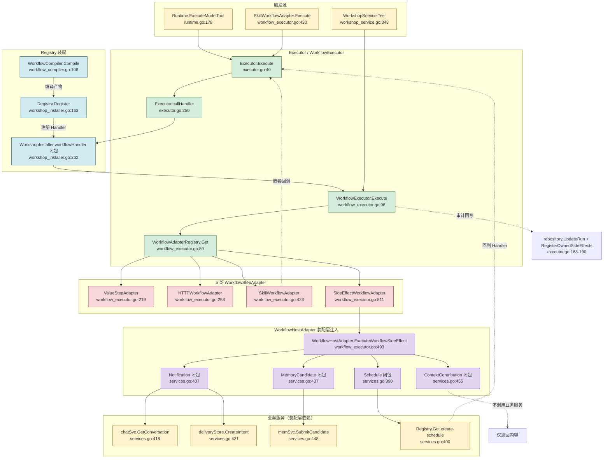

# Workflow 调用链地图

> 审计依据：.trae/Amitia_扩展系统重构_第2步_建立现有系统调用链地图.md
> 审计日期：2026-07-25
> 状态：第2步调用链地图（只审计不修改）

## 一、涉及文件清单

| 文件 | 职责 | 行数 | 关键类型/函数 |
|---|---|---:|---|
| d:/桌面/跟进项目/U-Ai/backend/internal/extension/workflow_compiler.go | Workflow 静态校验、依赖解析、Capability 推导、网络与 Secret 策略 | 546 | WorkflowCompiler、NewWorkflowCompiler、Compile、analyzeStep、AnalyzeDependencyCycles、effectiveWorkflowLimits、DefaultWorkflowLimits、validateWorkflowReference、validateFinalReference、ValidateNetworkTarget、deniedIP、ScanWorkshopSecrets、secretReferencePaths、secretReferenceNames、compiledStepTimeout |
| d:/桌面/跟进项目/U-Ai/backend/internal/extension/workflow_executor.go | Workflow 节点调度、Adapter 注册、Host 适配器、5 类节点执行器 | 579 | WorkflowExecutor、NewWorkflowExecutor、Execute、executeAdapterSafe、WorkflowAdapterRegistry、NewWorkflowAdapterRegistry、BuildWorkflowAdapters、ValueStepAdapter、HTTPWorkflowAdapter、SkillWorkflowAdapter、SideEffectWorkflowAdapter、WorkflowHostAdapter、SideEffectHost、workflowCallState、secureClient |
| d:/桌面/跟进项目/U-Ai/backend/internal/extension/workflow_values.go | 条件求值、引用解析、模板渲染、JSON 变换 | 570 | validateCondition、evalCondition、evalConditionDepth、resolveValue、resolveReference、resolveJSON、resolveJSONValue、renderTemplate、formatTemplateValue、asFloat、transformJSON、compareTransformValue、stringSlice、cloneMap |
| d:/桌面/跟进项目/U-Ai/backend/internal/extension/runtime.go | Runtime 装配入口，WorkflowHost 在此创建为空 adapter | 192 | Runtime、NewRuntime（L83-91 Workflow 装配块） |
| d:/桌面/跟进项目/U-Ai/backend/internal/extension/executor.go | Skill 执行器（通过 Handler 调用 WorkflowExecutor） | 313 | Executor、NewExecutor、Execute、executeHandler、callHandler、deniedResult、defaultIdempotencyKey、scopedIdempotencyKey、cloneSkillResult |
| d:/桌面/跟进项目/U-Ai/backend/internal/extension/workshop_service.go | 工坊服务（Generate/Validate/Test/Install），调用 WorkflowCompiler.Compile 与 WorkflowExecutor.Execute | 726 | WorkshopService、NewWorkshopService、Generate、Validate、Test、Install、Restore、ForkSkill、analyzeCapabilityDeclaration、buildWorkshopManifest、dependenciesFromCompiled、sideEffectNames、evaluateAssertions |
| d:/桌面/跟进项目/U-Ai/backend/internal/extension/workshop_installer.go | Workflow 制品安装与 SkillHandler 包装、Restore/Rollback | 439 | WorkshopInstaller、NewWorkshopInstaller、Install、Restore、Rollback、definitionFromArtifact、workflowHandler、splitWorkflowConfig、buildArtifact、artifactChecksum、skillDefinitionFromDraft、skillDefinitionFromManifest、suggestWorkshopVersion |
| d:/桌面/跟进项目/U-Ai/backend/internal/extension/package_service.go | Package 导入预览中调用 WorkflowCompiler.Compile | 475 | PackageService、PreviewImport、buildPackagePreview（L150-180 调用 compiler.Compile 与 runPackageWorkflowTests） |
| d:/桌面/跟进项目/U-Ai/backend/cmd/server/services.go | 装配层 configureWorkflowHost 填充 4 个 Host 函数 | — | configureWorkflowHost（L389-470）、NewAppContext 中 L287 调用 |

## 二、核心类型与函数索引

| 类型/函数 | 文件:行 | 职责 | 调用者 | 被调用者 |
|---|---|---|---|---|
| WorkflowCompiler | workflow_compiler.go:51 | Workflow 静态分析与编译器 | runtime.NewRuntime、PackageService | SkillRegistry（只读 Get） |
| NewWorkflowCompiler | workflow_compiler.go:53 | 构造 WorkflowCompiler | runtime.NewRuntime:83、workshop_installer.go:31（WorkshopInstaller 间接通过 WorkshopService）、package_recovery.go:212 | — |
| Compile | workflow_compiler.go:106 | 编译 WorkflowDefinition → CompiledWorkflow | WorkshopService.Generate:178/192、WorkshopService.Validate:236、WorkshopInstaller.Install:50、PackageService.buildPackagePreview:151、revalidateRollbackTarget、runPackageWorkflowTests | effectiveWorkflowLimits、analyzeStep、validateWorkflowReference、validateFinalReference、sortedKeys、stableJSON、hasErrorIssues |
| analyzeStep | workflow_compiler.go:211 | 单步分析（类型白名单、Capability 推导、副作用、依赖） | Compile | ValidateNetworkTarget、isSecretReference、secretReferencePaths、registry.Get（call_skill 分支） |
| AnalyzeDependencyCycles | workflow_compiler.go:57 | 传递性 Skill 依赖循环检测 | WorkshopService.Validate:285、WorkshopInstaller.Install:54 | registry.Get |
| WorkflowExecutor | workflow_executor.go:87 | Workflow 节点调度执行器 | WorkshopInstaller.workflowHandler、WorkshopService.Test | WorkflowAdapterRegistry、SchemaValidator |
| NewWorkflowExecutor | workflow_executor.go:92 | 构造 WorkflowExecutor | runtime.NewRuntime:85、workshop_installer.go:32、package_recovery.go:213 | — |
| Execute | workflow_executor.go:96 | 执行 CompiledWorkflow | WorkshopInstaller.workflowHandler:272、WorkshopService.Test:415、runPackageWorkflowTests | resolveJSON、evalCondition、executeAdapterSafe、e.adapters.Get、compactSensitiveJSON、e.validator.Validate |
| executeAdapterSafe | workflow_executor.go:210 | Adapter 执行 panic recover 包装 | WorkflowExecutor.Execute:148 | adapter.Execute |
| WorkflowAdapterRegistry | workflow_executor.go:60 | Adapter 注册表（kind → WorkflowStepAdapter） | WorkflowExecutor | — |
| NewWorkflowAdapterRegistry | workflow_executor.go:65 | 构造空注册表 | BuildWorkflowAdapters | — |
| WorkflowAdapterRegistry.Register | workflow_executor.go:68 | 注册 Adapter（白名单校验） | BuildWorkflowAdapters | allowedWorkflowSteps |
| WorkflowAdapterRegistry.Get | workflow_executor.go:80 | 取 Adapter | WorkflowExecutor.Execute:143 | — |
| BuildWorkflowAdapters | workflow_executor.go:529 | 装配 9 种 Adapter（condition/transform/template/http/call_skill + 4 个 SideEffect） | runtime.NewRuntime:85、workshop_installer.go:32、package_recovery.go:213 | registry.Register（5 次） |
| ValueStepAdapter | workflow_executor.go:219 | condition/transform/template 适配器 | BuildWorkflowAdapters | evalCondition、transformJSON |
| HTTPWorkflowAdapter | workflow_executor.go:253 | http 适配器（含 SSRF 防护、Mock、DryRun） | BuildWorkflowAdapters | ValidateNetworkTarget、secureClient、deniedIP、expectedHTTPStatus、safeHeaders、safeURL |
| SkillWorkflowAdapter | workflow_executor.go:423 | call_skill 适配器（递归调用 SkillExecutor） | BuildWorkflowAdapters | SkillExecutor.Execute（嵌套回调） |
| SideEffectWorkflowAdapter | workflow_executor.go:511 | schedule/notification/memory_candidate/context_contribution 适配器 | BuildWorkflowAdapters | SideEffectHost.ExecuteWorkflowSideEffect |
| SideEffectHost | workflow_executor.go:483 | 副作用 Host 接口 | SideEffectWorkflowAdapter | — |
| WorkflowHostAdapter | workflow_executor.go:486 | SideEffectHost 实现（4 个函数字段） | SideEffectWorkflowAdapter、runtime.WorkflowHost、装配层 configureWorkflowHost | 装配层注入的 4 个闭包 |
| WorkflowHostAdapter.ExecuteWorkflowSideEffect | workflow_executor.go:493 | 按 kind 路由到 Schedule/Notification/MemoryCandidate/ContextContribution | SideEffectWorkflowAdapter.Execute:525 | h.Schedule/h.Notification/h.MemoryCandidate/h.ContextContribution |
| WorkshopInstaller.workflowHandler | workshop_installer.go:262 | 将 WorkflowExecutor.Execute 包装为 SkillHandler | WorkshopInstaller.Install:104、definitionFromArtifact:260、Rollback:217/230 | i.executor.Execute、artifactChecksum、splitWorkflowConfig |
| WorkshopService.Test | workshop_service.go:348 | 工坊测试入口，直接调用 WorkflowExecutor.Execute | WorkshopHandler | s.executor.Execute、s.repository.CASStatus、s.repository.SaveTestReport、evaluateAssertions |
| WorkshopService.Generate | workshop_service.go:121 | 工坊生成入口，调用 WorkflowCompiler.Compile | WorkshopHandler | s.compiler.Compile（两次）、normalizeWorkshopDraft、buildWorkshopManifest、s.repository.SaveRevision |
| WorkshopInstaller.Install | workshop_installer.go:34 | 工坊安装入口 | WorkshopService.Install:471 | i.compiler.Compile、i.compiler.AnalyzeDependencyCycles、registry.Register、tx |
| configureWorkflowHost | services.go:389 | 装配层填充 4 个 Host 函数（依赖 chatSvc/memSvc/deliveryStore） | NewAppContext:287 | runtime.Registry.Get、chatSvc.GetConversation、deliveryStore.CreateIntent、memSvc.SubmitCandidate |

## 三、调用链

### 链路 WF-1：编译链

链路编号：WF-1
链路名称：Workflow 定义编译为 SkillDefinition 并注册到 Registry
触发条件：(a) 工坊生成修订 `POST /workshop/sessions/:id/generate`；(b) 工坊安装 `POST /workshop/sessions/:id/install`；(c) 包导入预览 `POST /extensions/packages/import/preview`；(d) 启动恢复 `WorkshopInstaller.Restore` / `PackageService.Restore`
最终结果：CompiledWorkflow 持久化到 `extension_artifacts` 表，SkillDefinition 通过 `Registry.Register(ctx, definition, handler)` 注册，Handler 闭包持有 CompiledWorkflow 与 WorkflowExecutor 引用

| 顺序 | 层级 | 文件 | 类型/函数 | 输入 | 输出/状态变化 | 错误处理 | 备注 |
|---:|---|---|---|---|---|---|---|
| 1 | 业务入口（工坊） | workshop_service.go:178 | WorkshopService.Generate 调用 s.compiler.Compile | ctx、normalized.Workflow | CompiledWorkflow、issues | compileErr 时 ErrWorkshopGenerationOutputInvalid | Generate 内 L192 二次编译验证规范化结果 |
| 1' | 业务入口（包） | package_service.go:151 | PackageService.buildPackagePreview 调用 s.compiler.Compile | ctx、*parsed.Workflow | compiled、issues | compileErr 时 ErrPackageManifestInvalid | 同时调用 runPackageWorkflowTests 执行 DryRun |
| 1'' | 业务入口（恢复） | workshop_installer.go:50 | WorkshopInstaller.Install 调用 i.compiler.Compile | ctx、draft.Workflow | compiled | ErrWorkshopStaticAnalysisFailed / ErrWorkshopDependencyCycle / ErrWorkshopChecksumMismatch | 安装前重新编译比对 Checksum |
| 2 | 编译入口 | workflow_compiler.go:106 | WorkflowCompiler.Compile | ctx、WorkflowDefinition | CompiledWorkflow、[]AnalysisIssue、error | 任何 error 级 issue 触发 ErrWorkshopWorkflowInvalid | L109-120 校验 SchemaVersion/Steps/Output |
| 3 | 限额生效 | workflow_compiler.go:28 | effectiveWorkflowLimits | requested WorkflowLimits | WorkflowLimits（取 min(requested, host)） | — | 保证不可超过宿主上限 |
| 4 | 步骤遍历 | workflow_compiler.go:128 | Compile 内 for 循环 | workflow.Steps | compiledSteps、capByStep、dependencies | ErrWorkflowStepInvalid / ErrWorkflowReferenceInvalid / WORKFLOW_DUPLICATE_STEP_ID | L130-140 校验 ID 与类型白名单 |
| 5 | 引用校验 | workflow_compiler.go:371 | validateWorkflowReference | ref、current、seen | error | — | L373 containsForbiddenPath 拦截 __proto__/prototype/constructor/env |
| 6 | 条件校验 | workflow_values.go:16 | validateCondition | *ConditionExpression、depth、maximum | error | — | 递归深度 ≤ MaxExpressionDepth |
| 7 | 单步分析 | workflow_compiler.go:211 | WorkflowCompiler.analyzeStep | ctx、step | capabilities、effects、idempotent、issues、*ResolvedSkillDependency | 各分支独立返回 issues | http 分支 L226 调 ValidateNetworkTarget；call_skill 分支 L339 调 registry.Get 解析依赖 |
| 8 | 网络策略 | workflow_compiler.go:505 | ValidateNetworkTarget | rawURL | error | ErrWorkshopNetworkDenied | 强制 HTTPS、拒绝 loopback/private/link-local/metadata IP |
| 9 | 依赖解析 | workflow_compiler.go:339 | analyzeStep 内 registry.Get | ctx、input.SkillID | RegisteredSkill 或 err | optional=true 时降级为 warning | 依赖元数据写入 ResolvedSkillDependency |
| 10 | 循环检测 | workflow_compiler.go:57 | WorkflowCompiler.AnalyzeDependencyCycles | ctx、currentSkillID、dependencies | []AnalysisIssue | ErrWorkshopDependencyCycle / ErrWorkshopDependencyNotFound | DFS + active/completed 集合，仅 Validate 阶段调用 |
| 11 | 输出引用校验 | workflow_compiler.go:185 | Compile 内 validateFinalReference | workflow.Output、seen | issues | ErrWorkflowReferenceInvalid | — |
| 12 | 编译产物 | workflow_compiler.go:201 | Compile 内 json.Marshal + sha256 | base 结构体 | CompiledWorkflow.Checksum（hex） | — | Checksum 用于后续 Checksum 比对与权限确认绑定 |
| 13 | 制品持久化 | workshop_installer.go:312 | buildArtifact | sessionID、revision、draft、compiled、testRunID | extensionArtifactRecord | ErrWorkshopArtifactInvalid（>8MB） | L319 artifactChecksum 重新计算并比对 |
| 14 | SkillDefinition 构造 | workshop_installer.go:334 | skillDefinitionFromDraft | draft、compiled | SkillDefinition | — | L336 model 名替换非 [a-z0-9_] 字符 |
| 15 | Handler 包装 | workshop_installer.go:262 | WorkshopInstaller.workflowHandler | artifact、outputSchema | SkillHandler 闭包 | — | 闭包内 L272 调用 i.executor.Execute（即 WorkflowExecutor） |
| 16 | Registry 注册 | workshop_installer.go:163 | i.registry.Register | ctx、definition、handler | error | ErrWorkshopInstallFailed（注册失败时回滚事务并恢复旧版本） | L160-178 失败时尝试恢复 oldRegistered |

### 链路 WF-2：执行链

链路编号：WF-2
链路名称：Workflow Executor 通过 Registry 注册的 SkillHandler 被调用（生产模式）或被 WorkshopService.Test 直接调用（测试模式）
触发条件：(a) 模型工具调用 `Runtime.ExecuteModelTool`；(b) 手动触发 Skill；(c) 嵌套 `call_skill` 步骤 `SkillWorkflowAdapter.Execute`；(d) 工坊测试 `WorkshopService.Test`
最终结果：返回 `WorkflowExecutionResult{Output, Steps, SideEffects}`，生产模式下由 Executor 写入 `extension_runs` 审计表并注册 SideEffect 资源

| 顺序 | 层级 | 文件 | 类型/函数 | 输入 | 输出/状态变化 | 错误处理 | 备注 |
|---:|---|---|---|---|---|---|---|
| 1a | 触发源（模型） | runtime.go:178 | Runtime.ExecuteModelTool | modelName、input、scope、idempotencyKey | SkillResult、bool | ErrSkillNotFound | L179 Registry.GetByModelName |
| 1b | 触发源（工坊测试） | workshop_service.go:415 | WorkshopService.Test 调用 s.executor.Execute | ctx、WorkflowExecutionRequest | WorkflowExecutionResult | execErr 写入 aggregate.Error | 直接调 WorkflowExecutor，不经 Executor/Registry |
| 1c | 触发源（嵌套 call_skill） | workflow_executor.go:476 | SkillWorkflowAdapter.Execute 调用 a.executor.Execute | ctx、ExecuteSkillRequest | SkillResult | ErrWorkshopSandboxLimit（深度/次数） | L468-475 workflowCallState 检查深度 |
| 2 | Executor 入口（仅 1a/1c 路径） | executor.go:40 | Executor.Execute | ctx、ExecuteSkillRequest | SkillResult、error | ErrSkillNotExecutable / ErrSkillDisabled / ErrSkillIncompatible / ErrSkillTriggerNotAllowed / ErrSkillInputInvalid / ErrSkillPermissionDenied | L42 Registry.GetScoped |
| 3 | 权限评估 | executor.go:75 | Executor.Execute 内 for capabilities | identity、capability、scope | Decision | DecisionDeny 时 deniedResult 写审计并返回 | — |
| 4 | 幂等性 | executor.go:82-130 | Executor.Execute 内 idempotency 块 | cacheKey | 缓存命中返回 cloneSkillResult | ErrSkillIdempotencyConflict | L100 repository.FindIdempotentRun |
| 5 | Run 审计创建 | executor.go:142 | repository.CreateRun + SetRunStatus(RunRunning) | RunView | DB 行 | — | — |
| 6 | Handler 调用 | executor.go:192 | Executor.executeHandler → callHandler | ctx、handler、request、definition | SkillResult | panic recover 包装 ErrSkillExecutionFailed | L257 goroutine + handlerSlots 信号量（容量 64） |
| 7 | Handler 闭包 | workshop_installer.go:263 | WorkshopInstaller.workflowHandler 返回的闭包 | ctx、ExecuteSkillRequest | SkillResult | ErrWorkshopChecksumMismatch / ErrWorkshopArtifactInvalid | L264 artifactChecksum 校验 |
| 8 | WorkflowExecutor 入口 | workflow_executor.go:96 | WorkflowExecutor.Execute | ctx、WorkflowExecutionRequest、outputSchema | WorkflowExecutionResult | ErrWorkshopSandboxLimit（输入超限） | L97 输入大小校验 |
| 9 | 执行上下文构造 | workflow_executor.go:108 | WorkflowExecutor.Execute 内 values map | input、config、secrets、scope | values map（含 input/config/secrets/steps/runtime） | — | L108 runtime 字段含 traceId/runId/characterId/conversationId/channel |
| 10 | 超时控制 | workflow_executor.go:109 | context.WithTimeout | ctx、MaxExecutionDurationMS | execCtx、cancel | ErrWorkflowStepTimeout | — |
| 11 | 步骤遍历 | workflow_executor.go:113 | WorkflowExecutor.Execute 内 for step | request.Workflow.Steps | WorkflowStepResult[] | — | L114 incrementWorkshopMetric |
| 12 | 条件求值 | workflow_executor.go:121 | evalCondition | step.When、values | bool | ErrWorkflowStepInvalid | 跳过条件为 false 的步骤 |
| 13 | 输入解析 | workflow_executor.go:136 | resolveJSON | step.Input、values | resolved json.RawMessage | ErrWorkshopSandboxLimit（中间结果超限） | L137 MaxIntermediateBytes 校验 |
| 14 | Adapter 获取 | workflow_executor.go:143 | e.adapters.Get | step.Type | WorkflowStepAdapter、ok | ErrWorkflowStepInvalid（适配器不可用） | — |
| 15 | Adapter 安全执行 | workflow_executor.go:210 | executeAdapterSafe | ctx、adapter、request | WorkflowAdapterResult | panic recover ErrWorkflowStepInvalid | L147 stepCtx 独立超时 |
| 16a | Value 分支 | workflow_executor.go:221 | ValueStepAdapter.Execute | request | WorkflowAdapterResult | — | condition/template/transform 三种 |
| 16b | HTTP 分支 | workflow_executor.go:261 | HTTPWorkflowAdapter.Execute | request | WorkflowAdapterResult | ErrWorkshopNetworkDenied / ErrWorkshopSandboxLimit / ErrWorkflowStepInvalid | L283 DryRun、L287 Mocked/ControlledLive、L309 生产 ValidateNetworkTarget |
| 16c | Skill 分支 | workflow_executor.go:430 | SkillWorkflowAdapter.Execute | request | WorkflowAdapterResult | ErrWorkshopSandboxLimit / ErrSkillNotFound（optional 时降级） | **回到链路 WF-2 第 2 步（嵌套调用 Executor.Execute）** |
| 16d | SideEffect 分支 | workflow_executor.go:516 | SideEffectWorkflowAdapter.Execute | request | WorkflowAdapterResult | 宿主未配置时 err | L518 非 production 模式直接返回 planned；production 模式调 host.ExecuteWorkflowSideEffect → 进入链路 WF-3 |
| 17 | 输出大小校验 | workflow_executor.go:173 | WorkflowExecutor.Execute 内 | adapterResult.Output | — | ErrWorkshopSandboxLimit（步骤输出超限） | — |
| 18 | 副作用数量校验 | workflow_executor.go:179 | WorkflowExecutor.Execute 内 | len(effects)+len(adapterResult.SideEffects) | — | ErrWorkshopSandboxLimit（副作用超 MaxSideEffects） | — |
| 19 | 步骤结果记录 | workflow_executor.go:187 | values["steps"][step.ID] = output | — | 后续步骤可引用 | — | — |
| 20 | 最终输出解析 | workflow_executor.go:195 | resolveJSON | request.Workflow.Output、values | output json.RawMessage | ErrWorkflowOutputInvalid | L199 MaxOutputBytes 校验 |
| 21 | 输出 Schema 校验 | workflow_executor.go:202 | e.validator.Validate | "workflow-output"、outputSchema、output | nil 或 err | ErrWorkflowOutputInvalid | validator 为空时跳过 |
| 22 | Run 审计回写（仅 1a/1c 路径） | executor.go:168-190 | defer 内 repository.RegisterOwnedSideEffects + UpdateRun | result.SideEffects、result | DB 更新 | ErrSkillExecutionFailed（持久化失败时 RunPartiallySucceeded） | L172 CompensateUnownedSideEffects 补偿未拥有的资源 |

### 链路 WF-3：Host 链（4 个 Host 子链路）

链路编号：WF-3
链路名称：SideEffect Host 适配器调用链
触发条件：Workflow 步骤类型为 schedule/notification/memory_candidate/context_contribution 且 Mode=WorkflowProduction
最终结果：4 个 Host 函数分别完成对应副作用，返回 `WorkflowAdapterResult{Output, SideEffects}`

#### 子链路 WF-3-A：Schedule Host

| 顺序 | 层级 | 文件 | 类型/函数 | 输入 | 输出/状态变化 | 错误处理 | 备注 |
|---:|---|---|---|---|---|---|---|
| 1 | Adapter 入口 | workflow_executor.go:516 | SideEffectWorkflowAdapter.Execute | ctx、request | WorkflowAdapterResult | — | L517 effectType="schedule_create" |
| 2 | 模式判定 | workflow_executor.go:518 | request.Mode != WorkflowProduction | — | 返回 planned、Mocked | — | 非 production 直接短路 |
| 3 | Host 接口调用 | workflow_executor.go:525 | a.host.ExecuteWorkflowSideEffect | ctx、"schedule"、input、scope | output、effects、err | 宿主未配置 err | host 为 nil 时 L522 返回 err |
| 4 | Host 路由 | workflow_executor.go:493 | WorkflowHostAdapter.ExecuteWorkflowSideEffect | kind="schedule" | 路由到 h.Schedule | h.Schedule==nil 时 err "宿主未配置 schedule 适配器" | L496 case "schedule" |
| 5 | 装配层闭包 | services.go:390 | configureWorkflowHost 内 h.Schedule 闭包 | ctx、input、scope | output、effects、err | 日程参数无效 / Registry.Get err | **关键：调用 runtime.Registry.Get(ctx, "dev.amitia.skill.create-schedule")** |
| 6 | Registry 查询 | services.go:400 | runtime.Registry.Get | ctx、skillID | RegisteredSkill | — | 命中内置 Skill `dev.amitia.skill.create-schedule` |
| 7 | Handler 调用 | services.go:404 | registered.Handler | ctx、ExecuteSkillRequest | SkillResult | — | **回到链路 WF-2 第 2 步 Executor.Execute** |
| 8 | 返回包装 | services.go:405 | 闭包返回 | result.Output、result.SideEffects、err | — | — | Schedule Host 不直接依赖 Chat/Memory/Delivery 服务 |

#### 子链路 WF-3-B：Notification Host

| 顺序 | 层级 | 文件 | 类型/函数 | 输入 | 输出/状态变化 | 错误处理 | 备注 |
|---:|---|---|---|---|---|---|---|
| 1 | Adapter 入口 | workflow_executor.go:516 | SideEffectWorkflowAdapter.Execute | ctx、request | WorkflowAdapterResult | — | effectType="notification_send" |
| 2 | 模式判定 | workflow_executor.go:518 | request.Mode != WorkflowProduction | — | 返回 planned | — | 非 production 短路 |
| 3 | Host 接口调用 | workflow_executor.go:525 | a.host.ExecuteWorkflowSideEffect | ctx、"notification"、input、scope | output、effects、err | — | — |
| 4 | Host 路由 | workflow_executor.go:498 | WorkflowHostAdapter.ExecuteWorkflowSideEffect | kind="notification" | 路由到 h.Notification | — | L498 case "notification" |
| 5 | 装配层闭包 | services.go:407 | configureWorkflowHost 内 h.Notification 闭包 | ctx、input、scope | output、effects、err | 通知参数无效 / 内容长度违规 | L415 校验 1-4000 字符 |
| 6 | 会话查询 | services.go:418 | chatSvc.GetConversation | scope.ConversationID | conversation | err | **直接依赖 Chat Service** |
| 7 | 会话一致性校验 | services.go:422 | 闭包内 if 校验 | conversation.CharacterID/Channel/PeerID | — | err "通知只能发送到当前角色和会话绑定的渠道" | — |
| 8 | Intent 创建 | services.go:430 | delivery.NewDeliveryIntent + deliveryStore.CreateIntent | interactionID、channel、peerID、type、body | intent | err | **直接依赖 Delivery Service（SQLiteDeliveryStore）** |
| 9 | 返回包装 | services.go:434-435 | json.Marshal + SideEffectRecord | intentId、status | output、effects | — | SideEffectRecord.Type="notification_send"、Confirmed=true |

#### 子链路 WF-3-C：MemoryCandidate Host

| 顺序 | 层级 | 文件 | 类型/函数 | 输入 | 输出/状态变化 | 错误处理 | 备注 |
|---:|---|---|---|---|---|---|---|
| 1 | Adapter 入口 | workflow_executor.go:516 | SideEffectWorkflowAdapter.Execute | ctx、request | WorkflowAdapterResult | — | effectType="memory_candidate_write" |
| 2 | 模式判定 | workflow_executor.go:518 | request.Mode != WorkflowProduction | — | 返回 planned | — | 非 production 短路 |
| 3 | Host 接口调用 | workflow_executor.go:525 | a.host.ExecuteWorkflowSideEffect | ctx、"memory_candidate"、input、scope | output、effects、err | — | — |
| 4 | Host 路由 | workflow_executor.go:500 | WorkflowHostAdapter.ExecuteWorkflowSideEffect | kind="memory_candidate" | 路由到 h.MemoryCandidate | — | L500 case "memory_candidate" |
| 5 | 装配层闭包 | services.go:437 | configureWorkflowHost 内 h.MemoryCandidate 闭包 | ctx、input、scope | output、effects、err | 候选记忆参数无效 | — |
| 6 | 候选提交 | services.go:448 | memSvc.SubmitCandidate | SubmitCandidateRequest | candidate | err | **直接依赖 Memory Service** |
| 7 | 返回包装 | services.go:452-453 | json.Marshal + SideEffectRecord | candidateId、status="pending_review" | output、effects | — | SideEffectRecord.Type="memory_candidate_write"、Confirmed=true |

#### 子链路 WF-3-D：ContextContribution Host

| 顺序 | 层级 | 文件 | 类型/函数 | 输入 | 输出/状态变化 | 错误处理 | 备注 |
|---:|---|---|---|---|---|---|---|
| 1 | Adapter 入口 | workflow_executor.go:516 | SideEffectWorkflowAdapter.Execute | ctx、request | WorkflowAdapterResult | — | effectType="context_injection" |
| 2 | 模式判定 | workflow_executor.go:518 | request.Mode != WorkflowProduction | — | 返回 planned | — | 非 production 短路 |
| 3 | Host 接口调用 | workflow_executor.go:525 | a.host.ExecuteWorkflowSideEffect | ctx、"context_contribution"、input、scope | output、effects、err | — | — |
| 4 | Host 路由 | workflow_executor.go:502 | WorkflowHostAdapter.ExecuteWorkflowSideEffect | kind="context_contribution" | 路由到 h.ContextContribution | — | L502 case "context_contribution" |
| 5 | 装配层闭包 | services.go:455 | configureWorkflowHost 内 h.ContextContribution 闭包 | ctx、input、scope | output、effects、err | 上下文贡献参数无效 / 超出 1024 token | L464 tokenLimit 1-1024、内容长度 ≤ tokenLimit*8 |
| 6 | 返回包装 | services.go:467-468 | json.Marshal + SideEffectRecord | content、tokenLimit、conversationId | output、effects | — | **不调用任何业务服务**，仅返回内容；SideEffectRecord.Type="context_injection"、TargetID=scope.ConversationID、Confirmed=true |

## 四、Host 依赖矩阵

| Host | 是否直接依赖 Chat | 是否直接依赖 Memory | 是否直接依赖 Delivery | 是否依赖 Registry/Executor | 证据文件:行 | 结论 |
|---|---|---|---|---|---|---|
| Schedule | 否 | 否 | 否 | 是（Registry.Get + registered.Handler） | services.go:400-405 | 已确认：通过内置 Skill `dev.amitia.skill.create-schedule` 间接完成，形成 Host→Executor→Host 闭环 |
| Notification | 是 | 否 | 是 | 否 | services.go:418（chatSvc.GetConversation）、services.go:430-431（deliveryStore.CreateIntent） | 已确认：直接依赖 Chat 与 Delivery Service |
| MemoryCandidate | 否 | 是 | 否 | 否 | services.go:448（memSvc.SubmitCandidate） | 已确认：直接依赖 Memory Service |
| ContextContribution | 否 | 否 | 否 | 否 | services.go:455-469 | 已确认：仅返回内容，不调用任何业务服务 |

装配层泄漏证据：
- `WorkflowHostAdapter` 在 `runtime.go:84` 创建为空 `&WorkflowHostAdapter{}`
- 4 个 Host 函数字段在 `services.go:389-470` 由 `configureWorkflowHost(runtime *extension.Runtime, chatSvc chat.Service, memSvc memory.Service, deliveryStore *delivery.SQLiteDeliveryStore)` 填充
- `extension` 包不直接 import `chat`/`memory`/`delivery` 包，必须通过装配层注入函数字段
- 这是装配层泄漏的已确认证据：业务服务依赖通过函数字段注入到 `WorkflowHostAdapter`，违反了 `extension` 包的内聚性

## 五、Mermaid 图

## 六、关键发现与风险

### P0：装配层泄漏 - WorkflowHostAdapter 4 个函数字段由 services.go 注入

- 文件：`d:/桌面/跟进项目/U-Ai/backend/cmd/server/services.go:389-470`
- 函数：`configureWorkflowHost(runtime *extension.Runtime, chatSvc chat.Service, memSvc memory.Service, deliveryStore *delivery.SQLiteDeliveryStore)`
- 证据：
  - `runtime.go:84` 创建空 `&WorkflowHostAdapter{}`
  - `runtime.go:95` 把空 adapter 装入 `Runtime.WorkflowHost` 字段
  - `services.go:287` 调用 `configureWorkflowHost(extensionRuntime, chatSvc, memSvc, deliveryStore)` 注入 4 个闭包
  - 4 个闭包分别捕获 `chatSvc`、`memSvc`、`deliveryStore`、`runtime.Registry`
- 影响链路：WF-3 全部 4 个子链路
- 后续建议处理步骤（只记录不修复）：
  1. 在 `extension` 包内定义 `WorkflowHost` 接口，明确 4 个方法的输入输出契约
  2. 在 `extension` 包外实现具体 Host（如 `ChatNotificationHost`、`MemoryCandidateHost`、`ScheduleHost`、`ContextContributionHost`）
  3. 在装配层通过接口注入而非函数字段，使 `extension` 包无需感知业务服务包

### P0：Schedule Host 形成循环依赖风险

- 文件：`d:/桌面/跟进项目/U-Ai/backend/cmd/server/services.go:400-405`
- 函数：`configureWorkflowHost` 内 `Schedule` 闭包
- 证据：
  - `services.go:400` 调用 `runtime.Registry.Get(ctx, "dev.amitia.skill.create-schedule")`
  - `services.go:404` 调用 `registered.Handler(ctx, ExecuteSkillRequest{...})`
  - 该 Handler 来自 Registry，可能是另一个 Workflow Skill 或内置 Skill
  - 若该 Handler 内部又触发 schedule 步骤，则形成 `Host → Handler → WorkflowExecutor → SideEffectWorkflowAdapter → Host` 循环
- 影响链路：WF-3-A 与 WF-2 嵌套
- 后续建议处理步骤（只记录不修复）：
  1. 审计 `dev.amitia.skill.create-schedule` 的 Handler 实现，确认是否为 Workflow Skill
  2. 若为 Workflow Skill，需在 Host 闭包内增加递归深度检测（类似 SkillWorkflowAdapter 的 workflowCallState）
  3. 考虑将 Schedule 拆分为独立 Service 接口注入，避免通过 Registry 回到 Executor

### P1：Schedule Host 路径未在测试模式下验证

- 文件：`d:/桌面/跟进项目/U-Ai/backend/internal/extension/workflow_executor.go:518`
- 函数：`SideEffectWorkflowAdapter.Execute`
- 证据：
  - L518 `if request.Mode != WorkflowProduction` 直接返回 `planned`
  - 即 WorkflowDryRun / WorkflowMocked / WorkflowControlledLive 模式下都不会触发 Host 闭包
  - Schedule Host 闭包（services.go:390-406）仅在 production 模式下被调用
- 影响链路：WF-3-A
- 后续建议处理步骤（只记录不修复）：
  1. 在工坊测试场景中增加 controlled_live 模式的 Schedule Mock 机制
  2. 文档明确说明 Schedule 步骤在测试期不会真正创建日程

### P1：WorkflowHostAdapter 函数字段空指针风险已通过运行时检查缓解

- 文件：`d:/桌面/跟进项目/U-Ai/backend/internal/extension/workflow_executor.go:493-509`
- 函数：`WorkflowHostAdapter.ExecuteWorkflowSideEffect`
- 证据：
  - L505-507 `if execute == nil { return nil, nil, fmt.Errorf("宿主未配置 %s 适配器", kind) }`
  - 即 4 个函数字段任一为 nil 时返回运行时错误而非 panic
  - 但 `runtime.go:84` 创建空 `&WorkflowHostAdapter{}` 后，若装配层未调用 `configureWorkflowHost`，则所有 SideEffect 步骤都会返回 "宿主未配置" 错误
- 影响链路：WF-3 全部
- 后续建议处理步骤（只记录不修复）：
  1. 在 `NewRuntime` 中增加空 Host 警告日志
  2. 或在 `NewWorkflowExecutor` 装配时校验 host 是否已注入 4 个函数

### P1：call_skill 嵌套调用复用 Executor.Execute 但无独立审计隔离

- 文件：`d:/桌面/跟进项目/U-Ai/backend/internal/extension/workflow_executor.go:476`
- 函数：`SkillWorkflowAdapter.Execute`
- 证据：
  - L476 `result, err := a.executor.Execute(context.WithValue(ctx, workflowCallStateKey{}, next), ExecuteSkillRequest{...})`
  - 嵌套调用直接复用 `Executor.Execute`，会再次触发 Run 审计创建（executor.go:142 `repository.CreateRun`）
  - 嵌套 Skill 的 Run 会独立持久化，但 SideEffect 资源归属通过 `request.Scope` 区分
  - L472 仅靠 `MaxSkillCallDepth` 与 `MaxSkillCalls` 限制嵌套深度，无显式调用栈审计
- 影响链路：WF-2 第 1c/16c 步
- 后续建议处理步骤（只记录不修复）：
  1. 在 RunView 中增加 `parent_run_id` 字段记录嵌套关系
  2. 审计日志中输出调用链路 trace

### P2：ContextContribution Host 返回 Confirmed=true 但实际未注入上下文

- 文件：`d:/桌面/跟进项目/U-Ai/backend/cmd/server/services.go:468`
- 函数：`configureWorkflowHost` 内 `ContextContribution` 闭包
- 证据：
  - L468 `return output, []extension.SideEffectRecord{{Type: "context_injection", TargetID: scope.ConversationID, Confirmed: true}}, nil`
  - 但闭包内仅 marshal 内容，未实际将 content 注入到任何上下文存储或会话状态
  - SideEffectRecord.Confirmed=true 会让上层认为副作用已确认生效
- 影响链路：WF-3-D
- 后续建议处理步骤（只记录不修复）：
  1. 审计 ContextContribution 的预期行为，确认是否应写入上下文存储
  2. 若仅作为占位返回，应将 Confirmed 改为 false 或在文档中说明

### P2：WorkflowCompiler.Compile 在工坊 Generate 阶段被调用两次

- 文件：`d:/桌面/跟进项目/U-Ai/backend/internal/extension/workshop_service.go:178, 192`
- 函数：`WorkshopService.Generate`
- 证据：
  - L178 第一次编译 `s.compiler.Compile(ctx, normalized.Workflow)` 用于推导 Capability
  - L183 `normalized.Capabilities = append([]string{}, compiled.Capabilities...)` 替换声明
  - L191 `normalized.Workflow.Limits = compiled.Limits` 写回限额
  - L192 第二次编译以反映规范化后的 Workflow
- 影响链路：WF-1
- 后续建议处理步骤（只记录不修复）：
  1. 评估两次编译的必要性，若仅 Limits 变化可考虑增量编译
  2. 文档说明双编译的原因（Capability 推导 → Limits 生效）

### P3：WorkflowExecutor 中 values["steps"] 类型断言未做安全检查

- 文件：`d:/桌面/跟进项目/U-Ai/backend/internal/extension/workflow_executor.go:164, 168, 187`
- 函数：`WorkflowExecutor.Execute`
- 证据：
  - L108 `values := map[string]interface{}{... "steps": map[string]interface{}{} ...}`
  - L164 `values["steps"].(map[string]interface{})[step.ID] = fallback`
  - L168 `values["steps"].(map[string]interface{})[step.ID] = nil`
  - L187 `values["steps"].(map[string]interface{})[step.ID] = output`
  - 类型断言无 ok 检查，若 `values["steps"]` 被外部修改为非 map 类型会 panic
  - 但当前代码中 `values` 为局部变量，不会被外部修改，实际风险低
- 影响链路：WF-2
- 后续建议处理步骤（只记录不修复）：
  1. 提取 `stepsMap` 局部变量替代反复类型断言
  2. 增加防御性编程

### P3：HTTPWorkflowAdapter.secureClient 每次请求重建 client

- 文件：`d:/桌面/跟进项目/U-Ai/backend/internal/extension/workflow_executor.go:346, 395`
- 函数：`HTTPWorkflowAdapter.Execute` → `secureClient`
- 证据：
  - L346 `client := a.secureClient(request.Limits.MaxHTTPRedirects)` 每次调用都新建 `http.Client` 与 `http.Transport`
  - L395-421 `secureClient` 内部构造 transport 与 redirect 策略
  - 无连接复用，频繁 HTTP 请求时有性能损耗
- 影响链路：WF-2 第 16b 步
- 后续建议处理步骤（只记录不修复）：
  1. 按 MaxHTTPRedirects 缓存 client
  2. 或使用 sync.Pool 复用 transport

## 七、未确认项

1. **`dev.amitia.skill.create-schedule` Handler 实现**：本次审计仅确认 `services.go:400` 通过 `Registry.Get` 获取该 Skill 并调用其 Handler，但 Handler 内部是否为 Workflow Skill、是否会产生 schedule 步骤递归，需进一步审计 `agent_skill_runtime.go` 或 `LegacyToolAdapter` 中的注册逻辑。

2. **runPackageWorkflowTests 实现细节**：本次审计确认 `package_service.go:166` 调用 `s.runPackageWorkflowTests(ctx, request, parsed, compiled)`，但该方法的具体实现（如何构造 WorkflowExecutionRequest、如何聚合测试报告）未在本次范围内读取，需在 Package 子系统审计中补充。

3. **WorkshopInstaller.Restore 恢复路径**：本次审计确认 `workshop_installer.go:183` 在启动时遍历 `repository.CurrentArtifacts` 调用 `definitionFromArtifact` 重新注册 Handler，但未审计 artifact 表中历史数据的一致性保证机制。

4. **Executor.handlerSlots 容量限制影响**：`executor.go:37` `handlerSlots: make(chan struct{}, 64)` 限制并发 Handler 调用上限为 64，当 Workflow 含大量 `call_skill` 嵌套时可能阻塞，但未在本次审计中验证实际负载场景。

5. **WorkflowLimits 在 Runtime 之外被绕过的可能性**：`effectiveWorkflowLimits` 在 `workflow_compiler.go:28` 强制取 min(requested, host)，但 `WorkflowExecutor.Execute` 中 `request.Workflow.Limits` 来自持久化的 `CompiledWorkflow`，若 Artifact 被篡改（Checksum 校验失败时 `workflowHandler` L264 会拦截），仍存在理论风险。
