# .amitiax 扩展包调用链地图

> 审计依据：.trae/Amitia_扩展系统重构_第2步_建立现有系统调用链地图.md
> 审计日期：2026-07-25
> 状态：第2步调用链地图（只审计不修改）

## 一、涉及文件清单

| 文件 | 职责 | 行数 | 关键类型/函数 |
|---|---|---:|---|
| d:/桌面/跟进项目/U-Ai/backend/internal/extension/package_archive.go | ZIP 安全检查、Checksum、Signature、Digest | 312 | readPackageZIP、validatePackagePath、validatePackageFile、stablePackageZIP、buildChecksums、validateChecksums、packageCanonicalDigest、verifyPackageSignature、packageHash |
| d:/桌面/跟进项目/U-Ai/backend/internal/extension/package_parser.go | 包解析（Directory/ZIP/amitiax/AgentSkills） | 234 | parsePackageInput、parseNativeAgentSkills、parseAmitiax、parseAmitiaxWorkflow、parseAmitiaxInstructions、packageStepSummary |
| d:/桌面/跟进项目/U-Ai/backend/internal/extension/package_service.go | PackageService 主体、PreviewImport、Restore、buildPackagePreview、buildPackageUpgradeDiff、packageConflict、resolvePackageDependency、metric | 475 | PackageService、NewPackageService、PreviewImport、Restore、buildPackagePreview、buildPackageUpgradeDiff、packageConfigSchemaChanged、packageConflict、localAgentSkillExtensionID、Metrics、lockExtension |
| d:/桌面/跟进项目/U-Ai/backend/internal/extension/package_installer.go | Install 主流程、Workflow/Instructions 分支、commitPackageVersion、配置迁移 | 623 | Install、packageOperationIdentity、reparsePackageSession、reinstallArchivedPackage、installWorkflowPackage、installInstructionsPackage、commitPackageVersion、packageSchemas、buildAgentSkillMetadataRecord、preparePackageConfigMigrations、migratePackageConfig |
| d:/桌面/跟进项目/U-Ai/backend/internal/extension/package_lifecycle.go | Export、Rollback、Uninstall、PreviewUninstall、Versions、Compare、Dependencies、Signers | 596 | Export、exportAmitiaxFiles、exportAgentSkillsFiles、scanPackageExportSecrets、GetExport、ListVersions、CompareVersions、packageVersionDiffRecords、agentArtifactDiff、Rollback、revalidateRollbackTarget、Dependencies、PreviewUninstall、Uninstall、validatePackageScope、ListOperations、GetOperation、ListSigners、TrustSigner、UntrustSigner |
| d:/桌面/跟进项目/U-Ai/backend/internal/extension/package_recovery.go | 启动恢复、孤儿 Artifact 清理 | 191 | recoverPackageOperations、recoverPackageOperation、failPreRegistrationOperation、ensureRecoveredVersionRegistered、cleanupPackageRecoveryDebris |
| d:/桌面/跟进项目/U-Ai/backend/internal/extension/package_repository.go | DB 持久化（Session/Operation/Signer/Version/Artifact/Export/ReverseDep） | 400 | packageImportSessionRecord、packageOperationRecord、packageSignerRecord、packageDependencyRecord、packageVersionRecord、packageArtifactRecord、packageExportRecord、CreatePackageImportSession、AcquirePackageImportSession、FinishPackageImportSession、CleanupPackageSessions、PackageSignerTrusted、SavePackageSigner、SetPackageSignerTrust、ListPackageSigners、CreatePackageOperation、SetPackageOperationStatus、UpdatePackageOperationDetails、FinishPackageOperation、ListPackageOperations、GetPackageOperation、GetPackageExtension、ListPackageVersions、GetPackageVersion、SavePackageExport、GetPackageExport、ReversePackageDependencies |
| d:/桌面/跟进项目/U-Ai/backend/internal/extension/package_handler.go | HTTP 入口 | 272 | PackageHandler、NewPackageHandler、Preview、PreviewUpgrade、previewRequest、Install、Upgrade、install、Export、Download、Versions、Compare、Rollback、Dependencies、Uninstall、PreviewUninstall、Operations、Operation、Signers、TrustSigner、UntrustSigner、Metrics |
| d:/桌面/跟进项目/U-Ai/backend/internal/extension/package_protocol.go | 类型与常量定义 | 331 | PackageFormat、PackageOperation、PackageSignatureStatus、PackageConflictStatus、PackageLimits、DefaultPackageLimits、PackageFileView、PackageRisk、PackageSignatureView、PackageChecksumView、PackageDependencyView、PackageUninstallPreview、PackageImportPreview、PackageDryRunReport、PreviewPackageImportRequest、InstallPackageRequest、ExportPackageRequest、ExportedPackage、PackageOperationResult、PackageOperationView、PackageVersionView、PackageVersionDiff、PackageSignerView |
| d:/桌面/跟进项目/U-Ai/backend/internal/extension/schema/manifest.schema.json | Manifest JSON Schema | 85 | skill、plugin、entry、metadata、compatibility |
| d:/桌面/跟进项目/U-Ai/backend/internal/extension/handler.go（Package 部分） | problem 错误码映射 | — | problemStatus（PACKAGE_* 分支）、Handler（透传给 PackageHandler.problems） |
| d:/桌面/跟进项目/U-Ai/backend/internal/extension/router.go（Package 部分） | 路由注册 | — | RegisterRouter 中 22-39 行的 Package 路由 |

## 二、核心类型与函数索引

| 类型/函数 | 文件:行 | 职责 | 调用者 | 被调用者 |
|---|---|---|---|---|
| PackageHandler | package_handler.go:14 | Package 子系统 HTTP 入口聚合 | router.go:17 NewPackageHandler | — |
| PackageService | package_service.go:19 | 包业务核心服务 | runtime.NewRuntime、PackageHandler | Repository、Registry、SchemaValidator、WorkflowCompiler、WorkshopInstaller、AgentSkillService |
| NewPackageService | package_service.go:31 | 构造 PackageService 并初始化 metrics | runtime.NewRuntime | — |
| PreviewImport | package_service.go:63 | 导入预览主入口 | PackageHandler.Preview、PackageHandler.PreviewUpgrade | parsePackageInput、buildPackagePreview、repository.CreatePackageImportSession |
| Restore | package_service.go:39 | 启动恢复入口 | runtime.NewRuntime | repository.CleanupPackageSessions、repository.RetryOwnedResourceCleanup、recoverPackageOperations、cleanupPackageRecoveryDebris |
| buildPackagePreview | package_service.go:122 | 预览构造（兼容性/能力/风险/冲突/升级差异） | PreviewImport、Install、revalidateRollbackTarget | compiler.Compile、runPackageWorkflowTests、resolvePackageDependency、packageConflict、buildPackageUpgradeDiff |
| packageConflict | package_service.go:383 | 冲突类型判定 | buildPackagePreview | repository.db（extensions/extension_versions/agent_skill_metadata） |
| buildPackageUpgradeDiff | package_service.go:285 | 升级版本差异计算 | buildPackagePreview | packageVersionDiffRecords、stringSetDifference、packageScriptPaths、artifactScriptPaths |
| parsePackageInput | package_parser.go:17 | 解析入口（分支 Directory/ZIP/amitiax/AgentSkills） | PreviewImport、reparsePackageSession、revalidateRollbackTarget | validatePackagePath、validatePackageFile、stablePackageZIP、readPackageZIP、parseAmitiax、parseNativeAgentSkills、readAgentSkillZIP |
| parseAmitiax | package_parser.go:93 | .amitiax 包主解析 | parsePackageInput | validator.ValidateManifest、validateChecksums、verifyPackageSignature、parseAmitiaxWorkflow、parseAmitiaxInstructions |
| parseAmitiaxWorkflow | package_parser.go:167 | workflow 包解析 | parseAmitiax | — |
| parseAmitiaxInstructions | package_parser.go:196 | instructions 包解析 | parseAmitiax | parseAgentSkillFiles |
| readPackageZIP | package_archive.go:64 | ZIP 解压与安全检查 | parsePackageInput、reparsePackageSession、packageVersionScriptCount | validatePackagePath、validatePackageFile |
| validatePackagePath | package_archive.go:131 | 路径越界/保留名检查 | readPackageZIP、parsePackageInput、validateChecksums | — |
| validatePackageFile | package_archive.go:156 | 文件类型与二进制检查 | readPackageZIP、parsePackageInput | — |
| validateChecksums | package_archive.go:238 | checksums.sha256 校验 | parseAmitiax | — |
| verifyPackageSignature | package_archive.go:301 | ed25519 签名验证 | parseAmitiax | packageCanonicalDigest |
| stablePackageZIP | package_archive.go:193 | 稳定 ZIP 重组（导出/目录导入） | parsePackageInput、Export | — |
| Install | package_installer.go:24 | 安装主入口 | PackageHandler.Install、PackageHandler.Upgrade | AcquirePackageImportSession、CreatePackageOperation、reparsePackageSession、buildPackagePreview、reinstallArchivedPackage、installWorkflowPackage、installInstructionsPackage、commitPackageVersion |
| reparsePackageSession | package_installer.go:194 | 基于 Session.PackageBlob 重新解析 | Install | readPackageZIP、parseNativeAgentSkills、parsePackageInput |
| reinstallArchivedPackage | package_installer.go:224 | 归档扩展恢复 | Install | repository.GetPackageVersion、workflowInstaller.definitionFromArtifact、registry.Register |
| installWorkflowPackage | package_installer.go:309 | workflow 包安装 | Install | compiler.Compile、workflowInstaller.workflowHandler、preparePackageConfigMigrations、commitPackageVersion |
| installInstructionsPackage | package_installer.go:336 | instructions 包安装 | Install | encodeAgentSkillArtifact、buildAgentSkillMetadataRecord、commitPackageVersion |
| commitPackageVersion | package_installer.go:372 | 版本提交事务（Artifact+Version+Registry+Extension+依赖+迁移） | installWorkflowPackage、installInstructionsPackage | registry.Register、registry.SetScopeEnabled、tx（extensions/extension_versions/extension_artifacts/extension_version_dependencies/extension_agent_skill_metadata/grants） |
| preparePackageConfigMigrations | package_installer.go:563 | 配置迁移预演 | installWorkflowPackage、Rollback | migratePackageConfig |
| migratePackageConfig | package_installer.go:590 | 单条配置迁移 | preparePackageConfigMigrations | validator.Validate |
| Rollback | package_lifecycle.go:272 | 回滚主入口 | PackageHandler.Rollback | GetPackageVersion、revalidateRollbackTarget、definitionFromArtifact、preparePackageConfigMigrations、registry.Unregister/Register、tx |
| revalidateRollbackTarget | package_lifecycle.go:396 | 回滚目标包重校验 | Rollback | parsePackageInput、buildPackagePreview、compiler.Compile、runPackageWorkflowTests |
| Uninstall | package_lifecycle.go:486 | 卸载主入口 | PackageHandler.Uninstall | ReversePackageDependencies、CleanupOwnedResources、registry.Unregister、tx |
| PreviewUninstall | package_lifecycle.go:456 | 卸载预览 | PackageHandler.PreviewUninstall | ReversePackageDependencies、CountOwnedResources |
| Export | package_lifecycle.go:15 | 导出主入口 | PackageHandler.Export | GetPackageVersion、exportAmitiaxFiles、exportAgentSkillsFiles、scanPackageExportSecrets、stablePackageZIP、SavePackageExport |
| exportAmitiaxFiles | package_lifecycle.go:80 | .amitiax 导出文件构造 | Export | decodeAgentSkillArtifact、buildChecksums |
| exportAgentSkillsFiles | package_lifecycle.go:128 | AgentSkills ZIP 导出 | Export | decodeAgentSkillArtifact |
| recoverPackageOperations | package_recovery.go:12 | 启动恢复扫描 | Restore | recoverPackageOperation |
| recoverPackageOperation | package_recovery.go:25 | 单条 operation 恢复决策 | recoverPackageOperations | failPreRegistrationOperation、ensureRecoveredVersionRegistered、SetPackageOperationStatus、tx |
| failPreRegistrationOperation | package_recovery.go:116 | 预注册阶段失败的清理 | recoverPackageOperation | tx（extension_versions/extension_artifacts/extension_version_dependencies/extension_package_installations） |
| ensureRecoveredVersionRegistered | package_recovery.go:141 | 恢复版本重新注册 | recoverPackageOperation | registry.Get、registry.Unregister、registry.Register、definitionFromArtifact、skillDefinitionFromManifest |
| cleanupPackageRecoveryDebris | package_recovery.go:174 | 孤儿 Artifact/Version 清理 | Restore | tx.Exec |
| AcquirePackageImportSession | package_repository.go:166 | Session 占用 | Install | tx |
| CreatePackageImportSession | package_repository.go:156 | Session 创建 | PreviewImport | db.Create |
| GetPackageVersion | package_repository.go:361 | 版本查询 | Rollback、Export、buildPackageUpgradeDiff、reinstallArchivedPackage | db.First |
| GetPackageExtension | package_repository.go:306 | 扩展归属校验查询 | Rollback、Uninstall、Export、ListVersions、Dependencies、PreviewUninstall | db.First+ownership 二次查询 |
| ReversePackageDependencies | package_repository.go:387 | 反向依赖查询 | PreviewUninstall、Uninstall、Dependencies | db.Find |
| PackageSignerTrusted | package_repository.go:198 | 签名者信任查询 | PreviewImport、reparsePackageSession | db.First |
| CreatePackageOperation | package_repository.go:250 | 操作审计记录创建 | Install、Rollback、Uninstall | db.Create |
| problemStatus | handler.go:314 | PACKAGE_* 错误码到 HTTP 状态映射 | PackageHandler 路径 | — |

## 三、调用链

### 链路 PKG-1：导入预览链

链路编号：PKG-1
链路名称：扩展包导入预览（PreviewImport）
触发条件：前端调用 `POST /extensions/packages/import/preview` 或 `POST /extensions/:id/upgrade/preview`
最终结果：返回 `PackageImportPreview` 并在 DB 创建 `extension_package_import_sessions` 记录（30 分钟过期）

| 顺序 | 层级 | 文件 | 类型/函数 | 输入 | 输出/状态变化 | 错误处理 | 备注 |
|---:|---|---|---|---|---|---|---|
| 1 | HTTP 路由 | router.go:22 | RegisterRouter | POST /extensions/packages/import/preview | 绑定 PackageHandler.Preview | — | 走 extensionAuth 中间件 |
| 2 | HTTP 入口 | package_handler.go:23 | PackageHandler.Preview | gin.Context | 调 previewRequest 组装请求 | — | — |
| 3 | 请求组装 | package_handler.go:53 | PackageHandler.previewRequest | multipart 或 JSON | PreviewPackageImportRequest | ErrPackageInvalidArchive / ErrPackageArchiveLimit | JSON 走 Directory 模式，multipart 走 Raw 模式 |
| 4 | 业务入口 | package_service.go:63 | PackageService.PreviewImport | PreviewPackageImportRequest | PackageImportPreview 或 err | ErrSkillPermissionDenied（无 UserID/作用域）、metric extension_package_import_failure_total | defer 中按 err.Code 计 checksum/signature metric |
| 5 | 作用域校验 | package_service.go:82 | PreviewImport（内联） | ScopeType、ScopeID | — | ErrSkillPermissionDenied | ScopeCharacter 时调用 repository.ValidateCharacterScope |
| 6 | 解析入口 | package_parser.go:17 | parsePackageInput | request、validator、limits | parsedExtensionPackage | ErrPackageArchiveLimit / ErrPackagePathTraversal / ErrPackageInvalidArchive | 三分支：Directory/ZIP-amitiax/ZIP-agentskills |
| 7a | Directory 分支 | package_parser.go:18 | parsePackageInput（Directory 块） | request.Directory | 调 stablePackageZIP + parseNativeAgentSkills | 同上 | 走 AgentSkillSourceDirectory |
| 7b | ZIP 解压 | package_archive.go:64 | readPackageZIP | request.Raw | files、views | ErrPackageInvalidArchive / ErrPackageArchiveLimit | 含路径、扩展名、嵌套归档、压缩比检查 |
| 8 | .amitiax 分支 | package_parser.go:93 | parseAmitiax | raw、files、views | parsedExtensionPackage | ErrPackageManifestMissing / ErrPackageManifestInvalid / ErrPackageEntryUnsupported | 关键 105 行：Kind 必须 Skill 且 Entry.Kind 必须 workflow 或 instructions |
| 9 | Manifest 校验 | package_parser.go:98 | validator.ValidateManifest | manifestRaw | nil 或 err | ErrPackageManifestInvalid | — |
| 10 | Checksum 校验 | package_archive.go:238 | validateChecksums | files | nil 或 err | ErrPackageChecksumMissing / ErrPackageChecksumInvalid / ErrPackageChecksumMismatch / ErrPackageUnlistedFile / ErrPackageMissingFile | — |
| 11 | 签名校验 | package_archive.go:301 | verifyPackageSignature | files、trusted=false | PackageSignatureView、digest | ErrPackageSignatureInvalid | trusted 来自 Repository.PackageSignerTrusted |
| 12 | Schema/Tests 解析 | package_parser.go:144 | parseAmitiax（Schema 块） | files | parsed.Schemas、parsed.Tests | ErrPackageArchiveLimit / ErrPackageManifestInvalid | 仅识别 input/output/config.schema.json |
| 13a | workflow 分支 | package_parser.go:167 | parseAmitiaxWorkflow | parsed | parsed.Workflow | ErrPackageManifestInvalid / ErrPackageEntryUnsupported | 强制 workflows/main.json，禁止 scripts 与 instructions/ |
| 13b | instructions 分支 | package_parser.go:196 | parseAmitiaxInstructions | parsed | parsed.AgentSkill | ErrPackageManifestInvalid | 强制 instructions/SKILL.md，entry.path 必须空或 instructions/SKILL.md |
| 14 | 信任回查 | package_service.go:95 | Repository.PackageSignerTrusted | parsed.Signature.Fingerprint | bool | — | 命中则升级为 PackageSignatureTrusted |
| 15 | 签名者落库 | package_service.go:104 | Repository.SavePackageSigner | Signature、PublicKey | — | — | OnConflict 更新 |
| 16 | 预览构造 | package_service.go:122 | buildPackagePreview | request、parsed | PackageImportPreview | ErrPackageManifestInvalid / ErrPackageCapabilityMismatch / ErrPackageFormatUnsupported | Amitiax 分支：编译 Workflow、runPackageWorkflowTests、resolvePackageDependency、packageConflict、buildPackageUpgradeDiff |
| 17 | 兼容性检查 | package_service.go:146 | buildPackagePreview（兼容性块） | manifest.Compatibility、registry.engineVersion | preview.Compatible | ErrPackageEngineIncompatible 写入 preview.Errors | compareSemver |
| 18 | 风险/告警 | package_service.go:220 | buildPackagePreview（风险块） | preview.Capabilities、Signature.Status、Scripts | preview.HighRisk/Risks/Warnings | — | — |
| 19 | 冲突判定 | package_service.go:383 | packageConflict | request、preview | PackageConflictStatus | metric extension_package_conflict_total | 查 extensions/extension_versions/agent_skill_metadata |
| 20 | 升级差异 | package_service.go:285 | buildPackageUpgradeDiff | currentVersion、parsed、preview | *PackageVersionDiff | — | 仅 PackageConflictUpgrade 时调用 |
| 21 | Session 落库 | package_repository.go:156 | Repository.CreatePackageImportSession | userID、scope、fileName、parsed、preview | — | — | PackageBlob=raw，ExpiresAt=+30min |
| 22 | 响应 | package_handler.go:33 | success | preview | 200 | — | metric extension_package_import_total |

### 链路 PKG-2：安装链

链路编号：PKG-2
链路名称：扩展包安装（Install）
触发条件：前端调用 `POST /extensions/packages/import/install`（Install）或 `POST /extensions/:id/upgrade`（Upgrade）
最终结果：写入 `extension_artifacts`、`extension_versions`、`extensions`、`extension_agent_skill_metadata`（如适用）、`extension_version_dependencies`、`extension_package_installations`；注册到 Registry；AgentSkill 缓存失效

| 顺序 | 层级 | 文件 | 类型/函数 | 输入 | 输出/状态变化 | 错误处理 | 备注 |
|---:|---|---|---|---|---|---|---|
| 1 | HTTP 路由 | router.go:23 | RegisterRouter | POST /extensions/packages/import/install | 绑定 PackageHandler.Install | — | — |
| 1' | HTTP 路由 | router.go:33 | RegisterRouter | POST /extensions/:id/upgrade | 绑定 PackageHandler.Upgrade（传入 expectedID） | — | — |
| 2 | HTTP 入口 | package_handler.go:112/116 | PackageHandler.Install / Upgrade | gin.Context | 调 install(c, expectedID) | — | — |
| 3 | 请求绑定 | package_handler.go:120 | PackageHandler.install | ShouldBindJSON | InstallPackageRequest | ErrPackageInstallFailed | ExpectedExtensionID 来自路径 :id |
| 4 | 业务入口 | package_installer.go:24 | PackageService.Install | InstallPackageRequest | PackageOperationResult | 各类 ErrPackage* | defer 中 FinishPackageImportSession 与 FinishPackageOperation |
| 5 | 作用域校验 | package_installer.go:25 | Install（内联） | ScopeCharacter | — | ValidateCharacterScope 抛错 | — |
| 6 | Session 占用 | package_repository.go:166 | Repository.AcquirePackageImportSession | SessionID、UserID、ScopeType、ScopeID | packageImportSessionRecord | ErrPackageImportSessionConsumed / ErrPackageImportSessionExpired | 行锁 + 状态置 installing |
| 7 | Operation 落库 | package_installer.go:44 | Repository.CreatePackageOperation | packageOperationRecord（status=pending） | — | — | operationID/traceID 由 uuid.NewString 生成 |
| 8 | Session 重解析 | package_installer.go:194 | PackageService.reparsePackageSession | session | parsedExtensionPackage | ErrPackage* | 复用 parsePackageInput + 信任回查 |
| 9 | Hash 校验 | package_installer.go:61 | Install（内联） | parsed.PackageHash vs session.PackageHash | — | ErrPackageChecksumMismatch | 防止 Session 期间被替换 |
| 10 | 上一版本查询 | package_installer.go:67 | Repository.GetPackageExtension | extensionID、UserID、Scope | extensionRecord 或 not found | — | previousVersion 用于审计 |
| 11 | Operation 详情更新 | package_repository.go:258 | Repository.UpdatePackageOperationDetails | operation、preview、previousVersion | — | — | — |
| 12 | 状态：validating | package_repository.go:254 | Repository.SetPackageOperationStatus | operationID、validating | — | — | — |
| 13 | 重新 Preview | package_service.go:122 | buildPackagePreview | request、parsed | preview | 同 PKG-1 | 复用预览逻辑（OperationID 写入 testing 状态） |
| 14 | 升级判定 | package_installer.go:82 | Install（内联） | preview.Conflict | operation = PackageOperationUpgrade | — | — |
| 15 | ExpectedID 校验 | package_installer.go:88 | Install（内联） | request.ExpectedExtensionID、preview.ID | — | ErrPackageVersionConflict | Upgrade 路径必走 |
| 16 | 错误/兼容检查 | package_installer.go:91 | Install（内联） | preview.Errors、preview.Compatible | — | ErrPackageInstallFailed | — |
| 17 | 风险确认 | package_installer.go:94-122 | Install（确认块） | ConfirmUnsigned、ConfirmScripts、ConfirmedCapabilities、ConfirmVersionChange、ConfirmSignerChange、ConfirmConfigMigration | — | ErrPackageHighRiskConfirmationRequired | 逐项校验 |
| 18 | 冲突终判 | package_installer.go:123-137 | Install（冲突块） | preview.Conflict | — | ErrPackageSameVersionDifferentContent / ErrPackageIDConflict / ErrPackageVersionConflict | PackageConflictSame 时直接 FinishPackageOperation(succeeded) 返回 |
| 19 | 锁 | package_service.go:452 | PackageService.lockExtension | preview.ID | unlock func | ErrPackageOperationInProgress | sync.Map LoadOrStore |
| 20 | 状态：staging | package_installer.go:146 | Repository.SetPackageOperationStatus | staging | — | — | — |
| 21 | 归档恢复 | package_installer.go:224 | PackageService.reinstallArchivedPackage | request、preview、operationID、traceID | *PackageOperationResult 或 nil | ErrSkillPermissionDenied / ErrPackageSameVersionDifferentContent / ErrPackageArtifactInvalid / ErrPackageInstallFailed | 命中归档扩展直接走恢复路径，事务内更新 extensions/extension_artifacts/extension_agent_skill_metadata |
| 22a | workflow 分支 | package_installer.go:309 | installWorkflowPackage | request、parsed、preview、operationID、traceID | PackageOperationResult | ErrPackageTestFailed / ErrPackageInstallFailed | compiler.Compile + artifact 构造 + workflowHandler + preparePackageConfigMigrations |
| 22b | instructions 分支 | package_installer.go:336 | installInstructionsPackage | request、parsed、preview、operationID、traceID | PackageOperationResult | ErrPackageManifestInvalid | buildAgentSkillManifest + encodeAgentSkillArtifact + buildAgentSkillMetadataRecord |
| 23 | 版本提交 | package_installer.go:372 | commitPackageVersion | request、parsed、preview、artifact、definition、handler、deps、migrations、operationID、traceID、agentMetadata | PackageOperationResult | ErrPackageSameVersionDifferentContent / ErrPackageInstallFailed | 状态机：staging→registering→committing→refreshing |
| 24 | Artifact+Version 写入 | package_installer.go:390 | commitPackageVersion（tx 块1） | artifact、version | — | ErrPackageSameVersionDifferentContent / ErrPackageInstallFailed | tx.Create artifact + tx.Create version |
| 25 | Registry 重注册 | package_installer.go:407-419 | commitPackageVersion（注册块） | oldRegistered、definition、handler | — | ErrPackageInstallFailed | Unregister 旧→Register 新，失败回滚 |
| 26 | 作用域绑定 | package_installer.go:421-430 | commitPackageVersion（Scope 块） | ScopeCharacter 时 DeleteScopeBinding(global) | — | ErrPackageInstallFailed | SetScopeEnabled 保留 previousEnabled |
| 27 | 主事务 | package_installer.go:448 | commitPackageVersion（tx 块2） | extensions（OnConflict）、dependencies、configMigrations、grants 删除、agentMetadata（OnConflict）、activation_status 切换 | — | ErrPackageInstallFailed | 失败时 Unregister + Register oldRegistered + cleanupPrepared |
| 28 | 缓存失效 | package_installer.go:514 | commitPackageVersion（refreshing 块） | s.agentSkills | invalidateAgentSkillCaches | — | 状态置 refreshing |
| 29 | Operation 收尾 | package_installer.go:165 | Repository.FinishPackageOperation | succeeded | — | — | — |
| 30 | Session 收尾 | package_repository.go:189 | Repository.FinishPackageImportSession | installed/failed | — | — | defer 中清空 PackageBlob |

### 链路 PKG-3：升级链

链路编号：PKG-3
链路名称：扩展包升级（Upgrade，复用 Install 主流程）
触发条件：前端调用 `POST /extensions/:id/upgrade/preview` 后再调用 `POST /extensions/:id/upgrade`
最终结果：旧版本 Artifact/Version 标记为 archived，新版本切换为 active，extensions.current_version 更新，配置迁移落库

| 顺序 | 层级 | 文件 | 类型/函数 | 输入 | 输出/状态变化 | 错误处理 | 备注 |
|---:|---|---|---|---|---|---|---|
| 1 | HTTP 路由 | router.go:32 | RegisterRouter | POST /extensions/:id/upgrade/preview | 绑定 PackageHandler.PreviewUpgrade | — | — |
| 2 | HTTP 入口 | package_handler.go:36 | PackageHandler.PreviewUpgrade | gin.Context | 调 previewRequest + PreviewImport | — | — |
| 3 | 升级预览校验 | package_handler.go:46 | PackageHandler.PreviewUpgrade（校验块） | preview.ID vs :id、preview.Conflict | — | ErrPackageVersionConflict | 必须 PackageConflictUpgrade |
| 4 | 升级差异 | package_service.go:285 | buildPackageUpgradeDiff | currentVersion、parsed、preview | *PackageVersionDiff | — | PKG-1 步骤 20 调用 |
| 5 | 风险标记 | package_service.go:252-264 | buildPackagePreview（升级风险块） | SignerFingerprint、scripts、configSchema | CAPABILITY_ADDED / SIGNER_CHANGED / SCRIPTS_ADDED / CONFIG_MIGRATION | — | 写入 preview.Risks 与 Warnings |
| 6 | HTTP 路由 | router.go:33 | RegisterRouter | POST /extensions/:id/upgrade | 绑定 PackageHandler.Upgrade | — | — |
| 7 | 安装主流程 | package_installer.go:24 | PackageService.Install | InstallPackageRequest（带 ExpectedExtensionID） | PackageOperationResult | 同 PKG-2 | operation 在步骤 14 升级为 PackageOperationUpgrade |
| 8 | 配置迁移预演 | package_installer.go:563 | preparePackageConfigMigrations | extensionID、ConfigSchema、DefaultConfig | []packageConfigMigration | ErrPackageConfigMigrationFailed / ErrPackageConfigMigrationRequired | 逐条 configCipher.decrypt → migratePackageConfig → encrypt |
| 9 | 配置迁移执行 | package_installer.go:463 | commitPackageVersion（迁移 tx 块） | configMigrations | config_json 更新 + config_version+1 | ErrPackageInstallFailed | 仅在主 tx 内执行 |
| 10 | 旧版本归档 | package_installer.go:492-503 | commitPackageVersion（activation 切换块） | preview.ID、preview.Version | activation_status=archived（旧）、active（新） | ErrPackageInstallFailed | 同时 extension_artifacts.artifact_status 切换 |
| 11 | Operation 收尾 | package_installer.go:165 | Repository.FinishPackageOperation | succeeded | operation=upgrade | metric extension_package_upgrade_total | 失败时 metric extension_package_upgrade_failure_total |

### 链路 PKG-4：回滚链

链路编号：PKG-4
链路名称：扩展包版本回滚（Rollback）
触发条件：前端调用 `POST /extensions/:id/versions/:version/rollback`
最终结果：extensions.current_version 切换为目标版本，目标 Artifact/Version 标记为 active，其他版本归档，配置迁移落库，operation 记录写入

| 顺序 | 层级 | 文件 | 类型/函数 | 输入 | 输出/状态变化 | 错误处理 | 备注 |
|---:|---|---|---|---|---|---|---|
| 1 | HTTP 路由 | router.go:36 | RegisterRouter | POST /extensions/:id/versions/:version/rollback | 绑定 PackageHandler.Rollback | — | — |
| 2 | HTTP 入口 | package_handler.go:182 | PackageHandler.Rollback | :id、:version、scope | InstallPackageRequest 仅取 ScopeType/ScopeID | ErrPackageRollbackFailed | — |
| 3 | 业务入口 | package_lifecycle.go:272 | PackageService.Rollback | extensionID、version、userID、scopeType、scopeID | PackageOperationResult | ErrPackageArtifactInvalid / ErrPackageRollbackFailed / ErrPackageOperationInProgress / ErrPackageDependencyMissing | — |
| 4 | 作用域校验 | package_lifecycle.go:568 | validatePackageScope | userID、scopeType、scopeID | — | ErrSkillPermissionDenied | ScopeCharacter 走 ValidateCharacterScope |
| 5 | 扩展查询 | package_repository.go:306 | Repository.GetPackageExtension | extensionID、userID、scope | extensionRecord | ErrSkillPermissionDenied | 含 ownership 二次校验 |
| 6 | 当前版本短路 | package_lifecycle.go:280 | Rollback（短路块） | extension.CurrentVersion == version | 返回 succeeded | — | 不走后续流程 |
| 7 | 锁 | package_service.go:452 | lockExtension | extensionID | unlock | ErrPackageOperationInProgress | — |
| 8 | 目标版本查询 | package_repository.go:361 | Repository.GetPackageVersion | extensionID、version | packageVersionRecord | ErrPackageArtifactInvalid | — |
| 9 | Hash 校验 | package_lifecycle.go:289 | Rollback（Hash 校验块） | target.PackageHash vs packageHash(target.PackageBlob) 或 workshop ArtifactHash | packageValid | ErrPackageArtifactInvalid | workshop 来源走 ArtifactHash == PackageHash |
| 10 | Artifact 查询 | package_lifecycle.go:294 | Rollback（Artifact 查询块） | target.ArtifactID、archived_at='' | packageArtifactRecord | ErrPackageArtifactInvalid | — |
| 11 | 重校验 | package_lifecycle.go:396 | revalidateRollbackTarget | target、artifact、userID、scope | nil | ErrPackageRollbackFailed | parsePackageInput + buildPackagePreview；workflow 还需 compiler.Compile + runPackageWorkflowTests |
| 12 | Definition 构造 | package_lifecycle.go:300-314 | Rollback（Definition 块） | artifact.ArtifactKind | SkillDefinition + SkillHandler | ErrPackageRollbackFailed | agent-skill 走 skillDefinitionFromManifest，workflow 走 workflowInstaller.definitionFromArtifact |
| 13 | 依赖校验 | package_lifecycle.go:315 | Rollback（依赖块） | definition.Dependencies | — | ErrPackageDependencyMissing | registry.Get 逐个 |
| 14 | 配置迁移预演 | package_installer.go:563 | preparePackageConfigMigrations | extensionID、definition.ConfigSchema、DefaultConfig | []packageConfigMigration | ErrPackageConfigMigrationFailed / ErrPackageConfigMigrationRequired | — |
| 15 | 备份当前 | package_lifecycle.go:324 | registry.Get | extensionID | current RegisteredSkill | ErrPackageRollbackFailed | 用于失败补偿 |
| 16 | Registry 切换 | package_lifecycle.go:329-338 | Rollback（Registry 块） | current、definition、handler | — | ErrPackageRollbackFailed | Unregister→Register→SetEnabled，失败回退 current |
| 17 | 主事务 | package_lifecycle.go:340 | Rollback（tx 块） | extensionRecord.Updates、agentSkillMetadataRecord.Updates（agent-skill）、configMigrations、activation_status 切换 | — | ErrPackageRollbackFailed | 失败时 Unregister+Register current |
| 18 | Operation 落库 | package_lifecycle.go:385 | Repository.CreatePackageOperation | operationRecord（status=succeeded） | — | — | PreviousVersion=current.CurrentVersion，TargetVersion=version |
| 19 | 缓存失效 | package_lifecycle.go:389 | agentSkills.invalidateAgentSkillCaches | — | — | — | — |
| 20 | metric | package_lifecycle.go:392 | metric | extension_package_rollback_total | — | — | — |

### 链路 PKG-5：卸载链

链路编号：PKG-5
链路名称：扩展包卸载（Uninstall，含预览）
触发条件：前端调用 `GET /extensions/:id/uninstall/preview` 后再调用 `DELETE /extensions/:id`
最终结果：extensions.archived_at 写入，Artifact/AgentSkillMetadata/Grant/Config/Schedule/ScopeBinding 标记归档或删除，Registry 注销，operation 记录写入

| 顺序 | 层级 | 文件 | 类型/函数 | 输入 | 输出/状态变化 | 错误处理 | 备注 |
|---:|---|---|---|---|---|---|---|
| 1 | HTTP 路由 | router.go:38 | RegisterRouter | GET /extensions/:id/uninstall/preview | 绑定 PackageHandler.PreviewUninstall | — | — |
| 2 | HTTP 入口 | package_handler.go:217 | PackageHandler.PreviewUninstall | :id、scope | — | — | — |
| 3 | 预览业务 | package_lifecycle.go:456 | PackageService.PreviewUninstall | extensionID、userID、scope | PackageUninstallPreview | ErrSkillPermissionDenied | — |
| 4 | 扩展查询 | package_repository.go:306 | Repository.GetPackageExtension | extensionID、userID、scope | extensionRecord | ErrSkillPermissionDenied | — |
| 5 | 反向依赖 | package_repository.go:387 | Repository.ReversePackageDependencies | extensionID | []PackageDependencyView | — | 仅返回当前活跃依赖方 |
| 6 | 自有资源 | package_lifecycle.go:469 | Repository.CountOwnedResources | extensionID、scope | ScheduleCount | — | — |
| 7 | Grants 查询 | package_lifecycle.go:474 | PreviewUninstall（Grants 块） | extensionID、scope | []grantRecord | — | — |
| 8 | Config 查询 | package_lifecycle.go:479 | PreviewUninstall（Config 块） | extensionID、scope | configCount | — | — |
| 9 | 历史 Run 查询 | package_lifecycle.go:482 | PreviewUninstall（Runs 块） | extensionID | HistoricalRuns | — | runRecord |
| 10 | HTTP 路由 | router.go:39 | RegisterRouter | DELETE /extensions/:id | 绑定 PackageHandler.Uninstall | — | — |
| 11 | HTTP 入口 | package_handler.go:208 | PackageHandler.Uninstall | :id、scope | — | — | — |
| 12 | 业务入口 | package_lifecycle.go:486 | PackageService.Uninstall | extensionID、userID、scope | PackageOperationResult | ErrPackageExportNotAllowed / ErrPackageDependencyInUse / ErrPackageOperationInProgress / ErrPackageUninstallFailed | — |
| 13 | 来源限制 | package_lifecycle.go:494 | Uninstall（来源块） | extension.Source | — | ErrPackageExportNotAllowed | 拒绝 builtin 或非 workflow/instructions 来源 |
| 14 | 反向依赖检查 | package_lifecycle.go:497 | Repository.ReversePackageDependencies | extensionID | dependents | ErrPackageDependencyInUse | 非空则拒绝 |
| 15 | 锁 | package_service.go:452 | lockExtension | extensionID | unlock | ErrPackageOperationInProgress | — |
| 16 | 自有资源清理 | package_lifecycle.go:513 | Repository.CleanupOwnedResources | extensionID、scope | — | — | 失败不进 tx |
| 17 | Registry 备份 | package_lifecycle.go:516 | registry.Get | extensionID | registered | ErrPackageUninstallFailed（间接） | 用于失败补偿 |
| 18 | Registry 注销 | package_lifecycle.go:520 | registry.Unregister | extensionID | — | ErrPackageUninstallFailed | — |
| 19 | 主事务 | package_lifecycle.go:524 | Uninstall（tx 块） | extensions.enabled=0+archived_at、extension_artifacts.archived_at、extension_agent_skill_metadata.enabled=0+removed_at、grants Delete、config archived_at、extension_schedules Delete、scope_binding Delete | — | ErrPackageUninstallFailed | 失败时 registry.Register(registered) |
| 20 | AgentSkill 清理 | package_lifecycle.go:556 | agentSkills.clearExtensionFromRounds + invalidateAgentSkillCaches | extensionID | — | — | — |
| 21 | Operation 落库 | package_lifecycle.go:560 | Repository.CreatePackageOperation | operationRecord（Uninstall、succeeded） | — | — | — |
| 22 | metric | package_lifecycle.go:564 | metric | extension_package_uninstall_total | — | — | — |

### 链路 PKG-6：启动恢复链

链路编号：PKG-6
链路名称：PackageService 启动恢复（Restore）
触发条件：runtime.NewRuntime 装配后调用 `packages.Restore(ctx)`
最终结果：清理过期 Session、回填 owner/scope/版本字段、恢复未完成 Operation、清理孤儿 Artifact/Version、恢复 Registry 注册

| 顺序 | 层级 | 文件 | 类型/函数 | 输入 | 输出/状态变化 | 错误处理 | 备注 |
|---:|---|---|---|---|---|---|---|
| 1 | 装配入口 | runtime.go（已知背景） | NewRuntime | packages := NewPackageService(...) | — | — | 后续调用 packages.Restore(ctx) |
| 2 | 业务入口 | package_service.go:39 | PackageService.Restore | ctx | nil 或 err | metric extension_package_cleanup_failure_total | — |
| 3 | 表存在检查 | package_service.go:40 | Restore（表检查块） | extension_package_import_sessions | 无表则直接返回 nil | — | — |
| 4 | Session 清理 | package_repository.go:193 | Repository.CleanupPackageSessions | now | — | metric extension_package_cleanup_failure_total | 过期且未 installed/expired 的 Session 标记 expired 并清空 blob |
| 5 | 自有资源重试 | package_service.go:47 | Repository.RetryOwnedResourceCleanup | ctx | — | — | — |
| 6 | instructions 归属回填 | package_service.go:48 | Restore（instructions SQL） | source='instructions' AND owner_user_id='' | 从 extension_agent_skill_metadata 回填 owner_user_id/scope_type/scope_id | — | — |
| 7 | workflow 归属回填 | package_service.go:51 | Restore（workflow SQL） | source='workflow' AND owner_user_id='' | 从 extension_artifacts JOIN extension_workshop_sessions 回填 | — | character_id 为空则 scope_type=global |
| 8 | 版本字段回填 | package_service.go:54 | Restore（versions SQL） | extension_versions | artifact_id/artifact_hash/package_hash/source/compatibility_status/capabilities_json/validation_status | — | — |
| 9 | 恢复扫描 | package_recovery.go:12 | recoverPackageOperations | ctx | nil 或 err | — | 查询 status NOT IN ('succeeded','failed','compensated') |
| 10 | 单条恢复 | package_recovery.go:25 | recoverPackageOperation | operation | — | — | 按状态分支 |
| 11a | 预注册失败分支 | package_recovery.go:116 | failPreRegistrationOperation | operation、now | status=failed | — | 仅在 extension_versions 有 operation_id 列时清理 versions/dependencies；extension_artifacts 有 operation_id 列时清理 artifacts |
| 11b | 已切换成功分支 | package_recovery.go:40 | recoverPackageOperation（成功块） | current==target 且 targetValid | status=succeeded + artifact_status=active + ensureRecoveredVersionRegistered | — | — |
| 11c | 补偿回退分支 | package_recovery.go:58 | recoverPackageOperation（补偿块） | current==target 且 previousVersion 存在 | status=compensated + 回退 current_version=previous + target orphaned | — | previousArtifact.Checksum 需匹配 previous.Checksum |
| 11d | 兜底分支 | package_recovery.go:96 | recoverPackageOperation（兜底块） | 其他 | status=compensated + target orphaned | — | — |
| 12 | 恢复注册 | package_recovery.go:141 | ensureRecoveredVersionRegistered | current、version、artifact | — | ErrPackageArtifactInvalid | agent-skill 走 skillDefinitionFromManifest，workflow 走 definitionFromArtifact；ErrSkillDuplicateID 容忍 |
| 13 | 孤儿清理 | package_recovery.go:174 | cleanupPackageRecoveryDebris | ctx | — | — | 删除 staged/orphaned 且无 version 引用的 artifact；删除 orphaned 且无 extension 引用的 version+dependencies |

### 链路 PKG-7：导出链

链路编号：PKG-7
链路名称：扩展包导出与下载（Export + Download）
触发条件：前端调用 `POST /extensions/:id/export` 后再调用 `GET /extensions/:id/exports/:exportId`
最终结果：写入 `extension_package_exports` 记录（15 分钟过期），返回 ZIP 二进制

| 顺序 | 层级 | 文件 | 类型/函数 | 输入 | 输出/状态变化 | 错误处理 | 备注 |
|---:|---|---|---|---|---|---|---|
| 1 | HTTP 路由 | router.go:31 | RegisterRouter | POST /extensions/:id/export | 绑定 PackageHandler.Export | — | — |
| 2 | HTTP 入口 | package_handler.go:136 | PackageHandler.Export | :id、body | — | ErrPackageExportNotAllowed | — |
| 3 | 业务入口 | package_lifecycle.go:15 | PackageService.Export | ExportPackageRequest | ExportedPackage | ErrPackageExportNotAllowed / ErrPackageArtifactInvalid / ErrPackageSecretDetected | — |
| 4 | 作用域校验 | package_lifecycle.go:568 | validatePackageScope | userID、scope | — | ErrSkillPermissionDenied | — |
| 5 | 扩展查询 | package_repository.go:306 | Repository.GetPackageExtension | extensionID、userID、scope | extensionRecord | ErrPackageExportNotAllowed | — |
| 6 | 版本查询 | package_repository.go:361 | Repository.GetPackageVersion | extensionID、versionName | packageVersionRecord | ErrPackageExportNotAllowed | versionName 默认取 CurrentVersion |
| 7 | Artifact 兜底 | package_lifecycle.go:31 | Export（Artifact 兜底块） | version.ArtifactID 空 | 从 extension_artifacts 重查 | ErrPackageExportNotAllowed | — |
| 8 | Artifact 查询 | package_lifecycle.go:38 | Export（Artifact 查询块） | version.ArtifactID | packageArtifactRecord | ErrPackageArtifactInvalid | — |
| 9a | agentskills-zip 分支 | package_lifecycle.go:128 | exportAgentSkillsFiles | artifact、extension.Name | map[string][]byte | ErrPackageExportNotAllowed | 仅 agent-skill，前缀加 extension.Name/ |
| 9b | amitiax 分支 | package_lifecycle.go:80 | exportAmitiaxFiles | artifact | map[string][]byte | ErrPackageArtifactInvalid | 重写 manifest.entry.path，重新生成 checksums.sha256（不重新签名） |
| 10 | Secret 扫描 | package_lifecycle.go:143 | scanPackageExportSecrets | files | nil | ErrPackageSecretDetected | metric extension_package_secret_detected_total |
| 11 | 稳定 ZIP | package_archive.go:193 | stablePackageZIP | files | raw | — | — |
| 12 | Export 落库 | package_repository.go:367 | Repository.SavePackageExport | userID、exported、extensionID | — | — | ExpiresAt=+15min |
| 13 | metric | package_lifecycle.go:76 | metric | extension_package_export_total | — | — | — |
| 14 | HTTP 路由 | router.go:30 | RegisterRouter | GET /extensions/:id/exports/:exportId | 绑定 PackageHandler.Download | — | — |
| 15 | HTTP 入口 | package_handler.go:152 | PackageHandler.Download | :id、:exportId | 二进制响应 | — | — |
| 16 | Export 查询 | package_repository.go:373 | Repository.GetPackageExport | userID、extensionID、id | ExportedPackage | ErrPackageExportNotAllowed | 过期则删除并返回错误；同时 update downloaded_at |
| 17 | 响应 | package_handler.go:158 | Download（响应块） | exported | 200 + Content-Disposition | — | X-Content-Type-Options: nosniff |

## 四、Manifest Schema 声明 vs Parser 实际支持对比

| Entry 类型 | Schema 声明 | Parser 实际支持 | Installer 实际处理 | 一致性 | 证据文件:行 |
|---|---|---|---|---|---|
| Skill / workflow | schema/manifest.schema.json:42（entry.kind enum 含 workflow；workflow/instructions 要求 artifactId 或 path） | package_parser.go:105（允许）、package_parser.go:167 parseAmitiaxWorkflow（强制 workflows/main.json，禁止 scripts 与 instructions/） | package_installer.go:309 installWorkflowPackage | 已确认 | package_parser.go:105、package_parser.go:167、package_installer.go:157 |
| Skill / instructions | schema/manifest.schema.json:42（entry.kind enum 含 instructions；path 限 SKILL.md 或 instructions/SKILL.md） | package_parser.go:105（允许）、package_parser.go:196 parseAmitiaxInstructions（强制 instructions/SKILL.md，entry.path 必须空或 instructions/SKILL.md） | package_installer.go:336 installInstructionsPackage | 部分确认 | package_parser.go:196、package_parser.go:215；Parser 比 Schema 更严格（拒绝纯 "SKILL.md"） |
| Skill / builtin | schema/manifest.schema.json:42（entry.kind enum 含 builtin；else 分支要求 entry.name） | package_parser.go:105（拒绝，ErrPackageEntryUnsupported "本地包仅支持 workflow 和 instructions Skill"） | 不处理 | 未接通 | package_parser.go:105 |
| Skill / legacy_tool | schema/manifest.schema.json:42（entry.kind enum 含 legacy_tool；else 分支要求 entry.name） | package_parser.go:105（拒绝） | 不处理 | 未接通 | package_parser.go:105 |
| Plugin / builtin | schema/manifest.schema.json:54-65（oneOf plugin；entry.kind const builtin） | package_parser.go:105（manifest.Kind != "Skill" 即拒绝） | 不处理 | 未接通 | package_parser.go:105 |

关键结论：
- Manifest Schema 通过 `oneOf [skill, plugin]` 声明同时支持 Skill 与 Plugin 两种 Kind，且 Skill.entry.kind 允许 `builtin/legacy_tool/workflow/instructions` 四种。Parser（parseAmitiax）实际仅放行 `Kind=Skill 且 Entry.Kind∈{workflow,instructions}`，Plugin 与 builtin/legacy_tool 均被 ErrPackageEntryUnsupported 拒绝。Schema 与 Parser 不一致。
- Schema 允许 instructions.entry.path 取 `SKILL.md` 或 `instructions/SKILL.md`，Parser 仅允许空或 `instructions/SKILL.md`，Parser 更严格。
- workflow.entry.path 在 Schema 中仅要求非空字符串，Parser 强制必须为空或 `workflows/main.json`。

## 五、.amitiax 实际支持 Entry 类型清单

运行时实际可达（parseAmitiax 放行 + installWorkflowPackage/installInstructionsPackage 处理）：

1. **Skill / workflow**：证据 package_parser.go:105、package_parser.go:167、package_installer.go:309
2. **Skill / instructions**：证据 package_parser.go:105、package_parser.go:196、package_installer.go:336

未接通（Schema 声明但 Parser 拒绝）：Skill/builtin、Skill/legacy_tool、Plugin/builtin。

辅助说明：parsePackageInput 还支持两种本地导入路径，但产出的是 AgentSkills 格式而非 .amitiax：
- `PackageFormatAgentSkillsDir`（package_parser.go:51，本地目录）
- `PackageFormatAgentSkillsZIP`（package_parser.go:72，本地 AgentSkills ZIP）

## 六、Mermaid 图

```mermaid
flowchart TD
    subgraph HTTP[HTTP 路由层]
        R1[router.go:22<br/>POST /packages/import/preview]
        R2[router.go:23<br/>POST /packages/import/install]
        R3[router.go:32<br/>POST /:id/upgrade/preview]
        R4[router.go:33<br/>POST /:id/upgrade]
        R5[router.go:36<br/>POST /:id/versions/:version/rollback]
        R6[router.go:38<br/>GET /:id/uninstall/preview]
        R7[router.go:39<br/>DELETE /:id]
        R8[router.go:31<br/>POST /:id/export]
        R9[router.go:30<br/>GET /:id/exports/:exportId]
        R10[router.go:17<br/>NewPackageHandler]
    end

    subgraph Handler[Handler 层]
        H1[package_handler.go:23<br/>PackageHandler.Preview]
        H2[package_handler.go:112<br/>PackageHandler.Install]
        H3[package_handler.go:36<br/>PackageHandler.PreviewUpgrade]
        H4[package_handler.go:116<br/>PackageHandler.Upgrade]
        H5[package_handler.go:182<br/>PackageHandler.Rollback]
        H6[package_handler.go:217<br/>PackageHandler.PreviewUninstall]
        H7[package_handler.go:208<br/>PackageHandler.Uninstall]
        H8[package_handler.go:136<br/>PackageHandler.Export]
        H9[package_handler.go:152<br/>PackageHandler.Download]
    end

    subgraph Service[PackageService 业务层]
        S1[package_service.go:63<br/>PreviewImport]
        S2[package_service.go:122<br/>buildPackagePreview]
        S3[package_service.go:383<br/>packageConflict]
        S4[package_service.go:285<br/>buildPackageUpgradeDiff]
        S5[package_installer.go:24<br/>Install]
        S6[package_installer.go:194<br/>reparsePackageSession]
        S7[package_installer.go:224<br/>reinstallArchivedPackage]
        S8[package_installer.go:309<br/>installWorkflowPackage]
        S9[package_installer.go:336<br/>installInstructionsPackage]
        S10[package_installer.go:372<br/>commitPackageVersion]
        S11[package_lifecycle.go:272<br/>Rollback]
        S12[package_lifecycle.go:396<br/>revalidateRollbackTarget]
        S13[package_lifecycle.go:456<br/>PreviewUninstall]
        S14[package_lifecycle.go:486<br/>Uninstall]
        S15[package_lifecycle.go:15<br/>Export]
        S16[package_lifecycle.go:80<br/>exportAmitiaxFiles]
        S17[package_lifecycle.go:128<br/>exportAgentSkillsFiles]
        S18[package_service.go:39<br/>Restore]
    end

    subgraph Parser[解析层]
        P1[package_parser.go:17<br/>parsePackageInput]
        P2[package_parser.go:93<br/>parseAmitiax]
        P3[package_parser.go:167<br/>parseAmitiaxWorkflow]
        P4[package_parser.go:196<br/>parseAmitiaxInstructions]
        P5[package_archive.go:64<br/>readPackageZIP]
        P6[package_archive.go:238<br/>validateChecksums]
        P7[package_archive.go:301<br/>verifyPackageSignature]
    end

    subgraph Recovery[恢复层]
        RC1[package_recovery.go:12<br/>recoverPackageOperations]
        RC2[package_recovery.go:25<br/>recoverPackageOperation]
        RC3[package_recovery.go:116<br/>failPreRegistrationOperation]
        RC4[package_recovery.go:141<br/>ensureRecoveredVersionRegistered]
        RC5[package_recovery.go:174<br/>cleanupPackageRecoveryDebris]
    end

    subgraph Repo[Repository 持久化层]
        RP1[package_repository.go:156<br/>CreatePackageImportSession]
        RP2[package_repository.go:166<br/>AcquirePackageImportSession]
        RP3[package_repository.go:250<br/>CreatePackageOperation]
        RP4[package_repository.go:306<br/>GetPackageExtension]
        RP5[package_repository.go:361<br/>GetPackageVersion]
        RP6[package_repository.go:387<br/>ReversePackageDependencies]
        RP7[package_repository.go:367<br/>SavePackageExport]
        RP8[package_repository.go:373<br/>GetPackageExport]
    end

    subgraph Runtime[运行时]
        RT1[Registry.Register / Unregister]
        RT2[WorkflowCompiler.Compile]
        RT3[WorkshopInstaller.workflowHandler]
        RT4[AgentSkillService.invalidateAgentSkillCaches]
        RT5[runPackageWorkflowTests]
    end

    R1 --> H1
    R2 --> H2
    R3 --> H3
    R4 --> H4
    R5 --> H5
    R6 --> H6
    R7 --> H7
    R8 --> H8
    R9 --> H9
    R10 -.->|构造| H1

    H1 --> S1
    H2 --> S5
    H3 --> S1
    H4 --> S5
    H5 --> S11
    H6 --> S13
    H7 --> S14
    H8 --> S15
    H9 --> RP8

    S1 --> P1
    S1 --> S2
    S2 --> S3
    S2 --> S4
    S2 --> RT2
    S2 --> RT5
    S1 --> RP1

    P1 --> P5
    P1 --> P2
    P2 --> P6
    P2 --> P7
    P2 --> P3
    P2 --> P4

    S5 --> RP2
    S5 --> RP3
    S5 --> S6
    S6 --> P1
    S5 --> S2
    S5 --> S7
    S5 --> S8
    S5 --> S9
    S8 --> RT2
    S8 --> RT3
    S8 --> S10
    S9 --> S10
    S10 --> RT1
    S10 --> RT4
    S10 --> RP5

    S11 --> RP4
    S11 --> RP5
    S11 --> S12
    S12 --> P1
    S12 --> S2
    S11 --> RT1
    S11 --> RT3
    S11 --> RP3

    S13 --> RP4
    S13 --> RP6
    S14 --> RP4
    S14 --> RP6
    S14 --> RT1
    S14 --> RT4
    S14 --> RP3

    S15 --> RP4
    S15 --> RP5
    S15 --> S16
    S15 --> S17
    S15 --> RP7

    S18 --> RC1
    S18 --> RC5
    RC1 --> RC2
    RC2 --> RC3
    RC2 --> RC4
    RC4 --> RT1

    R10 -.->|装配| S18

    classDef http fill:#e1f5ff,stroke:#0288d1
    classDef service fill:#fff4e1,stroke:#f57c00
    classDef parser fill:#f3e5f5,stroke:#7b1fa2
    classDef repo fill:#e8f5e9,stroke:#388e3c
    classDef runtime fill:#ffebee,stroke:#c62828
    class R1,R2,R3,R4,R5,R6,R7,R8,R9,R10 http
    class S1,S2,S3,S4,S5,S6,S7,S8,S9,S10,S11,S12,S13,S14,S15,S16,S17,S18 service
    class P1,P2,P3,P4,P5,P6,P7 parser
    class RP1,RP2,RP3,RP4,RP5,RP6,RP7,RP8 repo
    class RT1,RT2,RT3,RT4,RT5 runtime
```

说明：
- 实线箭头表示同步调用关系。
- 虚线箭头表示装配/构造时关系（NewPackageHandler 构造、runtime 装配 Restore）。
- 数据写入节点：RP1（Session）、RP3（Operation）、S10 内 tx（extensions/extension_versions/extension_artifacts/extension_version_dependencies/extension_agent_skill_metadata/grants）、RP7（Export）。

## 七、关键发现与风险

### P0

**P0-1：Manifest Schema 与 Parser 不一致（Entry 类型）**
- 文件：d:/桌面/跟进项目/U-Ai/backend/internal/extension/schema/manifest.schema.json:42、d:/桌面/跟进项目/U-Ai/backend/internal/extension/package_parser.go:105
- 函数：parseAmitiax
- 证据：Schema 声明 Skill.entry.kind enum `["builtin","legacy_tool","workflow","instructions"]` 且 oneOf 支持 Plugin；Parser 在 package_parser.go:105 写死 `manifest.Kind != "Skill" || manifest.Entry.Kind != "workflow" && manifest.Entry.Kind != "instructions"` 即拒绝，仅放行 workflow/instructions Skill。
- 影响：PKG-1、PKG-2、PKG-3。前端若按 Schema 校验上传 builtin/legacy_tool/Plugin 包，会被 Parser 以 ErrPackageEntryUnsupported 拒绝。
- 后续建议处理步骤（只记录不修复）：在重构第3步统一 Schema 与 Parser 的允许类型清单，或在 Schema 中删除 builtin/legacy_tool/Plugin 的 oneOf 分支（如这些类型仅由内置/官方 Plugin 走其他装配路径）。

**P0-2：instructions.entry.path 约束 Schema 与 Parser 不一致**
- 文件：schema/manifest.schema.json:42、package_parser.go:215
- 函数：parseAmitiaxInstructions
- 证据：Schema 允许 `path ∈ {"SKILL.md","instructions/SKILL.md"}`；Parser 在 package_parser.go:215 仅允许空或 `instructions/SKILL.md`，对 `"SKILL.md"` 会返回 ErrPackageManifestInvalid。
- 影响：PKG-1。Schema 允许的 `path=SKILL.md` 包无法通过 Parser。
- 后续建议处理步骤：对齐两者，建议保留 Parser 的严格约束并收紧 Schema enum。

**P0-3：workflow.entry.path 约束 Schema 与 Parser 不一致**
- 文件：schema/manifest.schema.json:42、package_parser.go:188
- 函数：parseAmitiaxWorkflow
- 证据：Schema 仅要求 entry.path 非空字符串；Parser 在 package_parser.go:188 要求 entry.path 为空或 `workflows/main.json`。
- 影响：PKG-1。Schema 允许的任意 path 值会被 Parser 拒绝。
- 后续建议处理步骤：在 Schema 中对 workflow.entry.path 增加 const/enum 约束。

### P1

**P1-1：reinstallArchivedPackage 无独立 API 入口**
- 文件：package_installer.go:224
- 函数：reinstallArchivedPackage
- 证据：仅由 Install 主流程在步骤 21 调用；归档扩展恢复依赖 PreviewImport 检测同 extension_id + 同 PackageHash，且 PackageConflictStatus 为 PackageConflictSame 时不会进入恢复路径（步骤 18 直接返回 succeeded）。
- 影响：PKG-2。前端无法主动触发"恢复归档扩展"，必须走完整 Install 流程。
- 后续建议处理步骤：评估是否新增独立恢复端点，或在重构中明确归档恢复的触发条件文档化。

**P1-2：PreviewUninstall 不做来源预检**
- 文件：package_lifecycle.go:456
- 函数：PreviewUninstall
- 证据：PreviewUninstall 不检查 extension.Source；Uninstall 在 package_lifecycle.go:494 才拒绝 builtin/官方 Plugin。
- 影响：PKG-5。前端可能展示卸载按钮，但点击后返回 ErrPackageExportNotAllowed。
- 后续建议处理步骤：在 PreviewUninstall 中增加同样的来源检查并返回 AvailableActions=[]。

**P1-3：exportAmitiaxFiles 不重新签名**
- 文件：package_lifecycle.go:80
- 函数：exportAmitiaxFiles
- 证据：导出时重新生成 `checksums.sha256`（package_lifecycle.go:124），但不重新生成 `signature.json`；导出包 ExportedPackage.SignatureStatus 仅复用 version.SignatureStatus（package_lifecycle.go:65）。
- 影响：PKG-7。导出后的 .amitiax 包未签名，重新导入会被标记为 PackageSignatureUnsigned。
- 后续建议处理步骤：明确导出语义（是否需要保留原 signature.json），或在导出时复制原 signature.json 并校验 digest 一致性。

### P2

**P2-1：Rollback Operation 状态直接置 succeeded**
- 文件：package_lifecycle.go:387
- 函数：Rollback
- 证据：operationRecord.Status 直接写 "succeeded"，无 pending/validating/compensating 中间状态。
- 影响：PKG-4。无法通过 Operation 历史观察回滚过程的中间状态。
- 后续建议处理步骤：与 Install/Rollback 状态机对齐。

**P2-2：workshop 来源回滚 Hash 校验弱**
- 文件：package_lifecycle.go:289
- 函数：Rollback（Hash 校验块）
- 证据：当 target.PackageBlob 为空且 target.Source=="workshop" 时，仅校验 `target.ArtifactHash != "" && target.ArtifactHash == target.PackageHash`，未重新解析包。
- 影响：PKG-4、PKG-6。workshop 来源回滚不会触发 revalidateRollbackTarget 的 parsePackageInput 路径（package_lifecycle.go:398 len(target.PackageBlob)>0 才走）。
- 后续建议处理步骤：评估是否对 workshop 来源也强制重校验 Artifact。

**P2-3：failPreRegistrationOperation 依赖列存在性**
- 文件：package_recovery.go:119、package_recovery.go:132
- 函数：failPreRegistrationOperation
- 证据：仅在 `extension_versions` 有 `operation_id` 列时清理 versions/dependencies；仅在 `extension_artifacts` 有 `operation_id` 列时清理 artifacts。
- 影响：PKG-6。若旧 schema 无 operation_id 列，预注册失败分支不会清理残留。
- 后续建议处理步骤：在 schema 迁移中保证 operation_id 列存在，或改为按 extension_id+extension_version 清理。

### P3

**P3-1：validatePackageFile 允许 octet-stream+UTF-8**
- 文件：package_archive.go:168
- 函数：validatePackageFile
- 证据：`mime == "application/octet-stream" && utf8.Valid(content)` 直接放行。
- 影响：PKG-1。部分 UTF-8 编码的二进制可能被放过。
- 后续建议处理步骤：评估是否收紧 octet-stream 的允许条件。

**P3-2：stablePackageZIP 使用 SetModTime**
- 文件：package_archive.go:204
- 函数：stablePackageZIP
- 证据：`header.SetModTime(...)` 在 Go 1.18+ 已 deprecated。
- 影响：PKG-7、PKG-1（Directory 模式）。当前仍可工作，但未来 Go 版本可能移除。
- 后续建议处理步骤：迁移到 header.Modified。

**P3-3：CleanupOwnedResources 失败不进事务**
- 文件：package_lifecycle.go:513
- 函数：Uninstall
- 证据：CleanupOwnedResources 失败直接返回 err，不进入后续 tx。
- 影响：PKG-5。自有资源清理失败会阻塞整个卸载流程，但不会回滚 Registry（Registry 尚未 Unregister）。
- 后续建议处理步骤：评估是否将自有资源清理纳入事务或允许跳过。

## 八、未确认项

1. **runPackageWorkflowTests 实际行为**：定义在 package_test_runner.go（不在本次审计范围内），由 buildPackagePreview（package_service.go:166）与 revalidateRollbackTarget（package_lifecycle.go:426）调用。本次仅确认调用入口存在，未审计测试用例执行细节。
2. **secretPattern 定义**：scanPackageExportSecrets（package_lifecycle.go:143）引用的 `secretPattern` 未在本次审计文件中读取，无法确认其覆盖的 Secret 模式清单。
3. **CountOwnedResources 与 CleanupOwnedResources 实现**：在 Repository 中定义但不在本次审计文件清单内，仅确认调用关系存在。
4. **schema/openapi.json 中声明的 Package 端点**：handler.go:266 OpenAPI 返回 embed 的 openapi.json，未核对其中 Package 端点声明是否与 router.go 完全一致。
5. **Archive 中的 SBOM.spdx.json 内容**：exportAmitiaxFiles（package_lifecycle.go:122）生成的 SBOM 是占位结构（packages 为空数组），未确认是否符合 SPDX 2.3 规范要求。
6. **Plugin 装配路径**：Manifest Schema 声明 Plugin oneOf 但 Parser 拒绝。Plugin 的实际装配入口（若存在）不在本次审计文件清单内，无法确认 Plugin 是否通过其他路径装配。
