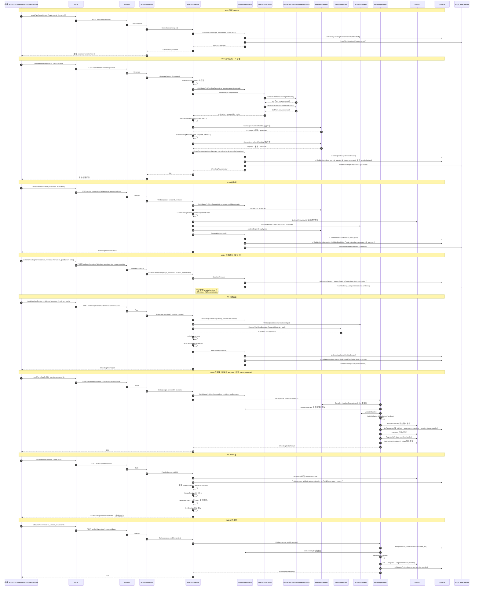

# Workshop 调用链地图

> 审计依据：.trae/Amitia_扩展系统重构_第2步_建立现有系统调用链地图.md
> 审计日期：2026-07-25
> 状态：第2步调用链地图（只审计不修改）

## 一、涉及文件清单

| 文件 | 职责 | 行数 | 关键类型/函数 |
|---|---|---:|---|
| d:/桌面/跟进项目/U-Ai/backend/internal/extension/workshop_protocol.go | Workshop 协议类型与错误码 | 491 | WorkshopSessionStatus、WorkshopSession、ExtensionDraft、WorkshopPlan、WorkflowDefinition、CompiledWorkflow、WorkshopValidationResult、WorkshopTestCase、WorkshopTestReport、PermissionConfirmation、WorkshopInstallResult、WorkshopRevisionView、WorkshopSessionDetailView、WorkshopArtifactView、CreateWorkshopSessionRequest、GenerateWorkshopDraftRequest、WorkshopTestRequest、ErrWorkshop* |
| d:/桌面/跟进项目/U-Ai/backend/internal/extension/workshop_handler.go | HTTP 入口（17 个端点） | 275 | WorkshopHandler、NewWorkshopHandler、scope、revision、ListSessions、Metrics、CreateSession、GenerateInstruction、GetSession、Archive、ListRevisions、GetRevision、Generate、Validate、ConfirmPermissions、Test、Install、ListTests、GetTest、Rollback、GetArtifact、Export、Fork |
| d:/桌面/跟进项目/U-Ai/backend/internal/extension/workshop_service.go | Workshop 业务核心服务 | 709 | WorkshopService、NewWorkshopService、SetModelGenerator、AttachAgentSkills、GenerateInstruction、lockSession、CreateSession、ListSessions、GetSession、ListRevisions、GetRevision、Generate、Validate、ConfirmPermissions、Test、Install、Archive、ListTests、GetTest、Rollback、Restore、GetArtifact、ForkSkill、buildWorkshopManifest、analyzeCapabilityDeclaration、evaluateAssertions、sideEffectNames、dependenciesFromCompiled、workshopSecretFields、summarizeIssues、planFromDraft（在 generator.go）、bumpPatchVersion |
| d:/桌面/跟进项目/U-Ai/backend/internal/extension/workshop_repository.go | DB 持久化（Session/Revision/TestRun/Artifact） | 503 | workshopSessionRecord、workshopRevisionRecord、workshopTestRunRecord、extensionArtifactRecord、WorkshopRepository、NewWorkshopRepository、insertWorkshopAudit、CreateSession、GetSession、ListSessions、CASStatus、validWorkshopTransition、SaveRevision、workshopContentSummary、GetRevision、ListRevisions、SaveValidation、SaveConfirmation、SaveTestReport、redactWorkshopTestReport、redactWorkshopErrorDetail、ListTestReports、GetTestReport、LatestPassedTest、GetArtifact、GetSessionArtifact、CurrentArtifacts、sessionFromRecord、revisionFromRecord、testReportFromRecord、reportStatusMode |
| d:/桌面/跟进项目/U-Ai/backend/internal/extension/workshop_installer.go | 安装/恢复/回滚主流程 | 437 | WorkshopInstaller、NewWorkshopInstaller、Install、Restore、Rollback、definitionFromArtifact、workflowHandler、splitWorkflowConfig、buildArtifact、artifactChecksum、skillDefinitionFromDraft、skillDefinitionFromManifest、replaceManifestArtifact、suggestWorkshopVersion、breakingSchemaChanges、semverParts、semverMajor、jsonEqual、dependencyIDs、modelNamePattern |
| d:/桌面/跟进项目/U-Ai/backend/internal/extension/workshop_generator.go | AI 生成 Draft（Plan+Draft 两段式） | 410 | WorkshopModelGenerator、WorkshopGenerator、WorkshopInstructionDraft、GenerateInstruction、NewWorkshopGenerator、SetModel、Generate、generatePlan、generateDraft、workshopPlannerPrompt、workshopSystemPrompt、validateWorkshopPlan、normalizeWorkshopPlan、planFromDraft、sortedAllowedSteps、sanitizeGenerationError、hasIssueCode、validateDraftStructure、nonIDPattern、normalizeWorkshopDraft、normalizeSchema、uniqueSortedTriggers |
| d:/桌面/跟进项目/U-Ai/backend/internal/extension/workshop_metrics.go | 内存计数器 | 75 | WorkshopMetric* 常量、workshopMetrics、defaultWorkshopMetrics、incrementWorkshopMetric、recordWorkshopErrorMetric、WorkshopMetricsSnapshot、resetWorkshopMetrics |
| d:/桌面/跟进项目/U-Ai/backend/internal/extension/workshop_workflow_test.go | 单元测试（Compiler/Executor/Plan/Assertion/StateMachine/Metrics） | 597 | workshopTestAdapter、workshopModelSequence、validWorkshopPlanJSON、TestWorkflowCompilerStaticPolicies、TestWorkflowCompilerRejectsTransitiveSkillCycle、TestNetworkTargetPolicy、TestForbiddenDraftContentMatrix、TestHTTPWorkflowAdapterMockContract、TestSkillMockControlledLiveContract、TestHTTPCompiledStepUsesRequestedTimeout、TestRestrictedValuesAndSecrets、TestConditionOperatorMatrix、TestTransformOperationMatrix、TestWorkflowHostLimitClamping、TestWorkshopVersionSuggestion、TestWorkshopAssertionSchemaValidation、TestWorkshopTestReportRedaction、TestWorkshopPlannerAndGeneratorPipeline、TestWorkshopPlanValidationMatrix、TestPlannedStepAcceptsDescriptionAliasAndRejectsOtherFields、TestWorkshopPlanAcceptsFalseSideEffectsAndRejectsTrue、TestDraftMessagesAcceptStringAliasesAndRejectUnknownObjectFields、TestWorkshopMetricsExposeAllRequiredCounters、TestWorkflowExecutorIsolationAndLimits、TestControlledLiveBlocksHostSideEffects、TestWorkshopStateMachine、TestWorkflowSecretConfigIsolation |
| d:/桌面/跟进项目/U-Ai/backend/internal/extension/workshop_integration_test.go | 端到端集成测试 | 315 | newWorkshopIntegrationService、integrationDraft、prepareInstallableWorkshop、TestWorkshopEndToEndInstallExecuteAndRestore、TestWorkshopRevisionInvalidatesPermissionScopes、TestWorkshopRegistryFailureCompensatesDatabaseInstall、TestWorkshopDatabaseFailureLeavesRegistryUntouched |
| d:/桌面/跟进项目/U-Ai/backend/internal/extension/router.go（Workshop 部分） | 路由注册 | — | RegisterRouter 第 15 行 NewWorkshopHandler；第 54-70 行 workshop/* 路由；第 101-102 行 skills/:id/workshop/fork 与 skills/:id/versions/:version/rollback |
| d:/桌面/跟进项目/U-Ai/backend/internal/extension/runtime.go（Workshop 部分） | 装配 WorkshopService 与 Restore | — | NewRuntime 第 82-91 行：创建 WorkshopRepository、WorkflowCompiler、WorkflowExecutor、WorkshopService、AttachAgentSkills、WorkshopService.Restore、把 workshop.installer 注入 PackageService |
| d:/桌面/跟进项目/U-Ai/backend/internal/extension/handler.go（Workshop 公共部分） | scope/problem/OpenAPI | — | authenticatedUserKey、Handler.baseScope、Handler.problem、Handler.problemWithResult、problemStatus（WORKSHOP_* 分支） |
| d:/桌面/跟进项目/U-Ai/backend/internal/extension/workflow_compiler.go（被复用） | Workflow 编译、Secret 扫描、网络目标校验 | — | WorkflowCompiler.Compile、AnalyzeDependencyCycles、ScanWorkshopSecrets、ValidateNetworkTarget、allowedWorkflowSteps、workflowStepIDPattern、forbiddenDraftPattern、secretPattern、DefaultWorkflowLimits、effectiveWorkflowLimits |
| d:/桌面/跟进项目/U-Ai/backend/internal/extension/workflow_executor.go（被复用） | Workflow 沙箱执行器 | — | WorkflowExecutionMode（WorkflowProduction/DryRun/Mocked/ControlledLive）、WorkflowExecutionRequest、WorkflowExecutionResult、WorkflowExecutor.Execute、HTTPWorkflowAdapter、SkillWorkflowAdapter、SideEffectWorkflowAdapter、BuildWorkflowAdapters |
| d:/桌面/跟进项目/U-Ai/backend/internal/extension/registry.go（被复用） | Skill 注册表 | — | Registry.Register、Registry.Unregister、Registry.Get、Registry.SetEnabled、Registry.GetByModelName |
| d:/桌面/跟进项目/U-Ai/backend/internal/extension/schema_validator.go（被复用） | Manifest/Schema 校验 | — | SchemaValidator.ValidateManifest、ValidateSchema、Validate |
| d:/桌面/跟进项目/U-Ai/backend/internal/extension/agent_skill_service.go（被复用） | Instructions Skill 安装 | — | AgentSkillService.storePreview、AgentSkillService.Install、AgentSkillService.setInstalledAgentSkillBinding |
| d:/桌面/跟进项目/U-Ai/backend/internal/extension/agent_skill_parser.go（被复用） | Agent Skill 文件解析 | — | parseAgentSkillFiles、agentSkillNamePattern、validateAgentSkillDescription |
| d:/桌面/跟进项目/U-Ai/backend/internal/extension/agent_skill_protocol.go（被复用） | AgentSkillSourceWorkshop 常量 | — | AgentSkillSourceWorkshop = "workshop"、AgentSkillImportPreview |
| d:/桌面/跟进项目/U-Ai/backend/internal/extension/capability.go（被复用） | Capability 风险等级目录 | — | CapabilityDefinition、Capabilities()、Capability()（high/medium/low） |
| d:/桌面/跟进项目/U-Ai/backend/internal/extension/protocol.go（被复用） | SkillSource 常量、ExecutionScope、SkillHandler | — | SkillSourceWorkflow = "workflow"、SkillSourceInstructions = "instructions"、ExecutionScope、SkillHandler、ExecuteSkillRequest、SkillResult、ExtensionError |
| d:/桌面/跟进项目/U-Ai/backend/internal/migration/extension_workshop.go | DB 迁移 | — | add_extension_workshop_tables、extension_workshop_sessions、extension_workshop_revisions、extension_workshop_test_runs、列扩展迁移（test_permission_*、plan_json、model_*_summary_json） |
| d:/桌面/跟进项目/U-Ai/backend/internal/chat/service.go（被复用） | LLM 调用 | — | service.GenerateWorkshopJSON（实现 WorkshopModelGenerator 接口，返回 reply/apiType/modelName） |
| d:/桌面/跟进项目/U-Ai/backend/cmd/server/services.go（装配点） | 注入模型 Provider | — | 第 172 行 extensionRuntime.Workshop.SetModelGenerator(chatSvc) |
| d:/桌面/跟进项目/U-Ai/front/src/views/extensions/workshop/WorkshopListView.vue | 会话列表与创建入口 | 342 | load、validateRequirement、create（workflow/instructions 分支）、openSession、archive、statusLabel、statusType |
| d:/桌面/跟进项目/U-Ai/front/src/views/extensions/workshop/WorkshopSessionView.vue | 制作会话详情（10 步向导） | 857 | load、perform、generate、validate、toggleCapability、confirmPermissions、runTest、install、saveDraft、StructuredDraftEditor、CapabilityRiskList、TestResultViewer |
| d:/桌面/跟进项目/U-Ai/front/src/views/extensions/workshop/components/StructuredDraftEditor.vue | 结构化 Draft 编辑器 | — | defineProps(draft)、emit save/cancel、validateAll |
| d:/桌面/跟进项目/U-Ai/front/src/views/extensions/workshop/components/CapabilityRiskList.vue | 能力/风险确认列表 | — | toggle 事件 |
| d:/桌面/跟进项目/U-Ai/front/src/views/extensions/workshop/components/TestResultViewer.vue | 测试结果展示 | — | — |
| d:/桌面/跟进项目/U-Ai/front/src/views/extensions/api.ts（Workshop 部分） | API 函数 | — | workshopPath、fetchWorkshopSessions、createWorkshopSession、fetchWorkshopSession、archiveWorkshopSession、generateWorkshopDraft、validateWorkshopDraft、confirmWorkshopPermissions、testWorkshopDraft、installWorkshopDraft、forkWorkflowSkill、rollbackWorkflowSkill、generateWorkshopInstruction |
| d:/桌面/跟进项目/U-Ai/front/src/views/extensions/SkillDetailView.vue（Fork/Rollback 入口） | 已安装 Skill 详情 | — | forkRevision（第 499-511 行）、rollbackVersion（第 513-526 行） |
| d:/桌面/跟进项目/U-Ai/front/src/views/extensions/types.ts（Workshop 部分） | 前端类型 | — | WorkshopStatus、WorkshopSession、WorkshopSessionDetail、WorkshopRevision、WorkshopValidation、WorkshopTestReport、WorkshopTestCase、WorkshopPlan、WorkshopPage |
| d:/桌面/跟进项目/U-Ai/front/src/router/index.ts | 前端路由 | — | 第 47-48 行：/extensions/workshop、/extensions/workshop/:id |

## 二、核心类型与函数索引

| 类型/函数 | 文件:行 | 职责 | 调用者 | 被调用者 |
|---|---|---|---|---|
| WorkshopHandler | workshop_handler.go:16 | Workshop HTTP 入口聚合 | router.go:15 NewWorkshopHandler | WorkshopService、Handler |
| WorkshopService | workshop_service.go:17 | Workshop 业务核心服务 | runtime.NewRuntime、WorkshopHandler | WorkshopRepository、WorkshopGenerator、WorkflowCompiler、WorkflowExecutor、SchemaValidator、Registry、Executor、WorkshopInstaller、AgentSkillService |
| NewWorkshopService | workshop_service.go:30 | 构造 WorkshopService 并内部创建 WorkshopInstaller | runtime.NewRuntime | NewWorkshopInstaller |
| SetModelGenerator | workshop_service.go:35 | 注入 LLM Provider | cmd/server/services.go:172 | generator.SetModel |
| AttachAgentSkills | workshop_service.go:39 | 注入 AgentSkillService（用于 GenerateInstruction 分支） | runtime.NewRuntime | — |
| lockSession | workshop_service.go:65 | 会话级内存互斥（sync.Map + sync.Mutex.TryLock） | Generate、Validate、Test、Install | — |
| GenerateInstruction | workshop_service.go:41 | Instructions Skill 生成入口（不走 Session 体系） | WorkshopHandler.GenerateInstruction | generator.GenerateInstruction、parseAgentSkillFiles、agentSkills.storePreview |
| CreateSession | workshop_service.go:74 | 创建会话 | WorkshopHandler.CreateSession | repository.CreateSession、incrementWorkshopMetric |
| Generate | workshop_service.go:121 | 生成新 Revision（AI/手工两条路径） | WorkshopHandler.Generate | lockSession、repository.GetSession、repository.CASStatus、generator.Generate、normalizeWorkshopDraft、compiler.Compile（2 次）、buildWorkshopManifest、analyzeCapabilityDeclaration、repository.SaveRevision |
| Validate | workshop_service.go:202 | 校验当前 Revision | WorkshopHandler.Validate | lockSession、repository.GetSession、repository.CASStatus、repository.GetRevision、compiler.Compile、ScanWorkshopSecrets、workshopSecretFields、registry.Get、suggestWorkshopVersion、validator.ValidateManifest、validator.ValidateSchema、validator.Validate、analyzeCapabilityDeclaration、compiler.AnalyzeDependencyCycles、repository.SaveValidation |
| ConfirmPermissions | workshop_service.go:316 | 测试/生产权限确认（双独立） | WorkshopHandler.ConfirmPermissions | repository.GetSession、repository.GetRevision、sameStringSets、containsString、repository.SaveConfirmation |
| Test | workshop_service.go:348 | 测试运行（dry_run/mocked/controlled_live） | WorkshopHandler.Test | lockSession、repository.GetSession、repository.GetRevision、repository.CASStatus、validator.Validate、executor.Execute、evaluateAssertions、redactWorkshopTestReport、repository.SaveTestReport |
| Install | workshop_service.go:445 | 安装入口（不直接调 Registry） | WorkshopHandler.Install | lockSession、repository.GetSession、repository.CASStatus、installer.Install、repository.CASStatus（失败补偿） |
| Archive | workshop_service.go:480 | 归档会话 | WorkshopHandler.Archive | repository.GetSession、repository.CASStatus |
| Rollback | workshop_service.go:497 | Skill 版本回滚入口 | WorkshopHandler.Rollback | installer.Rollback |
| Restore | workshop_service.go:502 | 启动恢复入口 | runtime.NewRuntime | installer.Restore |
| GetArtifact | workshop_service.go:504 | 获取会话当前 Artifact | WorkshopHandler.GetArtifact、WorkshopHandler.Export | repository.GetSessionArtifact |
| ForkSkill | workshop_service.go:513 | 从已安装 Workflow Skill 创建新 Session+Revision | WorkshopHandler.Fork | registry.Get、repository.db（查 extension_artifacts）、CreateSession、Generate（递归）、GetSession |
| bumpPatchVersion | workshop_service.go:542 | patch 版本自增 | ForkSkill | — |
| buildWorkshopManifest | workshop_service.go:556 | 构造最终 Manifest（Kind=Skill, Entry.Kind=workflow） | Generate | uniqueSortedTriggers、containsTrigger |
| analyzeCapabilityDeclaration | workshop_service.go:568 | 能力差异分析（Missing/Excess/HighRisk/ByStep） | Generate、Validate | Capability（capabilityCatalog）、uniqueSortedStrings |
| evaluateAssertions | workshop_service.go:672 | 测试断言求值 | Test | resolveReference、asFloat、validator.Validate |
| WorkshopRepository | workshop_repository.go:121 | DB 持久化 | WorkshopService、WorkshopInstaller | gorm.DB |
| CreateSession | workshop_repository.go:134 | 创建会话记录+审计 | WorkshopService.CreateSession | tx.Create、insertWorkshopAudit |
| GetSession | workshop_repository.go:148 | 会话查询+所有权校验 | 多处 | tx.First（user_id 与 character_id 双重校验） |
| CASStatus | workshop_repository.go:194 | 状态机 CAS（lock_version+status IN ?） | Generate/Validate/Test/Install/Archive | validWorkshopTransition、tx.Updates、insertWorkshopAudit |
| validWorkshopTransition | workshop_repository.go:221 | 状态机白名单 | CASStatus | — |
| SaveRevision | workshop_repository.go:242 | 保存 Revision + 推进 current_revision + 清空 Permission/Test | Generate | tx.Create、tx.Updates、insertWorkshopAudit、workshopContentSummary |
| SaveValidation | workshop_repository.go:309 | 保存校验结果，状态→Validated/ValidationFailed | Validate | tx.Update、tx.Updates、insertWorkshopAudit |
| SaveConfirmation | workshop_repository.go:330 | 保存权限确认（双独立：test/production） | ConfirmPermissions | tx.Updates、insertWorkshopAudit |
| SaveTestReport | workshop_repository.go:361 | 保存测试报告+状态→TestPassed/TestFailed | Test | redactWorkshopTestReport、tx.Create、tx.Updates、insertWorkshopAudit |
| redactWorkshopTestReport | workshop_repository.go:394 | Secret 脱敏 | SaveTestReport、Test（内联） | redactJSON、redactWorkshopErrorDetail |
| redactWorkshopErrorDetail | workshop_repository.go:411 | 错误详情脱敏（secretPattern 替换为 [REDACTED]，截断 512） | redactWorkshopTestReport | secretPattern |
| LatestPassedTest | workshop_repository.go:449 | 查询当前 Revision+Checksum 的最近通过测试 | WorkshopInstaller.Install | tx.First |
| GetSessionArtifact | workshop_repository.go:469 | 会话当前 Artifact | GetArtifact | tx.First |
| CurrentArtifacts | workshop_repository.go:480 | 所有 source=workshop 的当前 Artifact（Restore 用） | WorkshopInstaller.Restore | db.Table JOIN extensions |
| insertWorkshopAudit | workshop_repository.go:125 | 写 plugin_audit_record（action=workshop.state.transition） | 所有 CAS 与 Save* | tx.Create(pluginAuditRecord) |
| WorkshopInstaller | workshop_installer.go:22 | 安装/恢复/回滚实现 | WorkshopService（内部）、PackageService（外部复用） | WorkshopRepository、Registry、WorkflowCompiler、WorkflowExecutor、SchemaValidator |
| Install | workshop_installer.go:34 | 安装主流程（重编译+Checksum 校验+权限校验+测试校验+Artifact 落库+Extension 落库+Registry.Register） | WorkshopService.Install | repository.GetSession、repository.GetRevision、compiler.Compile、compiler.AnalyzeDependencyCycles、repository.LatestPassedTest、validator.ValidateManifest、buildArtifact、skillDefinitionFromDraft、registry.Get、registry.Unregister、registry.Register、registry.SetEnabled、tx（多表） |
| Restore | workshop_installer.go:183 | 启动恢复（遍历 CurrentArtifacts，重新注册） | WorkshopService.Restore | repository.CurrentArtifacts、definitionFromArtifact、registry.Unregister、registry.Register |
| Rollback | workshop_installer.go:209 | 历史版本回滚 | WorkshopService.Rollback | repository.db、repository.GetSession、definitionFromArtifact、registry.Get、registry.Unregister、registry.Register、tx |
| definitionFromArtifact | workshop_installer.go:242 | 从 Artifact 重建 SkillDefinition+Handler | Install、Restore、Rollback、PackageService（package_installer.go:266、package_lifecycle.go:310、package_recovery.go:158） | artifactChecksum、skillDefinitionFromManifest、workflowHandler |
| workflowHandler | workshop_installer.go:262 | 闭包式 SkillHandler（执行时重校验 Checksum，调 WorkflowExecutor.Execute(WorkflowProduction)） | definitionFromArtifact、PackageService.installWorkflowPackage | artifactChecksum、splitWorkflowConfig、executor.Execute |
| splitWorkflowConfig | workshop_installer.go:283 | 分离 config 中的 writeOnly/secret 字段 | workflowHandler | — |
| buildArtifact | workshop_installer.go:312 | 构造 extensionArtifactRecord（含 8MB 限制与 Checksum） | Install | artifactChecksum |
| artifactChecksum | workshop_installer.go:326 | Artifact 稳定 Checksum（sha256 of 7 字段拼接） | buildArtifact、definitionFromArtifact、workflowHandler | — |
| skillDefinitionFromDraft | workshop_installer.go:334 | Draft→SkillDefinition（含 ModelName 推导） | Install | dependencyIDs |
| suggestWorkshopVersion | workshop_installer.go:370 | 版本建议（patch/minor/major）+ 破坏性变更检测 | Validate、Install | breakingSchemaChanges、semverParts、jsonEqual、sameStringSets |
| WorkshopGenerator | workshop_generator.go:15 | AI 生成器 | WorkshopService | WorkshopModelGenerator、SkillRegistry |
| GenerateInstruction | workshop_generator.go:31 | Instructions Skill 生成（单次调用模型） | WorkshopService.GenerateInstruction | ScanWorkshopSecrets、forbiddenDraftPattern、g.model.GenerateWorkshopJSON、agentSkillNamePattern、validateAgentSkillDescription |
| Generate | workshop_generator.go:86 | Workflow Skill 生成（两段式：Plan+Draft） | WorkshopService.Generate | forbiddenDraftPattern、ScanWorkshopSecrets、registry.List、generatePlan、generateDraft |
| generatePlan | workshop_generator.go:123 | Plan 阶段（最多 3 次重试带反馈） | Generate | g.model.GenerateWorkshopJSON、ScanWorkshopSecrets、validateWorkshopPlan、normalizeWorkshopPlan |
| generateDraft | workshop_generator.go:162 | Draft 阶段（最多 3 次重试带反馈） | Generate | g.model.GenerateWorkshopJSON、ScanWorkshopSecrets、validateDraftStructure |
| workshopPlannerPrompt | workshop_generator.go:200 | Plan 系统提示词 | generatePlan | — |
| workshopSystemPrompt | workshop_generator.go:204 | Draft 系统提示词 | generateDraft | — |
| validateWorkshopPlan | workshop_generator.go:208 | Plan 结构校验 | generatePlan | allowedWorkflowSteps、workflowStepIDPattern、capabilityCatalog、ScanWorkshopSecrets |
| normalizeWorkshopPlan | workshop_generator.go:234 | Plan 规范化（空数组兜底） | generatePlan、planFromDraft | — |
| planFromDraft | workshop_generator.go:275 | 从 Draft 反推 Plan（手工编辑路径） | WorkshopService.Generate | normalizeWorkshopPlan |
| validateDraftStructure | workshop_generator.go:317 | Draft 结构校验 | generateDraft | ScanWorkshopSecrets、allowedWorkflowSteps |
| normalizeWorkshopDraft | workshop_generator.go:338 | Draft 规范化（ID 命名空间、版本、Schema、Limits） | WorkshopService.Generate | nonIDPattern、semverPattern、uniqueSortedTriggers、normalizeSchema、effectiveWorkflowLimits、stableJSON |
| WorkshopModelGenerator | workshop_generator.go:12 | LLM Provider 接口 | — | chat.service（实现） |
| GenerateWorkshopJSON | chat/service.go:178 | 实际 LLM 调用（实现 WorkshopModelGenerator） | WorkshopGenerator | repo.GetActiveModel、callLLMJSON |
| WorkshopHandler.scope | workshop_handler.go:24 | 从 gin.Context 构建 ExecutionScope | 所有 Workshop 端点 | Handler.baseScope |
| WorkshopHandler.revision | workshop_handler.go:32 | revision 路径参数解析 | GetRevision、Validate、ConfirmPermissions、Test、Install | — |
| WorkshopHandler.Export | workshop_handler.go:225 | 导出 .amitiax ZIP（含 manifest/schemas/workflows/tests/README/checksums） | router.go:69 | WorkshopService.GetArtifact、zip.NewWriter |
| WorkshopHandler.Fork | workshop_handler.go:268 | Fork 入口 | router.go:101 | WorkshopService.ForkSkill |
| WorkshopHandler.Rollback | workshop_handler.go:209 | Rollback 入口 | router.go:102 | WorkshopService.Rollback |
| problemStatus | handler.go:314 | WORKSHOP_* 错误码到 HTTP 状态映射 | WorkshopHandler 路径 | — |
| executionAuth | router.go:107 | Bearer Token 鉴权中间件 | RegisterRouter | user.Service.GetMe |
| Handler.baseScope | handler.go:288 | 从 authenticatedUserKey 构建 ExecutionScope 基线 | WorkshopHandler.scope | — |

## 三、调用链

### 链路 WS-1：创建 Session 链

链路编号：WS-1
链路名称：创建 Workshop Session
触发条件：前端 WorkshopListView 选择"执行型工作流"产物类型并提交需求
最终结果：写入 `extension_workshop_sessions`（status=draft）+ `plugin_audit_records`（action=workshop.state.transition, operation=session.create）

| 顺序 | 层级 | 文件 | 类型/函数 | 输入 | 输出/状态变化 | 错误处理 | 备注 |
|---:|---|---|---|---|---|---|---|
| 1 | 前端入口 | WorkshopListView.vue:184 | create | productType=workflow、requirement | 调 createWorkshopSession | ElMessage 错误提示 | requirement 校验非空且 ≤20000 字符 |
| 2 | 前端 API | api.ts:349 | createWorkshopSession | requirement、characterId | POST /api/extensions/workshop/sessions?characterId=...，body={requirement, characterId} | — | 同时把 characterId 放 query 与 body |
| 3 | HTTP 路由 | router.go:57 | RegisterRouter | POST /extensions/workshop/sessions | 绑定 WorkshopHandler.CreateSession | — | extensionAuth 中间件已校验 Bearer |
| 4 | HTTP 入口 | workshop_handler.go:54 | WorkshopHandler.CreateSession | gin.Context | CreateWorkshopSessionRequest | ErrWorkshopGenerationOutputInvalid（JSON 解析失败） | — |
| 5 | scope 构建 | workshop_handler.go:24 | WorkshopHandler.scope | gin.Context | ExecutionScope（含 UserID、CharacterID、TraceID） | — | characterId 取自 query |
| 6 | 业务入口 | workshop_service.go:74 | WorkshopService.CreateSession | CreateWorkshopSessionRequest | WorkshopSession | ErrWorkshopGenerationOutputInvalid（空或 >20000 字符） | defer 中 incrementWorkshopMetric(WorkshopMetricSessionCreated) 与 recordWorkshopErrorMetric |
| 7 | 字符校验 | workshop_service.go:81 | CreateSession（内联） | requirement | trim 后非空且 ≤20000 | 同上 | — |
| 8 | CharacterID 回填 | workshop_service.go:85 | CreateSession（内联） | request.CharacterID 为空时取 Scope.CharacterID | — | — | — |
| 9 | 持久化 | workshop_repository.go:134 | WorkshopRepository.CreateSession | scope、requirement、characterID | workshopSessionRecord（status=draft, lock_version=1）+ audit | gorm 错误透传 | 在事务内同时 Create session 与 audit |
| 10 | 审计写入 | workshop_repository.go:125 | insertWorkshopAudit | session、scope、from=""、to=draft、operation=session.create | plugin_audit_record（extension_id="workshop:"+session.ID, action=workshop.state.transition） | — | scopeType/scopeID 按 characterID 决定 global/character |
| 11 | 响应 | workshop_handler.go:66 | c.JSON | 201 Created | WorkshopSession | — | — |
| 12 | 前端跳转 | WorkshopListView.vue:222 | router.push | /extensions/workshop/${session.id} | 进入 WorkshopSessionView | — | — |

### 链路 WS-2：指令生成链（Workflow 分支）

链路编号：WS-2
链路名称：生成 Workshop Revision（AI 自动 / 手工编辑两条路径）
触发条件：前端 WorkshopSessionView 第 1 步"生成结构化草案"或第 2 步"结构化编辑"保存
最终结果：写入 `extension_workshop_revisions`（revision=current+1，含 plan/draft/normalizedDraft/manifest/workflow/compiledWorkflow/checksum）+ 推进 `extension_workshop_sessions.current_revision` + 清空所有 Permission/Test 状态 + audit

| 顺序 | 层级 | 文件 | 类型/函数 | 输入 | 输出/状态变化 | 错误处理 | 备注 |
|---:|---|---|---|---|---|---|---|
| 1 | 前端入口（AI 路径） | WorkshopSessionView.vue:541 | generate | requirement | 调 generateWorkshopDraft({requirement}) | — | — |
| 1b | 前端入口（手工路径） | WorkshopSessionView.vue:637 | saveDraft | ExtensionDraft | 调 generateWorkshopDraft({draft}) | — | 来自 StructuredDraftEditor emit save |
| 2 | 前端 API | api.ts:371 | generateWorkshopDraft | id、characterId、payload | POST /workshop/sessions/:id/generate?characterId=... | — | payload.requirement 或 payload.draft 二选一 |
| 3 | HTTP 路由 | router.go:62 | RegisterRouter | POST /extensions/workshop/sessions/:id/generate | 绑定 WorkshopHandler.Generate | — | — |
| 4 | HTTP 入口 | workshop_handler.go:119 | WorkshopHandler.Generate | gin.Context（ContentLength>0 时绑定 body） | GenerateWorkshopDraftRequest | ErrWorkshopGenerationOutputInvalid | 允许空 body（使用 session.Requirement） |
| 5 | 业务入口 | workshop_service.go:121 | WorkshopService.Generate | sessionID、request | WorkshopRevisionView | ErrWorkshopRevisionConflict（lockSession 失败）、ErrWorkshopInvalidState（archived/installing）、CASStatus 错误 | defer 中根据 err 计 metric；completed 标志位控制失败补偿 |
| 6 | 会话锁 | workshop_service.go:65 | lockSession | sessionID | unlock func 或 nil | — | sync.Map + sync.Mutex.TryLock（内存锁） |
| 7 | 状态机 CAS | workshop_service.go:141 | WorkshopRepository.CASStatus | from=session.Status、to=WorkshopGenerating、operation=revision.generate.started | status=generating、lock_version+1、audit | ErrWorkshopInvalidState（非法转换）、ErrWorkshopRevisionConflict（RowsAffected!=1） | validWorkshopTransition 校验 |
| 8a | AI 路径 | workshop_service.go:172 | generator.Generate | requirement | draft、plan、raw、provider、model | ErrWorkshopGenerationFailed（无 model）、ErrWorkshopGenerationOutputInvalid（重试 3 次失败） | generator 内部两段式：generatePlan → generateDraft |
| 8a1 | Plan 阶段 | workshop_generator.go:123 | generatePlan | contextRaw+availableIDs | plan、planRaw、provider、model | 重试 maxAttempts=3，每次把上次错误塞回 prompt | g.model.GenerateWorkshopJSON(ctx, workshopPlannerPrompt(), userPrompt) |
| 8a2 | Draft 阶段 | workshop_generator.go:162 | generateDraft | draftContext | draft、raw、provider、model | 重试 maxAttempts=3 | g.model.GenerateWorkshopJSON(ctx, workshopSystemPrompt(), userPrompt) |
| 8a3 | LLM 调用 | chat/service.go:178 | service.GenerateWorkshopJSON | systemPrompt、userPrompt | reply、cfg.APIType、cfg.ModelName | repo.GetActiveModel 错误 | callLLMJSON 内部走配置的 LLM API |
| 8b | 手工路径 | workshop_service.go:165 | （内联） | request.Draft | draft=request.Draft、plan=planFromDraft(draft)、raw=json(draft)、provider="structured-editor" | — | 不调模型 |
| 9 | Draft 规范化 | workshop_generator.go:338 | normalizeWorkshopDraft | draft、userID | normalized、warnings | — | ID 命名空间强制 dev.user.<cleanUserID>.<slug>；禁止 dev.amitia.* |
| 10 | 第一次编译 | workshop_service.go:178 | compiler.Compile | normalized.Workflow | compiled、issues | ErrWorkshopGenerationOutputInvalid（编译失败） | 用编译结果重写 normalized.Capabilities |
| 11 | Capability 推导 | workshop_service.go:184 | （内联） | declared vs compiled.Capabilities | 若不同则追加 DraftWarning{CAPABILITIES_DERIVED} | — | 同步 normalized.Capabilities |
| 12 | Manifest 构造 | workshop_service.go:188 | buildWorkshopManifest | draft、compiled、artifactID | Manifest（Kind=Skill、Entry.Kind=workflow） | — | artifactID="artifact."+uuid |
| 13 | 副作用/依赖回填 | workshop_service.go:189 | sideEffectNames、dependenciesFromCompiled | — | normalized.Intent.SideEffects、normalized.Dependencies | — | — |
| 14 | Limits 回填 | workshop_service.go:191 | （内联） | — | normalized.Workflow.Limits=compiled.Limits | — | — |
| 15 | 第二次编译 | workshop_service.go:192 | compiler.Compile | normalized.Workflow | compiled（重算 Checksum） | ErrWorkshopGenerationOutputInvalid | — |
| 16 | 能力分析 | workshop_service.go:196 | analyzeCapabilityDeclaration | normalized.Capabilities、compiled | CapabilityAnalysis（Required/Declared/Missing/Excess/ByStep/HighRisk） | — | — |
| 17 | Revision 落库 | workshop_repository.go:242 | WorkshopRepository.SaveRevision | session、requirement、plan、raw、normalized、draft、compiled、analysis、provider、model | workshopRevisionRecord + session.current_revision+1 + 清空 permission/test/validation_summary/test_summary + audit | ErrWorkshopRevisionConflict（并发） | raw_model_output 走 redactJSON；input/output_summary 走 workshopContentSummary（sha256+bytes） |
| 18 | 失败补偿 | workshop_service.go:149 | defer | — | 若未 completed 且状态仍为 generating → CAS 到 WorkshopError | — | 用 context.Background() 不阻塞返回 |
| 19 | 响应 | workshop_handler.go:133 | c.JSON | 200 | WorkshopRevisionView | — | — |
| 20 | 前端刷新 | WorkshopSessionView.vue:547 | load | — | 重新拉取 session 详情 | — | — |

### 链路 WS-3：Revision 管理链

链路编号：WS-3
链路名称：Revision 列表与详情
触发条件：前端会话详情页加载、前端调用 GET /revisions 或 GET /revisions/:revision
最终结果：返回 WorkshopRevisionView 或列表

| 顺序 | 层级 | 文件 | 类型/函数 | 输入 | 输出/状态变化 | 错误处理 | 备注 |
|---:|---|---|---|---|---|---|---|
| 1 | 前端 API | api.ts:360 | fetchWorkshopSession | id、characterId | GET /workshop/sessions/:id?characterId=... | — | 会话详情内联当前 revision + testReports |
| 2 | HTTP 路由 | router.go:58 | RegisterRouter | GET /extensions/workshop/sessions/:id | 绑定 WorkshopHandler.GetSession | — | — |
| 3 | HTTP 入口 | workshop_handler.go:84 | WorkshopHandler.GetSession | gin.Context | WorkshopSessionDetailView | — | — |
| 4 | 业务入口 | workshop_service.go:94 | WorkshopService.GetSession | scope、id | WorkshopSessionDetailView | — | — |
| 5 | 会话查询 | workshop_repository.go:148 | WorkshopRepository.GetSession | scope、id | WorkshopSession、workshopSessionRecord | ErrWorkshopSessionNotFound、ErrWorkshopSessionForbidden | 双重所有权校验：UserID 必须匹配；CharacterID 非空时也必须匹配 |
| 6 | 当前 Revision | workshop_repository.go:280 | WorkshopRepository.GetRevision | scope、id、session.CurrentRevision | WorkshopRevisionView、workshopRevisionRecord | ErrWorkshopRevisionNotFound | 仅当 CurrentRevision>0 时调用 |
| 7 | 测试报告列表 | workshop_repository.go:421 | WorkshopRepository.ListTestReports | scope、id | []WorkshopTestReport | — | 按 created_at DESC |
| 8 | 单独列表 | router.go:60 | GET /workshop/sessions/:id/revisions | WorkshopHandler.ListRevisions → WorkshopService.ListSessions → WorkshopRepository.ListRevisions | []WorkshopRevisionView | — | 按 revision DESC |
| 9 | 单独详情 | router.go:61 | GET /workshop/sessions/:id/revisions/:revision | WorkshopHandler.GetRevision → WorkshopService.GetRevision → WorkshopRepository.GetRevision | WorkshopRevisionView | ErrWorkshopRevisionNotFound | revision 参数经 WorkshopHandler.revision 校验为正整数 |

### 链路 WS-4：校验链

链路编号：WS-4
链路名称：Revision 校验 + 权限确认
触发条件：前端 WorkshopSessionView 第 6 步"重新校验当前 Revision"或第 5 步"确认测试/生产权限"
最终结果：写入 `extension_workshop_revisions.validation_result_json` + `extension_workshop_sessions.validation_summary`/`risk_summary` + 状态→Validated/ValidationFailed 或写入 `permission_confirmation_json`/`test_permission_confirmation_json` + 状态→AwaitingPermissions

| 顺序 | 层级 | 文件 | 类型/函数 | 输入 | 输出/状态变化 | 错误处理 | 备注 |
|---:|---|---|---|---|---|---|---|
| 1 | 前端入口（校验） | WorkshopSessionView.vue:550 | validate | — | 调 validateWorkshopDraft | — | — |
| 2 | 前端 API | api.ts:383 | validateWorkshopDraft | id、revision、characterId | POST /workshop/sessions/:id/revisions/:revision/validate?characterId=...，空 body | — | — |
| 3 | HTTP 路由 | router.go:63 | RegisterRouter | POST /extensions/workshop/sessions/:id/revisions/:revision/validate | 绑定 WorkshopHandler.Validate | — | — |
| 4 | HTTP 入口 | workshop_handler.go:135 | WorkshopHandler.Validate | gin.Context、revision | WorkshopValidationResult | ErrWorkshopRevisionNotFound | revision 路径参数解析 |
| 5 | 业务入口 | workshop_service.go:202 | WorkshopService.Validate | scope、sessionID、revision | WorkshopValidationResult | ErrWorkshopRevisionConflict（lockSession 失败/revision 不匹配）、ErrWorkshopInvalidState（archived/installing）、CAS 错误 | defer 中计 metric |
| 6 | 状态机 CAS | workshop_service.go:224 | WorkshopRepository.CASStatus | from=session.Status、to=WorkshopValidating、operation=revision.validate.started | status=validating、lock_version+1、audit | 同 WS-2 步骤 7 | — |
| 7 | 重新编译 | workshop_service.go:236 | compiler.Compile | draft.Workflow | compiled、issues | — | 编译错误作为 AnalysisIssue（不返回 error） |
| 8 | Secret 扫描 | workshop_compiler.go:536 | ScanWorkshopSecrets（透传） | mustJSON(draft) | issues | — | secretPattern 检测 |
| 9 | Secret 字段声明校验 | workshop_service.go:239 | workshopSecretFields + secretReferenceNames | draft.ConfigSchema、step.Input | 未声明的 Secret 引用 → AnalysisIssue{ErrWorkshopSecretDetected} | — | writeOnly/format=password/secret 才算声明 |
| 10 | Manifest 约束 | workshop_service.go:246 | （内联） | draft.Manifest | Manifest.Kind 必须 Skill、Entry.Kind 必须 workflow、ID 不得以 dev.amitia. 开头 | AnalysisIssue{ErrWorkshopManifestInvalid} | — |
| 11 | 版本冲突检测 | workshop_service.go:255 | registry.Get + compareSemver + suggestWorkshopVersion | draft.Metadata.ID | 若版本 ≤ 当前生产版本 → AnalysisIssue{ErrWorkshopVersionConflict}；若 breaking 且 major 未提升 → 同上；否则 info 建议 | — | — |
| 12 | Manifest Schema 校验 | workshop_service.go:267 | validator.ValidateManifest | manifestRaw | nil 或 err | AnalysisIssue{ErrWorkshopManifestInvalid} | — |
| 13 | Schema 校验 | workshop_service.go:271 | validator.ValidateSchema | inputSchema、outputSchema、configSchema | nil 或 err | AnalysisIssue{ErrWorkshopSchemaInvalid} | — |
| 14 | Default Config 校验 | workshop_service.go:279 | validator.Validate | configSchema、defaultConfig | nil 或 err | AnalysisIssue{ErrWorkshopSchemaInvalid} | 仅当 ConfigSchema 非空 |
| 15 | 能力分析 | workshop_service.go:284 | analyzeCapabilityDeclaration | draft.Capabilities、compiled | Missing → error；Excess → warning | — | — |
| 16 | 依赖循环检测 | workshop_service.go:285 | compiler.AnalyzeDependencyCycles | draft.Metadata.ID、compiled.Dependencies | issues | — | 递归查 registry 检测循环 |
| 17 | 结果汇总 | workshop_service.go:292 | （内联） | issues、capabilityAnalysis | WorkshopValidationResult（Valid=!hasErrorIssues） | — | — |
| 18 | 校验落库 | workshop_repository.go:309 | WorkshopRepository.SaveValidation | session、revision、result | validation_result_json 写入 revision；status→Validated 或 ValidationFailed；validation_summary+risk_summary 写入 session；audit | ErrWorkshopRevisionConflict（RowsAffected!=1） | — |
| 19 | 响应 | workshop_handler.go:145 | c.JSON | 200 | WorkshopValidationResult | — | — |
| 20 | 前端入口（权限确认） | WorkshopSessionView.vue:576 | confirmPermissions | production: bool | 调 confirmWorkshopPermissions | — | 测试权限 production=false；生产权限 production=true |
| 21 | 前端 API | api.ts:395 | confirmWorkshopPermissions | id、revision、characterId、payload{workflowChecksum, capabilities, confirmedHighRisk, production} | POST /workshop/sessions/:id/revisions/:revision/permissions/confirm | — | — |
| 22 | HTTP 路由 | router.go:64 | RegisterRouter | 同上 | 绑定 WorkshopHandler.ConfirmPermissions | — | — |
| 23 | HTTP 入口 | workshop_handler.go:147 | WorkshopHandler.ConfirmPermissions | gin.Context、revision、PermissionConfirmation | 204 No Content | ErrWorkshopPermissionRequired（JSON 解析失败） | — |
| 24 | 业务入口 | workshop_service.go:316 | WorkshopService.ConfirmPermissions | scope、sessionID、revision、confirmation | nil | ErrWorkshopInvalidState（状态不匹配）、ErrWorkshopPermissionStale（checksum 不匹配）、ErrWorkshopPermissionRequired（capability 不全/高风险未单独确认） | production 时状态必须 TestPassed；非 production 时状态 Validated/AwaitingPermissions 均可 |
| 25 | 持久化 | workshop_repository.go:330 | WorkshopRepository.SaveConfirmation | session、revision、checksum、confirmation | production: 写 permission_confirmation_json+permission_revision+permission_checksum（不改 status）；非 production: status→AwaitingPermissions+test_permission_* | ErrWorkshopRevisionConflict | audit operation=permission.production.confirmed 或 permission.test.confirmed |

### 链路 WS-5：测试链

链路编号：WS-5
链路名称：测试运行（dry_run / mocked / controlled_live）
触发条件：前端 WorkshopSessionView 第 8 步"运行测试"
最终结果：写入 `extension_workshop_test_runs` + 推进 session.status → TestPassed 或 TestFailed + 写 test_summary

| 顺序 | 层级 | 文件 | 类型/函数 | 输入 | 输出/状态变化 | 错误处理 | 备注 |
|---:|---|---|---|---|---|---|---|
| 1 | 前端入口 | WorkshopSessionView.vue:604 | runTest | mode、controlledLiveConfirmed | 调 testWorkshopDraft | — | — |
| 2 | 前端 API | api.ts:412 | testWorkshopDraft | id、revision、characterId、payload{mode, testCases?, controlledLiveConfirmed?} | POST /workshop/sessions/:id/revisions/:revision/test | — | — |
| 3 | HTTP 路由 | router.go:65 | RegisterRouter | 同上 | 绑定 WorkshopHandler.Test | — | — |
| 4 | HTTP 入口 | workshop_handler.go:163 | WorkshopHandler.Test | gin.Context、revision、WorkshopTestRequest | WorkshopTestReport | ErrWorkshopTestFailed（JSON 解析失败） | — |
| 5 | 业务入口 | workshop_service.go:348 | WorkshopService.Test | scope、sessionID、revision、request | WorkshopTestReport | ErrWorkshopRevisionConflict、ErrWorkshopInvalidState（状态非 AwaitingPermissions/TestFailed/TestPassed）、ErrWorkshopPermissionRequired（controlled_live 未确认）、ErrWorkshopPermissionStale（test_permission_revision/checksum 不匹配）、ErrWorkshopPermissionRequired（test_permission 缺失或为 production）、ErrWorkshopChecksumMismatch（compiled.Checksum 不匹配） | defer 中计 metric；revision 必须等于 current |
| 6 | 状态机 CAS | workshop_service.go:396 | WorkshopRepository.CASStatus | from=session.Status、to=WorkshopTesting、operation=revision.test.started | status=testing、lock_version+1、audit | 同 WS-2 步骤 7 | — |
| 7 | 测试用例选择 | workshop_service.go:389 | （内联） | request.TestCases 或 view.NormalizedDraft.TestCases 或默认 | testCases | — | 默认用例：`{ID:"default", Name:"默认 Dry Run", Mode:request.Mode, Input:{}, Config:defaultConfig}` |
| 8 | 输入 Schema 校验 | workshop_service.go:410 | validator.Validate | inputSchema、testCase.Input | nil 或 err | aggregate.Status=failed、ErrWorkshopTestFailed | break 退出循环 |
| 9 | Workflow 执行 | workshop_service.go:415 | WorkflowExecutor.Execute | WorkflowExecutionRequest{Workflow: compiled, Input, Config, Scope, Mode, HTTPMocks, SkillMocks}、outputSchema | WorkflowExecutionResult{Output, Steps, SideEffects} | execErr → aggregate.Status=failed、asExtensionError | 复用生产执行器，Mode 区分行为 |
| 9a | HTTP Adapter | workflow_executor.go:261 | HTTPWorkflowAdapter.Execute | request | mocked: 强制命中 HTTPMock，否则失败；dry_run: 不发真实请求；controlled_live: 允许白名单网络 | — | ValidateNetworkTarget 拒绝内网/localhost/file/dynamic_host |
| 9b | Skill Adapter | workflow_executor.go:430 | SkillWorkflowAdapter.Execute | request | mocked/controlled_live: 必须命中 SkillMock | — | — |
| 9c | SideEffect Adapter | workflow_executor.go:516 | SideEffectWorkflowAdapter.Execute | request | production: 调 host.ExecuteWorkflowSideEffect；其他: 仅记录未确认 SideEffect | — | controlled_live 屏蔽真实副作用 |
| 10 | 断言求值 | workshop_service.go:424 | evaluateAssertions | assertions、execution、validator | []AssertionResult | — | 支持 equals/not_equals/exists/not_exists/contains/status_is/step_succeeded/step_failed/side_effect_count/duration_less_than/matches_schema |
| 11 | 报告汇总 | workshop_service.go:432 | （内联） | — | aggregate.FinishedAt、DurationMS、Warnings=[{Code:"mode:"+request.Mode}] | — | 若无 step 执行则强制 failed |
| 12 | Secret 脱敏 | workshop_service.go:438 | redactWorkshopTestReport | aggregate | Output/Error.Detail/StepResults[].Error.Detail 走 redactJSON + redactWorkshopErrorDetail | — | secretPattern 替换为 [REDACTED]；超 512 字节截断 |
| 13 | 报告落库 | workshop_repository.go:361 | WorkshopRepository.SaveTestReport | scope、aggregate、storedInput | workshopTestRunRecord + session.status→TestPassed/TestFailed + test_summary + audit | gorm 错误 | 同时再次 redactWorkshopTestReport |
| 14 | 响应 | workshop_handler.go:179 | c.JSON | 200 | WorkshopTestReport | — | — |

### 链路 WS-6：安装链

链路编号：WS-6
链路名称：安装 Workshop Skill
触发条件：前端 WorkshopSessionView 第 10 步"安装当前版本"
最终结果：写入 `extension_artifacts`（source=workshop）+ `extensions`（Kind=Skill, Source=workflow）+ `extension_versions` + 推进 session.status → Installed + Registry.Register(handler=workflowHandler) + Registry.SetEnabled(false)

**关键结论：Workshop Install 不调用 PackageService，而是直接通过 WorkshopInstaller.Install 写 Registry 与 DB。PackageService 持有 WorkshopInstaller 引用，但仅复用其 `definitionFromArtifact` 与 `workflowHandler` 方法用于 .amitiax 包加载，与 Workshop 安装链路反向无引用。**

| 顺序 | 层级 | 文件 | 类型/函数 | 输入 | 输出/状态变化 | 错误处理 | 备注 |
|---:|---|---|---|---|---|---|---|
| 1 | 前端入口 | WorkshopSessionView.vue:621 | install | — | ElMessageBox.confirm + 调 installWorkshopDraft | — | 弹窗确认 |
| 2 | 前端 API | api.ts:429 | installWorkshopDraft | id、revision、characterId | POST /workshop/sessions/:id/revisions/:revision/install，空 body | — | — |
| 3 | HTTP 路由 | router.go:66 | RegisterRouter | 同上 | 绑定 WorkshopHandler.Install | — | — |
| 4 | HTTP 入口 | workshop_handler.go:181 | WorkshopHandler.Install | gin.Context、revision | WorkshopInstallResult | ErrWorkshopRevisionNotFound | — |
| 5 | 业务入口 | workshop_service.go:445 | WorkshopService.Install | scope、sessionID、revision | WorkshopInstallResult | ErrWorkshopRevisionConflict（lockSession 失败）、ErrWorkshopInvalidState（状态非 TestPassed 或 revision 不匹配）、CAS 错误 | defer 中计 metric；幂等：若已安装且 revision 匹配则直接返回 |
| 6 | 状态机 CAS | workshop_service.go:468 | WorkshopRepository.CASStatus | from=WorkshopTestPassed、to=WorkshopInstalling、operation=revision.install.started | status=installing、lock_version+1、audit | 同 WS-2 步骤 7 | — |
| 7 | Installer 入口 | workshop_installer.go:34 | WorkshopInstaller.Install | scope、sessionID、revision | WorkshopInstallResult | 多重校验错误（见下） | — |
| 8 | 状态复核 | workshop_installer.go:39 | （内联） | session | 必须为 WorkshopInstalling 且 revision=current | ErrWorkshopInvalidState | 双重保险 |
| 9 | 重新编译 | workshop_installer.go:50 | compiler.Compile | draft.Workflow | compiled、issues | ErrWorkshopStaticAnalysisFailed | 安装前再次校验 |
| 10 | 依赖循环 | workshop_installer.go:54 | compiler.AnalyzeDependencyCycles | draft.Metadata.ID、compiled.Dependencies | issues | ErrWorkshopDependencyCycle | — |
| 11 | Checksum 校验 | workshop_installer.go:57 | （内联） | compiled.Checksum vs view.WorkflowChecksum | 必须一致 | ErrWorkshopChecksumMismatch | 防止 Draft 被篡改 |
| 12 | Validation 复核 | workshop_installer.go:60 | （内联） | view.Validation | 必须存在且 Valid 且 Checksum 匹配 | ErrWorkshopRevisionConflict | — |
| 13 | 生产权限复核 | workshop_installer.go:63 | （内联） | sessionRecord.PermissionRevision/Checksum vs revision/compiled.Checksum | 必须匹配 | ErrWorkshopPermissionStale | — |
| 14 | 生产权限 JSON 解析 | workshop_installer.go:66 | （内联） | sessionRecord.PermissionConfirmationJSON | confirmation.Production 必须 true | ErrWorkshopPermissionRequired | — |
| 15 | 通过测试复核 | workshop_installer.go:70 | WorkshopRepository.LatestPassedTest | sessionID、revision、compiled.Checksum | *WorkshopTestReport | ErrWorkshopTestRequired（passed==nil） | 必须有同 checksum 的通过测试 |
| 16 | Manifest 校验 | workshop_installer.go:78 | validator.ValidateManifest | manifestRaw | nil 或 err | ErrWorkshopManifestInvalid | — |
| 17 | Manifest-Draft 一致性 | workshop_installer.go:81 | （内联） | draft.Manifest.Metadata vs draft.Metadata、Entry.Kind | ID/Version/Entry.Kind 必须一致 | ErrWorkshopManifestInvalid | — |
| 18 | Definition 构造 | workshop_installer.go:84 | skillDefinitionFromDraft | draft、compiled | SkillDefinition（Source=SkillSourceWorkflow, Enabled=false） | — | ModelName 由 ID 推导（非字母数字替换为 _，截断 64） |
| 19 | Artifact 构造 | workshop_installer.go:85 | buildArtifact | sessionID、revision、draft、compiled、testRunID | extensionArtifactRecord（Checksum=artifactChecksum，SizeBytes>8MB 报错） | ErrWorkshopArtifactInvalid | — |
| 20 | 历史 Skill 查询 | workshop_installer.go:92 | registry.Get | definition.ID | oldRegistered 或 nil | — | 若存在则校验版本递增 + breaking 检测 |
| 21 | Handler 构造 | workshop_installer.go:104 | workflowHandler | artifact、outputSchema | SkillHandler（闭包，执行时重校验 Checksum + splitWorkflowConfig + executor.Execute(WorkflowProduction)） | — | — |
| 22 | DB 事务 | workshop_installer.go:105 | tx.Transaction | — | 写 extension_artifacts + extensions（OnConflict 更新 current_version）+ extension_versions + 扩展字段（owner_user_id/scope_type/scope_id、artifact_id/source/signature_status/compatibility_status/capabilities_json/installed_by/validation_status/test_status）+ workshop_sessions.status→Installed+installed_skill_id+installed_version | ErrWorkshopVersionConflict（制品版本已存在）、ErrWorkshopRevisionConflict（session 状态变化）、ErrWorkshopInstallFailed（事务失败） | 扩展字段仅在 tx.Migrator().HasColumn("extensions","owner_user_id") 时写入 |
| 23 | Registry 注销旧版 | workshop_installer.go:161 | registry.Unregister | definition.ID | — | — | 仅 oldRegistered 非 nil 时 |
| 24 | Registry 注册新版 | workshop_installer.go:163 | registry.Register | definition、handler | — | ErrWorkshopInstallFailed | 失败时回滚 DB（删除 artifact/version/session 复位 + audit revision.install.registry_failed + 恢复 oldRegistered） |
| 25 | 默认禁用 | workshop_installer.go:179 | registry.SetEnabled | definition.ID、false | — | — | 安装后保持禁用 |
| 26 | 失败补偿 | workshop_service.go:472 | （内联） | err | 若 status 仍为 Installing → CAS 回退到 TestPassed + audit revision.install.failed | — | 用 context.Background() |
| 27 | 响应 | workshop_handler.go:191 | c.JSON | 200 | WorkshopInstallResult | — | — |

### 链路 WS-7：导出链

链路编号：WS-7
链路名称：导出会话 Artifact 为 .amitiax ZIP
触发条件：后端有 `POST /extensions/workshop/sessions/:id/export` 路由，但**前端 api.ts 未提供对应函数**，前端无入口

最终结果：返回 `application/vnd.amitia.extension+zip` 二进制流，文件名 `<extensionID>-<extensionVersion>.amitiax`

| 顺序 | 层级 | 文件 | 类型/函数 | 输入 | 输出/状态变化 | 错误处理 | 备注 |
|---:|---|---|---|---|---|---|---|
| 1 | HTTP 路由 | router.go:69 | RegisterRouter | POST /extensions/workshop/sessions/:id/export | 绑定 WorkshopHandler.Export | — | 前端无直接调用 |
| 2 | HTTP 入口 | workshop_handler.go:225 | WorkshopHandler.Export | gin.Context | .amitiax ZIP 字节流 | 透传 GetArtifact 错误 | — |
| 3 | Artifact 查询 | workshop_service.go:504 | WorkshopService.GetArtifact | scope、sessionID | WorkshopArtifactView | ErrWorkshopArtifactInvalid（无已安装制品） | 走 repository.GetSessionArtifact |
| 4 | 文件构造 | workshop_handler.go:231 | （内联） | artifact | files={manifest.json, schemas/input.schema.json, schemas/output.schema.json, schemas/config.schema.json, config/defaults.json, workflows/main.json, tests/cases.json, README.md} | — | schemas 字段拆分；若某 schema 缺失则对应文件为 nil |
| 5 | Checksums 生成 | workshop_handler.go:239 | （内联） | files | checksums.sha256（按文件名排序，每行 `<sha256>  <name>`） | — | — |
| 6 | ZIP 打包 | workshop_handler.go:246 | zip.NewWriter | buffer | 完整 .amitiax ZIP | zip.Create 错误、entry.Write 错误 | — |
| 7 | 响应 | workshop_handler.go:264 | c.Data | 200 | application/vnd.amitia.extension+zip | — | Content-Disposition: attachment; filename="<id>-<version>.amitiax" |

### 链路 WS-8：Fork 链

链路编号：WS-8
链路名称：从已安装 Workflow Skill 创建新 Session + Revision
触发条件：前端 SkillDetailView 中 forkRevision 按钮（仅对 Source=workflow 的 Skill 显示）
最终结果：新建 `extension_workshop_sessions`（requirement="基于 <skillID> 创建新的声明式 Skill"）+ 新建 `extension_workshop_revisions`（revision=1，draft.Metadata.Version = bumpPatchVersion(原版本)）+ 状态 generated

| 顺序 | 层级 | 文件 | 类型/函数 | 输入 | 输出/状态变化 | 错误处理 | 备注 |
|---:|---|---|---|---|---|---|---|
| 1 | 前端入口 | SkillDetailView.vue:499 | forkRevision | skill.id | 调 forkWorkflowSkill | — | — |
| 2 | 前端 API | api.ts:447 | forkWorkflowSkill | id、characterId | POST /api/extensions/skills/:id/workshop/fork?characterId=...，空 body | — | — |
| 3 | HTTP 路由 | router.go:101 | RegisterRouter | POST /extensions/skills/:id/workshop/fork | 绑定 WorkshopHandler.Fork | — | — |
| 4 | HTTP 入口 | workshop_handler.go:268 | WorkshopHandler.Fork | gin.Context | WorkshopSessionDetailView（201 Created） | 透传 service 错误 | — |
| 5 | 业务入口 | workshop_service.go:513 | WorkshopService.ForkSkill | scope、skillID | WorkshopSessionDetailView | ErrWorkshopArtifactInvalid（Source 非 workflow）、registry.Get 错误、CreateSession 错误、Generate 错误 | — |
| 6 | 已安装 Skill 查询 | workshop_service.go:514 | registry.Get | skillID | RegisteredSkill | ErrSkillNotFound | — |
| 7 | Source 校验 | workshop_service.go:518 | （内联） | registered.Definition.Source | 必须为 SkillSourceWorkflow | ErrWorkshopArtifactInvalid | Instructions 类型的 Agent Skill 不能 Fork |
| 8 | Artifact 查询 | workshop_service.go:522 | repository.db.WithContext(ctx).Where(...).First(&artifact) | skillID、registered.Definition.Version | extensionArtifactRecord | gorm 错误 | 直接查 extension_artifacts 表 |
| 9 | Draft 重建 | workshop_service.go:527 | （内联） | artifact.{ManifestJSON, WorkflowJSON, SchemasJSON} | ExtensionDraft（Metadata.Version=bumpPatchVersion） | — | 触发器从原 Manifest.Intent.Triggers 复制；TestCases 清空 |
| 10 | 版本自增 | workshop_service.go:542 | bumpPatchVersion | manifest.Metadata.Version | patch+1（如 1.0.0→1.0.1） | — | 不解析 prerelease/build metadata，简单 split |
| 11 | CreateSession | workshop_service.go:532 | WorkshopService.CreateSession | scope、requirement="基于 <skillID> 创建新的声明式 Skill"、CharacterID | WorkshopSession | — | 走 WS-1 链路 |
| 12 | Generate | workshop_service.go:536 | WorkshopService.Generate | sessionID、GenerateWorkshopDraftRequest{Scope, Draft} | WorkshopRevisionView | — | 走 WS-2 手工路径（provider=structured-editor） |
| 13 | 响应组装 | workshop_service.go:539 | WorkshopService.GetSession | scope、session.ID | WorkshopSessionDetailView | — | 返回完整会话详情供前端跳转 |
| 14 | 前端跳转 | SkillDetailView.vue:507 | router.push | /extensions/workshop/${session.id} | 进入 WorkshopSessionView | — | — |

### 链路 WS-9：Instructions 分支链（补充）

链路编号：WS-9
链路名称：生成并安装 Instructions Agent Skill（不走 Workshop Session 体系）
触发条件：前端 WorkshopListView 选择"指令型 Agent Skill"产物类型
最终结果：调用 `agentSkills.storePreview` 返回 PreviewID，前端再调 `/agent-skills/import/install` 完成 AgentSkill 安装（与 03-agent-skill.md 链路重叠）

**关键确认：GenerateInstruction 与 Workshop Session 体系完全分离，最终产物是 Instructions Skill（Source=instructions），不写入 extension_workshop_sessions/extension_workshop_revisions。**

| 顺序 | 层级 | 文件 | 类型/函数 | 输入 | 输出/状态变化 | 错误处理 | 备注 |
|---:|---|---|---|---|---|---|---|
| 1 | 前端入口 | WorkshopListView.vue:188 | create（instructions 分支） | requirement | 调 generateWorkshopInstruction | — | — |
| 2 | 前端 API | api.ts:472 | generateWorkshopInstruction | requirement、characterId | POST /api/extensions/workshop/instructions/generate?characterId=...，body={requirement} | — | 返回 AgentSkillPreview |
| 3 | HTTP 路由 | router.go:55 | RegisterRouter | POST /extensions/workshop/instructions/generate | 绑定 WorkshopHandler.GenerateInstruction | — | — |
| 4 | HTTP 入口 | workshop_handler.go:69 | WorkshopHandler.GenerateInstruction | gin.Context、{requirement} | AgentSkillImportPreview | ErrWorkshopGenerationOutputInvalid | — |
| 5 | 业务入口 | workshop_service.go:41 | WorkshopService.GenerateInstruction | scope、requirement | AgentSkillImportPreview | ErrWorkshopGenerationFailed（agentSkills 未注入）、generator.GenerateInstruction 错误、parseAgentSkillFiles 错误 | — |
| 6 | 模型生成 | workshop_generator.go:31 | generator.GenerateInstruction | requirement | WorkshopInstructionDraft | ErrWorkshopGenerationFailed（无 model）、ErrWorkshopSecretDetected、ErrWorkshopGenerationOutputInvalid（重试 3 次失败或 forbiddenDraftPattern 命中） | 单次调用模型，prompt 限制只能返回 name/description/body/references/assets/displayName/shortDescription |
| 7 | 文件构造 | workshop_service.go:49 | （内联） | draft | files={SKILL.md, references/*, assets/*, agents/openai.yaml（可选）} | — | SKILL.md 为 frontmatter + body |
| 8 | 文件解析 | workshop_service.go:59 | parseAgentSkillFiles | files、draft.Name、AgentSkillSourceWorkshop、agentSkills.limits | parsedAgentSkill | ErrAgentSkill* | 复用 AgentSkill 解析器 |
| 9 | Preview 缓存 | workshop_service.go:63 | agentSkills.storePreview | scope.UserID、parsed | AgentSkillImportPreview（PreviewID、ExpiresAt=+30min） | — | 写入内存 previews map，30 分钟过期 |
| 10 | 响应 | workshop_handler.go:82 | c.JSON | 200 | AgentSkillImportPreview | — | — |
| 11 | 前端确认 | WorkshopListView.vue:193 | ElMessageBox.confirm | preview | — | — | 提示兼容性状态 |
| 12 | 前端安装 | WorkshopListView.vue:205 | installAgentSkill | preview.previewId、"character"、characterId | AgentSkillDefinition | — | 走 03-agent-skill.md 的 Install 链路 |
| 13 | 前端跳转 | WorkshopListView.vue:213 | router.push | /extensions/agent-skills | — | — | 不进入 Workshop 会话页 |

### 链路 WS-10：回滚链（补充）

链路编号：WS-10
链路名称：已安装 Workflow Skill 版本回滚
触发条件：前端 SkillDetailView.rollbackVersion（仅对 Source=workflow 的 Skill 显示）
最终结果：Registry 切换到历史版本 + DB extensions.current_version 回滚 + Handler 切换

| 顺序 | 层级 | 文件 | 类型/函数 | 输入 | 输出/状态变化 | 错误处理 | 备注 |
|---:|---|---|---|---|---|---|---|
| 1 | 前端入口 | SkillDetailView.vue:513 | rollbackVersion | version | ElMessageBox.confirm + 调 rollbackWorkflowSkill | — | — |
| 2 | 前端 API | api.ts:455 | rollbackWorkflowSkill | id、version、characterId | POST /api/extensions/skills/:id/versions/:version/rollback | — | — |
| 3 | HTTP 路由 | router.go:102 | RegisterRouter | POST /extensions/skills/:id/versions/:version/rollback | 绑定 WorkshopHandler.Rollback | — | — |
| 4 | HTTP 入口 | workshop_handler.go:209 | WorkshopHandler.Rollback | gin.Context | WorkshopInstallResult | 透传 service 错误 | — |
| 5 | 业务入口 | workshop_service.go:497 | WorkshopService.Rollback | scope、skillID、version | WorkshopInstallResult | 透传 installer 错误 | defer 中 recordWorkshopErrorMetric |
| 6 | Installer 入口 | workshop_installer.go:209 | WorkshopInstaller.Rollback | scope、skillID、version | WorkshopInstallResult | ErrWorkshopRollbackFailed（制品不存在/校验失败/Registry 回滚失败/DB 回滚失败） | — |
| 7 | Artifact 查询 | workshop_installer.go:211 | repository.db.First | skillID、version、archived_at='' | extensionArtifactRecord | ErrWorkshopRollbackFailed | — |
| 8 | 会话所有权 | workshop_installer.go:214 | repository.GetSession | scope、artifact.SessionID | — | ErrWorkshopSessionForbidden | 必须是原会话所有者 |
| 9 | Definition 重建 | workshop_installer.go:217 | definitionFromArtifact | artifact | SkillDefinition、SkillHandler | ErrWorkshopRollbackFailed | 含 artifactChecksum 校验 |
| 10 | 当前 Skill 查询 | workshop_installer.go:221 | registry.Get | skillID | RegisteredSkill | ErrSkillNotFound | — |
| 11 | Registry 注销 | workshop_installer.go:226 | registry.Unregister | skillID | — | 透传错误 | — |
| 12 | Registry 注册 | workshop_installer.go:230 | registry.Register | definition（保留 enabled 状态）、handler | — | ErrWorkshopRollbackFailed（失败时回滚到 current） | — |
| 13 | DB 回滚 | workshop_installer.go:234 | tx.Updates | extensions.current_version=version、manifest_json、normalized_manifest_json | — | ErrWorkshopRollbackFailed（失败时回滚 Registry） | — |
| 14 | 响应 | workshop_handler.go:215 | c.JSON | 200 | WorkshopInstallResult | — | — |

## 四、Mermaid 图



## 五、关键发现与风险

### P0 级（阻断 / 安全 / 数据损坏）

无明确 P0 级问题。Workshop 安装链路有完整的状态机 CAS、Checksum 校验、权限双重确认、Registry 失败补偿（包括 DB 回滚 + oldRegistered 恢复），集成测试 `TestWorkshopRegistryFailureCompensatesDatabaseInstall` 与 `TestWorkshopDatabaseFailureLeavesRegistryUntouched` 已覆盖两种失败场景。

### P1 级（功能缺陷 / 一致性风险）

| 序号 | 文件 | 函数 | 证据 | 影响链路 | 后续建议处理步骤 |
|---|---|---|---|---|---|
| P1-1 | workshop_handler.go:225 | WorkshopHandler.Export | router.go:69 注册了 `POST /workshop/sessions/:id/export`，但 front/src/views/extensions/api.ts 中无对应函数，WorkshopSessionView.vue 也无导出按钮 | WS-7 | 后端导出能力对前端不可达。建议要么补齐前端入口（在会话已安装后提供"导出 .amitiax"按钮），要么删除后端死路由。注意 PackageService 的 `GET /extensions/:id/exports/:exportId` 走的是另一条链路（PKG-7），无法直接下载 Workshop 导出 |
| P1-2 | workshop_service.go:513 | ForkSkill | 第 522 行直接 `s.repository.db.WithContext(ctx).Where(...).First(&artifact)`，绕过 WorkshopRepository 抽象，且未做 scope 过滤 | WS-8 | 任意用户只要知道 skillID 即可读取他人 Artifact 内容（含 Manifest/Workflow/Schemas/Tests），但后续 CreateSession 会用 scope.UserID 创建会话，攻击者只能 Fork 到自己命名空间，影响有限。建议封装 `repository.GetArtifactBySkillVersion(skillID, version, scope)` 并加所有权校验 |
| P1-3 | workshop_service.go:65 | lockSession | sync.Map + sync.Mutex 仅在单进程内有效 | WS-2、WS-4、WS-5、WS-6 | 多实例部署时同一 session 可能被并发操作，DB CASStatus 会兜底（RowsAffected!=1 返回 ErrWorkshopRevisionConflict），但 Generate 的中间状态可能错乱。建议引入分布式锁或依赖 DB 行锁 |
| P1-4 | workshop_service.go:472 | Install 失败补偿 | 用 `context.Background()` 调 CASStatus，不传原始 scope 与 TraceID | WS-6 | audit 记录中 scope.TraceID 丢失，影响排障。Generate 的同类补偿（第 153-156 行）有同样问题。建议保留原始 scope 但用新 context |
| P1-5 | workshop_repository.go:361 | SaveTestReport | 第 382 行 `tx.Updates(...).Where("id = ? AND current_revision = ?", ...)` 不校验 lock_version | WS-5 | 测试报告写入与并发的 Generate（也会更新 current_revision）可能交叉，但 Generate 会清空 test_summary。建议补 lock_version 校验 |
| P1-6 | workshop_installer.go:105 | Install 事务 | 第 144 行 `tx.Table("extension_versions").Where(...).Updates(...)` 仅在 `tx.Migrator().HasColumn("extensions","owner_user_id")` 时执行；若该列不存在则 capabilities/source/signature_status/compatibility_status/installed_by/validation_status/test_status 不会被回填 | WS-6 | 旧数据库升级路径下安装的 Skill 在 PackageService 列表中可能缺少能力签名信息。PackageService.Restore（package_service.go:48-56）有补齐 SQL，但仅启动时执行一次。建议在迁移脚本中强制添加该列或在 Install 中走兜底分支 |
| P1-7 | workshop_handler.go:225 | Export | 第 233 行 `files := map[string][]byte{...}` 中 `schemas["input"]`、`schemas["output"]` 等可能为 nil（若 SchemasJSON 缺字段），写入 ZIP 会得到空文件而非省略 | WS-7 | 导出的 .amitiax ZIP 结构不完整，被 PackageService 重新导入时会报 ErrPackageManifestInvalid。建议跳过 nil 文件或在 Export 前校验 schemas 完整性 |

### P2 级（设计缺陷 / 可维护性）

| 序号 | 文件 | 函数 | 证据 | 影响链路 | 后续建议处理步骤 |
|---|---|---|---|---|---|
| P2-1 | workshop_service.go:41 | GenerateInstruction | 生成的 Instructions Skill 走 AgentSkillService.storePreview，但 PreviewID 30 分钟后过期，且不写入任何 Workshop 表 | WS-9 | Instructions 类型的 Workshop 产物完全脱离 Workshop 体系，无法追溯生成来源、无法重生成、无 Revision 管理。建议至少在 plugin_audit_record 中记录 source=workshop.instructions 与原始 requirement |
| P2-2 | workshop_repository.go:411 | redactWorkshopErrorDetail | 第 415 行 `return value[:512]` 按 byte 截断 | WS-5 | 多字节 UTF-8 字符串截断可能产生无效 UTF-8，前端 JSON 解析可能失败或显示乱码。建议按 rune 截断 |
| P2-3 | workshop_metrics.go | workshopMetrics | 进程内存计数器，无持久化 | WS-1~WS-6 | 进程重启后指标清零，`GET /workshop/metrics` 无法反映历史趋势。建议接入 Prometheus 或 DB 表 |
| P2-4 | workshop_service.go:74 | CreateSession | requirement 上限 20000 字符在 service 层校验，但 DB 列 `requirement` 类型未在迁移中显式指定为 TEXT | WS-1 | SQLite 默认 TEXT 足够，但 MySQL/PostgreSQL 可能需要显式 TEXT 类型。建议在 migration 中显式声明 |
| P2-5 | workshop_installer.go:334 | skillDefinitionFromDraft | 第 336-339 行 ModelName 由 ID 推导（非字母数字→_，截断 64 字符） | WS-6 | 若两个不同 ID 推导出相同 ModelName（如 `dev.user.a-b` 与 `dev.user.a_b`），会导致 Registry.Register 报 ErrSkillDuplicateID。集成测试 `TestWorkshopRegistryFailureCompensatesDatabaseInstall` 已覆盖此场景但仅作为错误处理验证。建议在 normalizeWorkshopDraft 阶段就检测命名冲突 |
| P2-6 | workshop_generator.go:41 | GenerateInstruction | prompt 中明确禁止 scripts/源码/Shell/Python/Node/PowerShell/MCP/allowed-tools/Secret/README/CHANGELOG | WS-9 | 安全约束靠模型自觉，无后置结构校验（仅 agentSkillNamePattern + validateAgentSkillDescription）。若模型返回包含恶意 Markdown 链接或 prompt injection，可能影响下游 LLM 调用。建议在 parseAgentSkillFiles 之后对 body 做额外的 forbidden 内容扫描 |
| P2-7 | workshop_handler.go:225 | Export | 导出 ZIP 不包含 signature.json，无法被 PackageService 的签名验证链路信任 | WS-7 | Workshop 导出的 .amitiax 若被 PackageService 导入，签名状态为 unsigned，需要用户手动信任。建议要么允许 Workshop 自签名（本地 ed25519 密钥），要么明确文档说明 Workshop 产物仅限本地导入 |
| P2-8 | workshop_service.go:285 | Validate | 第 285 行 `s.compiler.AnalyzeDependencyCycles` 在 Validate 阶段调用，但 Generate 阶段不调用 | WS-2、WS-4 | Generate 阶段可能保存含有循环依赖的 Revision，Validate 才会报错。建议在 Generate 的第二次 Compile 之后立即调用 AnalyzeDependencyCycles |

### P3 级（提示 / 优化建议）

| 序号 | 文件 | 函数 | 证据 | 影响链路 | 后续建议处理步骤 |
|---|---|---|---|---|---|
| P3-1 | workshop_repository.go:125 | insertWorkshopAudit | 写入 `plugin_audit_record` 表，与 Plugin 子系统共用审计表 | 全部 | action 字段为 `workshop.state.transition`，与 Plugin 的 `plugin.*` 命名空间隔离良好。但 extension_id 字段写 `"workshop:"+session.ID` 是非真实 Extension ID，可能影响 ReversePackageDependencies 等查询。建议改用单独的 workshop_audit_record 表或加 source 字段区分 |
| P3-2 | workshop_handler.go:51 | Metrics | `GET /workshop/metrics` 只返回 counters，无 gauge/histogram | 全部 | 缺少进行中会话数、平均生成时长等指标。建议扩展 WorkshopMetricsSnapshot |
| P3-3 | workshop_service.go:480 | Archive | 仅校验状态非 Installing，不校验是否有未完成的测试或未消费的 Preview | WS-1 | 归档后已安装的 Skill 不受影响，但用户可能误归档正在进行中的会话。建议增加二次确认或限制只能归档终态（installed/error/test_failed） |
| P3-4 | workshop_installer.go:179 | Install 末尾 | `registry.SetEnabled(ctx, definition.ID, false)` 在 Register 之后单独调用 | WS-6 | Register 内部已经会读 stateStore.ResolveEnabled 设置 definition.Enabled，此处再调 SetEnabled 是冗余但安全的兜底。建议合并到 Register 调用或加注释说明 |
| P3-5 | workshop_generator.go:81 | NewWorkshopGenerator | maxAttempts=3 硬编码 | WS-2 | 无法根据模型质量动态调整。建议改为配置项 |
| P3-6 | workshop_service.go:299 | workshopSecretFields | 只识别 writeOnly=true 或 format=password/secret | WS-4 | 不识别 format 以外的自定义 Secret 标记（如 hint、pattern）。建议扩展识别规则 |
| P3-7 | workshop_handler.go:268 | Fork | 第 269 行 `c.Param("id")` 实际是 skillID（路由 `/skills/:id/workshop/fork`），与 WorkshopHandler 其他方法的 `c.Param("id")`（sessionID）含义不同 | WS-8 | 命名歧义，易维护出错。建议在路由中改用 `/skills/:skillId/workshop/fork` 或在 handler 中明确变量名 |

## 六、未确认项

| 序号 | 待确认问题 | 静态无法确认的原因 | 建议确认手段 |
|---|---|---|---|
| 1 | `chat.service.GenerateWorkshopJSON` 在实际 LLM 返回非 JSON 时的重试行为是否与 `workshopModelSequence` 测试一致 | 测试用 mock 模型，实际 LLM 可能返回带 Markdown 代码块、前后多余文本、部分 JSON 等场景。`generatePlan` 第 137 行有 `strings.Contains(raw, "```")` 拦截，但其他形式未覆盖 | 配置真实 LLM Provider（如 OpenAI/Anthropic），构造边界用例（要求模型返回带解释的 JSON、空 JSON、超长 JSON），观察 maxAttempts=3 内的重试成功率与 metric `workshop_generation_failure_total` |
| 2 | `WorkflowExecutor.Execute` 在 controlled_live 模式下，HTTP/Skill/SideEffect 三个 Adapter 的实际网络/Skill 调用是否被正确屏蔽 | 静态可见 `SideEffectWorkflowAdapter.Execute` 第 518 行 `if request.Mode != WorkflowProduction` 屏蔽真实副作用，但 `HTTPWorkflowAdapter.Execute` 在 controlled_live 下是否真的不发请求需要看 283-294 行的完整分支逻辑（未在本审计范围） | 运行 `TestControlledLiveBlocksHostSideEffects` 与新增 HTTP/Skill controlled_live 集成测试；在生产环境用 controlled_live 模式跑一次包含 http 步骤的工作流，抓包确认无出站请求 |
| 3 | `extension_artifacts` 表的 `owner_user_id`/`scope_type`/`scope_id` 列在所有部署环境中是否都已存在 | migration `extension_workshop.go` 未添加这些列；WorkshopInstaller.Install 第 135 行用 `tx.Migrator().HasColumn("extensions","owner_user_id")` 兜底；PackageService.Restore 第 48-56 行有补齐 SQL 但仅在启动时执行 | 在生产数据库执行 `PRAGMA table_info(extensions)`（SQLite）或 `SHOW COLUMNS FROM extensions`（MySQL），确认列存在性；对旧版本升级环境跑一次完整 Workshop 安装并验证 extension_versions 的 capabilities_json 字段是否被回填 |
| 4 | `WorkshopService.lockSession` 在高并发场景下是否真的能防止重复 Generate | sync.Mutex.TryLock 是非阻塞获取，但若两个请求几乎同时到达且都获取失败，CASStatus 会拦截第二个，但第一个的中间状态（status=generating）可能影响第二个的错误信息准确性 | 编写并发测试：对同一 sessionID 起 10 个 goroutine 同时调 Generate，观察是否只有一个成功且其他返回 ErrWorkshopRevisionConflict；在生产环境用压测工具（k6/vegeta）模拟 |
| 5 | Workshop 导出的 .amitiax ZIP 能否被 PackageService 成功导入 | Export 生成的 ZIP 结构（manifest.json + schemas/* + config/defaults.json + workflows/main.json + tests/cases.json + README.md + checksums.sha256）与 PackageService.parseAmitiax 期望的结构是否完全一致未在静态审计中比对 | 实际运行一次 Workshop 安装 → 调用 `POST /workshop/sessions/:id/export`（需手动构造请求，因前端无入口）→ 用得到的 .amitiax 调 `POST /extensions/packages/import/preview`，观察是否报错 |
| 6 | `suggestWorkshopVersion` 的 breaking 检测是否能覆盖所有破坏性 Schema 变更 | `breakingSchemaChanges` 仅检测 required 字段新增/删除与 type 改变，不检测 enum 收窄、pattern 收紧、additionalProperties 从 true 改 false、minimum/maximum 收紧等 | 编写单元测试覆盖上述场景，对照 semver 建议；与 JSON Schema 规范的 breaking change 定义比对 |
| 7 | `forkWorkflowSkill` 在原 Skill 已被卸载（archived_at 非空）时的行为 | WorkshopInstaller.Rollback 第 211 行查询条件包含 `archived_at = ''`，但 ForkSkill 第 522 行的查询不带此条件，可能 Fork 到已归档的版本 | 卸载一个 Workflow Skill 后尝试调用 Fork API，观察是否报错或 Fork 到旧版本 |
| 8 | `Plugin Audit Record` 表中 `extension_id="workshop:"+session.ID` 是否会影响其他模块的审计查询 | 静态可见 plugin_audit_record 与 extension_audit_record 可能共用表，未审计其他模块是否按 extension_id 过滤 | 在已有 Workshop 与 Plugin 审计记录的环境下，执行 `GET /plugins/:id/events` 等接口，观察是否混入 Workshop 审计 |
| 9 | `WorkshopService.Generate` 在第二次 Compile 失败时的状态恢复 | 第 192-195 行若第二次编译失败返回 ErrWorkshopGenerationOutputInvalid，但 status 已被 CAS 到 WorkshopGenerating，defer 中第 153-156 行会用 context.Background() 回退到 WorkshopError。但若 defer 执行时 DB 已被其他操作修改，CAS 会静默失败 | 编写集成测试：在第二次 Compile 注入失败，观察 session.status 最终值；在并发场景下重复测试 |
| 10 | `GenerateInstruction` 在 chatSvc 未配置模型时的错误信息是否对用户友好 | 第 43 行返回 `ErrWorkshopGenerationFailed, "Agent Skill 工坊不可用"`，但前端 WorkshopListView 第 224 行只显示 `error?.response?.data?.detail || error?.message`，detail 字段为空字符串 | 在未配置模型的环境下尝试创建 Instructions Skill，观察前端提示；建议在 detail 中补充"请先在模型设置中配置并启用模型"的指引 |

---

附录：路由清单（共 20 条 Workshop 相关路由）

| HTTP 方法 | 路径 | Handler 方法 | 链路 |
|---|---|---|---|
| GET | /extensions/workshop/metrics | WorkshopHandler.Metrics | — |
| POST | /extensions/workshop/instructions/generate | WorkshopHandler.GenerateInstruction | WS-9 |
| GET | /extensions/workshop/sessions | WorkshopHandler.ListSessions | WS-3 |
| POST | /extensions/workshop/sessions | WorkshopHandler.CreateSession | WS-1 |
| GET | /extensions/workshop/sessions/:id | WorkshopHandler.GetSession | WS-3 |
| POST | /extensions/workshop/sessions/:id/archive | WorkshopHandler.Archive | — |
| GET | /extensions/workshop/sessions/:id/revisions | WorkshopHandler.ListRevisions | WS-3 |
| GET | /extensions/workshop/sessions/:id/revisions/:revision | WorkshopHandler.GetRevision | WS-3 |
| POST | /extensions/workshop/sessions/:id/generate | WorkshopHandler.Generate | WS-2 |
| POST | /extensions/workshop/sessions/:id/revisions/:revision/validate | WorkshopHandler.Validate | WS-4 |
| POST | /extensions/workshop/sessions/:id/revisions/:revision/permissions/confirm | WorkshopHandler.ConfirmPermissions | WS-4 |
| POST | /extensions/workshop/sessions/:id/revisions/:revision/test | WorkshopHandler.Test | WS-5 |
| POST | /extensions/workshop/sessions/:id/revisions/:revision/install | WorkshopHandler.Install | WS-6 |
| GET | /extensions/workshop/sessions/:id/tests | WorkshopHandler.ListTests | WS-3 |
| GET | /extensions/workshop/sessions/:id/artifact | WorkshopHandler.GetArtifact | — |
| POST | /extensions/workshop/sessions/:id/export | WorkshopHandler.Export | WS-7 |
| GET | /extensions/workshop/tests/:testRunId | WorkshopHandler.GetTest | WS-3 |
| POST | /extensions/skills/:id/workshop/fork | WorkshopHandler.Fork | WS-8 |
| POST | /extensions/skills/:id/versions/:version/rollback | WorkshopHandler.Rollback | WS-10 |

附录：状态机完整转换表（来自 workshop_repository.go:221 `validWorkshopTransition`）

| From | 允许 To |
|---|---|
| draft | generating, generated, archived, error |
| generating | generated, error |
| generated | generating, validating, validated, validation_failed, archived, error |
| validating | validated, validation_failed, error |
| validation_failed | generating, validating, validated, validation_failed, archived |
| validated | generating, validating, awaiting_permission_confirmation, archived |
| awaiting_permission_confirmation | generating, validating, testing, test_passed, test_failed, archived |
| testing | test_passed, test_failed, error |
| test_failed | generating, validating, testing, test_passed, test_failed, archived |
| test_passed | generating, validating, testing, awaiting_permission_confirmation, installing, installed, archived |
| installing | installed, test_passed, error |
| installed | enabled, disabled, archived |
| enabled | disabled, archived |
| disabled | enabled, archived |
| error | generating, validating, archived |

附录：Workshop 错误码清单（来自 workshop_protocol.go:30-63）

| 错误码 | 含义 | 触发位置 |
|---|---|---|
| WORKSHOP_SESSION_NOT_FOUND | 会话不存在 | GetSession |
| WORKSHOP_SESSION_FORBIDDEN | 无权访问会话 | GetSession、GetTestReport、网络目标策略 |
| WORKSHOP_INVALID_STATE | 状态非法 | Generate、Validate、ConfirmPermissions、Test、Install、Archive、CASStatus |
| WORKSHOP_REVISION_NOT_FOUND | 修订不存在 | GetRevision、WorkshopHandler.revision |
| WORKSHOP_REVISION_CONFLICT | 修订冲突（并发/状态变化） | lockSession、CASStatus、SaveRevision、SaveValidation、SaveConfirmation、Install |
| WORKSHOP_GENERATION_FAILED | 生成失败（无模型） | Generate、GenerateInstruction |
| WORKSHOP_GENERATION_OUTPUT_INVALID | 生成输出无效 | CreateSession、Generate、GenerateInstruction、WorkshopHandler.CreateSession/GenerateInstruction/Generate |
| WORKSHOP_MANIFEST_INVALID | Manifest 无效 | Validate、Install |
| WORKSHOP_WORKFLOW_INVALID | 工作流无效 | （定义但未在审计范围内使用） |
| WORKSHOP_SCHEMA_INVALID | Schema 无效 | Validate |
| WORKSHOP_STATIC_ANALYSIS_FAILED | 静态分析失败 | Install |
| WORKSHOP_CAPABILITY_MISMATCH | 能力不匹配 | Validate |
| WORKSHOP_PERMISSION_CONFIRMATION_REQUIRED | 需要权限确认 | ConfirmPermissions、Test、WorkshopHandler.ConfirmPermissions |
| WORKSHOP_PERMISSION_CONFIRMATION_STALE | 权限确认已过期 | ConfirmPermissions、Test、Install |
| WORKSHOP_SECRET_DETECTED | 检测到 Secret | Validate、Generate、GenerateInstruction、ScanWorkshopSecrets |
| WORKSHOP_NETWORK_TARGET_DENIED | 网络目标被拒 | （由 ValidateNetworkTarget 返回，在 WorkflowCompiler.Compile 中包装） |
| WORKSHOP_DEPENDENCY_NOT_FOUND | 依赖不存在 | （定义但未在审计范围内使用） |
| WORKSHOP_DEPENDENCY_CYCLE | 依赖循环 | Install、compiler.AnalyzeDependencyCycles |
| WORKSHOP_TEST_REQUIRED | 需要通过测试 | Install、GetTestReport |
| WORKSHOP_TEST_FAILED | 测试失败 | Test、WorkshopHandler.Test |
| WORKSHOP_TEST_STALE | 测试已过期 | （定义但未在审计范围内使用） |
| WORKSHOP_SANDBOX_LIMIT_EXCEEDED | 沙箱限制超出 | WorkflowExecutor.Execute、Validate（context_budget） |
| WORKSHOP_INSTALL_FAILED | 安装失败 | Install（事务失败/Registry 失败） |
| WORKSHOP_SKILL_ID_CONFLICT | Skill ID 冲突 | （定义但未在审计范围内使用） |
| WORKSHOP_VERSION_CONFLICT | 版本冲突 | Validate、Install |
| WORKSHOP_ARTIFACT_INVALID | 制品无效 | GetArtifact、GetSessionArtifact、ForkSkill、buildArtifact、definitionFromArtifact、workflowHandler |
| WORKSHOP_CHECKSUM_MISMATCH | Checksum 不匹配 | Test、Install、definitionFromArtifact、workflowHandler |
| WORKSHOP_ROLLBACK_FAILED | 回滚失败 | WorkshopInstaller.Rollback |
| WORKFLOW_STEP_INVALID | 工作流步骤无效 | WorkflowCompiler.Compile |
| WORKFLOW_STEP_TIMEOUT | 工作流步骤超时 | WorkflowExecutor.Execute |
| WORKFLOW_REFERENCE_INVALID | 工作流引用无效 | WorkflowCompiler.Compile |
| WORKFLOW_OUTPUT_INVALID | 工作流输出无效 | WorkflowExecutor.Execute |
